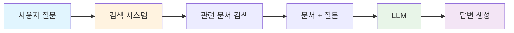
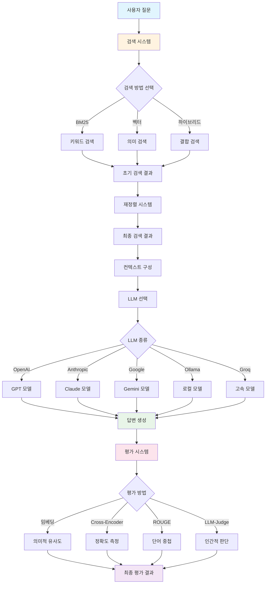

# RAG 기반 LLM 이론 연구노트

## 📚 목차
1. [RAG(Retrieval-Augmented Generation) 개요](#rag-개요)
2. [검색(Retrieval) 시스템](#검색-시스템)
3. [생성(Generation) 시스템](#생성-시스템)
4. [평가(Evaluation) 시스템](#평가-시스템)
5. [전체 시스템 아키텍처](#전체-시스템-아키텍처)

---

## RAG 개요

### 🤔 RAG란 무엇인가요?

**RAG(Retrieval-Augmented Generation)**는 질문에 답하기 위해 관련 정보를 먼저 검색한 후, 그 정보를 바탕으로 답변을 생성하는 AI 시스템입니다.

### 🧠 왜 RAG가 필요한가요?

**전통적인 LLM의 한계:**
- 학습 데이터 이후의 최신 정보 부족
- 사실적 오류(Hallucination) 발생
- 특정 도메인 지식 부족

**RAG의 장점:**
- 실시간 정보 검색 가능
- 사실적 정확성 향상
- 도메인별 특화 지식 활용

### 🔄 RAG의 동작 원리



---

## 검색(Retrieval) 시스템

### 🔍 검색 방법의 종류

#### 1. BM25 검색 (키워드 기반)
**원리:** 문서에서 키워드의 빈도와 중요도를 계산하여 관련성을 측정

**장점:**
- 빠른 검색 속도
- 키워드 매칭에 효과적
- 계산 비용이 낮음

**단점:**
- 의미적 유사성 파악 어려움
- 동의어나 유사 표현 인식 부족

```python
# BM25 검색기 예시
from krag.retrievers import KiWiBM25RetrieverWithScore

bm25_db = KiWiBM25RetrieverWithScore(
    documents=final_docs, 
    kiwi_tokenizer=kiwi_tokenizer, 
    k=2, 
    threshold=0.0,
)
```

#### 2. 벡터 검색 (의미 기반)
**원리:** 텍스트를 고차원 벡터로 변환하여 의미적 유사성을 측정

**장점:**
- 의미적 유사성 파악 우수
- 동의어나 유사 표현 인식
- 문맥 이해 능력

**단점:**
- 계산 비용이 높음
- 모델 의존적

```python
# 벡터 검색 예시
from langchain_community.vectorstores import Chroma
from langchain_huggingface import HuggingFaceEmbeddings

embeddings_model = HuggingFaceEmbeddings(model_name="BAAI/bge-m3")
chroma_db = Chroma(
    embedding_function=embeddings_model,
    collection_name="hf_bge_m3",
    persist_directory="./chroma_db",
)
```

#### 3. 하이브리드 검색
**원리:** BM25와 벡터 검색을 결합하여 두 방법의 장점을 활용

**장점:**
- 키워드 매칭과 의미적 유사성 모두 활용
- 검색 정확도 향상
- 다양한 유형의 질문에 대응

```python
# 하이브리드 검색 예시
from langchain.retrievers import EnsembleRetriever

retriever = EnsembleRetriever(
    retrievers=[bm25_db, chroma_k],
    weights=[0.5, 0.5],  # 각 검색기의 가중치
)
```

#### 4. 재정렬(Re-ranking)
**원리:** 초기 검색 결과를 더 정교한 모델로 재평가하여 순서를 조정

**장점:**
- 검색 결과의 품질 향상
- 관련성 높은 문서 우선 배치
- 정확한 답변 생성 지원

```python
# Cross-Encoder 재정렬 예시
from langchain.retrievers import ContextualCompressionRetriever
from langchain.retrievers.document_compressors import CrossEncoderReranker

re_ranker = CrossEncoderReranker(model=model, top_n=3)
cross_encoder_reranker_retriever = ContextualCompressionRetriever(
    base_compressor=re_ranker, 
    base_retriever=hybrid_retriever,
)
```

### 📊 검색 시스템 비교표

| 검색 방법 | 속도 | 정확도 | 의미 이해 | 키워드 매칭 | 비용 |
|-----------|------|--------|-----------|-------------|------|
| BM25 | ⭐⭐⭐⭐⭐ | ⭐⭐ | ⭐ | ⭐⭐⭐⭐⭐ | ⭐⭐⭐⭐⭐ |
| 벡터 검색 | ⭐⭐ | ⭐⭐⭐⭐ | ⭐⭐⭐⭐⭐ | ⭐⭐ | ⭐⭐ |
| 하이브리드 | ⭐⭐⭐ | ⭐⭐⭐⭐ | ⭐⭐⭐⭐ | ⭐⭐⭐⭐ | ⭐⭐⭐ |
| 재정렬 | ⭐ | ⭐⭐⭐⭐⭐ | ⭐⭐⭐⭐⭐ | ⭐⭐⭐⭐⭐ | ⭐ |

---

## 생성(Generation) 시스템

### 🤖 LLM 모델의 종류

#### 1. OpenAI GPT 모델
**특징:**
- 강력한 생성 능력
- 다양한 도메인에 대한 이해
- 안정적인 성능

```python
from langchain_openai import ChatOpenAI

llm = ChatOpenAI(model="gpt-4o-mini")
```

#### 2. Anthropic Claude 모델
**특징:**
- 안전성과 정확성 중시
- 상세한 설명 능력
- 윤리적 고려사항 반영

```python
from langchain_anthropic import ChatAnthropic

llm = ChatAnthropic(
    model="claude-3-haiku-20240307",
    temperature=0,
    max_tokens=200, 
)
```

#### 3. Google Gemini 모델
**특징:**
- 멀티모달 능력
- 빠른 응답 속도
- 효율적인 리소스 사용

```python
from langchain_google_genai import ChatGoogleGenerativeAI

llm = ChatGoogleGenerativeAI(model="gemini-1.5-flash")
```

#### 4. 오픈소스 모델 (Ollama)
**특징:**
- 로컬 실행 가능
- 비용 효율적
- 커스터마이징 자유도 높음

```python
from langchain_ollama import ChatOllama

llm = ChatOllama(
    model="llama3.1",
    temperature=0.8,
    num_predict=100,
)
```

#### 5. Groq API
**특징:**
- 초고속 응답
- 오픈소스 모델 지원
- 확장성 우수

```python
from langchain_groq import ChatGroq

llm = ChatGroq(
    model="llama-3.1-70b-versatile",
    temperature=0.0,
    max_tokens=100,
)
```

### 🔗 RAG 체인 구성

**RAG 체인의 핵심 구성요소:**

```python
def create_rag_chain(retriever, llm):
    template = """Answer the following question based on this context. 
    If the context is not relevant to the question, just answer with '답변에 필요한 근거를 찾지 못했습니다.'

    [Context]
    {context}

    [Question]
    {question}

    [Answer]
    """

    prompt = ChatPromptTemplate.from_template(template)

    def format_docs(docs):
        return "\n\n".join([f"{doc.page_content}" for doc in docs])

    rag_chain = (
        {"context": retriever | format_docs, "question": RunnablePassthrough()} 
        | prompt
        | llm
        | StrOutputParser()
    )

    return rag_chain
```

### 📝 프롬프트 엔지니어링

**효과적인 프롬프트 작성법:**

1. **명확한 지시사항:** 모델이 무엇을 해야 하는지 명확히 제시
2. **구조화된 입력:** 컨텍스트와 질문을 구분하여 제공
3. **예시 포함:** 원하는 출력 형식의 예시 제공
4. **제약 조건:** 모델의 행동 범위를 명확히 제한

---

## 평가(Evaluation) 시스템

### 📊 평가 방법의 종류

#### 1. 임베딩 거리 평가
**원리:** 예측 답변과 정답을 벡터로 변환하여 의미적 유사성을 측정

**장점:**
- 의미적 유사성 측정
- 자동화된 평가 가능
- 일관된 기준

**단점:**
- 완벽한 의미 이해 어려움
- 모델 의존적

```python
from langchain.evaluation import load_evaluator, EvaluatorType, EmbeddingDistance

embedding_evaluator = load_evaluator(
    evaluator=EvaluatorType.EMBEDDING_DISTANCE,
    distance_metric=EmbeddingDistance.COSINE,
    llm=ChatOpenAI(model="gpt-4o-mini", temperature=0.0),
)
```

#### 2. Cross-Encoder 평가
**원리:** 두 문장을 동시에 인코딩하여 직접적인 유사성을 평가

**장점:**
- 더 정확한 유사성 측정
- 문장 간 상호작용 모델링
- 높은 정확도

**단점:**
- 계산 비용 높음
- 처리 시간 길음

```python
from sentence_transformers import CrossEncoder

def calculate_cross_encoder_similarity(query, prediction, model_name="BAAI/bge-reranker-v2-m3"):
    cross_encoder_model = CrossEncoder(model_name)
    sentence_pairs = [[query, prediction]]
    similarity_scores = cross_encoder_model.predict(sentence_pairs)
    return similarity_scores[0]
```

#### 3. ROUGE 메트릭
**원리:** 단어 중첩을 기반으로 한 텍스트 유사도 측정

**장점:**
- 빠른 계산 속도
- 해석이 쉬움
- 표준화된 평가

**단점:**
- 깊은 의미 이해 부족
- 단어 순서에 민감

```python
from korouge_score import rouge_scorer

def calculate_rouge_similarity(query, prediction, rouge_types=['rouge1', 'rouge2', 'rougeL']):
    scorer = rouge_scorer.RougeScorer(rouge_types, use_stemmer=True)
    scores = scorer.score(query, prediction)
    return {rouge_type: scores[rouge_type].fmeasure for rouge_type in rouge_types}
```

#### 4. LLM-as-Judge
**원리:** LLM을 평가자로 사용하여 인간과 유사한 판단 제공

**장점:**
- 깊은 의미적 이해
- 유연한 평가 기준
- 인간과 유사한 판단

**단점:**
- 비용 발생
- 완전한 객관성 보장 어려움
- 처리 시간 길음

```python
# QA 평가
qa_evaluator = load_evaluator(
    evaluator="qa",  
    llm=ChatOpenAI(model="gpt-4o-mini", temperature=0.0),
)

# 기준 평가
criteria_evaluator = load_evaluator(
    evaluator="criteria", 
    criteria="conciseness",
    llm=ChatOpenAI(model="gpt-4o-mini", temperature=0.0),
)
```

### 📈 평가 결과 해석

**점수 해석 가이드:**

| 평가 방법 | 좋은 점수 | 나쁜 점수 | 해석 방법 |
|-----------|-----------|-----------|-----------|
| 임베딩 거리 | 낮을수록 좋음 | 높을수록 나쁨 | 0.1 이하 권장 |
| Cross-Encoder | 높을수록 좋음 | 낮을수록 나쁨 | 0.8 이상 권장 |
| ROUGE | 높을수록 좋음 | 낮을수록 나쁨 | 0.6 이상 권장 |
| LLM-as-Judge | Y/1 | N/0 | 이진 평가 |

---

## 전체 시스템 아키텍처

### 🏗️ RAG 시스템 전체 흐름



### 🔄 시스템 최적화 전략

#### 1. 검색 최적화
- **다중 검색 방법 조합:** BM25 + 벡터 검색
- **재정렬 적용:** Cross-Encoder로 결과 품질 향상
- **동적 가중치:** 질문 유형에 따른 검색 방법 선택

#### 2. 생성 최적화
- **모델 선택:** 작업 특성에 맞는 LLM 선택
- **프롬프트 튜닝:** 명확하고 구조화된 프롬프트 작성
- **파라미터 조정:** temperature, max_tokens 등 최적화

#### 3. 평가 최적화
- **다중 평가 방법:** 여러 방법을 조합하여 종합적 평가
- **자동화된 평가:** 지속적인 성능 모니터링
- **사용자 피드백:** 실제 사용자 만족도 반영

### 📊 성능 비교 예시

**다양한 LLM 모델의 성능 비교:**

| 모델 | 정확도 | 속도 | 비용 | 안정성 |
|------|--------|------|------|--------|
| OpenAI GPT-4 | ⭐⭐⭐⭐⭐ | ⭐⭐⭐ | ⭐⭐ | ⭐⭐⭐⭐⭐ |
| Anthropic Claude | ⭐⭐⭐⭐ | ⭐⭐⭐ | ⭐⭐⭐ | ⭐⭐⭐⭐ |
| Google Gemini | ⭐⭐⭐⭐ | ⭐⭐⭐⭐ | ⭐⭐⭐ | ⭐⭐⭐⭐ |
| Ollama (로컬) | ⭐⭐⭐ | ⭐⭐ | ⭐⭐⭐⭐⭐ | ⭐⭐⭐ |
| Groq | ⭐⭐⭐⭐ | ⭐⭐⭐⭐⭐ | ⭐⭐⭐⭐ | ⭐⭐⭐ |

---

## 🎯 실무 적용 가이드

### 📋 구현 체크리스트

#### 1단계: 데이터 준비
- [ ] 문서 수집 및 전처리
- [ ] 청킹(Chunking) 전략 수립
- [ ] 메타데이터 구성

#### 2단계: 검색 시스템 구축
- [ ] BM25 검색기 설정
- [ ] 벡터 데이터베이스 구축
- [ ] 하이브리드 검색 구성
- [ ] 재정렬 시스템 추가

#### 3단계: 생성 시스템 구축
- [ ] LLM 모델 선택
- [ ] 프롬프트 템플릿 작성
- [ ] RAG 체인 구성
- [ ] 에러 핸들링 추가

#### 4단계: 평가 시스템 구축
- [ ] 평가 메트릭 선택
- [ ] 자동화된 평가 파이프라인 구축
- [ ] 성능 모니터링 시스템 구축

#### 5단계: 최적화 및 배포
- [ ] 성능 튜닝
- [ ] 사용자 피드백 수집
- [ ] 시스템 배포
- [ ] 지속적 개선

### 🚀 성능 향상 팁

1. **검색 품질 향상:**
   - 다양한 검색 방법 조합
   - 질문 유형별 최적화
   - 동적 컨텍스트 크기 조정

2. **생성 품질 향상:**
   - 명확한 프롬프트 작성
   - 적절한 모델 선택
   - 체인 구성 최적화

3. **평가 품질 향상:**
   - 다중 평가 방법 활용
   - 사용자 피드백 반영
   - 지속적 모니터링

---

## 📚 참고 자료

### 🔗 관련 링크
- [LangChain 공식 문서](https://python.langchain.com/)
- [Hugging Face 모델 허브](https://huggingface.co/)
- [OpenAI API 문서](https://platform.openai.com/docs)
- [Anthropic Claude API](https://www.anthropic.com/api)

### 📖 추천 도서
- "Retrieval-Augmented Generation for Knowledge-Intensive NLP Tasks"
- "Building Production RAG Systems"
- "LangChain Cookbook"

### 🛠️ 유용한 도구
- **LangSmith:** RAG 시스템 추적 및 디버깅
- **ChromaDB:** 벡터 데이터베이스
- **FAISS:** 효율적인 벡터 검색
- **Sentence Transformers:** 임베딩 모델

---

## 📝 마무리

이 연구노트는 RAG 기반 LLM 시스템의 핵심 개념과 구현 방법을 다루었습니다. 실제 코드와 함께 학습하시면 더욱 효과적으로 이해할 수 있습니다.

**주요 포인트:**
1. **검색 + 생성의 조합**이 RAG의 핵심
2. **다양한 검색 방법**을 상황에 맞게 선택
3. **적절한 LLM 선택**이 성능에 큰 영향
4. **체계적인 평가**가 지속적 개선의 핵심

**다음 단계:**
- 실제 프로젝트에 적용해보기
- 다양한 도메인에서 실험해보기
- 커뮤니티와 지식 공유하기

---

*이 문서는 학습 목적으로 작성되었으며, 실제 프로덕션 환경에서는 추가적인 보안, 성능, 비용 고려사항이 필요할 수 있습니다.* 