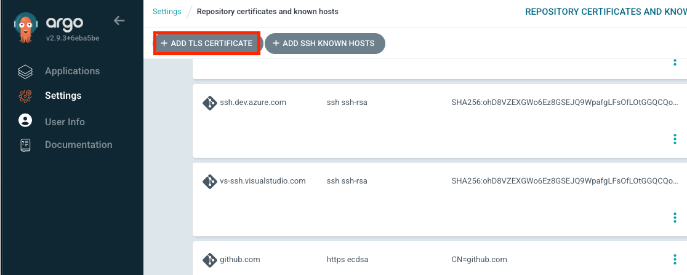
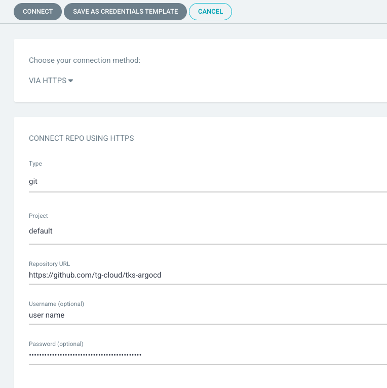
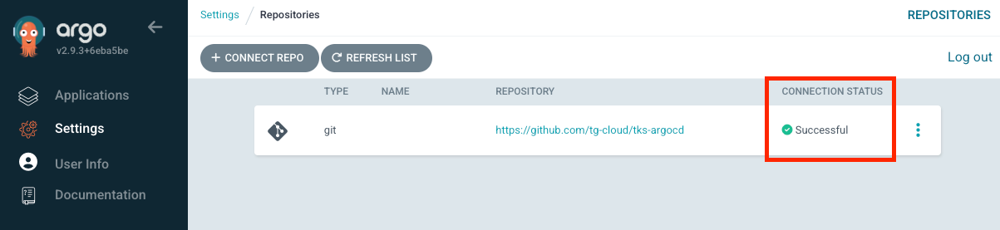
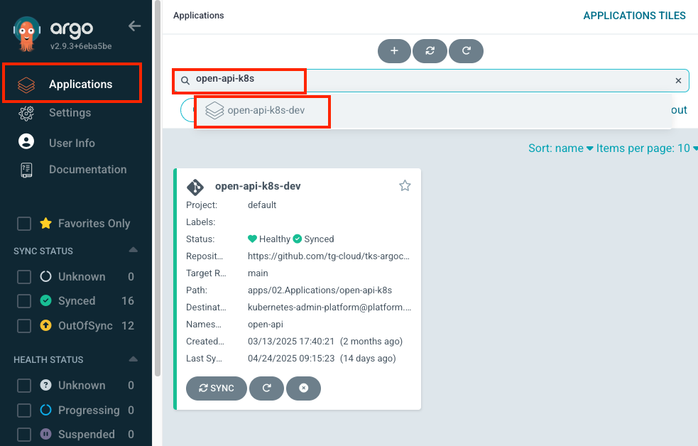
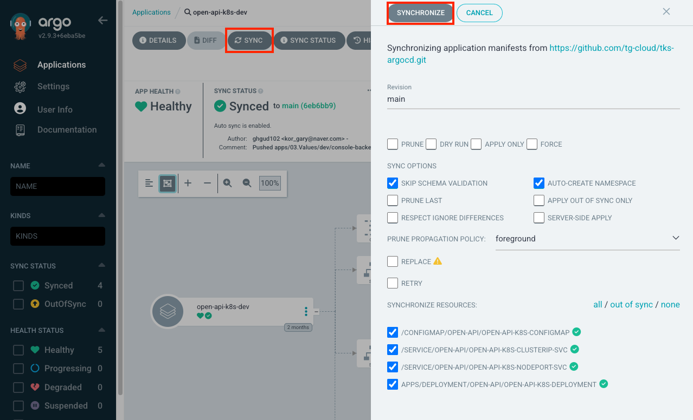

# ArgoCD 설치 및 설정 가이드

> CentOS 기반 CICD 마스터 노드에 ArgoCD v2.9.3을 설치하고, 폐쇄망 환경에 맞춰 Harbor 레지스트리 이미지를 사용하는 방법과 Kubernetes 연동 및 CLI 사용법을 설명합니다.


## 목차

1. [ArgoCD 설치 준비](#1-argocd-설치-준비)
2. [ArgoCD 설치](#2-argocd-설치)
3. [ArgoCD CLI 설치](#3-argocd-cli-설치)
4. [ArgoCD CLI 로그인](#4-argocd-cli-로그인)
5. [ArgoCD - Cluster 연결 설정](#5-argocd---cluster-연결-설정)
6. [ArgoCD - Git Repository 연결 설정](#6-argocd---git-repository-연결-설정)
7. [ArgoCD - Git Repository Polling 간격 수정](#7-argocd---git-repository-polling-간격-수정)
8. [ArgoCD 삭제 방법](#8-argocd-삭제-방법)
9. [애플리케이션 최초 배포 및 삭제](#9-애플리케이션-최초-배포-및-삭제)
10. [CICD 프로세스](#10-cicd-프로세스)
11. [자동 동기화 비활성화 및 수동 동기화](#11-자동-동기화-비활성화-및-수동-동기화)


## 1. ArgoCD 설치 준비

> ArgoCD 설치에 필요한 install.yaml을 내려받고 설치 환경이 폐쇄망인 경우 하버 레지스트리의 이미지를 사용하도록 install.yaml을 수정합니다. 

1. CICD 마스터노드 접속 및 작업 디렉토리 생성

  ```bash
  ssh root@<CICD cluster의 master node InternalIP>
  mkdir ~/argocd && cd ~/argocd
  ```


2. ArgoCD v2.9.3 공식 install.yaml 다운로드

  ```bash
  wget https://raw.githubusercontent.com/argoproj/argo-cd/v2.9.3/manifests/install.yaml
  ```


3. install.yaml 수정 여부 선택

  - **선택 1** : 공식 install.yaml 그대로 사용 → [2. ArgoCD 설치](#2-argocd-설치)로 이동
  - **선택 2** : 폐쇄망 / Harbor 이미지 사용 → 아래 3.x 단계 진행

  3.1 ArgoCD 관련 tar.gz 다운로드

      ```bash
      curl -L -o argocd-2.9.3.tar.gz https://github.com/argoproj/argo-cd/archive/refs/tags/v2.9.3.tar.gz
      curl -L -o dex-2.37.0.tar.gz   https://github.com/dexidp/dex/archive/refs/tags/v2.37.0.tar.gz
      curl -L -o redis-7.0.11.tar.gz https://github.com/redis/redis/archive/refs/tags/7.0.11.tar.gz
      ```

    3.2 압축 해제

      ```bash
      tar -xzvf argocd-2.9.3.tar.gz
      tar -xzvf dex-2.37.0.tar.gz
      tar -xzvf redis-7.0.11.tar.gz
      ```

    3.3 이미지 빌드

      ```bash
      # ArgoCD
      sed -i 's|deb http://deb.debian.org/debian buster-backports main|deb http://archive.debian.org/debian buster-backports main|' ~/argocd/argo-cd-2.9.3/Dockerfile
      docker build -t argocd:2.9.3 ~/argocd/argo-cd-2.9.3

      # Dex
      docker build -t dex:2.37.0 ~/argocd/dex-2.37.0

      # Redis (Dockerfile 작성 후 빌드)
      cat > ~/argocd/redis-7.0.11/Dockerfile <<'EOF'
      FROM redis:7.0.11-alpine
      EXPOSE 6379
      CMD ["redis-server"]
      EOF
      docker build -t redis:7.0.11-alpine ~/argocd/redis-7.0.11
      ```

      _주의) ArgoCD 압축 파일의 경우 2.9.3 이전 버전은 Debian 10 기반이며, Debian 10이 2024‑06‑30에 LTS 지원을 종료하면서 deb.debian.org (= 현재 운영되는 미러 풀)에서는 더 이상 buster‑backports를 서빙하지 않으므로 debian 10 (buster)의 backports 저장소 추가 필요_

    3.4 Harbor 레지스트리 태깅

      ```bash
      docker tag argocd:2.9.3             <Harbor registry의 Domain 혹은 IP 주소>/cicd/argocd:2.9.3
      docker tag dex:2.37.0               <Harbor registry의 Domain 혹은 IP 주소>/cicd/dex:2.37.0
      docker tag redis:7.0.11-alpine      <Harbor registry의 Domain 혹은 IP 주소>/cicd/redis:7.0.11-alpine
      ```

      이미지를 내부 하버 레지스트리에 push하기 위해 태깅

    3.5 Docker 데몬 insecure‑registries 설정

      ```bash
      sudo vi /etc/docker/daemon.json
      {
        "insecure-registries":["<Harbor registry의 Domain 혹은 IP 주소>"]
      }
      sudo systemctl restart docker
      ```

      TLS 통신이 불가능한 내부 하버 레지스트리에 대해 비보안 옵션을 구성

    3.6 Harbor 로그인

      ```bash
      docker login <Harbor registry의 Domain 혹은 IP 주소>
      ```

    3.7 이미지 Push

      ```bash
      docker push <Harbor registry의 Domain 혹은 IP 주소>/cicd/argocd:2.9.3
      docker push <Harbor registry의 Domain 혹은 IP 주소>/cicd/dex:2.37.0
      docker push <Harbor registry의 Domain 혹은 IP 주소>/cicd/redis:7.0.11-alpine
      ```

      내부 하버 레지스트리의 cicd 프로젝트에 각 이미지를 push

    3.8 install.yaml 이미지 경로 수정

      ```bash
      sed -i \
      -e 's|quay.io/argoproj/argocd:v2.9.3|<Harbor registry의 Domain 혹은 IP 주소>/cicd/argocd:2.9.3|g' \
      -e 's|ghcr.io/dexidp/dex:v2.37.0|<Harbor registry의 Domain 혹은 IP 주소>/cicd/dex:2.37.0|g' \
      -e 's|redis:7.0.11-alpine|<Harbor registry의 Domain 혹은 IP 주소>/cicd/redis:7.0.11-alpine|g' \
      ~/argocd/install.yaml
      ```

      내부 하버 레지스트리의 이미지를 사용하여 설치되도록 ArgoCD의 install.yaml을 수정


## 2. ArgoCD 설치

> argocd 네임스페이스에 argocd를 배포하고 노드포트 또는 인그레스 리소스를 추가합니다.

1. Namespace 생성

  ```bash
  kubectl create namespace argocd
  kubectl get namespace argocd
  ```

  kubectl을 사용하여 argocd 네임스페이스를 생성하고, 조회를 통해 상태를 확인


2. install.yaml 적용

  ```bash
  kubectl apply -n argocd -f install.yaml
  ```

  install.yaml 파일을 기반으로 argocd 네임스페이스에 ArgoCD 리소스를 생성


3. NodePort Service (옵션)

  ```bash
  sudo vi nodeport_service.yaml
  ```

  NodePort 타입의 서비스 리소스가 필요한 경우 nodeport_service.yaml을 생성

  ```yaml
  apiVersion: v1
  kind: Service
  metadata:
    name: argocd-server-nodeport-service
    namespace: argocd
  spec:
    selector:
      app.kubernetes.io/name: argocd-server
    type: NodePort
    ports:
      - name: http
        port: 80
        targetPort: 8080
        nodePort: <30000 ~ 32767 범위 내의 노드포트 번호>
  ```

  ```bash
  kubectl apply -f nodeport_service.yaml -n argocd
  ```

  nodeport_service.yaml 파일을 기반으로 argocd 네임스페이스에 NodePort 타입의 서비스를 생성

  ArgoCD 웹페이지 접속방법: `<ClusterIP>:<노트포트 서비스의 spec에 정의한 nodePort 필드값>`


4. Ingress (옵션)

  ```bash
  sudo vi ingress.yaml
  ```

  ```yaml
  apiVersion: networking.k8s.io/v1
  kind: Ingress
  metadata:
  name: argocd-server-ingress
  namespace: argocd
  annotations:
    nginx.ingress.kubernetes.io/ssl-passthrough: "true"
    nginx.ingress.kubernetes.io/backend-protocol: "HTTPS"
    nginx.ingress.kubernetes.io/force-ssl-redirect: "true"
  spec:
  ingressClassName: nginx
  rules:
  - host: <ArgoCD의 subdomain을 포함한 FQDN 주소>
    http:
      paths:
      - path: /
        pathType: Prefix
        backend:
          service:
            name: argocd-server
            port:
              name: https
  ```

  Ingress 리소스가 필요한 경우 ingress.yaml을 생성

  ```bash
  kubectl apply -f ingress.yaml -n argocd
  ```

  ingress.yaml 파일을 기반으로 argocd 네임스페이스에 Ingress를 생성하여 'argocd-server' Service에 대한 Domain을 부여

  어노테이션 설명
  - nginx.ingress.kubernetes.io/force-ssl-redirect: 'true'
    - HTTP 요청이 오면 자동으로 HTTPS로 리다이렉트
    - 즉, http://<ArgoCD의 subdomain을 포함한 FQDN 주소>로 접속하면 https://<ArgoCD의 subdomain을 포함한 FQDN 주소>로 강제 이동

  - nginx.ingress.kubernetes.io/ssl-passthrough: 'true'
    - SSL/TLS 트래픽을 Ingress Controller에서 종료(종료(TLS Termination)하지 않고)하지 않고, 그대로 백엔드 서비스(여기서는 argocd-server)로 전달
    - 즉, argocd-server 서비스에서 직접 TLS 처리를 수행
    - 이를 사용하려면 Ingress Controller에서 --enable-ssl-passthrough 옵션 활성화 필요 

  - ingress 설정 관련 문서 : https://argo-cd.readthedocs.io/en/stable/operator-manual/ingress/#option-1-ssl-passthrough 


## 3. ArgoCD CLI 설치

> 관리자 비밀번호 변경, 클러스터 등록 및 관리 작업을 위해 2.9.3 버전의 ArgoCD CLI 설치파일을 내려받고 관리자 권한으로 설치합니다.

  ```bash
  wget https://github.com/argoproj/argo-cd/releases/download/v2.9.3/argocd-linux-amd64
  sudo install -m 555 argocd-linux-amd64 /usr/local/bin/argocd
  ```


## 4. ArgoCD CLI 로그인

> ArgoCD에 최초 로그인 하여 관리자 비밀번호를 변경합니다.

  ```bash
  argocd admin initial-password -n argocd
  ```

  초기 비밀번호 확인

  ```bash
  # ingress를 생성하지 않은 경우
  kubectl get service argocd-server -n argocd
  # ingress를 생성한 경우
  kubectl get ingress argocd-server-ingress -n argocd
  ```

  접속 정보 확인

  ```bash
  argocd login <SERVER_IP_OR_DOMAIN> --username admin --password <INITIAL_PW>
  ```

  로그인

  ```bash
  argocd account update-password
  ```

  비밀번호 변경


## 5. ArgoCD - Cluster 연결 설정

> 애플리케이션이 배포될 대상 클러스터를 argocd에 등록합니다.

  ```bash
  ssh u@<CICD cluster의 master node InternalIP>
  cd ~/.kube
  cp config config.bak
  vi config
  ```
  
  `~/.kube/config`에 추가하려는 클러스터의 `clusters`, `users`, `contexts` 추가 후 `kubectl config get-contexts`로 확인

  ```bash
  argocd cluster add <context-name>
  Ex) argocd cluster add kubernetes-admin-platform@platform.io
  ```

  Cluster 추가

  ```bash
  argocd cluster list
  ```

  ArgoCD에 연결된 클러스터 상태 확인, 초기에는 cluster의 status 필드값이 Unknown으로 표시되며, Application 배포 성공 후 Successful로 변경 됨


## 6. ArgoCD - Git Repository 연결 설정

> 배포할 애플리케이션의 매니페스트를 주기적으로 확인(polling)할 수 있도록 ArgoCD에 Git 리포지토리를 등록합니다.

1. Repository TLS 인증서 추가

  

  UI: **Settings → Repository certificates and known hosts → + ADD TLS CERTIFICATE**
  - Repository Server Name : github.com
  - TLS Certificate (PEM format) : <PEM 파일 출력문을 붙여넣기>
  - CREATE 버튼 클릭


2. Git Repository 추가

  

  UI: **Settings → Repositories → + Connect Repo**
  - Choose your connection method: VIA HTTPS
  - Type: git
  - Project: default
  - Repository URL: <메니페스트가 저장된 Git Repository URL>
  - Username: <User name>
  - Password: <Personal Access Token>
  - CONNECT 버튼 클릭

3. 연결 상태 확인

  

  UI: **Settings → Repositories
  CONNECTION STATUS 필드값이 Successful인지 확인


## 7. ArgoCD - Git Repository Polling 간격 수정

> 배포된 애플리케이션의 매니페스트 변경 사항을 감지하는 주기를 변경합니다.

  ```bash
  kubectl patch configmap argocd-cm -n argocd -p '{"data": {"timeout.reconciliation": "30s"}}'
  ```

  'argocd-cm' ConfigMap의 timeout.reconciliation 값을 수정: 180s → 30s


## 8. ArgoCD 삭제 방법

> ArgoCD를 삭제합니다.

  ```bash
  kubectl delete -n argocd -f install.yaml
  ```

  argocd 네임스페이스는 유지한 채, install.yaml을 통해 생성된 모든 리소스를 삭제


## 9. 애플리케이션 최초 배포 및 삭제

> ArgoCD의 커스텀 리소스 ApplicationSet 리소스를 활용하여 애플리케이션을 최초 배포하고 삭제하는 방법입니다.

1. 애플리케이션 최초 배포 방법

  ```bash
  ssh root@<CICD cluster의 master node InternalIP> 
  cd ~/argocd
  git clone <ApplicationSet을 관리하는 깃 레파지토리>/<생성할 ApplicationSet 경로>.git
  kubectl apply -f ~/argocd/DKS-paas-argocd/apps/01.ApplicationSets/prd-workload-api.yaml
  kubectl apply -f ~/argocd/DKS-paas-argocd/apps/01.ApplicationSets/prd-workload.external-k8s.yaml
  ```

  CICD 마스터 노드에 접속

  ~/argocd 경로에 ApplicationSet을 관리하는 깃 레파지토리를 clone
  
  배포하려는 애플리케이션에 대한 ApplicationSet yaml 파일을 준비
  
  yaml 파일 기반으로 argocd 네임스페이스에 ApplicationSet 커스텀 리소스 생성

  ApplicationSet 작성 예시는 [](https://github.com/tg-cloud/tks-platform/tree/main/argocd/application_set_example.yaml)를 참고


2. 애플리케이션 삭제 방법
  
  ```bash
  ssh root@<CICD cluster의 master node InternalIP> 
  kubectl delete -n argocd applicationset <ApplicationSet 리소스명>
  ```

  삭제할 애플리케이션에 해당하는, argocd 네임스페이스의 ApplicationSet 커스텀 리소스를 삭제

  ApplicationSet 삭제 시 Application 커스텀 리소스도 함께 삭제되며, 템플릿으로 정의된 대상 클러스터의 리소스들이 삭제 됨

  단, 템플릿에서 Namespace를 정의하지 않는 경우가 많으므로 대상 클러스터의 Namespace 리소스는 삭제되지 않음


## 10. CICD 프로세스

> Jenkins, ArgoCD를 활용하여 애플리케이션 자동 배포를 구현하는 전반적인 프로세스입니다.

  - 개발자가 App Git Repository에 애플리케이션의 변경사항을 커밋 & 푸쉬
  - 개발자가 Jenkins Pipeline을 실행
    - App Git Repository를 클론
    - 이미지를 빌드
    - 이미지를 새 버전명으로 태깅한 후 Harbor Private Registry에 푸쉬
    - Manifest Git Repository를 클론
    - helm-update.sh를 실행하여 values.yaml 내 tag 필드를 새 버전명으로 수정
    - Manifest Git Repository에 변경사항을 커밋 & 푸쉬
  - ArgoCD가 일정 시간 간격(기본값 : 3분)으로 Manifest Git Repository를 polling하여 Helm Chart의 변경 사항을 감지
  - ArgoCD가 설정된 동기화 정책에 기반하여 Manifest Git Repository 상태와 Application의 상태를 동기화


## 11. 자동 동기화 비활성화 및 수동 동기화

> ArgoCD의 동기화 기능은 Git 저장소의 매니페스트와 클러스터의 실제 상태 차이를 감지해 자동으로 애플리케이션을 동기화합니다. 이 기능의 비활성화 설정 방법과 수동 동기화 실행 방법을 설명합니다.

1. 자동 동기화 비활성화
  
  CICD 클러스터의 argocd 네임스페이스에 생성한 ApplicationSet에서,
  
  spec.template.spec.syncPolicy.automated 필드와 하위 항목들을 삭제하면 자동 동기화 비활성화

  _주의) ArgoCD UI의 애플리케이션 DETAILS 화면에서 "DISABLE AUTO-SYNC" 버튼을 눌러도 자동 동기화가 비활성화되지 않음, UI를 통해 배포된 애플리케이션의 경우에만 DETAILS 화면에서 동기화 옵션을 변경할 수 있음


2. 수동 동기화
  
  

  ArgoCD에 접속하여 즉시 동기화할 애플리케이션 검색

  

  SYNCHRONIZE 버튼을 클릭하여 클러스터의 애플리케이션과 깃 레파지토리의 매니페스트를 즉시 동기화