# Harbor 설치 및 설정 가이드

> Harbor를 CentOS 기반 VM에 설치하고 OIDC 연동, Proxy Cache 구성 및 Kubernetes 연동을 구성하는 방법을 설명합니다.


## 목차

1. [Harbor VM 쉘 접속](#1-harbor-vm-쉘-접속)
2. [Docker 설치](#2-docker-설치)
3. [Docker-Compose 설치](#3-docker-compose-설치)
4. [자체 서명 인증서 구성](#4-자체-서명-인증서-구성)
5. [Harbor 설치](#5-harbor-설치)
6. [Harbor 사용자 가이드](#6-harbor-사용자-가이드)
7. [Harbor OIDC 구성](#7-harbor-oidc-구성)
8. [Harbor Proxy Cache 구성](#8-harbor-proxy-cache-구성)
9. [Node containerd 설정](#9-node-containerd-설정)
10. [Containerd image pulling 테스트](#10-containerd-image-pulling-테스트)


## 1. Harbor VM 쉘 접속

> 하버가 설치될 VM의 커널에 SSH로 접속합니다.

  ```bash
  ssh u@<Harbor VM IP 주소>
  ```


## 2. Docker 설치

> harbor 설치에 필요한 docker를 설치합니다.

1. Docker 설치

  ```bash
  sudo yum update
  sudo yum install -y yum-utils
  sudo yum-config-manager --add-repo https://download.docker.com/linux/centos/docker-ce.repo
  sudo yum install docker-ce docker-ce-cli containerd.io -y
  ```

  yum-utils 설치 및 Docker 저장소 등록 후 최신 Docker 설치


2. Docker 설정

  ```bash
  docker -v
  sudo systemctl start docker
  sudo systemctl enable docker
  sudo systemctl status docker
  sudo usermod -aG docker "$(id -nu)"
  newgrp docker
  ```

  도커 설치 확인 후 현재 사용자를 docker 그룹에 추가하고 그 변경 사항을 현재 터미널 세션에 즉시 적용


## 3. Docker-Compose 설치

> harbor 설치에 필요한 Docker-Compose를 설치합니다.

1. Docker-Compose 설치

  ```bash
  sudo curl -L "https://github.com/docker/compose/releases/download/1.29.2/docker-compose-$(uname -s)-$(uname -m)" -o /usr/local/bin/docker-compose
  sudo chmod +x /usr/local/bin/docker-compose
  sudo ln -s /usr/local/bin/docker-compose /usr/bin/docker-compose
  docker-compose -v
  ```

  Docker-Compose 설치 및 실행 파일 권한 부여, 링크 설정


## 4. 자체 서명 인증서 구성

> 자체 CA를 사용하여 Harbor를 HTTPS 기반으로 구성하고, Docker가 이 레지스트리를 신뢰할 수 있도록 설정합니다.

1. Server의 CSR(인증서 서명 요청서) 파일 생성

  ```bash
  # 하버 관련 설치, 설정 파일 및 인증서를 정리할 전용 디렉토리를 생성
  mkdir -p ~/harbor && cd ~/harbor
  # Root CA의 개인 키 생성
  openssl genrsa -out ca.key 4096
  # Root CA의 공개 인증서 생성
  openssl req -x509 -new -nodes -sha512 -days 3650 \
    -key ca.key \
    -subj "/C=CN/ST=seoul/L=seoul/O=timegate/OU=tcp/CN=<Harbor VM IP 주소>" \
    -out ca.crt

  # Server의 개인 키 생성 (Harbor 서버가 사용하는 자체 비밀 키)
  openssl genrsa -out <Harbor VM IP 주소>.key 4096
  # Server의 CSR(인증서 서명 요청서) 파일 생성
  openssl req -new -sha512 \
    -key <Harbor VM IP 주소>.key \
    -subj "/C=CN/ST=seoul/L=seoul/O=timegate/OU=tcp/CN=<Harbor VM IP 주소>" \
    -out <Harbor VM IP 주소>.csr
  ```

  _주의) 외부에 유출되지 않도록 주의_


2. v3.ext 파일 작성 (SAN 설정)

  ```bash
  cat > v3.ext <<-EOF
  subjectAltName = IP:<Harbor VM IP 주소>,IP:<Harbor VM IP 주소>
  EOF
  ```

  SAN (Subject Alternative Name) 은 현대 브라우저 및 클라이언트가 필수로 요구하는 필드, IP 뿐 아니라 도메인도 지원 가능 (예: DNS:harbor.example.com)


3. Server의 공개 인증서 생성

  ```bash
  openssl x509 -req -sha512 -days 3650 \
    -in <Harbor VM IP 주소>.csr \
    -CA ca.crt -CAkey ca.key -CAcreateserial \
    -out <Harbor VM IP 주소>.crt \
    -extfile v3.ext
  ```

  최종적으로 서버에서 사용할 TLS 인증서 (CRT) 가 생성됨, Root CA의 ca.key와 ca.crt로 서명되었기 때문에, 클라이언트가 ca.crt를 신뢰하면 이 인증서도 자동으로 신뢰


4. 인증서 파일 이동 및 파일 변환

  ```bash
  sudo mkdir -p /data/cert
  sudo cp <Harbor VM IP 주소>.crt /data/cert/
  sudo cp <Harbor VM IP 주소>.key /data/cert/
  openssl x509 -inform PEM -in <Harbor VM IP 주소>.crt -out <Harbor VM IP 주소>.cert
  ```

  Harbor는 /data/cert 경로의 인증서 파일을 사용하도록 설정할 수 있음, 추후 harbor.yml에서 이 경로를 지정하게 됨
  crt 파일을 cert파일로 변환하여 Docker가 사용할 수 있는 PEM 형식으로 변환


5. Docker 인증서 등록 및 재시작

  ```bash
  sudo mkdir -p /etc/docker/certs.d/<Harbor VM IP 주소>
  sudo cp <Harbor VM IP 주소>.cert /etc/docker/certs.d/<Harbor VM IP 주소>/
  sudo cp <Harbor VM IP 주소>.key /etc/docker/certs.d/<Harbor VM IP 주소>/
  sudo cp ca.crt /etc/docker/certs.d/<Harbor VM IP 주소>/
  sudo systemctl restart docker
  ```

  Docker가 사설 Registry에 HTTPS로 접근할 때, 해당 인증서를 신뢰하도록 설정
  /etc/docker/certs.d/<레지스트리 주소>/ 경로에 인증서를 배치해야 Docker가 자동으로 사용
  인증서 설정을 반영하려면 반드시 Docker를 재시작


## 5. Harbor 설치

> harbor 오프라인 설치 방식으로 설치 파일을 내려받고 harbor.yaml을 수정하여 설치합니다.

1. Harbor 오프라인 설치 파일 다운로드 및 설정 파일 준비

  ```bash
  wget https://github.com/goharbor/harbor/releases/download/v2.12.2/harbor-offline-installer-v2.12.2.tgz
  tar xvf harbor-offline-installer-v2.12.2.tgz
  cp harbor/harbor.yml.tmpl harbor/harbor.yml
  ```

  harbor 오프라인 설치 파일 압축 해제
  harbor 기본 템플릿 설정 파일로부터 설정 파일(harbor.yml)을 준비


2. harbor.yml 설정 파일 수정

  ```bash
  sed -i \
  -e 's/^hostname:.*/hostname: <Harbor VM IP 주소>/' \
  -e 's/^harbor_admin_password:.*/harbor_admin_password: <admin 사용자 비밀번호>/' \
  -e 's|^ *certificate:.*|  certificate: /etc/docker/certs.d/<Harbor VM IP 주소>/<Harbor VM IP 주소>.cert|' \
  -e 's|^ *private_key:.*|  private_key: /etc/docker/certs.d/<Harbor VM IP 주소>/<Harbor VM IP 주소>.key|' \
  harbor/harbor.yml
  ```

  수정 필드 목록:
    - hostname: 하버 주소
    - harbor_admin_password: admin 사용자의 초기화될 비밀번호
    - certificate: 인증서 파일 경로
    - private_key: 비밀키 파일 경로
  harbor.yml:
    - Harbor 인스턴스를 설치할 때 사용자가 설정을 커스터마이징해서 쓰는 설정 파일
    - harbor.yml 수정 후 하버 서비스를 재시작하여 설정을 변경할 수 있음


3. Harbor 설치

  ```bash
  sudo ./harbor/prepare
  sudo ./harbor/install.sh
  ```

  install.sh 쉘 스크립트를 실행하여 하버 레지스트리 설치


## 6. Harbor 사용자 가이드

> Harbor 레지스트리에 로그인하여 이미지 push, pull가 잘 되는 지 확인합니다.

1. Docker 데몬 하버 레지스트리에 대해 비보안 설정

  ```bash
  sudo vi /etc/docker/daemon.json
  {
      "insecure-registries":["<Harbor VM IP 주소>"]
  }
  sudo systemctl restart docker
  ```

  클라이언트와 하버 간에 TLS 통신이 불가능할 경우, 데몬 설정 파일의 insecure 옵션에 하버 서버 주소를 등록
  도커 재시작하여 적용


2. Harbor 로그인 및 이미지 업로드, 다운로드 가이드

  ```bash
  docker login <Harbor VM IP 주소>

  docker pull <Harbor VM IP 주소>/portal/nginx:test

  docker tag nginx <Harbor VM IP 주소>/portal/nginx:test

  docker push <Harbor VM IP 주소>/portal/nginx:test
  ```

  docker login <호스트명 또는 ingress url>
    : 하버 레지스트리로 도커 로그인
  docker pull <도메인>:<포트>/<프로젝트명>/<이미지명>:<태그>
    : 특정 프로젝트에 이미지 다운로드
  이미지를 특정 프로젝트 경로로 새롭게 태깅
    : docker tag 이미지명:<태그> <하버 주소>:<포트>/<프로젝트명>/<이미지명>:<태그>
  특정 프로젝트에 이미지 업로드
    : docker push <도메인>:<포트>/<프로젝트명>/<이미지명>:<태그>


3. 하버 웹 브라우저 접속

  url: `https://<Harbor VM IP 주소>`  
  로그인 정보: `admin / <admin 사용자 비밀번호>`


4. 기타 명령어 모음

  ```bash
  cd /home/u/harbor
  sudo ./prepare
  sudo docker-compose down -v
  sudo docker-compose up -d
  ```

  하버 서비스 재시작

  ```bash
  sudo docker-compose ps
  ```

  하버 컨테이너 동작 확인

  ```bash
  sudo docker logs -f harbor-core 
  ```

  하버 로그 확인


## 7. Harbor OIDC 구성

> 외부 ID Provider를 사용하여 Harbor 레지스트리에 인증하기 위해, keycloak에 harbor client를 구성하고, Harbor에 OIDC 설정을 구성합니다.

1. Harbor에 keycloak 접근을 위한 DNS, Hosts 설정 

  ```bash
  sudo vi /etc/hosts

  <keycloak이 설치된 worker node의 InternalIP 주소> <keycloak의 subdomain을 포함한 FQDN>
  ```
  
  키클락 호스트 추가

  ```bash
  sudo vi /etc/resolv.conf
  nameserver <내부 DNS 서버 주소>
  nameserver 8.8.8.8
  nameserver 8.8.4.4
  ```

  resolv.conf 파일을 열고 DNS 서버 우선순위 목록에 사내 DNS 서버를 1순위로 추가

  ```bash
  nslookup <keycloak의 subdomain을 포함한 FQDN>
  ```

  nslookup를 통해 실제로 어느 IP 주소로 해석되는지, 그리고 그 DNS 레코드가 어디에서 제공되는지를 확인


2. Harbor에 Keycloak 인증서 설치 (인증/인가 과정에서 Harbor와 Keycloak은 HTTPS 통신이 필요)

  ```bash
  ssh u@<keycloak이 설치된 cluster의 master node InternalIP 주소>
  sudo scp /etc/kubernetes/pki/rootca-kc.* u@<Harbor VM IP 주소>:/tmp/
  ```
  
  keycloak이 설치된 클러스터의 마스터 노드에 접속하여 keycloak 인증서를 하버VM에 원격전송

  ```bash
  ssh -o StrictHostKeyChecking=no -i ~/.ssh/id_rsa u@<Harbor VM IP 주소>
  sudo cp /tmp/rootca-kc.* /home/u/harbor/harbor/common/config/shared/trust-certificates/
  ```
  하버 VM에 접속하여 keycloak 인증서를 docker container에 마운트되는 디렉토리에 복사

  참고: docker-compose로 설치한 harbor의 경우,
  하버VM 내에 “/home/u/harbor/common/config/shared/trust-certificates” 경로의 볼륨이
  하버 관련 컨테이너들의 “/harbor_cust_cert” 경로로 마운트되어 있고
  harbor-core 컨테이너 기동 시 자동으로 “/harbor_cust_cert” 하위의 모든 인증서를 CA_bundle에 Append하여 인증서를 설치하도록 구성되어 있음

  ```bash
  sudo docker restart harbor-core
  ```

  harbor-core 도커 컨테이너 재시작

  ```bash
  sudo docker exec -it --user root harbor-core /bin/bash

  curl -v https://<keycloak의 subdomain을 포함한 FQDN>
  ```

  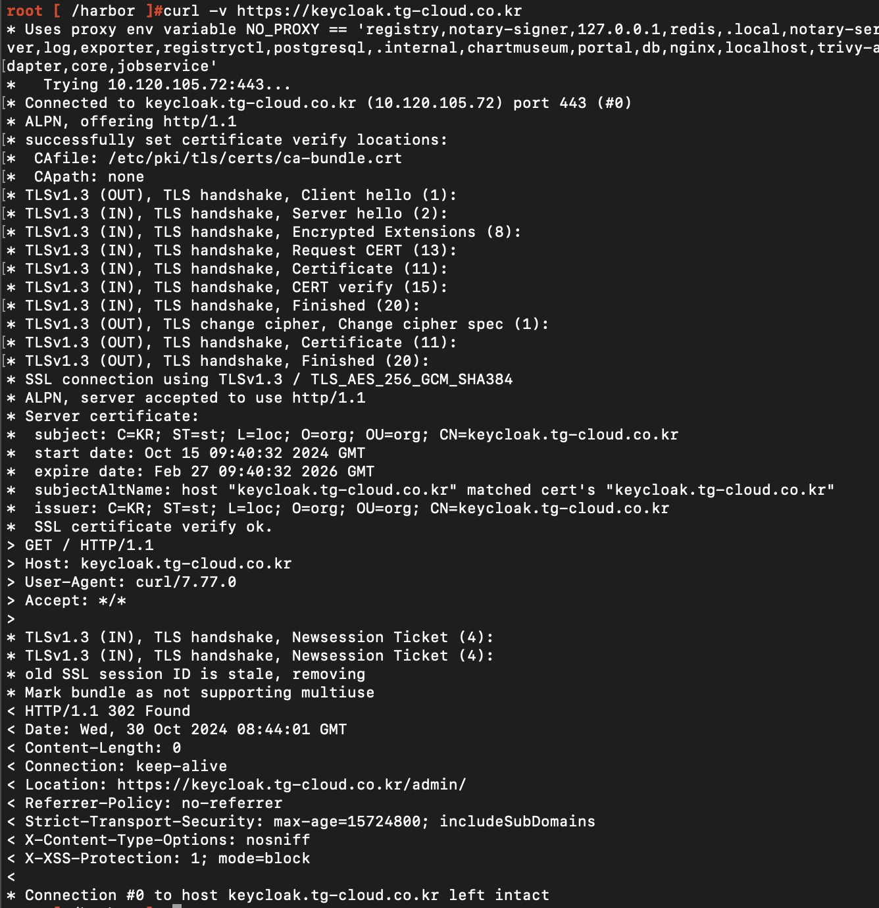

  harbor-core 컨테이너에 접속하여 curl 명령어로 ssl 통신 테스트, TLS 핸드셰이크에서 오류가 발생하는 지 확인


3. Keycloak에서 Harbor Client 생성 

  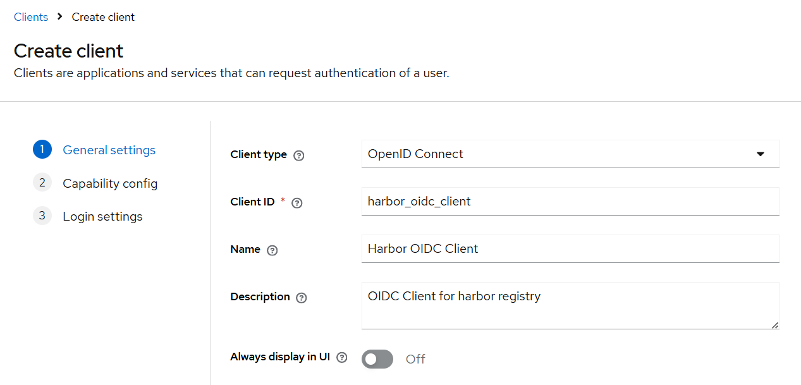

  keycloak에서 harbor 레지스트리를 위한 client 생성 - 기본 설정

  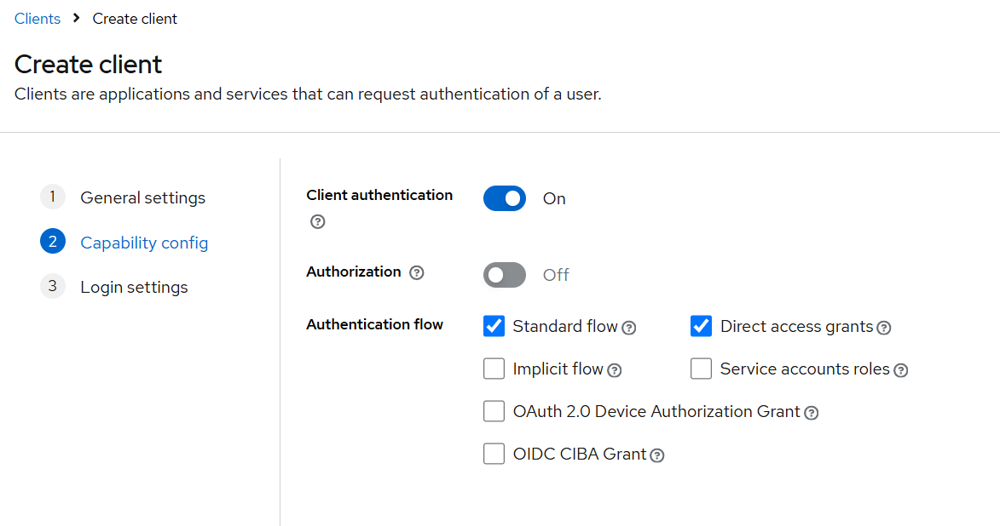

  클라이언트 애플리케이션이 사용자 인증&인가를 위해 Secret을 Keycloak에 제출하는 방식. Secret은 클라이언트와 함께 등록되며 서버 간의 보안된 통신을 통해 Token을 발급받고, 사용자 인증을 수행한다

  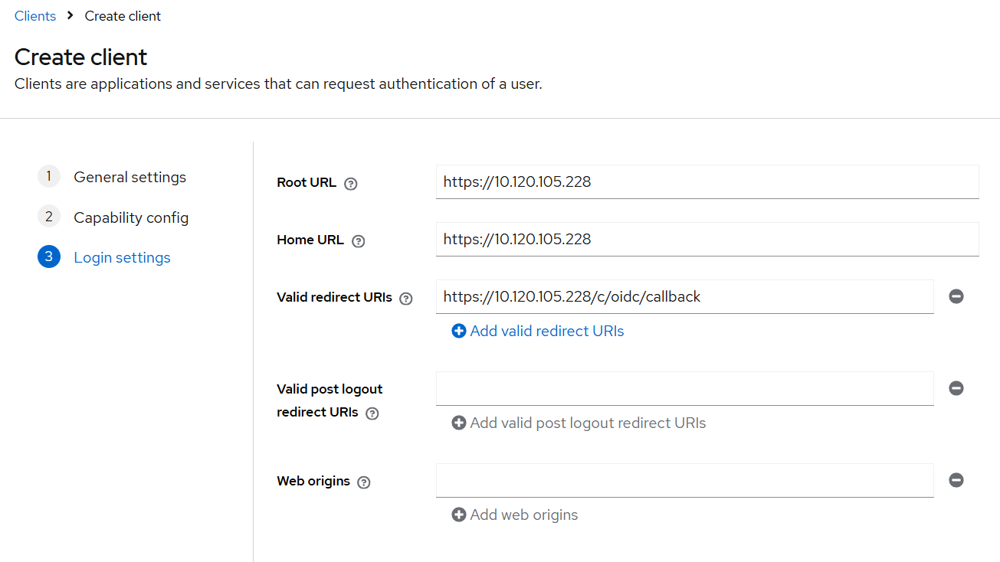

  하버 레지스트리의 Root URL을 구성하고 Valid Redirect URLs는 <Harbor 접속 주소>/c/oidc/callback 으로 설정

  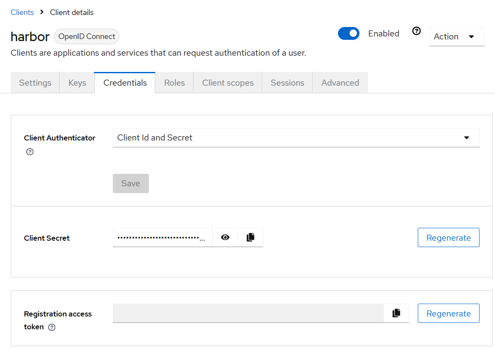

  Client에 대한 인증 도구를 'Client Id and Secret’로 구성되었는 지 확인
  Client Secret을 복사하여 Harbor 설정 시 사용


4. Keycloak Client Role 기반 Harbor Group 연동

  4.1. Client Scope 생성

    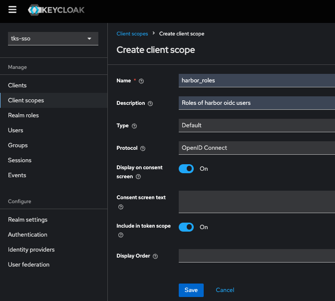

    하버의 Role을 위한 새 클라이언트 스코프 생성


  4.2. Client Scope에 Token Mapper 생성

    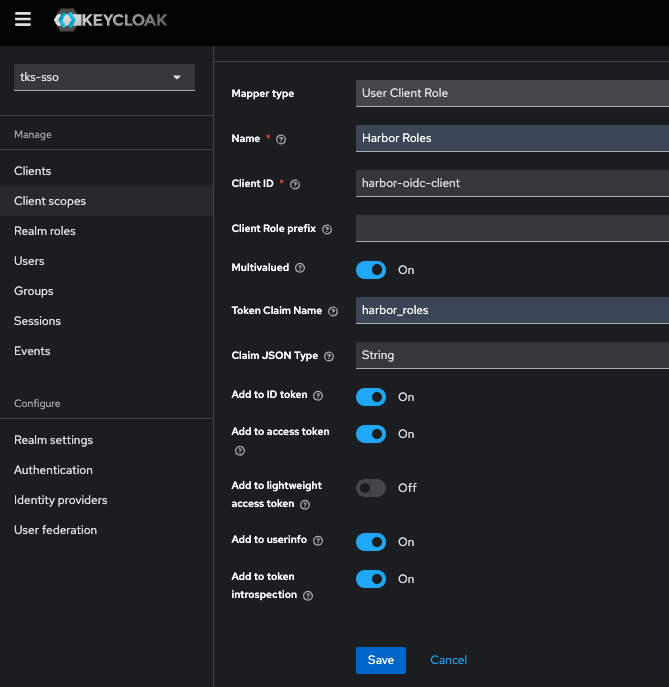

    'Add mapper' 또는 'Configure a new mapper' 버튼(매퍼가 없는 경우)을 클릭 > By configuration 선택

    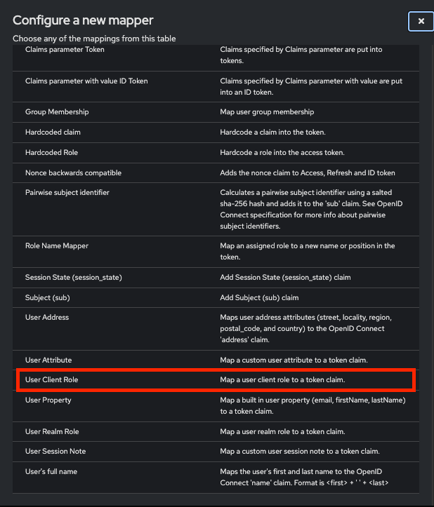

    User Client Role 타입의 Token Mapper를 선택

    

    토큰 매퍼의 Token Claim Name 필드는 하버 OIDC 구성 시 Group Claim Name 필드의 필드값이 됨


  4.3. Client에 Client Scope 추가

    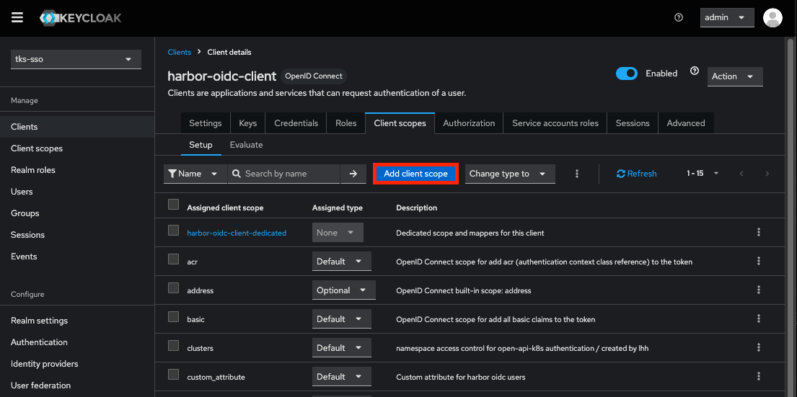

    Harbor Client의 Client Scopes 탭에서 'Add client scope' 버튼을 클릭

    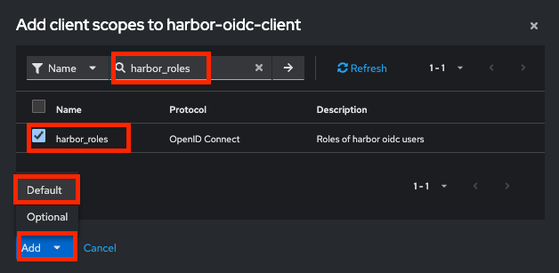

    'harbor_roles' client role을 체크 > 'Add' 버튼 클릭 > Default 선택


  4.4. Client에 Role을 생성

    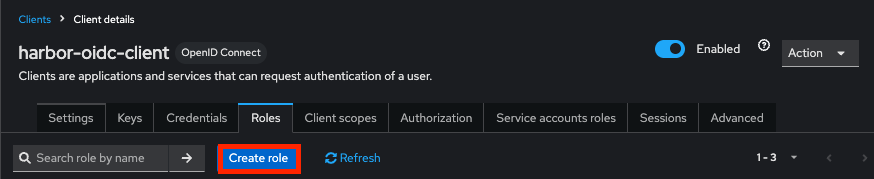

    Harbor Client의 Roles 탭에서 'Create role' 버튼 클릭

    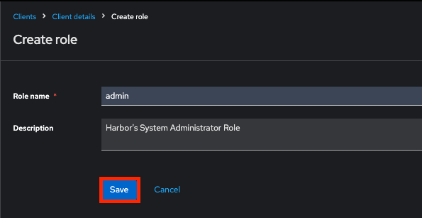

    Harbor의 시스템 관리자에 해당하는 'admin' Client role을 생성

    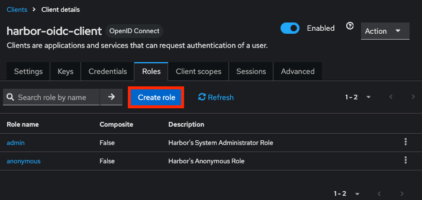

    Harbor의 admin과 anonymous에 해당하는 2개 Client role이 생성된 모습


  4.5. Keycloak User에 Role Mapping

    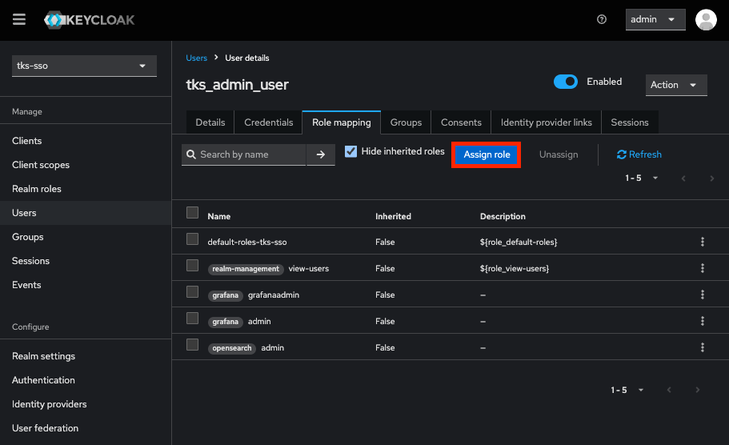

    'tks_admin_user' oidc 사용자의 Role mapping 탭에서 Assign role 버튼을 클릭

    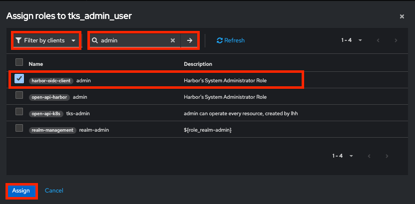

    Harbor Client의 'admin' client role을 할당

    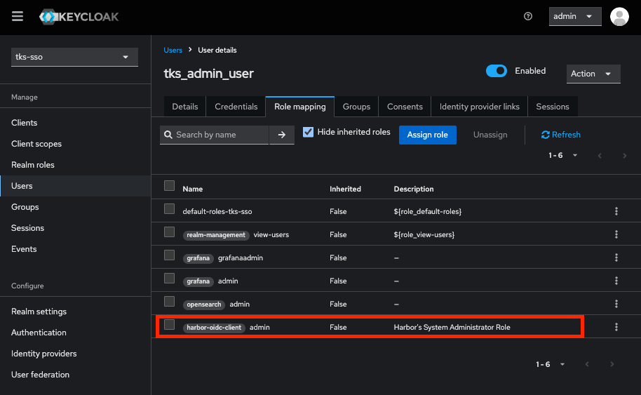

    'tks_admin_user' oidc 사용자에게 Harbor Client의 'admin' client role이 할당된 모습


5. Harbor에서 OIDC 구성

  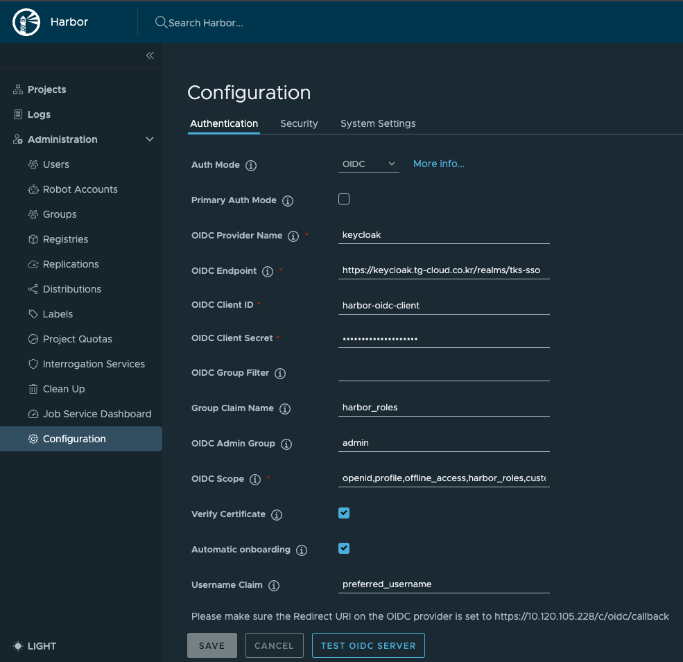

  Harbor 웹페이지 > 관리자로 로그인 > Administration > Configuration 메뉴 > Authentication 설정으로 이동

  주요 필드
    - OIDC Client ID: keycloak의 harbor client id
    - OIDC Client Secret: keycloak > harbor client > credentials 탭 > client secret 필드값
    - OIDC Claim Name: harbor_roles 클라이언트 스코프 내 User Client Role 타입으로 매핑된 token mapper의 Token Claim Name 필드값
      - 'Group Claim Name' 필드를 'harbor_roles'로 설정하여 사용자에게 할당된 client role에 따라 harbor group이 연동되도록 설정
    - OIDC Admin Group: keycloak의 harbor client role 중 하버 시스템 관리자에 해당하는 role 이름
      - OIDC Admin Group' 필드를 'admin'으로 설정하여 harbor의 admin group에 포함된 OIDC 사용자에게 하버 시스템 관리자 역할을 부여
    - Automatic onboarding: 처음 로그인한 외부 IdP의 사용자를 자동으로 Harbor 사용자로 생성하는 기능
    - Username Claim: Automatic onboarding 시 Username Claim에 지정된 필드값을 토큰에서 읽어 username을 생성하는 기능
      - 지정한 토큰 내 속성명으로 하버 oidc 사용자 이름이 자동 구성 됨 (권장값: preferred_username)
      - API 호출 시 path, query parameter로 사용 시 한글 사용을 방지하기 위함
      - 동명이인의 경우 발생할 수 있는 이슈를 예방하기 위함
      - 사용자가 하버 UI에 최초 로그인 시 사용자 이름을 커스텀할 수 있지만, 동일한 네이밍룰을 가지기 위함

  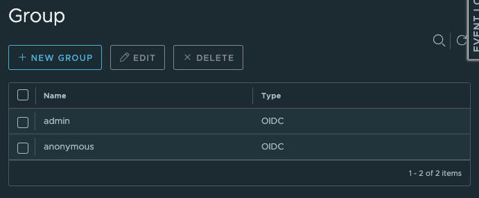

  'admin', 'anonymous' client role을 가진 각 oidc 사용자로부터 연동된 harbor group 목록


## 8. Harbor Proxy Cache 구성

> Harbor에서 특정 레지스트리에 대해 프록시 캐시를 사용할 수 있도록 구성합니다.

1. Docker Hub Personal Access Token 발급

  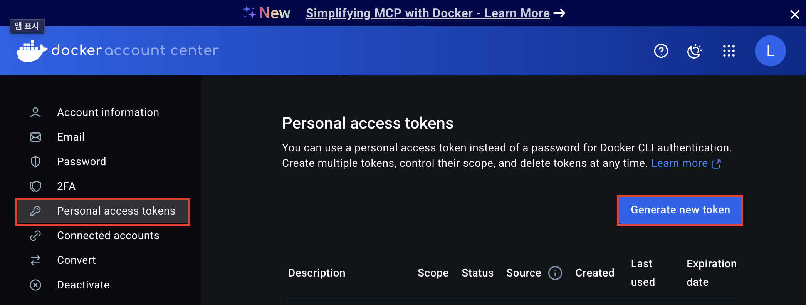

  https://app.docker.com/settings/personal-access-tokens 접속
  로그인 > Personal access tokens 메뉴 > Generate new token 버튼을 클릭하여 액세스 토큰을 발급
  도커 허브 엑세스 토큰은 하버에서 레지스트리 생성 시 사용


2. Registry 생성

  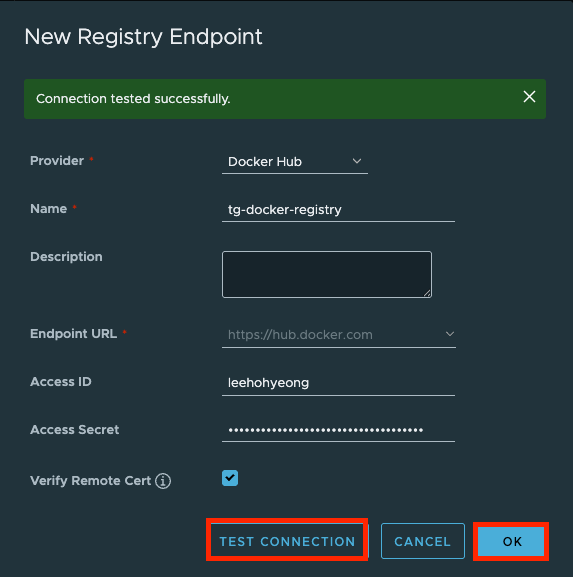

  ‘tg-docker-registry' 생성 시 Form
  TEST CONNECTION 버튼을 클릭하여 연결 상태 확인 후 OK 버튼 클릭하여 생성

  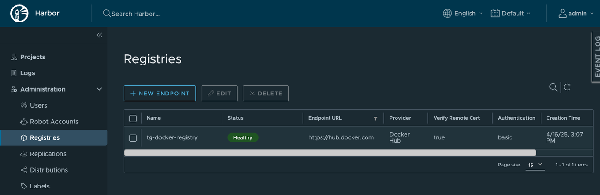

  ‘tg-docker-registry 생성 후 레지스트리 목록 화면


3. Proxy cache project 생성

  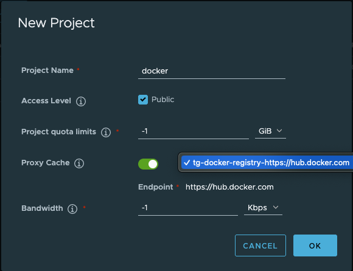

  'docker' 프록시 캐시 프로젝트 생성 시 Form

  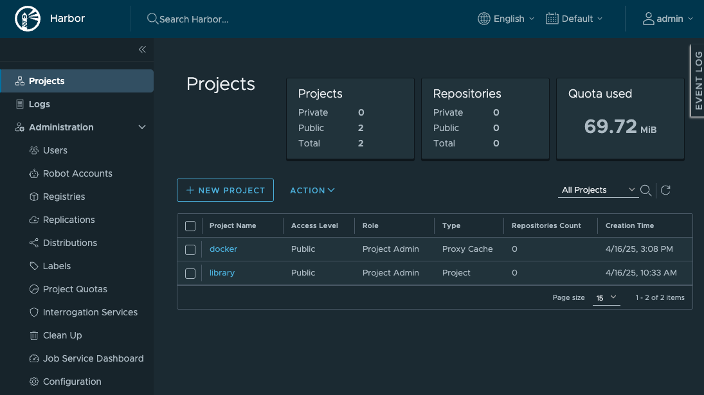

  'docker' 프록시 캐시 프로젝트 생성 후 프로젝트 목록 화면


## 9. Node containerd 설정

> Worker node의 containerd 및 registries.conf 설정을 통해 인증 우회 및 프록시 사용 설정합니다.

1. kubernetes cluster의 각 worker node에 접속

  ```bash
  ssh u@{worker node internal ip}
  ```


2. 모든 worker node의 containerd 런타임에 하버 레지스트리 설정

  ```bash
  sudo vi /etc/containerd/config.toml
  ```
  
  ```bash
  version = 2
  root = "/var/lib/containerd"
  state = "/run/containerd"
  oom_score = 0
  [grpc]
    max_recv_message_size = 16777216
    max_send_message_size = 16777216
  [debug]
    level = "info"
  [metrics]
    address = ""
    grpc_histogram = false
  [plugins]
    [plugins."io.containerd.grpc.v1.cri"]
      sandbox_image = "registry.k8s.io/pause:3.9"
      max_container_log_line_size = -1
      enable_unprivileged_ports = false
      enable_unprivileged_icmp = false
      [plugins."io.containerd.grpc.v1.cri".containerd]
        default_runtime_name = "runc"
        snapshotter = "overlayfs"
        [plugins."io.containerd.grpc.v1.cri".containerd.runtimes]
          [plugins."io.containerd.grpc.v1.cri".containerd.runtimes.runc]
            runtime_type = "io.containerd.runc.v2"
            runtime_engine = ""
            runtime_root = ""
            base_runtime_spec = "/etc/containerd/cri-base.json"
            [plugins."io.containerd.grpc.v1.cri".containerd.runtimes.runc.options]
              systemdCgroup = true
              binaryName = "/usr/local/bin/runc"
      [plugins."io.containerd.grpc.v1.cri".registry]
        [plugins."io.containerd.grpc.v1.cri".registry.mirrors]
          [plugins."io.containerd.grpc.v1.cri".registry.mirrors."docker.io"]
            endpoint = ["https://<Harbor VM IP 주소>/docker"]
          [plugins."io.containerd.grpc.v1.cri".registry.mirrors."<Harbor VM IP 주소>"]
            endpoint = ["https://<Harbor VM IP 주소>"]
          [plugins."io.containerd.grpc.v1.cri".registry.mirrors."<Harbor의 subdomain을 포함한 FQDN>"]
            endpoint = ["<Harbor의 subdomain을 포함한 FQDN>"]
        [plugins."io.containerd.grpc.v1.cri".registry.configs]
          [plugins."io.containerd.grpc.v1.cri".registry.configs."<Harbor VM IP 주소>"]
            [plugins."io.containerd.grpc.v1.cri".registry.configs."<Harbor VM IP 주소>".tls]
              insecure_skip_verify = true
            [plugins."io.containerd.grpc.v1.cri".registry.configs."<Harbor VM IP 주소>/proxy-cache".auth]
              username = "admin"
              password = "<admin 사용자 비밀번호>"
          [plugins."io.containerd.grpc.v1.cri".registry.configs."<Harbor의 subdomain을 포함한 FQDN>"]
            [plugins."io.containerd.grpc.v1.cri".registry.configs."<Harbor의 subdomain을 포함한 FQDN>".tls]
              insecure_skip_verify = true
            [plugins."io.containerd.grpc.v1.cri".registry.configs."<Harbor의 subdomain을 포함한 FQDN>/proxy-cache".auth]
              username = "admin"
              password = "<admin 사용자 비밀번호>"
  ```

  모든 worker node의 /etc/containerd/config.toml 파일 수정
  containerd 설정에 하버 레지스트리에 대해 인증, 비보안, 미러 설정 적용
  containerd 런타임 중 레지스트리에서 이미지를 pull 할 때 비보안 통신을 허용하고 주어진 사용자 정보를 이용하여 인증


3. 모든 worker node에 하버 레지스트리에 대한 비보안 설정
  
  ```bash
  sudo vi /etc/containers/registries.conf
  ```

  ```bash
  unqualified-search-registries = ["<Harbor VM IP 주소>", "<Harbor의 subdomain을 포함한 FQDN>", "registry.access.redhat.com", "registry.redhat.io", "docker.io"]
  short-name-mode = "enforcing"

  [[registry]]
  location = "<Harbor VM IP 주소>"
  insecure = true
  
  [[registry]]
  location = "<Harbor의 subdomain을 포함한 FQDN>"
  insecure = true
  ```

  모든 worker node의 /etc/containers/registries.conf 파일 수정
  노드에서 podman 사용 시 비보안 통신 허용


4. 모든 worker node의 containerd 설정 적용을 위한 재시작
  
  ```bash
  systemctl restart containerd.service
  ```


## 10. Containerd image pulling 테스트

> 하버 레지스트리 경로의 이미지를 사용하는 테스트용 Pod를 각 워커 노드에 생성하여 image pulling이 성공하는 지 확인합니다.

  ```yaml
  apiVersion: v1
  kind: Pod
  metadata:
    name: nginx-pod-<worker node name>
    namespace: default
  spec:
    containers:
    - name: nginx
      image: <Harbor VM IP 주소>/docker/library/nginx:latest
      ports:
      - containerPort: 80
    nodeName: <worker node name>
  ```

  docker hub에 대한 프록시 캐시 프로젝트 경로의 이미지를 사용
  spec.nodeName 필드에 특정 노드를 지정하여 해당 노드에 pod를 생성할 때 image pulling이 성공하는 지 확인
  _(다른 노드용 Pod은 nodeName만 변경)_
