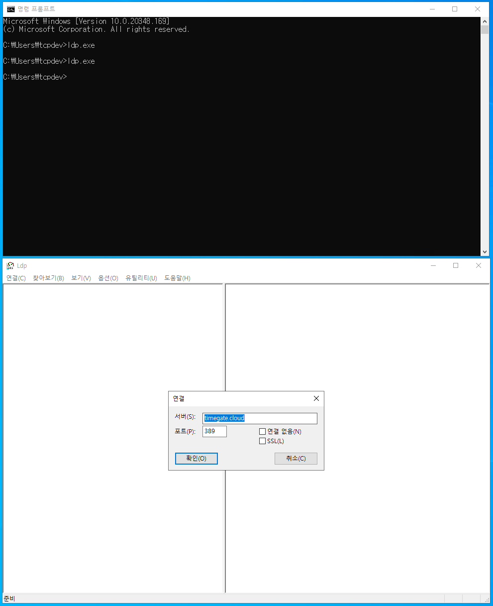
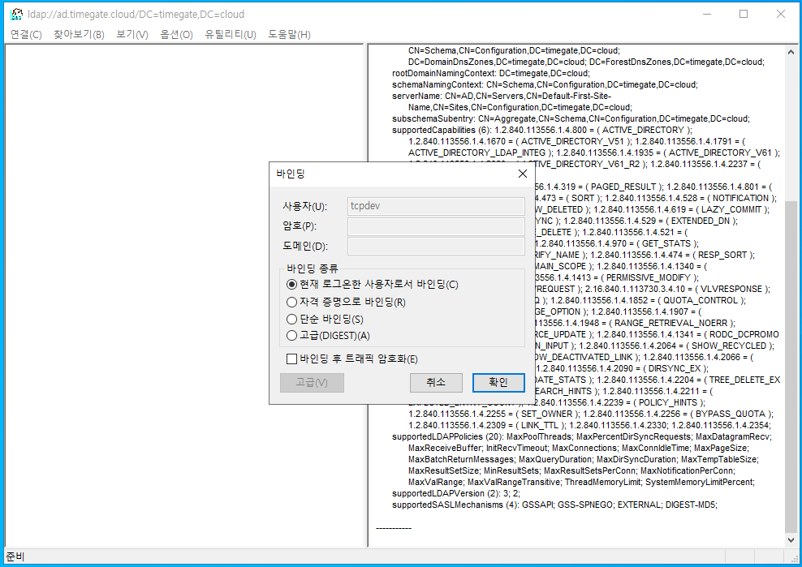
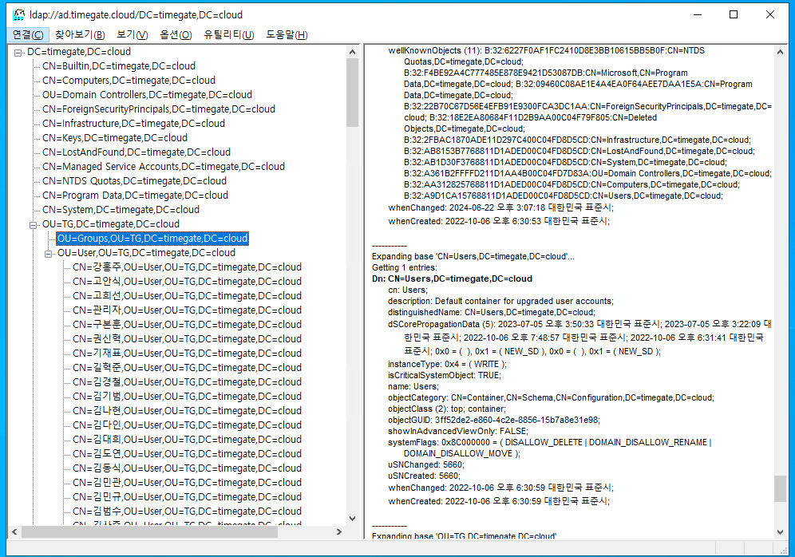
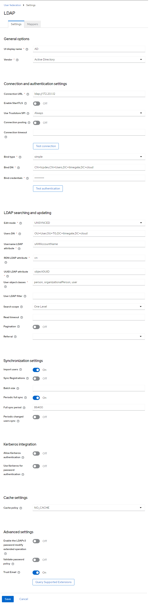
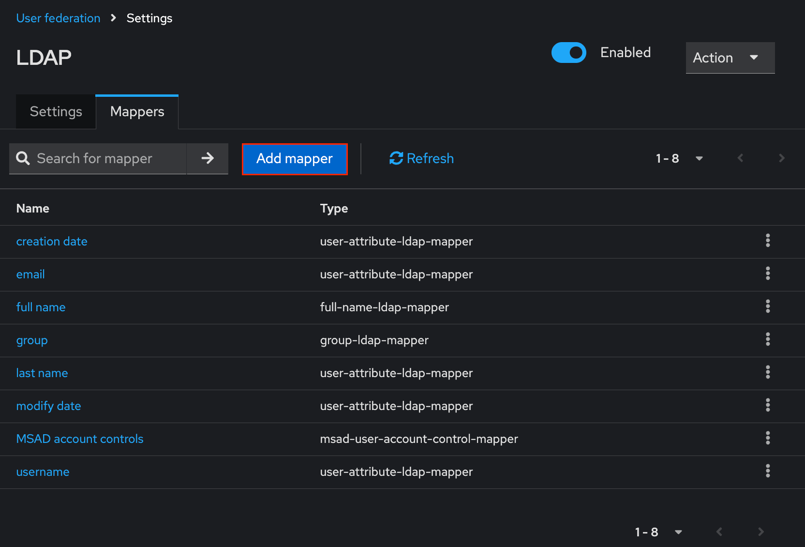
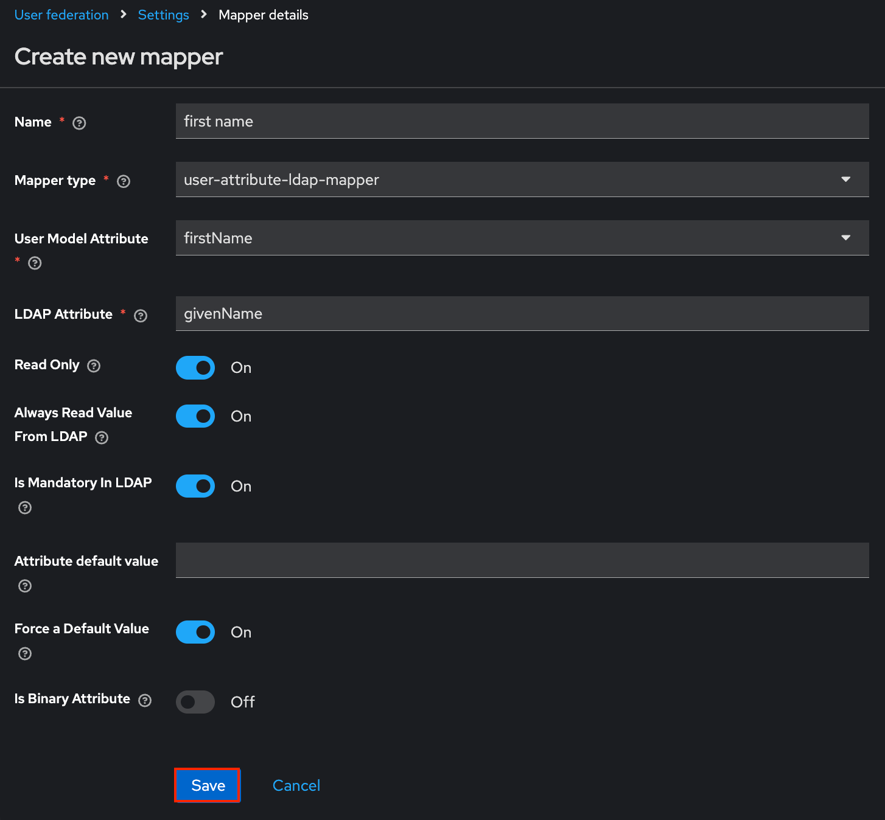
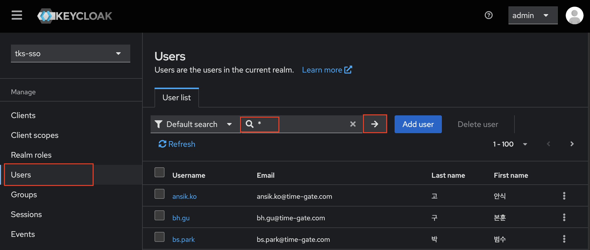
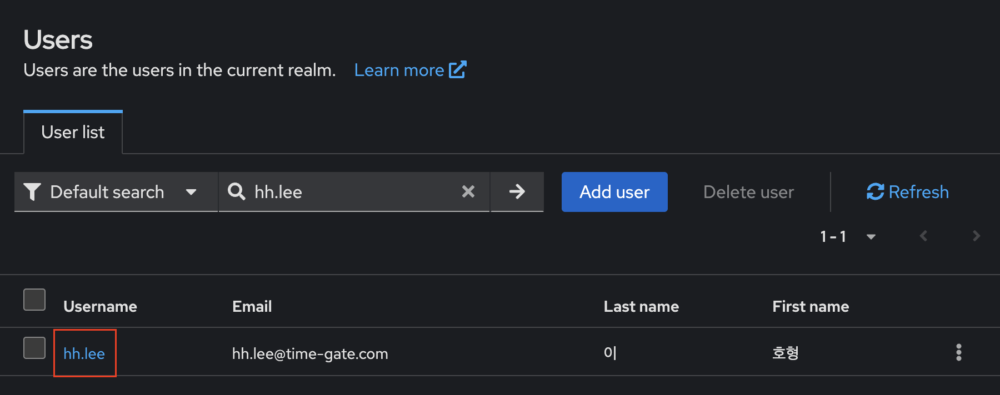
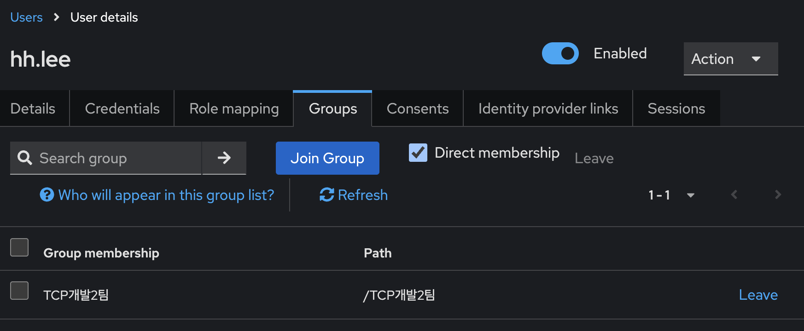
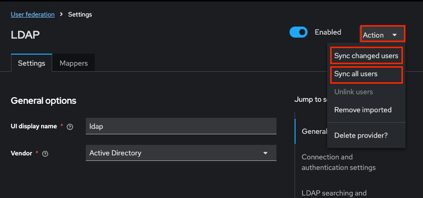

# Keyclaok - User Federation 구성

> Keycloak의 User Federation 기능은 외부 사용자 저장소(예: LDAP, Active Directory)와 통합하여 Keycloak이 해당 저장소의 사용자 정보를 직접 조회하거나 인증을 위임할 수 있도록 해주는 기능입니다. 이를 통해 기업이나 조직에서 기존의 사용자 관리 시스템을 그대로 활용하면서 Keycloak 기반의 인증 및 권한 부여 체계를 도입할 수 있습니다.


## 목차

1. [AD 트리 구조 확인](#1-ad-트리-구조-확인)  
2. [AD 사용자 연동 설정](#2-ad-사용자-연동-설정)  
3. [AD 그룹 연동 설정](#3-ad-그룹-연동-설정)  
4. [Keycloak 기본 LDAP Mapper 설정](#4-keycloak-기본-ldap-mapper-설정)  
5. [사용자 동기화 확인](#5-사용자-동기화-확인)  
6. [수동 사용자 동기화](#6-수동-사용자-동기화)  


## 1. AD 트리 구조 확인

> AD 서버에 존재하는 사용자 및 그룹의 DN(Distinguished Name), OU(Organizational Unit), CN(Common Name), DC(Domain Component) 정보를 확인하여 Keycloak 설정 시 정확한 값을 입력할 수 있게 합니다. ldapsearch를 이용하거나 ldap 서버에 직접 접속하여 주요 정보를 확인합니다. 

1. LDAP 서버와 통신 가능한 CLI 도구(ldapsearch)**를 사용하여 정보를 조회

    ldapsearch 사용을 위해 ldap-utils 또는 openldap-clients 설치

    Ubuntu / Debian
      ```bash
      sudo apt install ldap-utils
      ```
    CentOS / RHEL
      ```bash
      sudo yum install openldap-clients
      ```
    macOS
      ```bash
      brew install openldap
      ```
  
    기본 검색 명령어
      ldapsearch -x \
        -H ldap://{{사내 DNS 서버 주소}} \
        -D "CN=tcpdev,CN=Users,DC=timegate,DC=cloud" \
        -w 'Timegate1!' \
        -b "DC=timegate,DC=cloud" \
        -s sub \
        "(objectClass=*)" | less
      ldapsearch 주요 옵션 설명

    주요 옵션 목록:
      - -x
      → 단순 인증(Simple Bind) 사용

      - -H <URL>
      → LDAP 서버 주소 (예: ldap://{{사내 DNS 서버 주소}})

      - -D "<Bind DN>"
      → LDAP 로그인 사용자 (예: CN=tcpdev,CN=Users,DC=timegate,DC=cloud)

      - -w <Password>
      → 해당 사용자의 패스워드

      - -b "<Base DN>"
      → 검색 시작 기준이 되는 DN (예: DC=timegate,DC=cloud)

      - -s sub
      → 서브트리 전체 검색 (기본 수준보다 깊은 검색 수행)

      - "(filter)"
      → 검색 필터 (예: "objectClass=person" — 사람 객체만 검색)

2. ldapsearch 명령어 예시

  1. 사용자 목록 조회 (Users-DN 확인용)

  목적: 사용자 계정 목록, sAMAccountName, cn, mail, memberOf 등 속성 확인

  ldapsearch -x \
    -H ldap://{{사내 DNS 서버 주소}} \
    -D "CN=tcpdev,CN=Users,DC=timegate,DC=cloud" \
    -w 'Timegate1!' \
    -b "OU=User,OU=TG,DC=timegate,DC=cloud" \
    "(objectClass=person)"


  2. Group 목록 조회 (LDAP Groups DN, 그룹 이름 필드 확인)

  목적: 그룹 목록, cn, member, distinguishedName, memberOf 등 속성 확인

  ldapsearch -x \
    -H ldap://{{사내 DNS 서버 주소}} \
    -D "CN=tcpdev,CN=Users,DC=timegate,DC=cloud" \
    -w 'Timegate1!' \
    -b "OU=Groups,OU=TG,DC=timegate,DC=cloud" \
    "(objectClass=group)"


  3. 루트 DN 구조 탐색 (Base DN, OU 등 탐색)

  목적: 전체 AD 트리 탐색 (OU=TG, OU=User, OU=Groups 등 확인)

  ldapsearch -x \
    -H ldap://{{사내 DNS 서버 주소}} \
    -D "CN=tcpdev,CN=Users,DC=timegate,DC=cloud" \
    -w 'Timegate1!' \
    -b "DC=timegate,DC=cloud" \
    "(objectClass=organizationalUnit)"


  4. 특정 사용자 상세 정보 조회 (속성값 확인용)

  목적: 특정 사용자 계정의 상세 속성(cn, mail, memberOf, givenName, sn, userAccountControl) 확인

  ldapsearch -x \
    -H ldap://{{사내 DNS 서버 주소}} \
    -D "CN=tcpdev,CN=Users,DC=timegate,DC=cloud" \
    -w 'Timegate1!' \
    -b "OU=User,OU=TG,DC=timegate,DC=cloud" \
    "(sAMAccountName=hh.lee)"


  5. 특정 그룹에 속한 사용자 확인 (그룹 → 사용자)

  목적: member 속성으로 사용자 DN 목록 확인 → Keycloak Mapper에서 사용

  ldapsearch -x \
    -H ldap://{{사내 DNS 서버 주소}} \
    -D "CN=tcpdev,CN=Users,DC=timegate,DC=cloud" \
    -w 'Timegate1!' \
    -b "OU=Groups,OU=TG,DC=timegate,DC=cloud" \
    "(cn=your-group-name)"


  6. 사용자가 속한 그룹 확인 (사용자 → 그룹)

  목적: memberOf 속성 확인 → Group Mapper 설정에서 필요

  ldapsearch -x \
    -H ldap://{{사내 DNS 서버 주소}} \
    -D "CN=tcpdev,CN=Users,DC=timegate,DC=cloud" \
    -w 'Timegate1!' \
    -b "OU=User,OU=TG,DC=timegate,DC=cloud" \
    "(sAMAccountName=hh.lee)"
 


3. Window에서 LDAP 서버 접속하여 정보를 확인  
  
  
  
  메뉴에서 [연결] 선택. 입력창에 다음과 같이 입력 후 확인을 누르면 연결된다.
  서버 : timegate.cloud
  포트 : 389 

  

  메뉴에서 바인딩을 실행
  입력화면에서 현재 로그온한 사용자로서 바인딩 선택
  
  

  바인딩되면 트리구조가 표시되고 Bind, User Mapper 설정에 필요한 OU, CN, DC 정보를 찾아서 사용


## 2. AD 사용자 연동 설정

> Keycloak에 AD를 외부 사용자 저장소로 등록하여 로그인 인증 시 AD 사용자를 활용할 수 있게 합니다.

  

  - keKeycloak Admin Console 접속
  - 좌측 메뉴에서 User Federation 선택
  - [Add LDAP provider] 클릭

  

  LDAP 입력 화면에 다음 정보를 입력하고 Save
    - UI display name : AD
    - Vendor: Active Directory
    - Connection-URL: ldap://{{사내 DNS 서버 주소}} # AD는 port없이 IP만 입력 
    - Bind-Type: simple
    - Bind-DN: CN=tcpdev,CN=Users,DC=timegate,DC=cloud
    - Bind-Credential: Timegate1! # tcpdev 유저의 password 입력 
    - Edit-Mode: UNSYNCED # READ-ONLY : keycloak 내부 DB에 저장 안함, WRITABLE : AD서버에 변경 내용을 저장 
    - Users-DN: OU=User,OU=TG,DC=timegate,DC=cloud
    - User-LDAP-Filter: #불필요, 필요시만 정의 예) (&(employeetype=temp)) 
    - Search-Scope: One Level # 하위 트리의 유저 필요시 Subtree 
    - Import users : ON
    - Sync Registrations  : OFF # ON이면 keycloak 자체 생성 user를 AD에 저장 
    - Trust Email : ON
    - User LDAP Attribute : sAMAccountName ## sAMAccountName (email account)  또는 cn (한글이름)

## 3. AD 그룹 연동 설정

> AD의 그룹 정보를 Keycloak 그룹으로 매핑하여 RBAC 적용 시 Keycloak 그룹을 그대로 사용할 수 있게 합니다.

  
  
  - User Federation에서 방금 생성한 AD 항목 클릭
  - 상단 Mapper 탭으로 이동 (표시상 LDAP로 보일 수 있음)
  - [Add Mapper] 클릭 후 다음 정보 입력
  
  

  Name에 group을 입력하고  나머지 항목을 입력하고  Save
    - Name: group 
    - Mapper-Type: group-ldap-mapper
    - LDAP Groups DN : OU=Groups,OU=TG,DC=timegate,DC=cloud
    - Group-Name-LDAP-Attribute: cn 
    - Group-Object-Classes: group
    - Preserve Group Inheritance : OFF
    - Ignore Missing Groups : ON
    - Membership-LDAP-Attribute: member 
    - Membership-Attribute-Type: DN 
    - Membership-User-LDAP-Attribute: sAMAccountName 
    - LDAP-Filter:  # 불필요, 필요시만 정의 예) (&(cn=testGROUP))
    - Mode: READ_ONLY 
    - User-Groups-Retrieve-Strategy: LOAD_GROUPS_BY_MEMBER_ATTRIBUTE 
    - Member-Of-LDAP-Attribute: memberOf

## 4. Keycloak 기본 LDAP Mapper 설정

> Keycloak 기본 LDAP Mapper는 LDAP 구성 시  자동생성되며 OIDC 인증 시 필요한 사용자 정보 중 필수 필드를 완성합니다,  LDAP 구성 시 아래의 필드가 자동 매핑되었는지 확인하고 생성되지 않은 필드에 대해 매핑합니다.

  1. Keycloak 기본 LDAP Mapper 목록:

  - username
    - Mapper Type: user-attribute-ldap
    - LDAP Attribute: sAMAccountName
    - User Model Attribute: username

  - email
    - Mapper Type: user-attribute-ldap
    - LDAP Attribute: mail
    - User Model Attribute: email

  - first name
    - Mapper Type: user-attribute-ldap
    - LDAP Attribute: givenName
    - User Model Attribute: firstName

  - last name
    - Mapper Type: user-attribute-ldap
    - LDAP Attribute: sn
    - User Model Attribute: lastName

  
  
  
  2. firstName Mapper 추가

    

    - User Federation에서 방금 생성한 AD 항목 클릭
    - 상단 Mapper 탭으로 이동 (표시상 LDAP로 보일 수 있음)
    - [Add Mapper] 클릭 후 다음 정보 입력

    

    Name에 first name을 입력하고  나머지 항목을 입력하고  Save
      - Name: first name 
      - Mapper-Type: user-attribute-ldap-mapper
      - User Model Attribute: firstName
      - LDAP Attribute: givenName
      - Read Only: On
      - Always Read Value From LDAP: On
      - is Mandatory In LDAP: On
      - Force a Default Value: On
      - Is Binary Attribute: Off


## 5. 사용자 동기화 확인

> AD와 연결이 잘 되었는지 확인하고 실제 사용자 및 그룹이 연동되었는지 검증합니다.

  
  Users 메뉴에서 입력란에 “*”를 입력하고 → 버튼을 클릭하면 동기화된 유저 리스트가 출력됨

  

  사용자 목록에서 특정 사용자의 Username을 클릭하여 상세 화면으로 이동

  

  group 탭으로 이동하여 group 동기화 상태 확인   


## 6. 수동 사용자 동기화

> 외부 사용자 저장소(예: LDAP, Active Directory)에 등록된 모든 사용자 정보를 keycloak 사용자와 수동적으로 동기화하는 방법을 설명합니다.

  

  - keycloak tks-sso realm의 User federation 메뉴 이동
  - 등록한 LDAP 선택
  - 우측 상단의 Action 선택박스 클릭
  - Sync changed users 또는 Sync all users 버튼 클릭
  
  Sync all users 버튼의 기능
    - 외부 사용자 저장소(예: LDAP, Active Directory)에 등록된 모든 사용자 계정 정보를 Keycloak으로 가져옴
    - 아직 Keycloak에 등록되지 않은 외부 사용자들을 Keycloak의 내부 사용자 데이터베이스에 생성
    - 이미 등록된 사용자에 대해서는 정보를 업데이트 (사용자 속성 등)
    - 즉, 외부 저장소의 전체 사용자 정보를 Keycloak에 동기화하는 기능

  Sync changed users 버튼의 기능
    - 변경된 사용자 정보 동기화: 외부 저장소에서 사용자 정보(예: 이메일, 이름 등)가 변경된 경우, 해당 변경 사항만 Keycloak에 반영
    - 신규 사용자 추가: 외부 저장소에 새로 추가된 사용자는 Keycloak에 동기화되지 않습니다. 신규 사용자를 동기화하려면 "Syncall users" 버튼을 사용
    - 삭제된 사용자 처리: 외부 저장소에서 삭제된 사용자는 Keycloak에서 자동으로 제거되지 않음. 삭제된 사용자를 Keycloak에서 제거하려면 수동으로 삭제하거나 전체 동기화를 수행

  사용 시점 예시
    - LDAP에 변경된 사용자 정보가 있을 때 Keycloak에도 반영하고 싶을 때
    - 주기적인 수동 동기화가 필요할 때