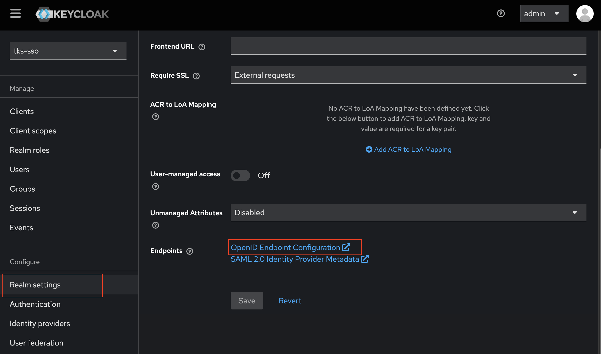

# kube-apiserver oidc 설정

> CentOS 기반 CICD 마스터 노드에 ArgoCD v2.9.3을 설치하고, 폐쇄망 환경에 맞춰 Harbor 레지스트리 이미지를 사용하는 방법과 Kubernetes 연동 및 CLI 사용법을 설명합니다.


## 목차

1. [Master Node에 쉘 접속](#1-master-node에-쉘-접속)  
2. [Master 노드에서 Keycloak 도메인 접근을 위한 호스트 매핑 설정](#2-master-노드에서-keycloak-도메인-접근을-위한-호스트-매핑-설정)  
3. [Keycloak OIDC 메타데이터 정보 확인](#3-keycloak-oidc-메타데이터-정보-확인)
4. [Kubernetes에 keycloak 서버 인증서 구성](#4-Kubernetes에-keycloak-서버-인증서-구성)
5. [Kube-apiserver 설정 파일 수정](#5-kube-apiserver-설정-파일-수정)  
6. [변경 사항 확인 및 반영 확인](#6-변경-사항-확인-및-반영-확인)  


## 1. Master Node에 쉘 접속

> keycloak 인증서를 복사하고 oidc 구성을 진행할 클러스터의 마스터 노드로 ssh 접속합니다.

  ```bash
  ssh u@<master node InternalIP>
  ```


## 2. Master 노드에서 Keycloak 도메인 접근을 위한 호스트 매핑 설정

> Keycloak 접근 가능한 IP를 keycloak.tg-cloud.co.kr이라는 도메인에 매핑, 이 도메인은 후속 작업에서 kube-apiserver의 OIDC 설정에 사용됩니다.

  ```bash
  IP=$(kubectl get svc ingress-nginx-controller -n ingress-nginx -o jsonpath='{.status.loadBalancer.ingress[0].ip}')
  HOSTNAME="keycloak.tg-cloud.co.kr"
  echo "$IP $HOSTNAME" | sudo tee -a /etc/hosts
  ```

  ingress-nginx-controller 서비스의 외부 IP(LB 주소)를 클러스터에서 조회해 /etc/hosts 파일에 해당 IP와 Keycloak 도메인을 등록

  주의: 설정하지 않으면 OIDC 서버의 DNS 해석이 실패하면 kube-apiserver가 OIDC 설정을 실패함
    - --oidc-issuer-url은 단순 문자열이 아니라, 정상적인 HTTPS 요청이 가능해야 하는 URL
    - kube-apiserver가 부팅 중 OIDC 서버에 HTTPS로 접속하여 메타데이터를 받아오는데 실패하면, OIDC 인증이 동작하지 않고 무시되거나 에러 발생.


## 3. Keycloak OIDC 메타데이터 정보 확인

> Keycloak의 OIDC 설정 정보를 통해 issuer URL 및 인증, 토큰 엔드포인트 경로를 확인합니다, 이 정보는 kube-apiserver에 OIDC를 구성할 때 필요합니다.

  

  keycloak 접속 > Realm settings > OpenID Endpoint Configuration 버튼클릭

  예시: 
  ```bash
  {
    "issuer": "https://keycloak.tg-cloud.co.kr/realms/tks-sso",
    "authorization_endpoint": "https://keycloak.tg-cloud.co.kr/realms/tks-sso/protocol/openid-connect/auth",
    "token_endpoint": "https://keycloak.tg-cloud.co.kr/realms/tks-sso/protocol/openid-connect/token"
  }
  ```


## 4. Kubernetes에 keycloak 서버 인증서 구성

> Keycloak에서 사용하는 self-signed 인증서 또는 내부 CA로 서명된 인증서를 Kubernetes의 kube-apiserver가 신뢰할 수 있도록 구성, 이를 통해 Kubernetes에서 Keycloak을 OIDC Provider로 사용할 때 TLS 통신 중 인증서 오류를 방지합니다.

  ```bash
  cp /root/.keystore/rootca-kcdev.crt /etc/kubernetes/ssl/rootca-kcdev.crt
  ```

  kube-apiserver가 접근 가능한 위치에 keycloak 서버 인증서를 복사

  예시: 
  ```bash
  - --oidc-ca-file=/etc/kubernetes/ssl/rootca-kcdev.crt
  ```

  아래의 '5. kube-apiserver 설정 파일 수정' 단계에서 아래 옵션을 통해 keycloak 서버 인증서를 구성


## 5. Kube-apiserver 설정 파일 수정

> kube-apiserver는 static pod로 실행되므로, 해당 설정 파일을 수정하면 자동으로 컨테이너가 재시작되며 변경사항이 반영됩니다.

  ```bash
  sudo vi /etc/kubernetes/manifests/kube-apiserver.yaml
  ```

  vi로 kube-apiserver 설정 파일 편집

  ```bash
  - --oidc-issuer-url=https://keycloak.tg-cloud.co.kr/realms/tks-sso
  - --oidc-client-id=oidc-client
  - --oidc-username-claim=preferred_username
  - --oidc-groups-claim=groups
  - --oidc-ca-file=/etc/kubernetes/ssl/rootca-kcdev.crt
  - --oidc-username-prefix=-
  ```
​
  각 항목 설명:
  - --oidc-issuer-url: Keycloak의 OIDC issuer URL을 지정
  - --oidc-client-id: Keycloak에 등록한 OIDC Client ID
  - --oidc-username-claim: ID 토큰에서 username으로 사용할 claim (preferred_username 권장)
  - --oidc-groups-claim: ID 토큰에서 group 정보를 추출할 claim
  - --oidc-ca-file: Keycloak 서버 인증서의 루트 CA 파일 경로
  - --oidc-username-prefix=-: 사용자 이름 앞에 붙일 접두어 (중복 방지 목적, 필요에 따라 변경 가능)

  ✅ --oidc-ca-file에 지정된 rootca-kcdev.crt는 Keycloak에서 사용하는 self-signed 인증서 또는 CA 인증서여야 하며, kube-apiserver가 접근 가능한 위치에 있어야 함
    kube-apiserver에 OIDC 관련 파라미터 추가


## 6. 변경 사항 확인 및 반영 확인

> kube-apiserver가 정상적으로 재시작되었는지 확인하고, OIDC 관련 설정이 잘 반영되었는지 로그에서 오류 메시지가 없는지 확인합니다.

  ```bash
  kubectl logs -n kube-system -l component=kube-apiserver
  ```

  kube-apiserver의 log를 조회