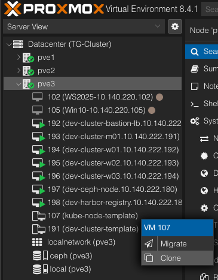
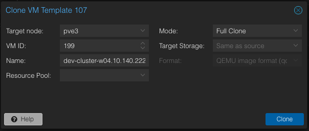
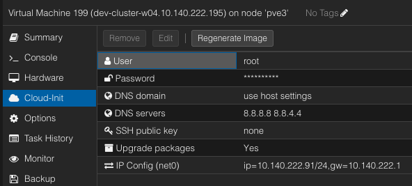

# 클러스터 확장을 위한 Kubernetes 노드 구성 매뉴얼(node-template 사용)


## 목차 

1. [VM 생성 ( Proxmox )](#1-vm-생성--proxmox-)  
1.1. [Proxmox 접속 정보](#11-proxmox-접속-정보)  
1.2. [템플릿 기반 VM 생성](#12-템플릿-기반-vm-생성)  
1.3. [VM 네트워크 설정](#13-vm-네트워크-설정)  
2. [Bastiom 서버 구성](#2-bastiom-서버-구성)  
2.1. [DNS 구성 (BIND)](#21-dns-구성-bind)  
2.2. [Kubespray 구성](#22-kubespray-구성-)   
2.3. [Ansible 을 통해 Kubernetes 설치](#23-ansible-을-통해-kubernetes-설치)  
2.4. [Kubespray 컨테이너 사용](#24-kubespray-컨테이너-사용)  
 

## 1. VM 생성 ( Proxmox )

### 1.1. Proxmox 접속 정보
URL : https://10.140.119.11:8006
계정 : root

 

### 1.2. 템플릿 기반 VM 생성
Proxmox 웹 UI에서 템플릿 VM(Node Template) 을 우클릭 → Clone 선택



Clone Options 설정

Mode : Full Clone (완전 복제)

VM ID : 새로 만들 VM 의 고유 ID 지정

Name : 새 VM 이름 입력 ( ex : dev-cluster-w01.10.140.222.191 )

Target Node / Storage : 원하는 노드와 스토리지 선택


 

### 1.3. VM 네트워크 설정
VM 생성 후, Cloud-Init > IP Config (net0) 선택

IP Config 행 선택 후 Edit 버튼 선택하여 IPv4 설정 ( ex : 10.140.222.191/24 )


 

 

## 2. Bastiom 서버 구성
 

### 2.1. DNS 구성 (BIND)
 

1. 정방향 조회 DNS 설정

ex) /var/named/timegate.io.zone - 노드 도메인에 맞는 IP 추가


```
$TTL 1W
@       IN      SOA     ns1.timegate.io.  root (
                        2019070700      ; serial
                        3H              ; refresh (3 hours)
                        30M             ; retry (30 minutes)
                        2W              ; expiry (2 weeks)
                        1W )            ; minimum (1 week)
        IN      NS      ns1.timegate.io.
        IN      MX 10   smtp.timegate.io.
;
;
ns1     IN      A       192.168.100.100
smtp    IN      A       192.168.100.100
;
; The api identifies the IP of your load balancer.
lb                IN      A       192.168.100.100
bastion           IN      A       192.168.100.100
registry          IN      A       192.168.100.100
api               IN      A       192.168.100.100
;
; The wildcard also identifies the load balancer.
*.apps            IN      A       192.168.100.100
;
; Create entries for the master hosts.
master           IN      A       192.168.100.101
;
; Create entries for the worker hosts.
worker           IN      A       192.168.100.102
;
```

2. 역방향 조회 DNS 설정

- ex) /var/named/100.168.192.in-addr-timegate.arpa.zone - IP에 맞는 노드 도메인 추가


```
$TTL 1W
@       IN      SOA     ns1.timegate.io.  root (
                        2019070700      ; serial
                        3H              ; refresh (3 hours)
                        30M             ; retry (30 minutes)
                        2W              ; expiry (2 weeks)
                        1W )            ; minimum (1 week)
        IN      NS      ns1.timegate.io.
;
; The syntax is "last octet" and the host must have an FQDN
; with a trailing dot.
20     IN      PTR     bastion.timegate.io.
20     IN      PTR     registry.timegate.io.
20     IN      PTR     api.timegate.io.
;
21     IN      PTR     master.timegate.io.
;
22     IN      PTR     worker.timegate.io.
;
```

3. DNS 서비스 재시작

```
systemctl restart named --now
```

 

### 2.2. Kubespray 구성 

1. hosts.yaml 파일 수정

    파일 경로 : /root/kubespray/inventory/<cluster_name>

- Node IP 정보 추가

- Node 역할 추가


```
all:
  hosts:
    master:
      ansible_host: 192.168.100.101
      ip: 192.168.100.101
      access_ip: 192.168.100.101
    worker:
      ansible_host: 192.168.100.102
      ip: 192.168.100.102
      access_ip: 192.168.100.102
    <node_name>:               # node 정보 추가
      ansible_host: <node_ip>
      ip: <node_ip>
      access_ip: <node_ip>
  children:                    # node 역할 추가
    kube_control_plane:
      hosts:
        master:
        <node_name>:           # master 노드인 경우
    kube_node:
      hosts:
        worker:
        <node_name>:           # worker 노드인 경우
    etcd: 
      hosts:
        master:
    k8s_cluster:
      children:
        kube_control_plane:
        kube_node:
    calico_rr:
      hosts: {}
  vars:
    override_system_hostname: false
```

### 2.3. Ansible 을 통해 Kubernetes 설치

1. resolv.conf 파일 복사

Bastion 서버에서 설정한 resolve.conf.<cluster_domain> 를 hosts.yaml에 명시된 각 노드의 resolve.conf로 동일하게 복사하여 적용합니다.


```
ansible k8s_cluster \ 
-i /root/kubespray/inventory/<cluster.domain>/hosts.yaml \
-m copy \
-a "src=/tmp/resolv.conf.<cluster.domain>.io dest=/etc/resolv.conf"
```

### 2.4. Kubespray 컨테이너 사용

1. Kubernetes 설치를 위한 Kubespray Container 가동

kubespray 를 도커 컨테이너로 올려 사용하면 버전별로 따로 쓸 일이 있을 경우 따로 설치안하고 이미지만 받아서 사용 가능

- ex ) $cluster => devclu0


```
docker run --name kubespray-v2.24.2 -it \
--mount type=bind,src="$(pwd)"/inventory/$cluster,dst=/inventory \
--mount type=bind,src="${HOME}"/.ssh/id_rsa,dst=/root/.ssh/id_rsa \
quay.io/kubespray/kubespray:v2.24.2  bash
```

2. 컨테이너 내부


```
# kubespray 디렉토리 이동
cd kubespray
# 신규 노드 추가 : 추가되는 node_name 명시
ansible-playbook \
-i /inventory/hosts.yaml \
--private-key /root/.ssh/id_rsa scale.yml \
-e kube_target_nodes="[<node_name>]" -b
# 전체 클러스터 재구성
ansible-playbook \
-i /inventory/hosts.yaml \
--private-key /root/.ssh/id_rsa cluster.yml -b
```