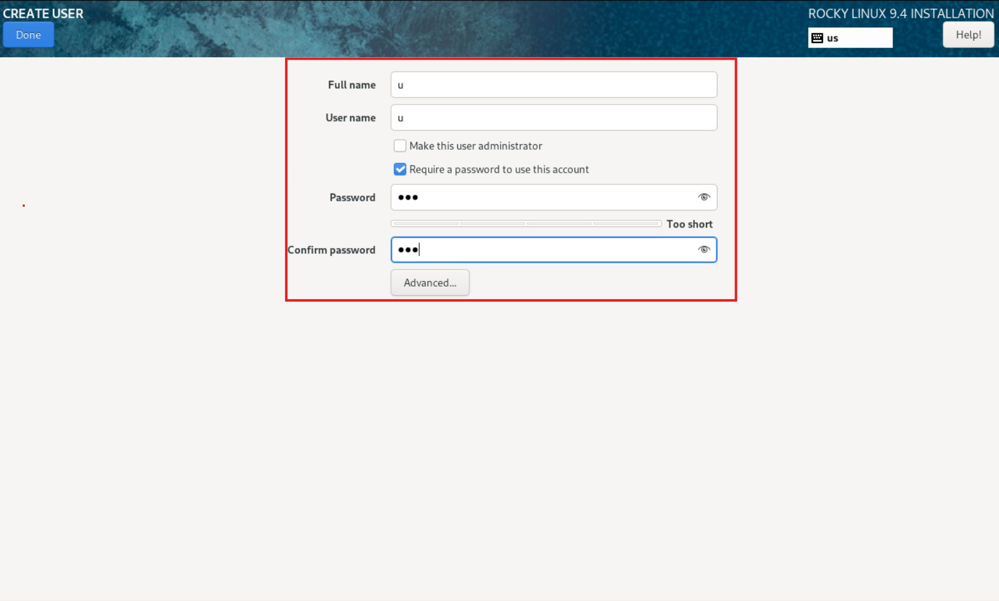

## 1. vSphere

### 1.1. vSphere 접속 및 인증

접속주소  : https://tgcloud-vcsa.timegate.cloud/
인증정보 :  DX AD 서버 사용자명/패스워드 


## 2. VM 구성

### 2.1. VM 생성 

홈 → 인벤토리 → tgcloud-vsca.timegate.cloud → tg-dc01 → tg-mgmt-cl → [TCP-Dev] 우클릭 → [새 가상 시스템] 선택


### 2.2. VM 설정

(1) - 생성 유형 선택 → 새 가상 시스템 생성


(2) - 이름 및 폴더 선택 → 가상 시스템 이름 작성 → 가상 시스템 위치 선택 (tgcloud-vcsa.timegate.cloud/tg-dc01/TCP-Dev)


(3) - 계산 리소스 선택 →  대상 계산 리소스 선택 (tg-dc01/tg-mgmt-cl/TCP-Dev)


(4) - 스토리지 선택 → tg-vsan-ds로 설정 


(5) - 호환성 선택 → 기본 값으로 선택


(6) -  게스트 운영 체제 선택

게스트 운영체제 패밀리 : Linux

게스트 운영체제 버전 : Rocky Linux(64비트)


 (7) - 하드웨어 사용자 지정 

VM 사양 입력 
CPU :  VCPU 코어 수
메모리 : VM에 할당할 최대 메모리 양
새 하드디스크 : HDD1 최대 용량 지정
             설정 단계에서 디스크를 추가하려면 [새 하드디스크] 항목의 [⋮] 을 눌러서 추가


 네트워크 설정:
 새 네트워크 → 찾아보기 → TCP-Dev_대역 선택


새 CD/DVD 드라이브 :  [데이터 스토어 ISO 파일]  선택


ISO 이미지 파일 선택 : [tg-vsan-ds] 선택 후 [확인]


tg-vsan-ds의 ISO 폴더 선택 (아래 방향 화살표를 클릭)


ISO 폴더에서 Rocky 폴더 선택 및 Release 선택 후 [확인]


새 CD/DVD 드라이브 : 데이터 ISO DVD 드라이브가 최초 부팅시 연결되도록  [전원을 켤 때 연결] 선택


완료 준비 단계에서 설정한 값들이 올바른지 확인하고 완료를 클릭하면 배포됩니다.


## 3. VM Console 설정

### 3.1. VM 접속

배포한 VM을 선택한 뒤 [▶] 버튼을 눌러 전원을 켭니다. 이후 [웹 콘솔 시작] 버튼이 활성화되면 클릭하여 웹 콘솔에 접속합니다.


### 3.2. OS 설치

웹콘솔 진입후 OS 설치 화면입니다.
Install Rocky Linux 9.4 를 선택하여 설치합니다.


설치 중인 화면


### 3.3. 언어 선택

설치 언어를 선택합니다. (매뉴얼에서는 English를 선택)


### 3.4. OS 설정

OS 설정 화면입니다.


[Installation Destination] 선택 후 설치할 HDD 통으로 선택합니다.
선택 후 [Done] 클릭하여 다시 설정 화면으로 이동합니다.


설정 화면에서 [Software Selection] 선택 후 Base Environment로 Server 선택합니다.
선택 후 [Done] 클릭하여 다시 설정 화면으로 이동합니다.


설정 화면에서 [Time and Date] 선택 후  Asia/Seoul에 핀 찍기 (또는 좌측 상단에서 지역 변경 가능)
선택 후 [Done] 클릭하여 다시 설정 화면으로 이동합니다.


설정 화면에서 [Root Password] 선택 후 password 설정합니다.
[Allow root SSH login with password] 체크해야합니다.


설정 화면에서 [User Creation] 선택 후 user name과 password 설정합니다.




설정이 완료되면 OS 설정 화면에서 [Begin Installation] 을 선택하여 OS 설치를 진행합니다.


설치가 완료되면 Reboot System을 클릭하면됩니다.


 vSphere 화면에서 [웹 콘솔 시작]을 눌러서 OS의 shell로  접근합니다.


앞에서 생성한 사용자 계정 또는 root 계정으로 로그인하여 정상적으로 설치되었는지 확인합니다.


hostname 및 static IP 설정

웹 콘솔 접속을 통해 shell에 root로 로그인 후 다음 명령 수행 

hostname 설정
각 노드가 고유한 이름은 가져야 Kubernetes에서 구분이 가능합니다.

```
hostnamectl set-hostname {hostname}
```

예 : ``dev-cluster-m01``

```
hostnamectl set-hostname dev-cluster-m01
```


network adapter  확인
서버에 설치된 네트워크 인터페이스를 확인합니다.

```
nmcli device
```

```
-----------  출력 예시  -----------
DEVICE  TYPE      STATE      CONNECTION
ens33   ethernet  connected  ens33        -> network adapter
lo      loopback  unmanaged  --
```


network adapter static IP 할당 및 게이트웨이 설정

```
[root@localhost ~]# nmcli connection modify ens33 ipv4.addresses 10.0.0.30/24

[root@localhost ~]# nmcli connection modify ens33 ipv4.gateway 10.0.0.1

[root@localhost ~]# nmcli connection modify ens33 ipv4.dns "8.8.8.8 8.8.4.4"

[root@localhost ~]# nmcli connection modify ens33 ipv4.method manual
```

```
# 설정 적용
[root@localhost ~]# nmcli connection down ens33 ; nmcli connection up ens33
```

예 : ``dev-cluster-m01``

```
[root@localhost ~]# nmcli connection modify ens33 ipv4.addresses 10.120.105.91/24

[root@localhost ~]# nmcli connection modify ens33 ipv4.gateway 10.120.105.1

[root@localhost ~]# nmcli connection modify ens33 ipv4.dns "8.8.8.8 8.8.4.4"

[root@localhost ~]# nmcli connection modify ens33 ipv4.method manual
```

```
# 설정 적용
[root@localhost ~]# nmcli connection down ens33 ; nmcli connection up ens33
```


자체 domain(내부 local domain)  할당 
고정 IP를 지정해서 설정이 변하지 않게합니다.

```
[root@localhost ~]# nmcli connection modify ens33 ipv4.dns-search {cluster.domain}

# 설정 적용
[root@localhost ~]# nmcli connection down ens33; nmcli connection up ens33 
```

예 : ``devclu0.io``

```
[root@localhost ~]# nmcli connection modify ens33 ipv4.dns-search devclu0.io
```


> 서버 생성 직후 SSH 연결 시 timeout이 발생할 수 있으며, 네트워크 연결이 완전히 설정되기까지 수 분이 소요될 수 있습니다.


동일 IP 재사용 시 기존 SSH 키 정보 삭제

```
ssh-keygen -R {IP addresses}
```

예 : ``dev-cluster-m01``

```
ssh-keygen -R 10.120.105.91
```