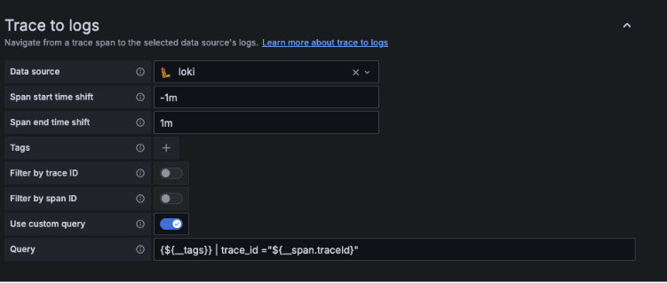
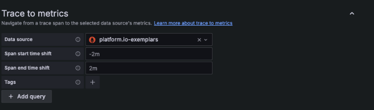
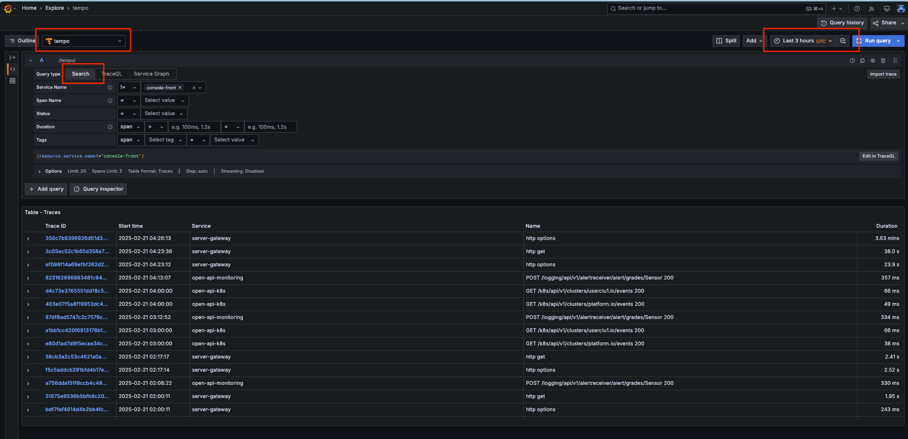
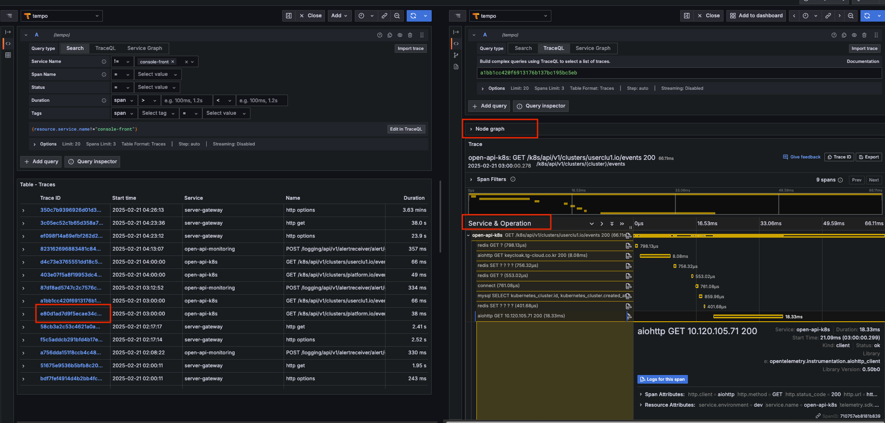

# Grafana Tempo

> Grafana Tempo는 분산 추적(Distributed Tracing)을 위한 오픈소스 백엔드로, 인덱스 없이 고효율로 트레이스 데이터를 저장하고 조회합니다. OpenTelemetry, Jaeger, Zipkin 등 다양한 트레이싱 프로토콜을 지원하며, TKS 플랫폼에서는 마이크로서비스 간 성능 분석과 문제 해결을 위한 트레이싱 도구로 활용됩니다.

---

## 목차

1. [개요](#1-개요)
2. [Tempo 설치](#2-tempo-설치)
3. [배포 구성 상세 설명](#3-배포-구성-상세-설명)
4. [Grafana DataSource 설정 및 트레이스 조회](#4-grafana-datasource-설정-및-트레이스-조회)
5. [트러블슈팅](#5-트러블슈팅)

---

## 1. 개요

Grafana Tempo는 분산 추적(Distributed Tracing)을 위한 오픈소스 백엔드로, 마이크로서비스 아키텍처에서 요청의 흐름을 추적하고 분석하는데 사용됩니다.

### 주요 특징

- 로그 인덱스 없이 저장 (Index-Free Tracing)
- 주요 오픈소스 트레이싱 프로토콜(OTLP, Zipkin, Jaeger) 지원
- S3, GCS, MinIO 등 오브젝트 스토리지에 트레이스 저장
- Kubernetes 및 분산 환경에서 수평 확장 가능
- Grafana와 완벽한 통합 지원 (Logs ↔ Traces 연동 가능)

### Tempo 사용 이유

- 기존 분산 추적 솔루션(예: Jaeger, Zipkin)은 인덱싱 비용이 크고 확장성이 낮음
- Tempo는 인덱스 없이 오브젝트 스토리지(S3, MinIO 등)에 고성능으로 저장 가능

---

## 2. Tempo 설치

Grafana Tempo는 Helm Chart를 사용하여 Kubernetes에 배포합니다.  
배포 방식은 마이크로서비스 모드(tempo-distributed)를 사용하며, 각 컴포넌트가 개별적으로 배포되어 확장성과 가용성이 뛰어난 구조입니다.
Helm values 파일은 TKS 플랫폼 레파지토리의 tempo > microservices-tempo-values.yaml 을 참조하세요.

### 배포 방식 종류

1. **Monolithic (단일 프로세스 모드)**
    - 모든 서비스가 단일 바이너리로 실행
    - 간단한 개발/테스트 환경에서 사용
    - 데이터 저장소로 filesystem, gcs, s3, azure 지원

2. **Microservices (분산 모드, tempo-distributed)**
    - Tempo를 여러 개의 마이크로서비스로 분리하여 배포
    - 각 역할(Distributor, Ingester, Compactor, Querier 등)을 개별적으로 확장 가능
    - Kubernetes 기반의 수평 확장 가능한 아키텍처
    - 데이터 저장소로 S3, GCS, Azure, HDFS 등 지원

> TKS 플랫폼에서는 Microservices(tempo-distributed) 방식을 사용합니다.

### 배포 절차 (Helm Chart 사용)

#### Helm 저장소 추가 및 업데이트

```bash
helm repo add grafana https://grafana.github.io/helm-charts
helm repo update
```

#### Tempo 설치

Namespace: `grafana-tempo` (가변적)

```bash
helm install --values microservices-tempo-values.yaml tempo grafana/tempo-distributed --create-namespace --namespace grafana-tempo
```

#### 설치 확인

```bash
helm list --namespace grafana-tempo
kubectl get pods -n grafana-tempo
```

#### Tempo 제거 및 PVC 삭제

```bash
helm uninstall tempo --namespace grafana-tempo
kubectl delete pvc --namespace grafana-tempo --all
```

---

## 3. 배포 구성 상세 설명

Tempo는 마이크로서비스 아키텍처로 배포되며, 각 구성 요소는 개별적으로 확장 가능합니다.

### 주요 컴포넌트

| 컴포넌트 | 설명 |
|---------|------|
| Compactor | 오래된 트레이스 데이터를 압축하고 최적화 |
| Distributor | 수신된 트레이스 데이터를 여러 Ingester로 분산 |
| Gateway | 외부 요청의 진입점 역할, 요청 라우팅과 인증 처리 |
| Ingester | 트레이스 데이터를 받아서 저장소에 쓰기 전에 처리 |
| Memcached | 트레이스 데이터와 쿼리 결과를 캐싱 |
| Minio | 트레이스 데이터의 객체 스토리지, 영구 저장소 역할 |
| Querier | 저장된 트레이스 데이터를 검색하고 조회 |
| Query Frontend | 쿼리 요청을 최적화하고 캐싱 |
| Metrics Generator | Trace 데이터를 기반으로 메트릭을 생성 |

### 주요 설정 설명 (`values.yaml`)

#### 글로벌 설정

```yaml
global:
  registry: [Private Image Registry]/docker/docker.io # 가변적 
  pullSecrets: []
  dnsService: 'coredns'  # 가변적
  dnsNamespace: 'kube-system'  # 가변적
  clusterDomain: 'platform.io' # 가변적, default: cluster.local
```

- Harbor Registry를 사용하여 프라이빗 컨테이너 이미지 저장소 활용
- clusterDomain: 클러스터 coredns 설정에 맞게 조정

#### Gateway 설정

```yaml
gateway:
  enabled: true
```

- Tempo의 HTTP/GRPC Gateway 활성화
- 외부에서 OTLP(OpenTelemetry Protocol) 트래픽을 수신할 수 있도록 설정

#### MinIO 설정

```yaml
minio:
  enabled: true
  mode: standalone
  rootUser: grafana-tempo
  rootPassword: supersecret
  persistence:
    size: 200Gi  # 가변적
  resources:
    requests:
      cpu: 200m  # 가변적
      memory: 256Mi  # 가변적
    limits:
      cpu: 200m  # 가변적
      memory: 256Mi  # 가변적
```

- MinIO를 S3 인터페이스 제공용 오브젝트 스토리지로 사용
- Standalone 모드로 운영 (단일 노드 MinIO)
- 200Gi 스토리지 할당, CPU/Mem 리소스 최소화

#### Storage 설정

```yaml
storage:
  trace:
    backend: s3
    s3:
      access_key: 'grafana-tempo'
      secret_key: 'supersecret'
      bucket: 'tempo-traces'
      endpoint: 'tempo-minio:9000'
      insecure: true
```

- Tempo의 트레이스 데이터를 S3 호환 오브젝트 스토리지(MinIO)에 저장
- MinIO의 tempo-traces 버킷 사용

#### OTLP(트레이스 수집) 설정

```yaml
traces:
  otlp:
    http:
      enabled: true
    grpc:
      enabled: true
```

- OTLP(HTTP + gRPC) 기반의 트레이스 데이터 수집 활성화
- OpenTelemetry Collector에서 Tempo로 트레이스를 전송 가능

#### Distributor 설정

```yaml
distributor:
  config:
    log_received_spans:
      enabled: true
    log_discarded_spans:
      enabled: true
```

- 트레이스 로그 기록 활성화
- 수집된 트레이스 로그를 저장하고, 필요 시 삭제 가능

#### Metrics-Generator 설정

```yaml
metricsGenerator:
  enabled: true
  config:
    storage:
      wal:
        remote_write_flush_deadline: 1m
      remote_write:
        - url: http://prometheus-k8s-svc.monitoring:9090/api/v1/write  # 가변적 - 프로메테우스 서비스 도메인
          send_exemplars: true
      local_blocks:
        filter_server_spans: false
    registry:
      collection_interval: 15s
      external_labels: { }
      stale_duration: 15m
    processor:
      service_graphs:
        max_items: 10000
        wait: 10s
        workers: 10
      span_metrics:
    
    global_overrides:
      metrics_generator_processors:
        - service-graphs
        - span-metrics
```

- **기본 활성화**: Metrics Generator 기능을 활성화
- **저장소 설정**:
    - wal: Write-Ahead Logging을 위한 공간 설정
    - remote_write_flush_deadline: 메트릭을 remote_write로 전송할 때 플러시하는 최대 대기 시간
    - remote_write: Prometheus에 메트릭을 저장할 수 있도록 설정
    - send_exemplars: true로 설정 시, trace ID를 포함한 exemplars 데이터를 Prometheus로 전송
- **Processor 설정**:
    - service_graphs: 서비스 그래프를 생성하는 설정
    - span_metrics: Span 데이터를 기반으로 메트릭을 생성하는 기능

---

## 4. Grafana DataSource 설정 및 트레이스 조회

Grafana에서 Tempo를 데이터 소스로 추가하여 트레이스 데이터를 조회합니다.

### URL 설정
```
http://tempo-query-frontend-discovery.grafana-tempo.svc.<가변적 도메인 또는 cluster.local>:3100
```

### 추가 설정

- **Trace to logs**: 설정한 Loki 데이터소스 선택

  
- **Trace to metrics**: 설정한 Prometheus 데이터소스 선택 (exemplars 옵션 활성화한 프로메테우스 데이터소스)



### Grafana 에서 Tempo 트레이스 조회 방법

TKS 애플리케이션(FastAPI, SpringBoot, React)에서 전송한 Trace 데이터는 OpenTelemetry 를 거쳐 Tempo 로  수집되며, Grafana 의 **Explore** 메뉴에서 조회할 수 있습니다.

---

#### 1. Explore 메뉴를 통한 트레이스 조회

1. **Grafana 좌측 메뉴 → Explore 클릭**
2. 상단 Data source 선택: `Tempo`
3. `Query Type` 영역에서 `Search` 선택
4. 필터 선택 (`Service Name`, `Namespace`, `Status` 등)
4. 타임 레인지 선택 후 Run Query 클릭 후 하단 조회된 Trace 확인

  
_Explore 메뉴에서 Tempo 선택 및 필터, 타임 레인지 지정 후 Run Query 클릭 후 수집된 로그 실시간 조회_

  
_특정 Trace 클릭시 상세한 정보가 우측 페널에 표시되며 연결된 하위 Span 확인 및 Node Graph 와 같은 뷰 확인 가능_
---

## 5. 트러블슈팅

배포 및 운영 중 발생할 수 있는 일반적인 문제와 해결 방법은 다음과 같습니다.

### 트레이스 데이터 수집 문제

- **데이터가 수집되지 않을 때**
    - Distributor Pod의 로그 확인
    - OpenTelemetry Collector 설정 검증
    - 애플리케이션의 트레이스 설정 확인

- **데이터 저장 문제**
    - MinIO 연결 상태 확인
    - S3 접근 권한 검증
    - Ingester Pod 상태 점검

### 트레이스 조회 문제

- **트레이스가 조회되지 않을 때**
    - Query Frontend 및 Querier Pod 상태 확인
    - 트레이스 ID 형식 검증
    - Tempo 데이터소스 설정 점검

### 유용한 트러블슈팅 명령어

- Pod 상태 점검:
```bash
kubectl get pods -n grafana-tempo
kubectl describe pod <pod-name> -n grafana-tempo
kubectl logs -n grafana-tempo <pod-name>
```

- 서비스 상태 점검:
```bash
kubectl get svc -n grafana-tempo
kubectl describe svc <service-name> -n grafana-tempo
```

- MinIO 상태 확인:
```bash
kubectl port-forward svc/tempo-minio 9000:9000 -n grafana-tempo
# 브라우저에서 http://localhost:9000 접속
```

---