# Open-API-Harbor - Keycloak Client 구성 가이드

> Keycloak을 IdP로 사용해 OIDC 사용자가 open-api-harbor 서비스에 인증할 수 있도록 클라이언트를 생성합니다. 이후 하버 OIDC 클라이언트에 구성한 Client Role을 할당해 사용자의 시스템 관리자 권한을 검증하고, audience가 설정된 클라이언트만 open-api-harbor 서비스를 이용할 수 있도록 구성하는 방법을 설명합니다.

## 목차

1. [Keycloak - Client 구성](#1-keycloak---client-구성)
2. [Keycloak - RBAC Client Scope 할당](#2-keycloak---RBAC-client-scope-할당)
3. [Keycloak - Audience 구성](#3-keycloak---audience-구성)

## 1. Keycloak - Client 구성

> idc 사용자가 open-api-harbor 서비스에 인증할 수 있도록 open-api-harbor client를 생성합니다.

1. open-api-harbor client 생성

  
  
  클라이언트 목록 화면에서 Create client 버튼 클릭

  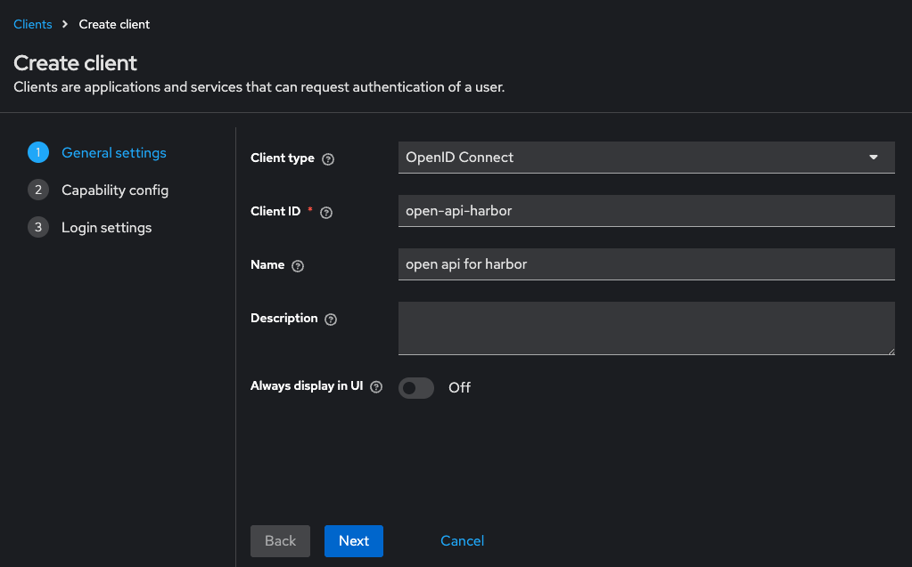
  
  Client type을 OpenID Connect로 선택, Client ID와 Name 필드를 채우고 Next 버튼 클릭
  _주의) Client ID는 open-api-harbor 애플리케이션 환경변수로 사용되며, Swagger OIDC 연동에 필요

  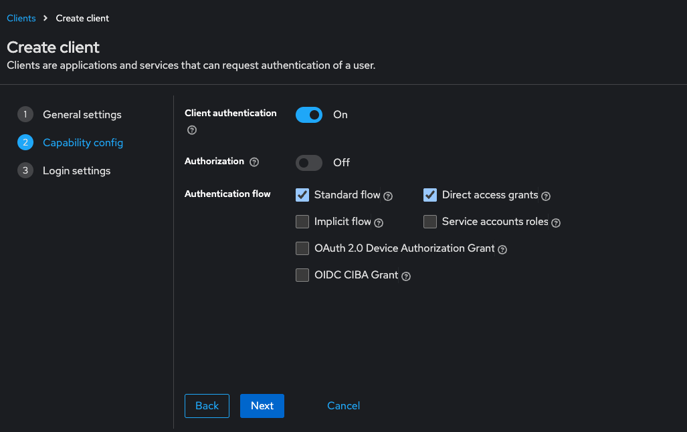
  
  기본 설정에서 Client authentication 토글을 활성화하고 Next 버튼 클릭

  
  
  아래의 각 필드를 채우고 Next 버튼 클릭
   - Root URL: 인증 이후 사용자가 기본적으로 이동할 주소, 보통 서비스의 홈 URL 또는 대시보드 경로를 입력
   - Vaild redirect URIs: 로그인 후 리디렉션할 수 있는 허용된 URI 목록
   - Web origins: 브라우저 기반 클라이언트에서의 CORS 정책을 위해 필요한 도메인, 일반적으로 Root URL과 동일하게 설정

2. open-api-harbor client의 Authenticator 설정

  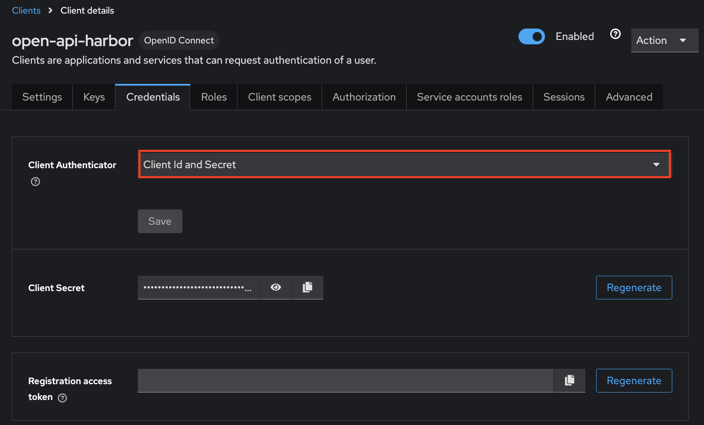
  
  open-api-harbor 클라이언트의 Credentials 탭에서 Client Authenticator를 Client Id and Secret으로 선택
  _주의) Client Secret은 open-api-harbor 애플리케이션 환경변수로 사용되며, Swagger OIDC 연동에 필요

## 2. Keycloak - RBAC Client Scope 할당

> open-api-harbor에서 요청한 native Harbor에서 사용자 인가 시 OIDC 사용자의 관리자 권한을 평가할 수 있도록 Harbor OIDC 클라이언트에서 생성한 Client Scope를 open-api-harbor 클라이언트에 할당합니다.

  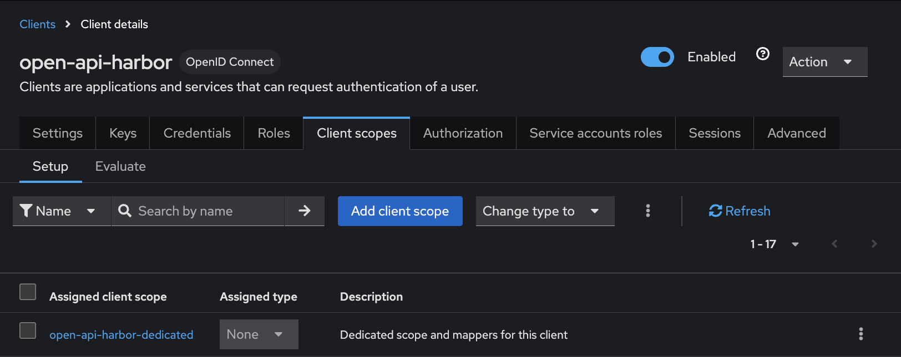

  open-api-harbor client 상세 페이지의 Client scopes 탭으로 이동 > Add client scope 버튼 클릭

  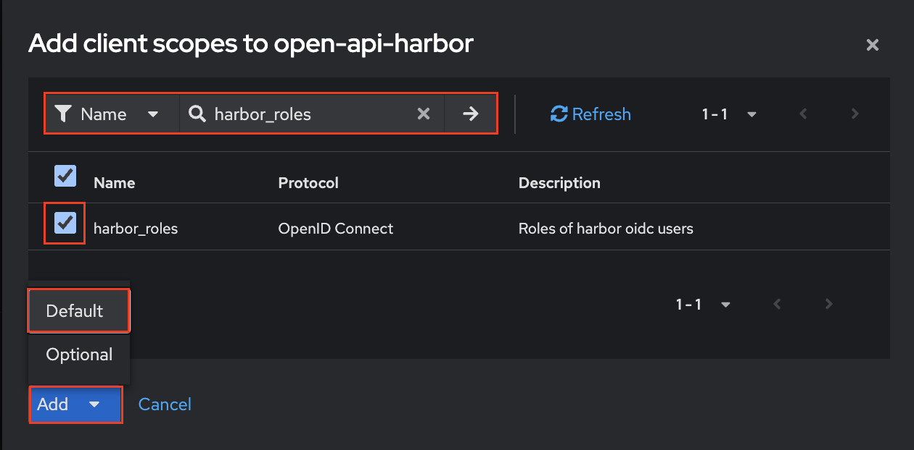

  name을 필터링하여 'harbor_roles' client scope를 체크 > Add 버튼 클릭 > Default 선택

## 3. Keycloak - Audience 구성

> 토큰 검증 시 어떤 서비스가 이 토큰을 신뢰할 수 있는지 명시하기 위해 Audience 정보를 포함하는 방법을 설명합니다. 토큰을 발급하는 클라이언트에 client scope를 할당하여 open-api-harbor 클라이언트가 해당 토큰을 사용할 수 있도록 합니다.

1. open-api-audience client scope 생성

  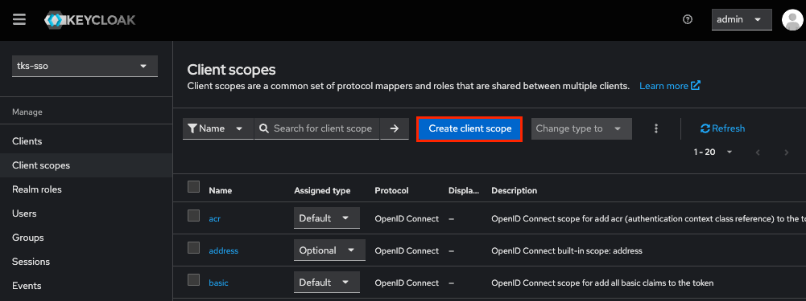

  좌측의 Client scopes 메뉴 클릭하여 client scope 목록으로 이동 > Create client scope 버튼 클릭

  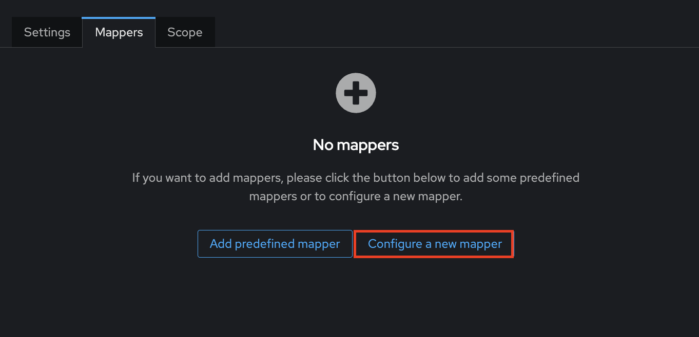

  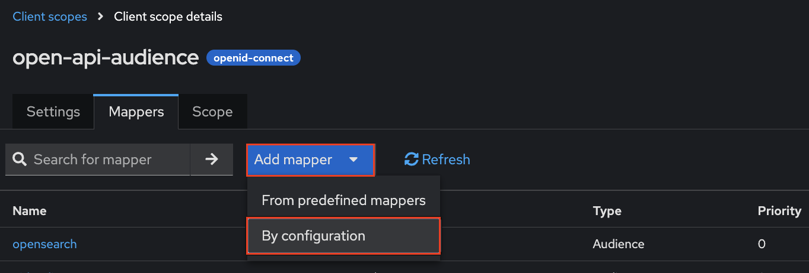

  Client scopes 상세 화면의 mapper 탭으로 이동 > 'Configure a new mapper' 버튼 또는 Add mapper > By configuration 버튼 클릭

  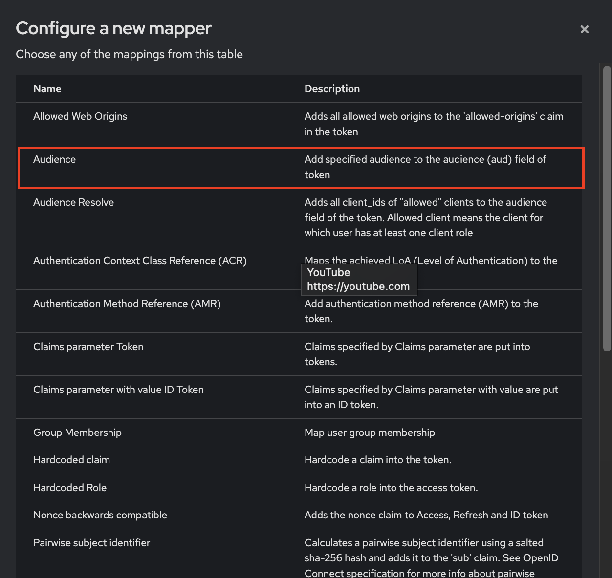

  mapper 테이블에서 Audience 선택
  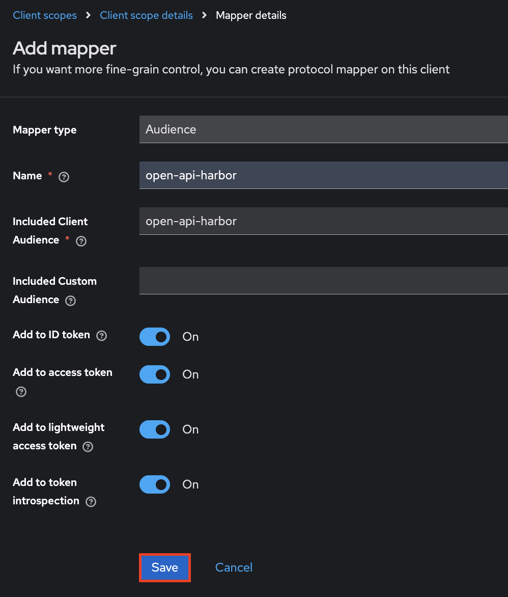

  아래 주요 필드를 채우고 Save 버튼 클릭

    주요 필드 목록:
      - Name: mapper의 이름
      - Included Client Audience: 토큰 안에 어떤 클라이언트 ID를 'aud' 값으로 추가할지 지정, 이 토큰을 사용할 수 있는 대상(서비스)를 나타내는 정보
      - Add to ID token: On
      - Add to access token: On
      - Add to lightweight access token: On
      - Add to token instrospection: On

2. open-api-audience client scope 할당

  

  open-api-harbor client 상세 페이지의 Client scopes 탭으로 이동 > Add client scope 버튼 클릭

  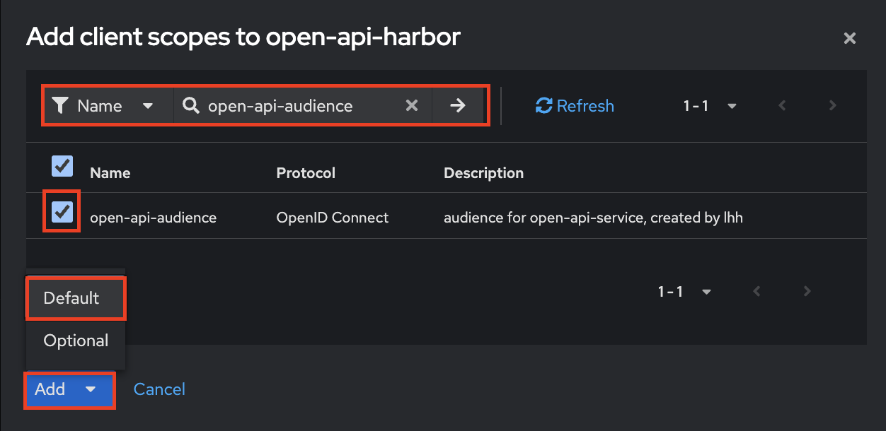

  name을 필터링하여 'open-api-audience' client scope를 체크 > Add 버튼 클릭 > Default 선택
  _주의) open-api-harbor 서비스 인증에 사용할 토큰을 발급하는 클라이언트에도 반드시 해당 Client Scope 할당 필요