# Open-API-K8S - Keycloak Client 구성 가이드

> Keycloak을 IdP로 사용하여 OIDC 사용자가 open-api-k8s 서비스에 인증할 수 있도록 Keycloak 클라이언트를 생성합니다. 이후 클러스터와 네임스페이스에 대한 접근 권한을 평가하기 위해 ABAC(Attribute Based Access Control)을 구현하고, audience가 구성된 클라이언트만이 open-api-k8s 서비스를 사용할 수 있도록 구성하는 방법을 설명합니다.

## 목차

1. [Keycloak - Client 구성](#1-keycloak---client-구성)
2. [Keycloak - User Attribute Based Access Control 구성](#2-keycloak---user-attribute-based-access-control-구성)
3. [Keycloak - Audience 구성](#3-keycloak---audience-구성)

## 1. Keycloak - Client 구성

> idc 사용자가 open-api-k8s 서비스에 인증할 수 있도록 open-api-k8s client를 생성합니다.

1. open-api-k8s client 생성

  
  
  클라이언트 목록 화면에서 Create client 버튼 클릭

  
  
  Client type을 OpenID Connect로 선택, Client ID와 Name 필드를 채우고 Next 버튼 클릭
  _주의) Client ID는 open-api-k8s 애플리케이션 환경변수로 사용되며, Swagger OIDC 연동에 필요

  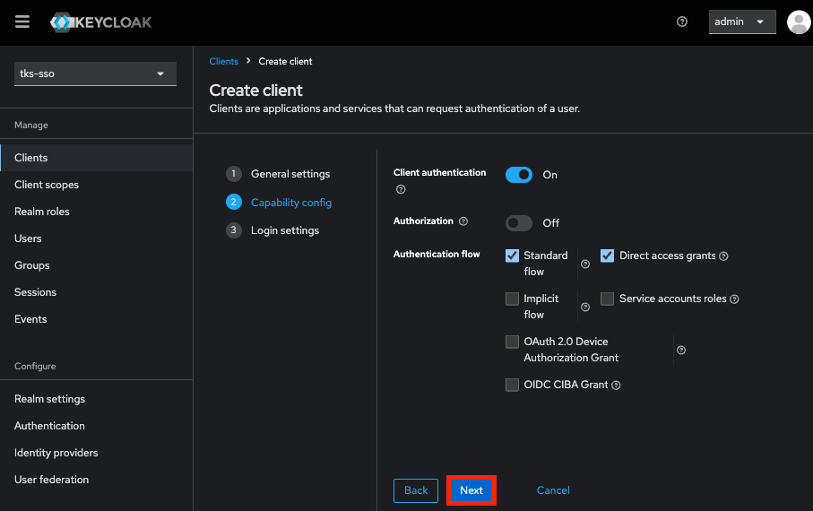
  
  기본 설정에서 Client authentication 토글을 활성화하고 Next 버튼 클릭

  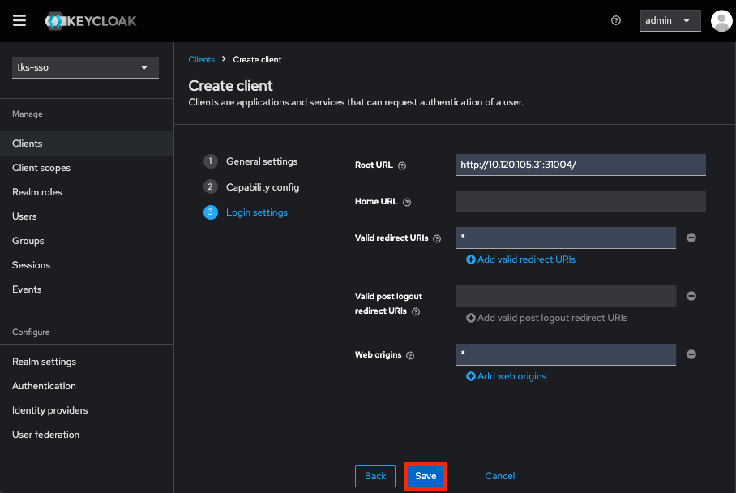
  
  아래의 각 필드를 채우고 Next 버튼 클릭
   - Root URL: 인증 이후 사용자가 기본적으로 이동할 주소, 보통 서비스의 홈 URL 또는 대시보드 경로를 입력
   - Vaild redirect URIs: 로그인 후 리디렉션할 수 있는 허용된 URI 목록
   - Web origins: 브라우저 기반 클라이언트에서의 CORS 정책을 위해 필요한 도메인, 일반적으로 Root URL과 동일하게 설정

2. open-api-k8s client의 Authenticator 설정

  
  
  open-api-k8s 클라이언트의 Credentials 탭에서 Client Authenticator를 Client Id and Secret으로 선택
  _주의) Client Secret은 open-api-k8s 애플리케이션 환경변수로 사용되며, Swagger OIDC 연동에 필요

## 2. Keycloak - User Attribute Based Access Control 구성

> open-api 서비스에서 사용자 인가 시 클러스터와 네임스페이스에 대한 접근 권한을 평가할 수 있도록 Attribute-Based Access Control(ABAC)을 위한 Client Scope를 생성하고 open-api-k8s 클라이언트에 할당합니다.

1. User Attribute 생성

  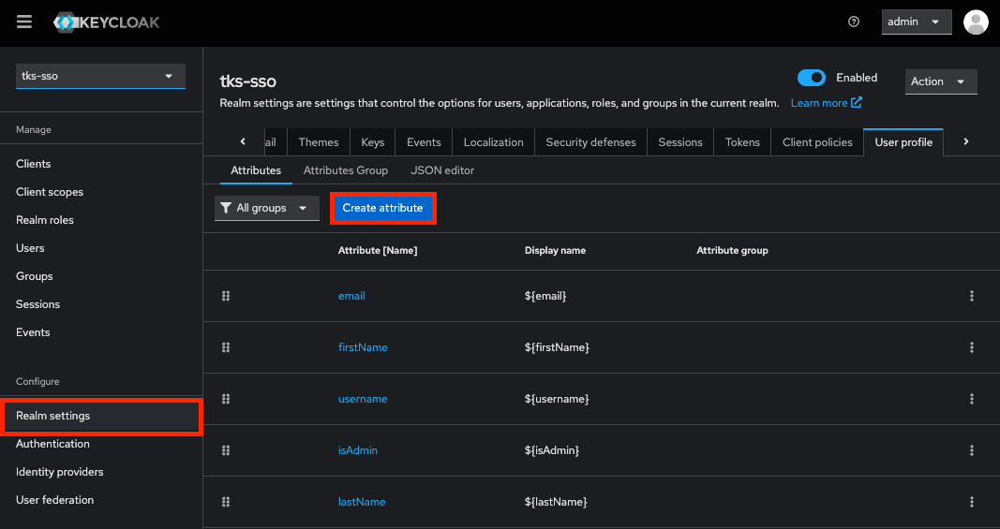

  Realm settings 메뉴 > User profile 탭 > Create attribute 버튼 클릭

  

  'clusters’ 속성 생성

2. OIDC 사용자의 clusters' User Attribute 확인

  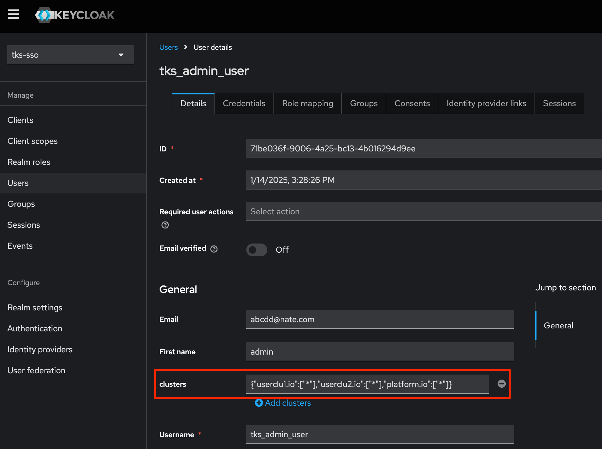

  oidc 관리자 계정의 'clusters' 속성 예시, 3개 클러스터의 전체 네임스페이스에 대한 접근 권한을 가지고 있는 모습

3. clusters client scope 생성

  

  좌측의 Client scopes 메뉴 클릭하여 client scope 목록으로 이동 > Create client scope 버튼 클릭

  

  각 필드를 채우고 Save 버튼 클릭

  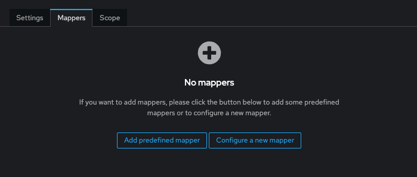

  'clusters' Client scopes 상세 페이지에서 Mappers 탭으로 이동 > Configure a new mapper 버튼 클릭
  _주의) 이미 다른 mapper가 할당된 상태라면 Add mapper 버튼을 클릭하고 By configuration을 선택_

  

  mapper 테이블에서 User Attribute를 선택

  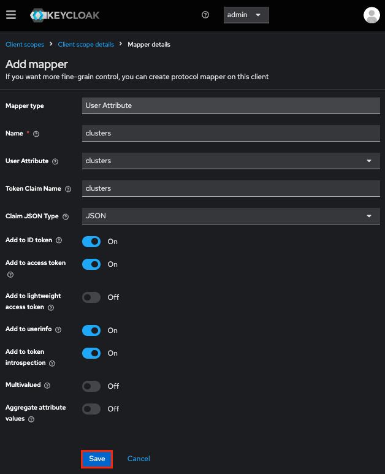

  User Attribute를 매핑한 'clusters' token claim name의 새 mapper를 생성
  주요 필드
  - User Attribute: clusters
  - Token Claim Name: clusters
  - Claim JSON Type: JSON
  - Add to ID token: On
  - Add to access token: On
  - Add to userinfo: On
  - Add to token introspection: On

  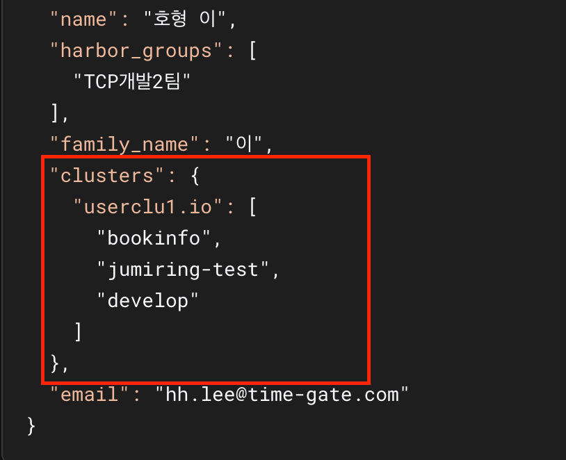

  ‘hh.lee’ oidc user의 디코딩된 id token 내 'clusters’ attribute 예시

4. clusters client scope 할당

  

  open-api-k8s client 상세 페이지의 Client scopes 탭으로 이동 > Add client scope 버튼 클릭

  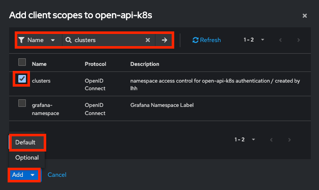

  name을 필터링하여 'clusters' client scope를 체크 > Add 버튼 클릭 > Default 선택

## 3. Keycloak - Audience 구성

> 토큰 검증 시 어떤 서비스가 이 토큰을 신뢰할 수 있는지 명시하기 위해 Audience 정보를 포함하는 방법을 설명합니다. 토큰을 발급하는 클라이언트에 client scope를 할당하여 open-api-k8s 클라이언트가 해당 토큰을 사용할 수 있도록 합니다.

1. open-api-audience client scope 생성

  

  좌측의 Client scopes 메뉴 클릭하여 client scope 목록으로 이동 > Create client scope 버튼 클릭
  
  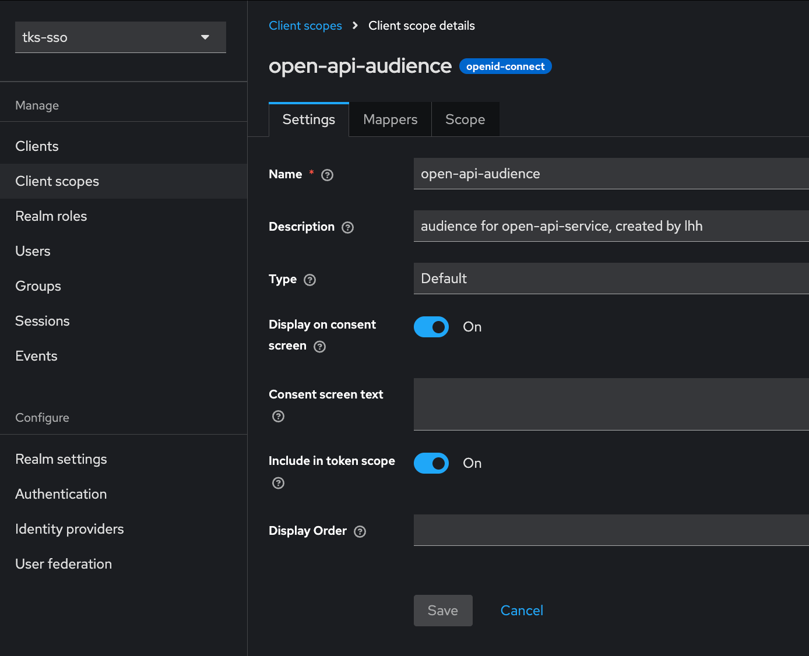

  각 필드를 채우고 open-api-audience client scope 생성

  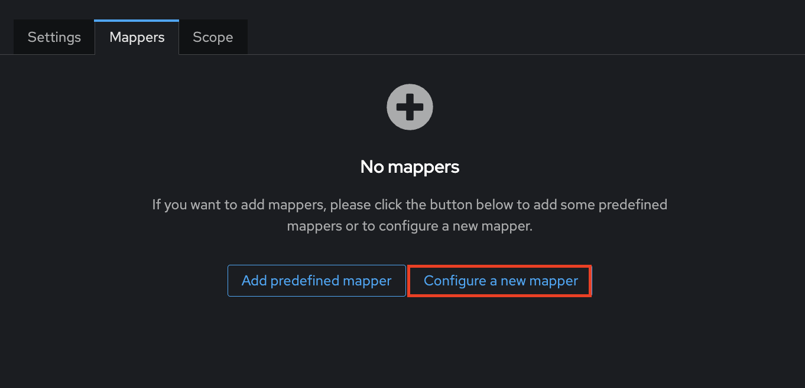

  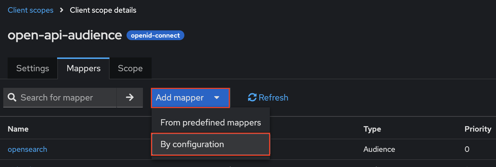
  
  Client scopes 상세 화면의 mapper 탭으로 이동 > 'Configure a new mapper' 버튼 또는 Add mapper > By configuration 버튼 클릭

  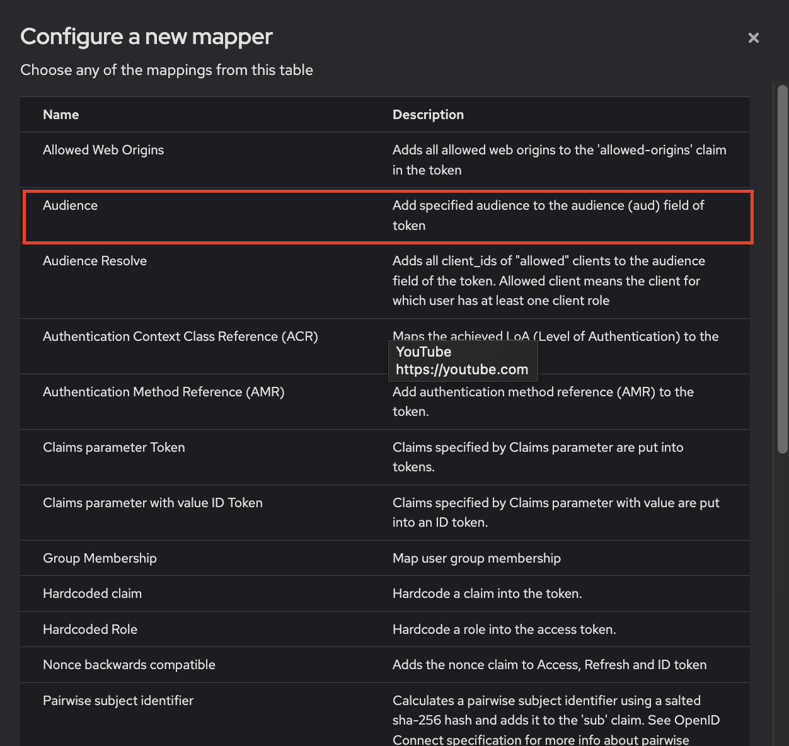

  mapper 테이블에서 Audience 선택
  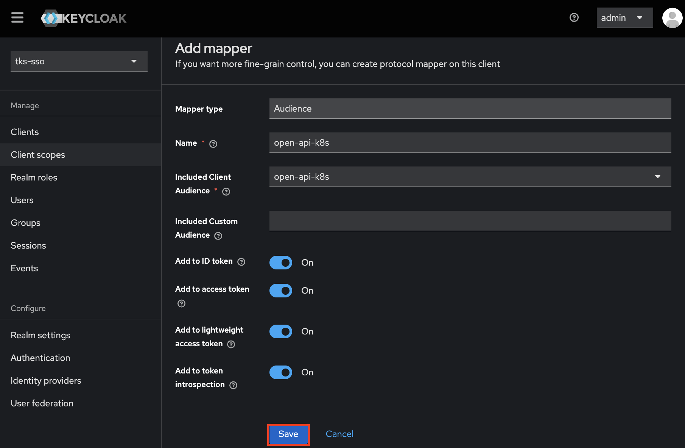

  아래 주요 필드를 채우고 Save 버튼 클릭

    주요 필드 목록:
      - Name: mapper의 이름
      - Included Client Audience: 토큰 안에 어떤 클라이언트 ID를 'aud' 값으로 추가할지 지정, 이 토큰을 사용할 수 있는 대상(서비스)를 나타내는 정보
      - Add to ID token: On
      - Add to access token: On
      - Add to lightweight access token: On
      - Add to token instrospection: On

2. open-api-audience client scope 할당

  

  open-api-k8s client 상세 페이지의 Client scopes 탭으로 이동 > Add client scope 버튼 클릭

  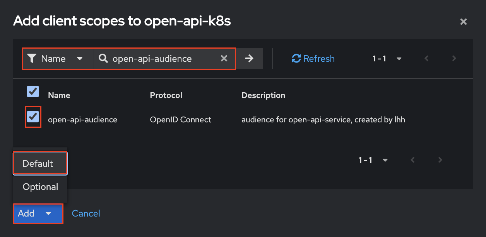

  name을 필터링하여 'open-api-audience' client scope를 체크 > Add 버튼 클릭 > Default 선택
  _주의) open-api-k8s 서비스 인증에 사용할 토큰을 발급하는 클라이언트에도 반드시 해당 Client Scope 할당 필요