# Grafana Alert

> Grafana 가 대시보드에서 수집하는 메트릭이나 로그 데이터를 기준으로 특정 조건에 따라 자동으로 알림을 발생시키고 
> 이메일, Slack, MSTeams, Webhook 등으로 알림을 전송하는 기능입니다.

---

## 목차

1. [Grafana Alert 구성 요소](#1-grafana-alert-구성-요소)
2. [Grafana Alert 설정 과정](#2-grafana-alert-설정-과정)

## 1. Grafana Alert 구성 요소

1. Grafana Alert 구성 요소

* Alert Rule 

    어떤 알림이 충족되었을 떄 경고를 발생시킬지 정의하는 규칙

* Contact Point

    알림을 보낼 수신처 ( Email, Slack, Teams, Webhook 등 )

* Notification Policy

    어떤 경고가 어떤 Contact Point로 갈지 매칭하는 규칙

* Slience

    경고를 일시적으로 무시하거나 알림을 멈추는 기능

* Alert Group

    비슷한 경고들을 하나로 묶는 기능

## 2. Grafana Alert 설정 과정

1. Alerting 메뉴 접속

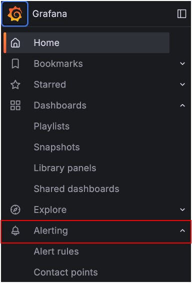

Grafana 메뉴에서 Alerting 접속


2. Contact Point 접속

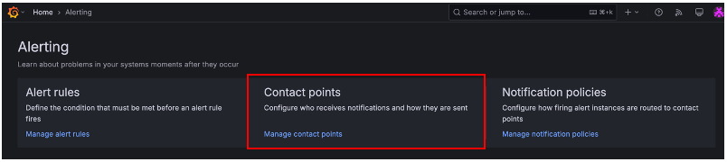

Grafana 메뉴에서 Alerting > Contact Points 접속


3. 새로운 Contact Point 접속

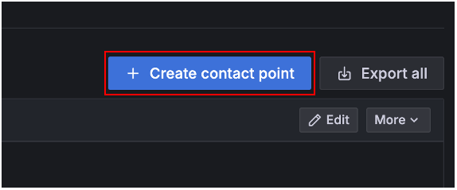


4. Contact Point 설정

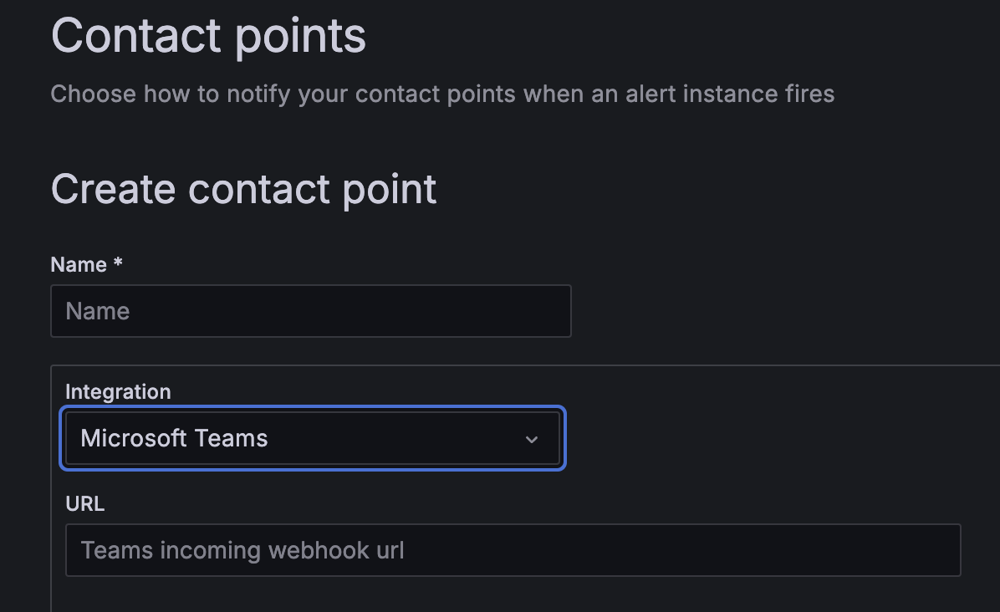

name : Contact Point 이름 ( ex: MS Teams Contact )  
integration : 알림 채널 선택 ( ex : Microsoft Teams )  
URL : 송신할 Webhook URL 기입


5. Alert Rule 생성

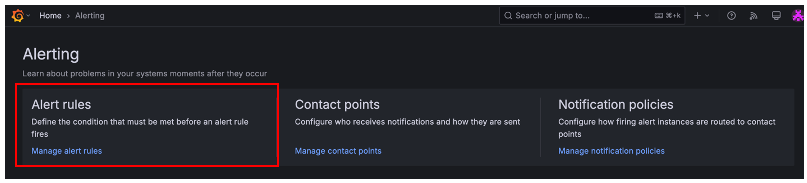

Grafana 메뉴에서 Alerting > Alert Rules 접속


6. Alert Query 생성

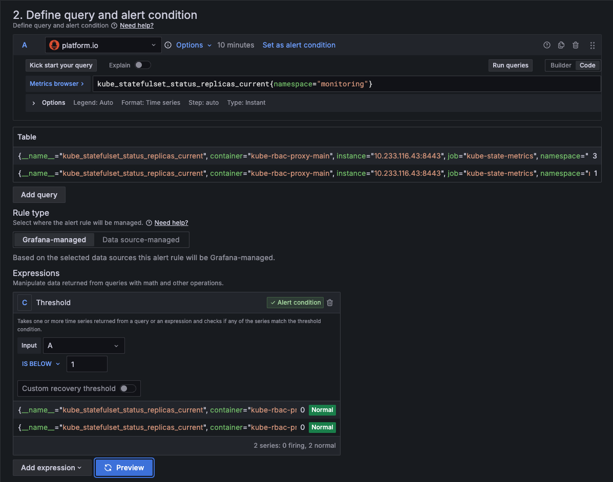

* 쿼리 조건식 : monitoring namespace 에 statefulset 이 가지고 있는 replicaset 개수가 0인 경우 Alert 발생합니다.

설정 순서

```
1. 드롭 다운 메뉴에서 Alert 설정하고자하는 Cluster Prometheus 데이터 소스를 선택
2. 현재 monitoring 네임스페이스에 존재하는 Statefulset이 가지고 있는 replicaset 개수 조회
3. 알림 조건에서 Alert Rule이 트리거 되어야 하는 값을 설정 (ex: IS BELOW 1 -> 1 미만인 경우 Alert Trigger )
4. 쿼리를 실행하면 Preview 버튼을 클릭
  4.1.  Alert Rule 상태가 Firing 이 되어야 Alert이 Trigger 됩니다.
```


7. 폴더를 새롭게 생성하거나 기존 폴더에 Alert Rule 추가

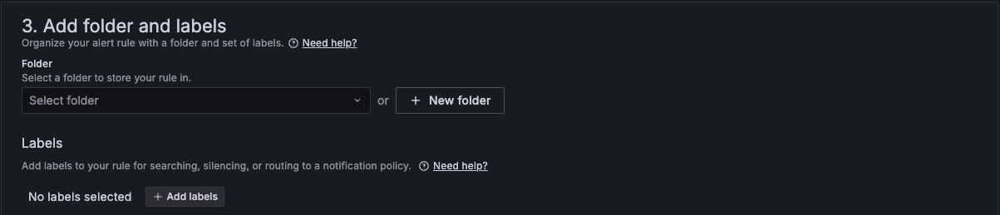

Alert Rule을 체계적으로 관리하고 권한을 분리하기 위해서 폴더에 추가합니다.


8. Alert Evaluation 설정

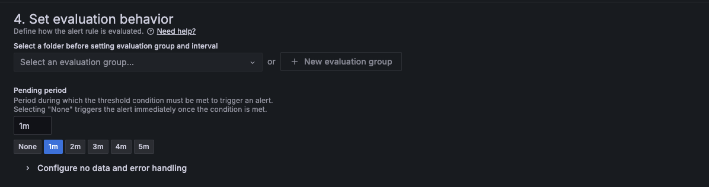

Alert Rule 평가 주기 설정합니다.

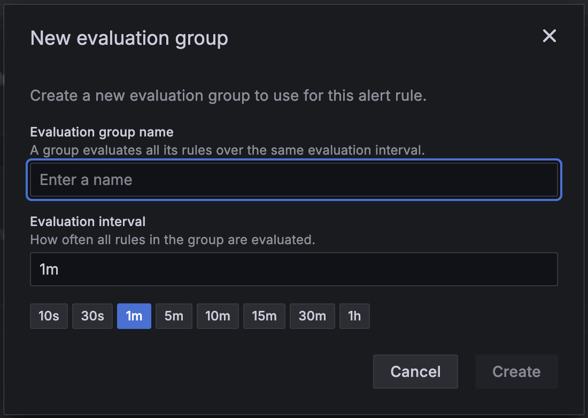

Evaluation Group 이 없는 경우 ``New evaluation group`` 을 통해 새롭게 생성합니다.  
새롭게 생성하는 경우 이름과 평가 주기를 설정합니다.


9. Pending Period 설정

Alert Rule 조건식이 얼마나 유지 되어야 하는지 설정합니다.

```
Evaluation Interval : 1m -> 1마다 Alert Rule 을 평가
Pendinf Period : 5m -> 5분 연속으로 조건이 충족되어야 Alert Trigger
```


10. Configure Notification 설정

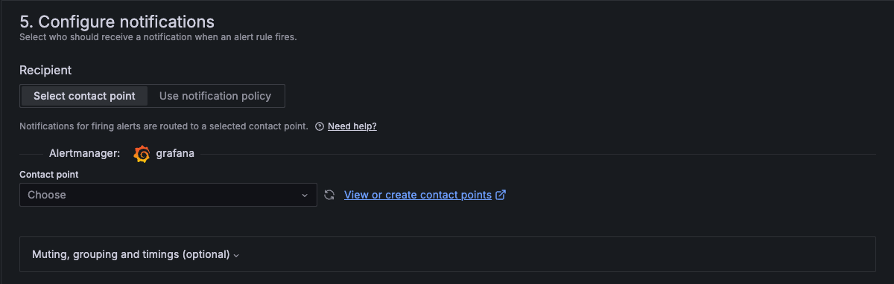

Alert 을 전송할 Contact Point 를 설정합니다.


11. Alert Trigger Example

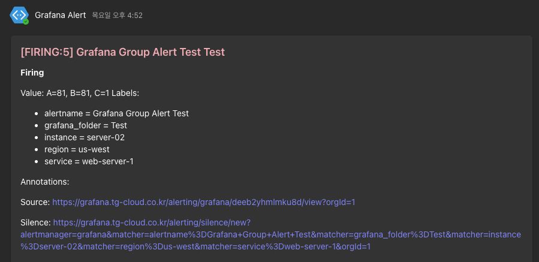