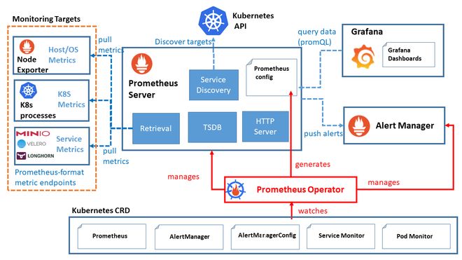

# Prometheus

> Prometheus는 시스템, 서비스, 어플리케이션의 성능 데이터를 수집하고 경고를 생성하며, 실시간으로 모니터링할 수 있게 해주는 강력한 도구입니다.



---

## 목차 

1. [개요](#1-개요)
1. [Prometheus Stack 배포 파일 Clone](#2-prometheus-stack-배포-파일-clone)
2. [인증서 구성 및 배포](#3-인증서-구성-및-배포)
3. [Kube Prometheus 배포전 선행 작업](#4-kube-prometheus-배포전-선행-작업)
4. [Kube Prometheus 배포](#5-kube-prometheus-배포)
5. [Prometheus Msteams 연동 설정](#6-prometheus-msteams-연동-설정)

## 1. 개요

kube-prometheus-stack은 kubernetes cluster에 맞게 구성된 오픈 소스 프로젝트입니다. Prometheus를 기반으로 하며, 쿠버네티스 클러스터의 다양한 컴포넌트들의 메트릭 데이터를 수집하고 이를 시계열 데이터로 생성하여 모니터링 및 경고 기능을 제공합니다.

kube-prometheus 각 구성 역할

* Prometheus Operator :

   쿠버네티스 내에서 Prometheus 서버와 관련된 리소스들을 관리하기 위한 컨트롤러입니다.
   Prometheus와 관련된 설정, 서비스 디스커버리, 룰 및 대시보드를 관리할 수 있습니다.

* Prometheus Server :

   고가용성을 제공하는 Prometheus 서버입니다.
   메트릭 데이터를 스크랩하고 저장합니다.

* Alertmanager :

   Prometheus가 수집한 메트릭 데이터를 기반으로 경고를 생성하고 관리하는 역할을 합니다.
   Prometheus 

* node-exporter :

   node-exporter는 Host의 metric을 수집하는 역할을 합니다.
   CPU, 메모리, 디스크 사용량 등의 데이터를 수집하여 Prometheus로 전달합니다.

* Prometheus Adapter for Kubernetes Metrics APIs :

   쿠버네티스의 메트릭 API와 연동하여 클러스터 내부의 리소스 메트릭 데이터를 수집하고 Prometheus로 전달합니다.

* kube-state-metrics :

   쿠버네티스 클러스터의 상태 정보를 메트릭으로 수집합니다.
   파드, 디플로이먼트, 노드 등의 상태 정보를 모니터링할 수 있습니다.

* Grafana :

   Grafana는 데이터 시각화 및 대시보드 생성 도구로, 수집한 메트릭 데이터를 그래프나 대시보드 형태로 시각화하여 사용자에게 제공합니다.

추가 수집기 역할

* mysqld-exporter : 

   mariadb 서버의 메트릭을 수집합니다.

* redis-exporter :

   redis 서버의 메트릭을 수집합니다.

## 2. Prometheus-Stack 배포 파일 Clone

> prometheus-stack은 tks-platform repository에서 관리하고 있습니다.  
> tks-platform repo 를 clone 합니다.

1. Git Clone

    ```shell
    git clone https://github.com/tg-cloud/tks-platform.git
    ```

    tks-platform repository를 clone합니다.


2. Create Monitoring Namespace

   ```shell
   kubectl create namespace monitoring
   ```
   
   monitoring 네임스페이스를 생성합니다.

---

## 3. 인증서 구성 및 배포

> Cert-Manager를 통해 Grafana TLS 인증서 생성 및 ETCD 인증서 배포  
> * Grafana TLS 인증서 : Grafana Dashboard Embedding 용  
> * ETCD 인증서 : ETCD Metrics 수집용

1. Grafana 인증서 구성 디렉토리 이동

    ```shell
    cd tks-platform/prometheus-stack/cert-manager
    ```
   
    tks-platform/prometheus-stack/cert-manager 디렉토리 이동


2. Grafana Root CA 설정
   
   ```shell
   kubectl apply -f 02.caCert.yaml
   ```
   인증서를 생성하기 위해 root ca 파일을 생성합니다. TKS 플랫폼 레파지토리 prometheus-stack > cert-manager > 02.caCert.yaml 참조


3. Grafana 인증서 발급자 설정

   ```shell
   kubectl apply -f 03.intermediateCA.yaml
   ```
   
   인증서를 생성하기 위해 Issuer(인증서 발급자)를 생성합니다. TKS 플랫폼 레파지토리 prometheus-stack > cert-manager > 03.intermediateCA.yaml 참조  
   이때, 발급자의 기반이 되는 Secret 은 앞서 생성한 02.caCert.yaml 에서 생성한 CA를 참조하도록 설정합니다.
    
   _참조하는 secret이 02.caCert.yaml에서 생성한 **grafana-ca-secret**과 일치하는지 확인합니다._


4. Grafana TLS 인증서 설정

   ```shell
   kubectl apply -f 09.grafanaIngressCert.yaml
   ```
   
   Grafana 서비스용 TLS 인증서를 자동으로 생성 및 관리하기 위한 리소스 정의하여 인증서(grafana-tls)를 생성합니다. TKS 플랫폼 레파지토리 prometheus-stack > cert-manager > 09.grafanaIngressCert.yaml 참조  

   _**Issuer(인증서 발급자)** 정보가 03.intermediateCA.yaml에 정의된 **Issuer**와 일치하는지 확인합니다._  
   _환경에 맞게 **Ingress**에서 사용할 호스트 이름이 설정되어 있는지 확인합니다._


5. ETCD Cert 설정

    ```shell
    kubectl -n monitoring create secret generic etcd-certs \
        --from-file={key 파일 경로}/node-<etcd 노드명>.pem \
        --from-file={key 파일 경로}/node-<etcd 노드명>-key.pem \
        --from-file={key 파일 경로}/ca.pem
    ```
    
    Master 노드 (etcd 노드) 접속하여 /etc/ssl/etcd/ssl 경로에 있는 key 파일로 secret 생성합니다.


---

## 4. Kube-prometheus 배포전 선행 작업

> Kube-prometheus manifest 배포전 선행 작업

1. preliminary 디렉토리 이동

   ```shell
   cd tks-platform/prometheus-stack/preliminary
   ```
   tks-platform/prometheus-stack/preliminary 디렉토리 이동


3. grafana ingress 배포
   
   ```shell
   kubectl apply -f grafana-ingress.yaml
   ```
   
   Grafana를 외부에서 접속 가능하도록 Ingress를 설정합니다. TKS 플랫폼 레파지토리 prometheus-stack > preliminary > grafana-ingress.yaml 참조  
   iframe 을 통해 embed 에서 keycloak 연동을 위한 TLS 설정을 추가합니다.

   _위의 인증서 배포 과정에서 생성된 grafana-tls 인증서를 사용하도록 구성합니다._


4. grafana pvc 배포

   ```shell
   kubectl apply -f grafana-pvc.yaml
   ```
   
   Grafana Dashboard 저장을 위해 PVC를 설정합니다. TKS 플랫폼 레파지토리 prometheus-stack > preliminary > grafana-pvc.yaml 참조  
   _환경에 맞는 storageClassName을 사용하도록 구성합니다._


---


## 5. Kube-prometheus 배포

> Kube-Prometheus는 Kubernetes의 CRD를 통해 YAML 파일을 배포하여 설치합니다.
> Prometheus, AlertManager, Grafana 등 배포

1. manifests 디렉토리 이동

   ```shell
   cd tks-platform/prometheus-stack/manifests
   ```
   
   tks-platform/prometheus-stack/manifests 디렉토리 이동


2. Kube-Prometheus CRD 배포
   
   ```shell
   kubectl apply --server-side -f ./setup/
   ```
   
   CRD 배포

   ```shell
   kubectl get crd | grep monitoring
   ```

   CRD 배포 상태 확인합니다.


3. manifests 구성 요소 cluster 환경에 맞도록 수정

   ```yaml
   storageClassName: csi-cephfs-sc # cluster 환경에 맞는 storageClassName으로 변경
   ```
   
   Cluster 환경에 맞는 storage 클래스 이름으로 변경합니다.   
   * TKS 플랫폼 레파지토리 prometheus-stack > manifests > alertmanager-alertmanager.yaml 참조
   * TKS 플랫폼 레파지토리 prometheus-stack > manifests > prometheus-prometheus.yaml 참조

   ```yaml
   alertmanager.yaml: |-
      "receivers":
         "webhook_configs":
            - "url": "<prometheus-msteams alert endpoint>"
   ```

   Cluster 환경에 맞는 prometheus-msteams alert endpoint 및 open-api-monitoring alert receiver api 를 확인 후 적용합니다.
   TKS 플랫폼 레파지토리 prometheus-stack > manifests > alertmanager-secret.yaml 참조  
   * prometheus-msteams alert endpoint : msteams 로 alert message 전송

   - 상세 설정 가이드 : [Alertmanager](../Alertmanager/alertmanager.md) 

   ```yaml
   stringData:
      grafana.ini: |
         [auth.generic_oauth]
         [security]
   ```
   
   Grafana Keycloak OIDC 연동 및 Dashboard Embedding 에 필요한 설정을 적용합니다. TKS 플랫폼 레파지토리 prometheus-stack > manifests > grafana-config.yaml 참조
   
   - 상세 설정 가이드 : [Grfana OIDC](../Grafana/grafana_oidc.md) 


   ```yaml
   spec:
     externalLabels:
       cluster: <Current Cluster Name>   # cluster name
   ```
   
   Prometheus가 수집하는 메트릭에 해당 클러스터 이름을 라벨로 추가하여, 멀티 클러스터 환경에서 데이터를 구분하고 관리하기 쉽게하기 위해 설정합니다.

   ```yaml
   # etcd-endpoint.yaml
   apiVersion: v1
   kind: Endpoints
   metadata:
     name: etcd-metrics
     namespace: monitoring
   subsets:
     - addresses:
         - ip: <ETCD 가 동작 중인 고정 IP 주소>
       ports:
         - port: 2379
   ```
   
   etcd 노드 metrics 을 수집을 위해 직접 endpoint 를 지정합니다. TKS 플랫폼 레파지토리 prometheus-stack > manifests > etcd-endpoint.yaml 참조
   serviceMonitor 에서 해당 endpoint 로 부터 메트릭을 수집할 수 있도록 service를 생성합니다. TKS 플랫폼 레파지토리 prometheus-stack > manifests > etcd-service.yaml 참조
   


4. manifests 배포

   ```shell
   kubectl apply -f ./
   ```
   
   manifests 배포

   ```shell
   kubectl get po -n monitoring
   ```
   
   manifest POD 배포 확인


## 6. Prometheus MsTeams 연동 설정

> Prometheus Alertmanager에서 생성된 Alert를 Webhook을 통해 Microsoft Teams로 전달하기 위한 연동 서버를 구성합니다.

1. prometheus-msteams helm repository 등록

   ```shell
   helm repo add prometheus-msteams https://prometheus-msteams.github.io/prometheus-msteams/
   ```


2. prometheus-msteams-config 구성

   ```yaml
   connectorsWithCustomTemplates:
      - request_path: <MS Teams Path 설정>
        template_file: |
          <Alert Message Template 설정>
        webhook_url: "<Webhook Connection Endpoint URL>"
        escape_underscores: true  
   ```
   
   request_path 이 ``/alert1`` 인 경우 ``http://prometheus-msteams:2000/alert1`` 로 이용할 수 있습니다.

   TKS 플랫폼 레파지토리 prometheus-stack > preliminary > prometheus-msteams-config.yaml 참조


3. prometheus-msteams helm 배포

   ```shell
   helm install prometheus-msteams prometheus-msteams/prometheus-msteams --namespace monitoring -f prometheus-msteams-config.yaml
   ```
   
   prometheus-msteams-config.yaml 을 참조하도록 배포


4. prometheus-msteams helm 업그레이드

   ```shell
   helm upgrade prometheus-msteams prometheus-msteams/prometheus-msteams --namespace monitoring -f prometheus-msteams-config.yaml
   ```
   
   prometheus msteams 업그레이드


5. prometheus-msteams helm delete 방법

   ```shell
   helm uninstall prometheus-msteams --namespace monitoring
   ```