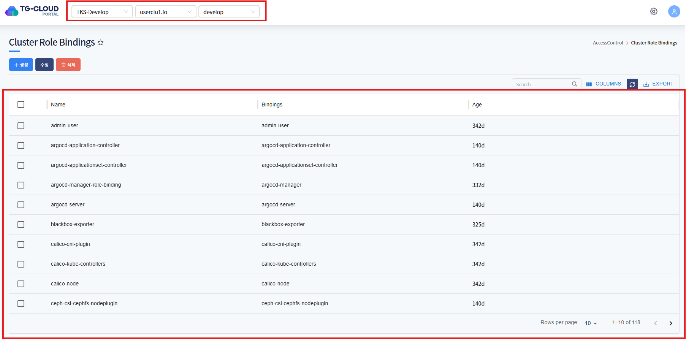
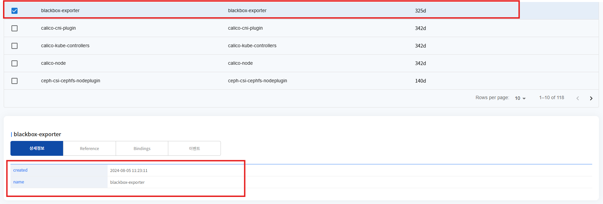
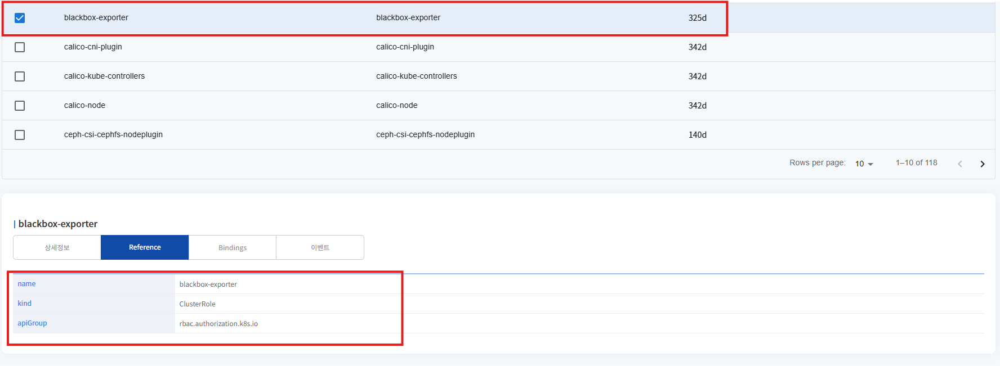
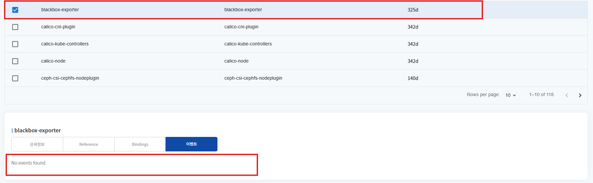
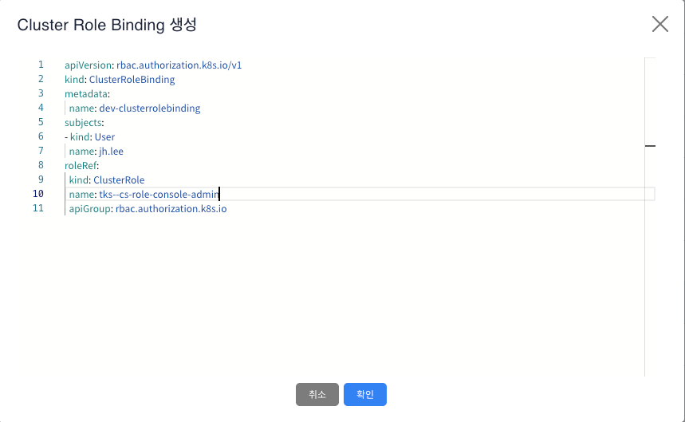
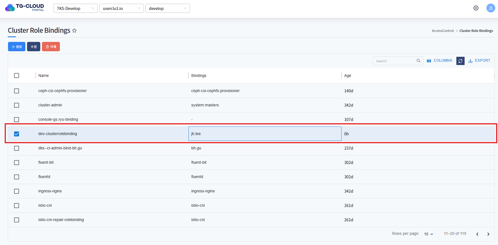
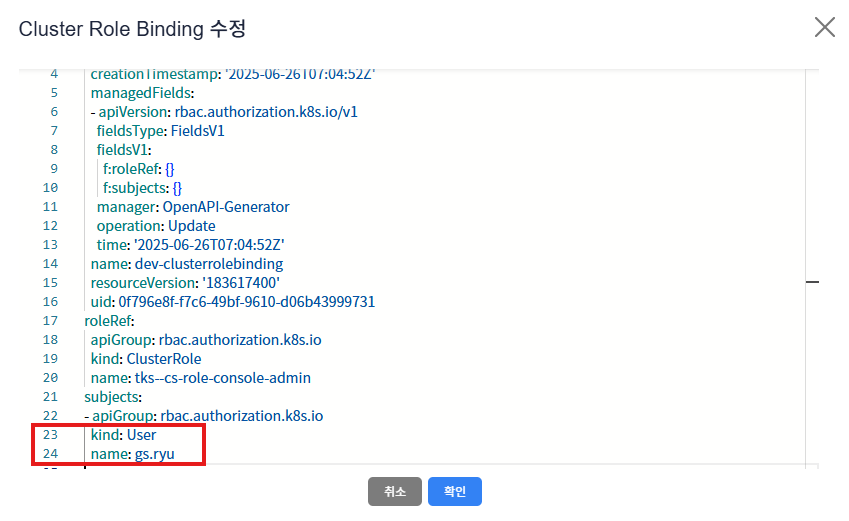
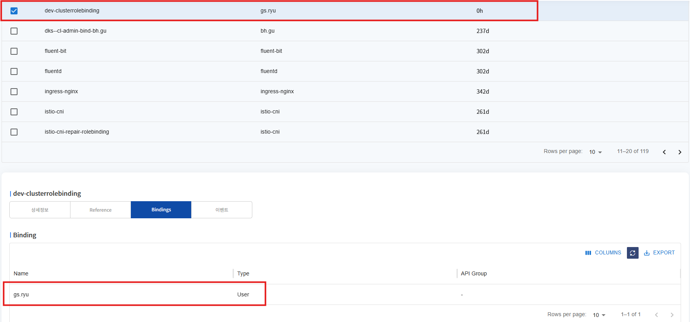
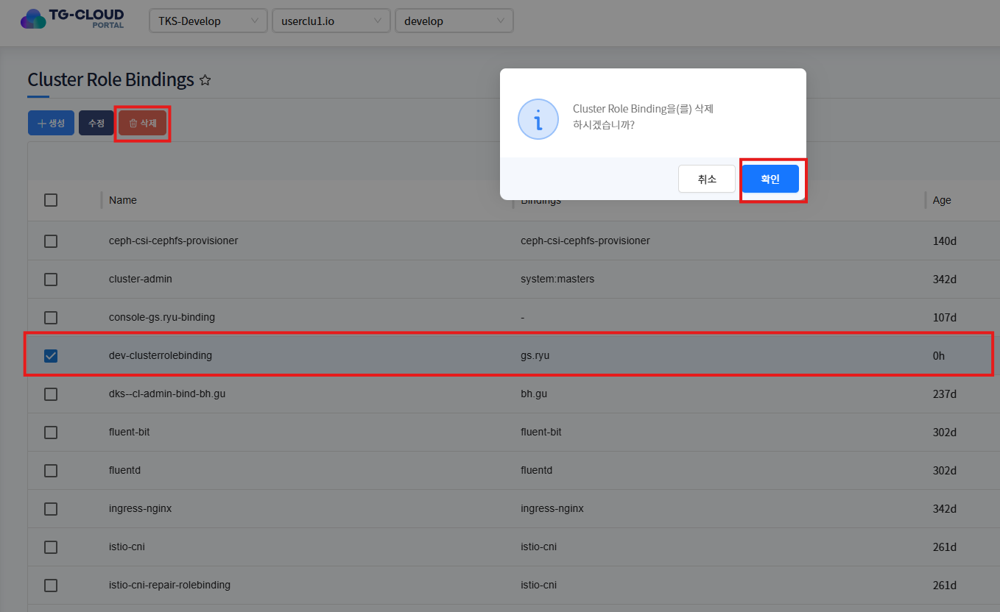
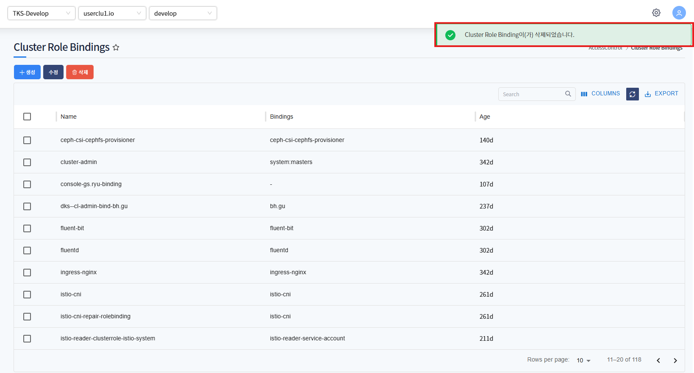

# ClusterRoleBinding

> 특정 클러스터 내에서 사용자, 그룹 또는 ServiceAccount에게 정의된 ClusterRole을 부여하는 역할을 합니다.

---

## **목차**
1. [ClusterRoleBinding 조회](#1-clusterrolebinding-조회)
   * [1.1. 리스트 조회](#11-리스트-조회)
   * [1.2. 상세정보 조회](#12-상세정보-조회)
   * [1.3. Reference 조회](#13-reference-조회)
   * [1.4. Bindings 조회(사용자, 그룹 또는 ServiceAccount binding 정보 조회)](#14-bindings-조회)
   * [1.5. RoleBinding 내 발생한 이벤트 정보 조회](#15-clusterrolebinding-내-발생한-이벤트-정보-조회)
2. [ClusterRoleBinding 생성](#2-clusterrolebinding-생성)
3. [ClusterRoleBinding 수정](#3-clusterrolebinding-수정)
4. [ClusterRoleBinding 삭제](#4-clusterrolebinding-삭제)

---

## 1. ClusterRoleBinding 조회
### 1.1. 리스트 조회
* 화면 진입시 상위 선택된 클러스터 내 ClusterRoleBinding 목록이 조회됩니다.



### 1.2. 상세정보 조회
* 리스트에서 특정 ClusterRoleBinding을 선택하면 하단 상세정보 탭에 ClusterRoleBinding의 상세 정보가 조회됩니다.



### 1.3. Reference 조회
* 리스트에서 특정 ClusterRoleBinding을 선택하면 하단 Reference 탭에 ClusterRoleBinding이 어떤 ClusterRole을 참조하는지에 대한 정보가 조회됩니다.



### 1.4. Bindings 조회
* 리스트에서 특정 ClusterRoleBinding을 선택하면 하단 Bindings 탭에 ClusterRoleBinding을 통해 어떤 주체들에게 권한이 부여되었는지 확인할 수 있습니다. 주체는 User/Group/ServiceAccount 가 있습니다.


### 1.5. ClusterRoleBinding 내 발생한 이벤트 정보 조회
* 리스트에서 선택된 ClusterRoleBinding에 발생한 이벤트 정보가 조회됩니다. 발생한 이벤트가 없을 경우 목록에서 표시되지 않습니다.



---

## 2. ClusterRoleBinding 생성
* 상단 **[생성]** 버튼을 클릭하게 되면 ClusterRoleBinding 생성에 필요한 yaml 템플릿 정보가 조회됩니다.


* 변수 치환 부분을 생성에 맞는 정보로 변경하여 확인 버튼을 클릭하게 되면 ClusterRoleBinding이 정상적으로 생성이 됩니다.
* 해당 자원은 Cluster Scope 자원이기에 상단 셀렉트 박스에 선택된 클러스터 하위에 자원이 생성됩니다.



```yaml
apiVersion: rbac.authorization.k8s.io/v1
kind: ClusterRoleBinding
metadata:
    name: dev-clusterrolebinding
subjects:
  - kind: User
    name: jh.lee
roleRef:
    kind: ClusterRole
    name: tks--cs-role-console-admin
    apiGroup: rbac.authorization.k8s.io
```



---

## 3. ClusterRoleBinding 수정
* 수정할 ClusterRoleBinding 선택 후 상단 **[수정]** 버튼을 클릭하게 되면 ClusterRoleBinding 의 metadata yaml 정보가 조회됩니다.
* ClusterRoleBinding은 subject 부분만 변경을 지원하며 ClusterRole 변경은 불가합니다.



```yaml
apiVersion: rbac.authorization.k8s.io/v1
kind: ClusterRoleBinding
metadata:
  creationTimestamp: '2025-06-26T07:04:52Z'
  managedFields:
  - apiVersion: rbac.authorization.k8s.io/v1
    fieldsType: FieldsV1
    fieldsV1:
      f:roleRef: {}
      f:subjects: {}
    manager: OpenAPI-Generator
    operation: Update
    time: '2025-06-26T07:04:52Z'
  name: dev-clusterrolebinding
  resourceVersion: '183617400'
  uid: 0f796e8f-f7c6-49bf-9610-d06b43999731
roleRef:
  apiGroup: rbac.authorization.k8s.io
  kind: ClusterRole
  name: tks--cs-role-console-admin
subjects:
- apiGroup: rbac.authorization.k8s.io
  kind: User
  name: gs.ryu
```



--- 

## 4. ClusterRoleBinding 삭제
* 삭제할 ClusterRoleBinding를 선택 후 상단 **[삭제]** 버튼을 클릭하게 되면 ClusterRoleBinding이 삭제됩니다.
* 삭제 후 리스트에서 ClusterRoleBinding이 제거된 것을 확인할 수 있습니다.



