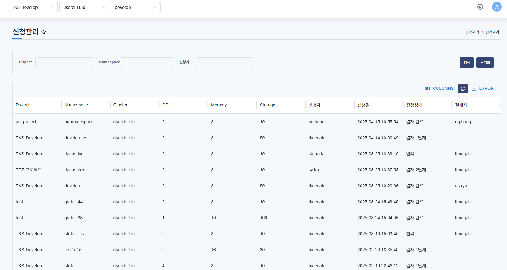
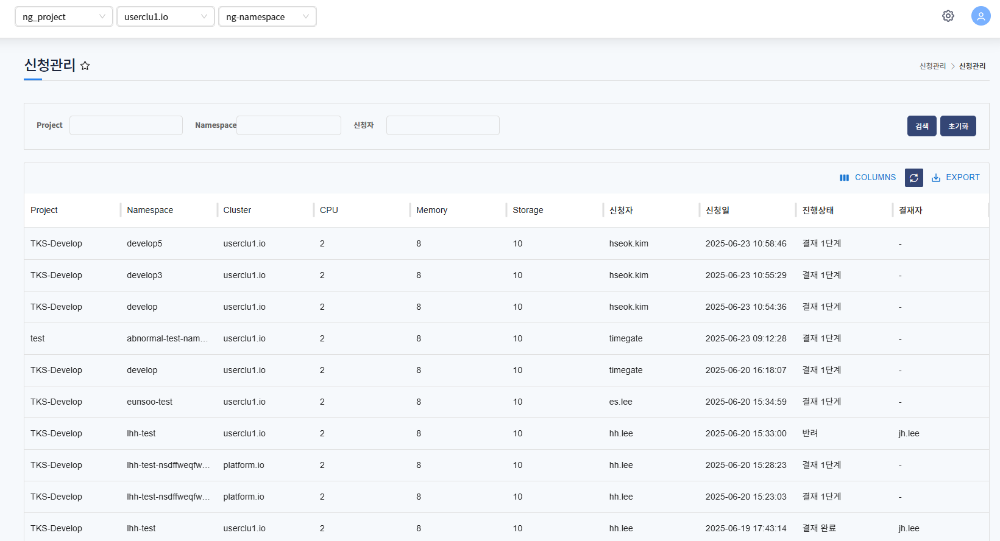
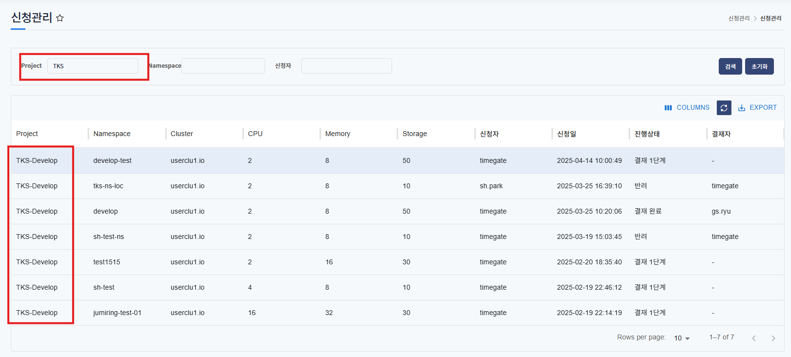
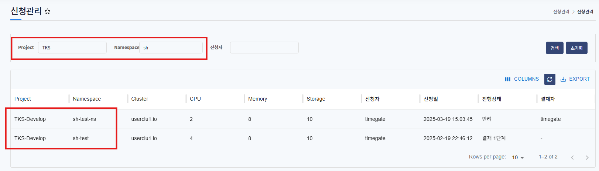
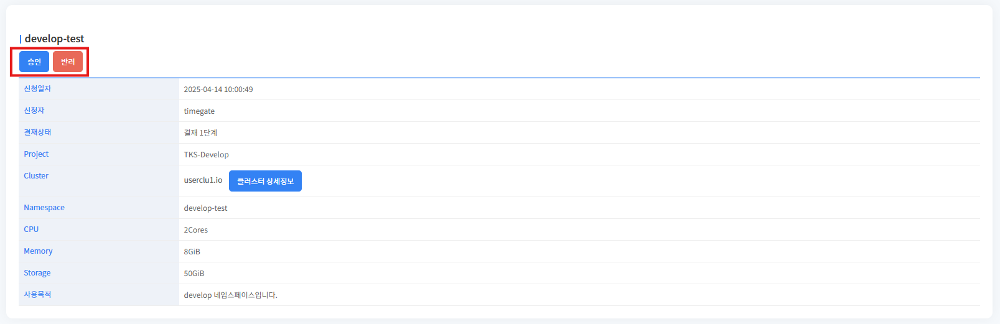
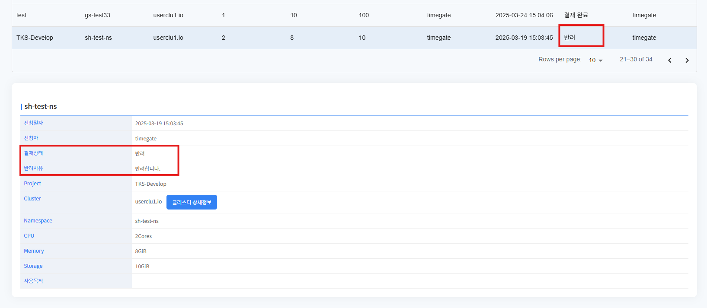
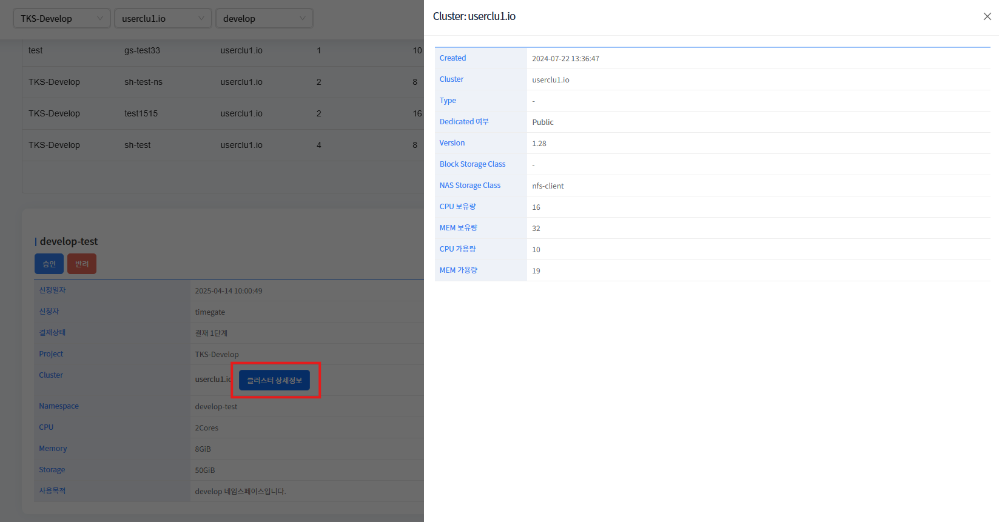
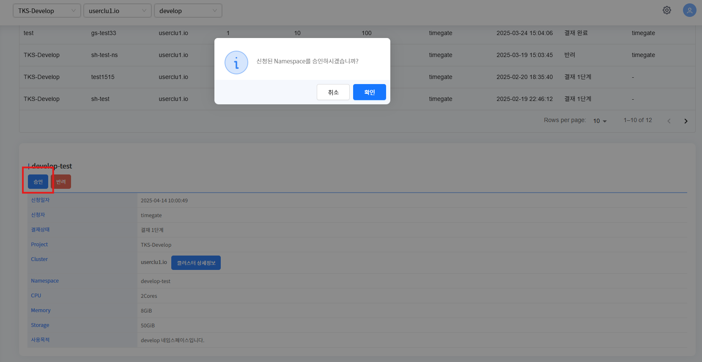
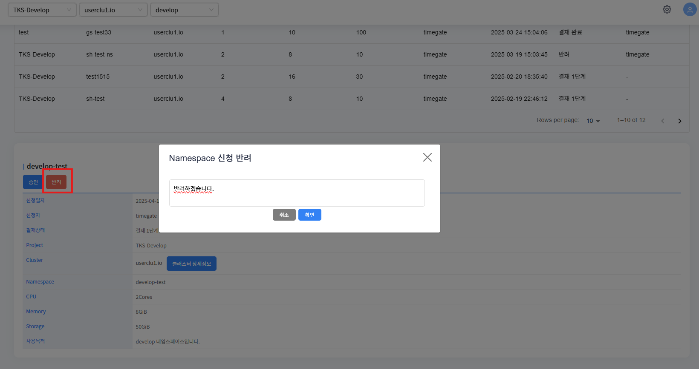

# 신청관리

> 신청관리는 신청한 네임스페이스 목록 확인하고, 결재하는 서비스 입니다.
> 
> 운영자 권한을 가진 사용자는 모든 목록이 표시됩니다.
> 
> 프로젝트 관리자/사용자 권한을 가진 사용자는 본인이 소속되어있는 프로젝트에 대한 신청 목록이 표시됩니다.
> 
> 운영자는 결재 1단계에 대한 결재 권한이 있습니다.
> 
> 프로젝트 관리자는 결재 2단계에 대한 결재 권한이 있습니다.

---
## 목차
1. [신청 조회](#신청-조회)
   - [1.1. 신청 목록](#신청-목록)
   - [1.2. 신청 상세정보](#신청-상세정보)
   - [1.3. 클러스터 상세정보](#클러스터-상세정보)
2. [신청 결재](#신청-결재)

## 신청 조회

---
### 신청 목록

* 운영자 유저의 목록

   운영자는 모든 프로젝트의 네임스페이스 신청내역을 확인할 수 있습니다. 

---

* 사용자 유저의 목록

   로그인한 유저가 속한 프로젝트의 모든 네임스페이스 신청 목록이 표시됩니다.

진행상태 종류는 아래와 같습니다.
   * 결재 1단계 : 운영자가 결재하는 단계
   * 결재 2단계 : 프로젝트 관리자가 결재하는 단계
   * 결재 완료 : 결재가 완료되어 네임스페이스 생성
   * 반려 : 반려되어 네임스페이스 신청 거절된 상태

신청내역 목록이라 Namespace 메뉴의 목록과 다를 수 있습니다.

각 필드에 단어가 포함된 목록은 검색됩니다.

아래는 검색 예시 입니다.

---
### 신청 상세정보

선택한 신청목록의 상세정보를 표시합니다.

신청자, project, cluster, CPU, Memory, Storage 자원 내역 등을 확인할 수 있습니다.

클러스터 상세정보 클릭하면 클러스터의 상세정보를 확인할 수 있습니다.

아래의 권한을 가진 유저는 신청한 네임스페이스 결재할 수 있습니다.
* 운영자는 결재 1단계에서 승인/반려할 수 있습니다.
* 프로젝트 관리자는 결재 2단계에서 승인/반려할 수 있습니다.

반려된 신청내용은 위 화면과 같이 반려 사유 내용을 확인할 수 있습니다.

### 클러스터 상세정보

신청한 클러스터의 상세정보를 표시합니다.

Dedicated 여부, version, CPU, Memory 자원 등을 확인할 수 있습니다.

---
## 신청 결재
1. 승인

승인버튼 클릭하면 확인 팝업 호출됩니다.

확인버튼 클릭하면 다음단계로 진행됩니다.
* 1단계에서 승인 > 2단계로 진행
* 2단계에서 승인 > 결재완료, 네임스페이스 생성

---
2. 반려

반려버튼 클릭하면 확인 팝업 호출됩니다. 

반려사유 입력 후, 확인버튼 클릭하면 해당 신청은 반려됩니다.