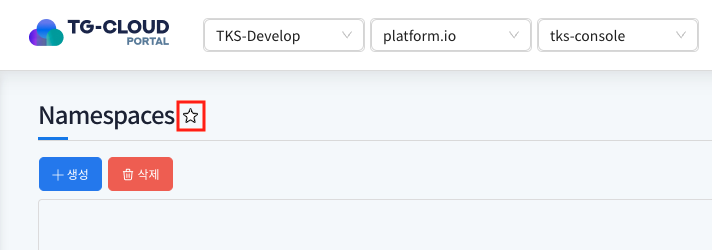
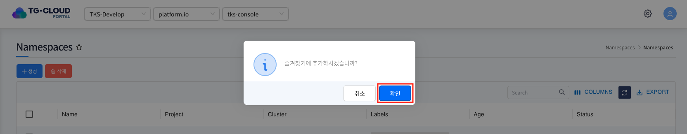
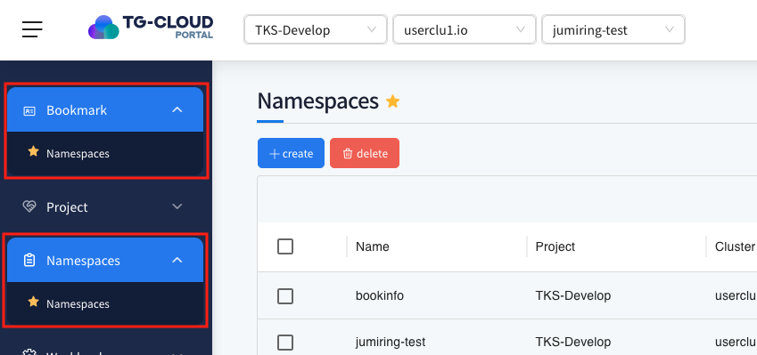
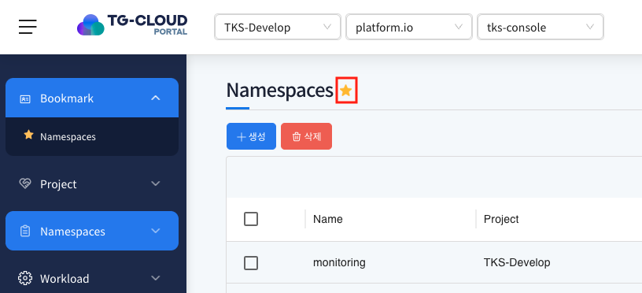
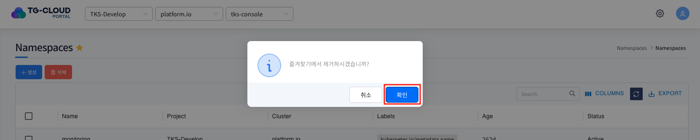
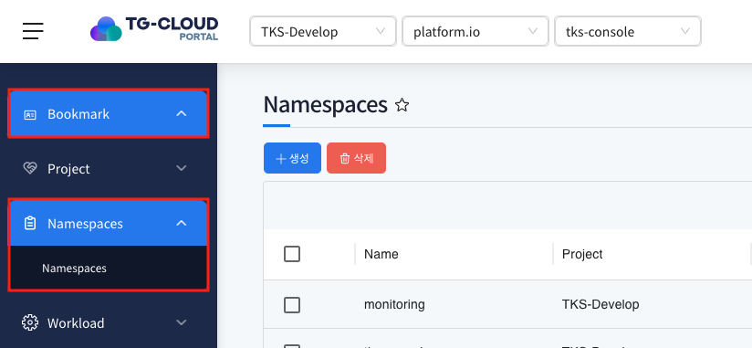

# Bookmark

> Bookmark 메뉴에서는 자주 사용하는 메뉴를 즐겨찾기로 등록할 수 있습니다. 
> 
>
> 즐겨찾기 기능은 네임스페이스별로 개별 설정됩니다.
> 
> 예를 들어, dev 네임스페이스에서 즐겨찾기한 메뉴는 prod 네임스페이스에는 영향을 주지 않습니다.
> 
> 네임스페이스마다 자주 사용하는 기능이 다를 경우, 해당 환경에 맞는 즐겨찾기 구성을 활용하면 작업 효율을 높일 수 있습니다.

## 목차

1. [메뉴 즐겨찾기 등록](#1-메뉴-즐겨찾기-등록)
2. [메뉴 즐겨찾기 해제](#2-메뉴-즐겨찾기-해제)

## 1. 메뉴 즐겨찾기 등록

> 특정 메뉴를 즐겨찾기로 등록해 메뉴 최 상단 레벨에서 빠르게 메뉴로 이동할 수 있습니다.

1. 메뉴 즐겨찾기 등록

   
   
   즐겨찾기에 등록 할 메뉴로 진입 후 상단 타이틀 우측의 `별 아이콘` 클릭

   
   
   즐겨찾기 등록 확인 팝업의 `확인` 버튼 클릭

2. 즐겨찾기 등록한 메뉴 확인

   
   
   메뉴 최상단의 Bookmark에서 추가한 메뉴 확인 및 메뉴트리에서 해당 메뉴 좌측에 별 아이콘 추가
   
   _예외) 헤더에 Namespace가 없는 사용자는 즐겨찾기 기능을 이용할 수 없습니다._

## 2. 메뉴 즐겨찾기 해제

> 즐겨찾기에 등록한 메뉴를 해제해 즐겨찾는 메뉴를 정리 할 수 있습니다.

1. 메뉴 즐겨찾기 해제

   
   
   즐겨찾기에 등록 한 메뉴로 진입 후 상단 타이틀 우측의 `별 아이콘` 클릭
   
   
   
   즐겨찾기 해제 확인 팝업의 `확인` 버튼 클릭

2. 즐겨찾기 해제한 메뉴 확인

   
   
   메뉴 최상단의 Bookmark에서 해제한 메뉴가 삭제 됐는지 확인 및 메뉴트리에서 해당 메뉴 좌측에 별 아이콘 삭제 확인
