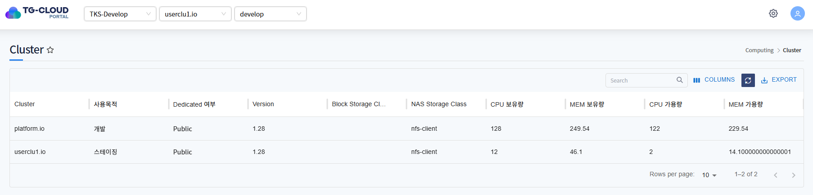
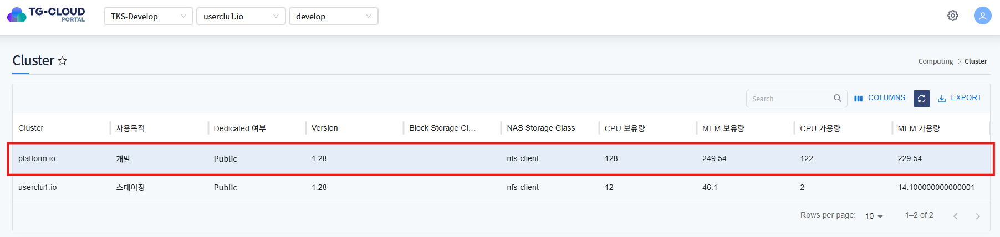
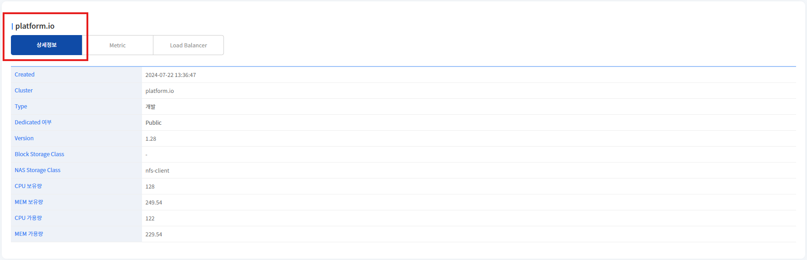
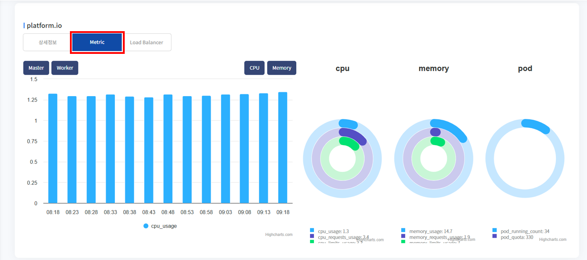
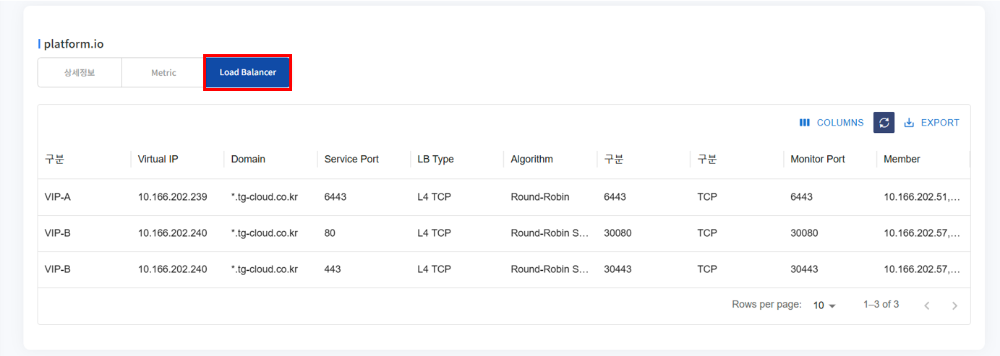

# Cluster

> 시스템에 등록된 모든 클러스터의 정보를 확인할 수 있는 메뉴입니다.
> 
> 관리자 권한을 가진 사용자가 조회할 수 있습니다.

## 목차
1. [Cluster 조회](#1-cluster-조회)
    * [리스트 조회](#리스트-조회)
   * [상세정보 조회](#상세정보-조회)
   * [Metric 조회](#metric-조회)
   * [Load Balancer 조회](#load-balancer-조회)

## 1. Cluster 조회
### 리스트 조회
* 메뉴 진입시 Cluster 목록이 조회됩니다. 
* Cluster의 사용 목적, Dedicated 여부, Version, 클러스터에서 사용중인 Storage Class, CPU/Memory 보유량, CPU/Memory 가용량을 확인할 수 있습니다.

### 상세정보 조회
* 리스트에서 특정 Cluster를 선택하면 하단 상세정보 탭에 Cluster의 상세 정보가 조회됩니다.
* 선택된 Cluster의 사용 목적, Dedicated 여부, Version, 클러스터에서 사용중인 Storage Class, CPU/Memory 보유량, CPU/Memory 가용량을 확인할 수 있습니다.

### Metric 조회
* 'Metric' 탭을 클릭하면 해당 Cluster의 사용량/가용량 추이를 그래프 형태로 확인할 수 있습니다.
* 'Master' 버튼 클릭시 해당 클러스터 내의 Mater 노드에 대한 추이가 표시됩니다.
* 'Worker' 버튼 클릭시 해당 클러스터 내의 Worker 노드에 대한 추이가 표시됩니다.
* 좌측 막대 그래프에서는 1시간 동안의 CPU, Memory 사용량을 5분 단위로 표현합니다.
* 우측 파이 차트에서는 CPU, Memory의 사용량과 Request/Limit 설정을 확인할 수 있고, 현재 가동중인 Pod의 수를 확인할 수 있습니다.

### Load Balancer 조회
* Load Balancer 탭을 클릭하면 해당 Cluster에 설정된 Load Balancer 목록을 조회할 수 있습니다.

