# ConfigMaps

> ConfigMap은 애플리케이션이 사용할 설정 정보를 저장하는 Kubernetes 리소스입니다.
>
> 코드와 설정을 분리할 수 있어, 설정 변경 시 애플리케이션을 수정하지 않고도 유연하게 대응할 수 있습니다.

## 목차

1. [ConfigMap 조회](#1-configmap-조회)
    * [리스트 조회](#리스트-조회)
   * [상세정보 조회](#상세정보-조회)
   *  [Data 조회](#data-조회)
   * [이벤트 조회](#이벤트-조회)
2. [ConfigMap 생성](#2-configmap-생성)
3. [ConfigMap 수정](#3-configmap-수정)
4. [ConfigMap 삭제](#4-configmap-삭제)


## 1. ConfigMap 조회
### 리스트 조회
* 메뉴 진입시 상위 선택된 클러스터/네임스페이스 내 ConfigMap 목록이 조회됩니다.
* ConfigMap이 속한 네임스페이스, ConfigMap에 선언된 Key, Age 정보를 확인할 수 있습니다.

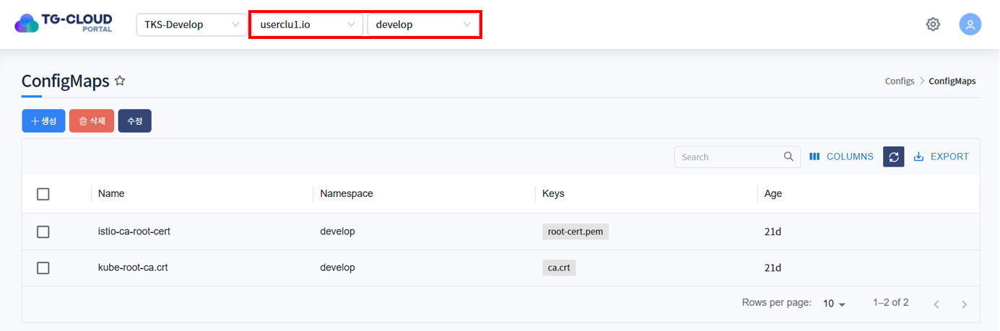

### 상세정보 조회
* 리스트에서 특정 ConfigMap을 선택하면 하단 상세정보 탭에 ConfigMap의 상세 정보가 조회됩니다.
* 선택된 ConfigMap의 생성일시, 네임스페이스, Annotation 등을 확인할 수 있습니다.

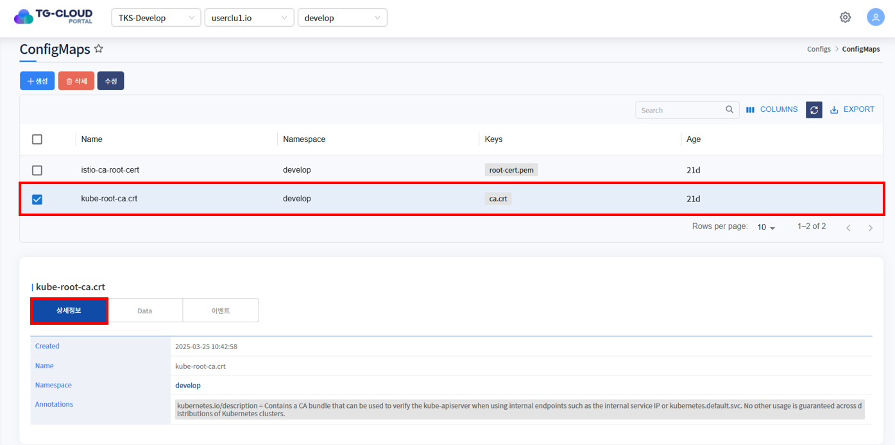

* 네임스페이스 이름을 클릭하면 해당 네임스페이스의 상세정보를 확인할 수 있습니다.

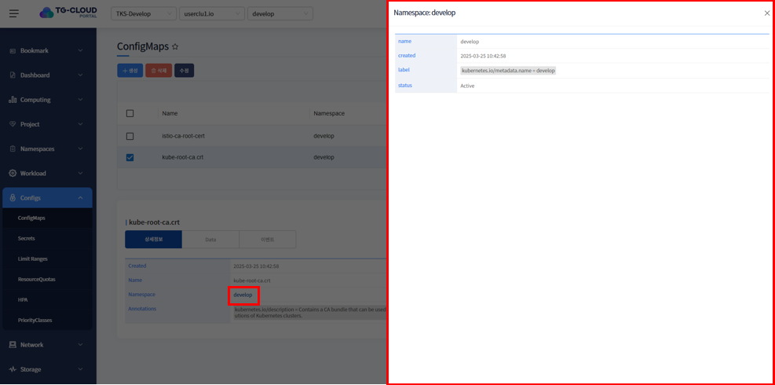

### Data 조회
* Data 탭을 클릭하면 해당 ConfigMap에 선언된 Data가 조회됩니다. Data는 Key-Value 형태로 구성되어 있습니다.

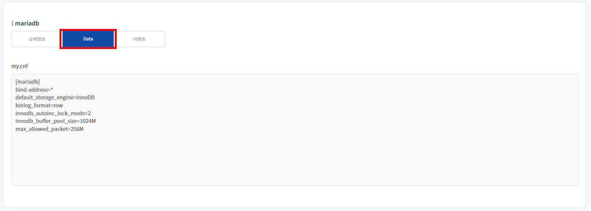

### 이벤트 조회
* ConfigMap에 발생한 이벤트 정보가 조회됩니다. 발생한 이벤트가 없을 경우 목록에서 표시되지 않습니다.


## 2. ConfigMap 생성
1. 목록 위 '생성' 버튼을 클릭합니다.

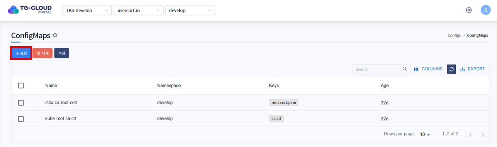

2. ConfigMap을 생성하는 Yaml 템플릿이 노출됩니다.

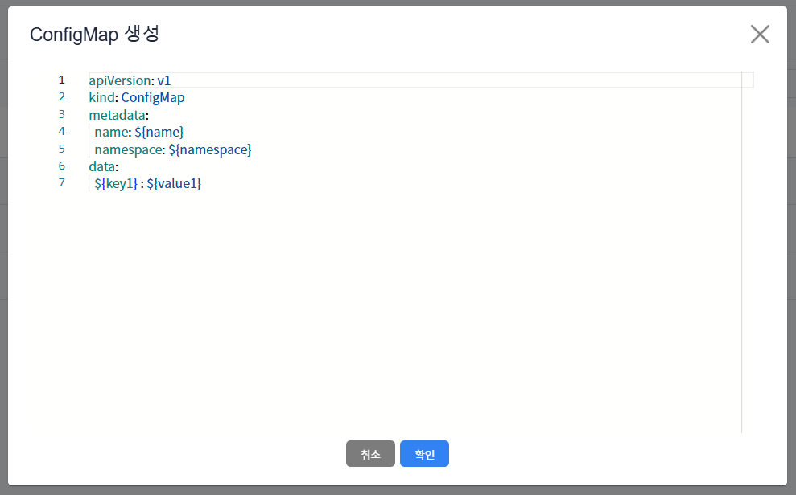

3. 템플릿 내 변수를 치환하여 생성하고자 하는 ConfigMap Yaml을 작성하고 '확인' 버튼을 클릭합니다.

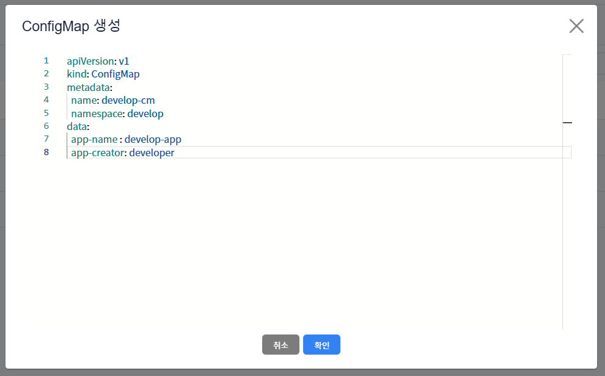

ex)
```yaml
apiVersion: v1
kind: ConfigMap
metadata:
   name: develop-cm
   namespace: develop
data:
   app-name: develop-app
   app-creator: developer
```
metadata > namespace에 입력한 namespace에 ConfigMap 생성됩니다.

* <strong>상단 헤더에 선택된 클러스터 내에 존재하는</strong> namespace 입력

4. ConfigMap이 정상적으로 생성된 것을 확인합니다.

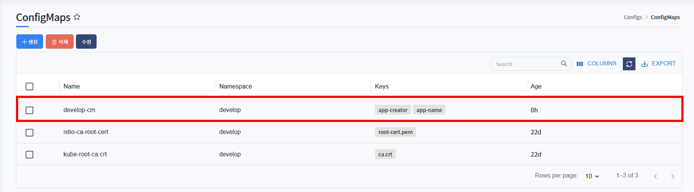

## 3. ConfigMap 수정
1. 수정하고자 하는 ConfigMap을 선택하고 목록 위 '수정' 버튼을 클릭합니다.

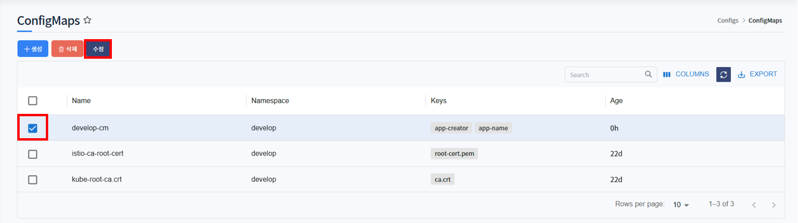

2. ConfigMap이 Yaml 형태로 조회됩니다. 원하는 데이터로 Yaml을 수정한 후 '확인' 버튼을 클릭합니다.

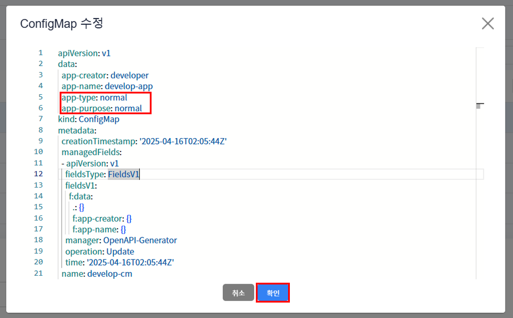

3. 하단의 상세정보 탭 또는 Data 탭에서 ConfigMap이 수정된 것을 확인합니다.

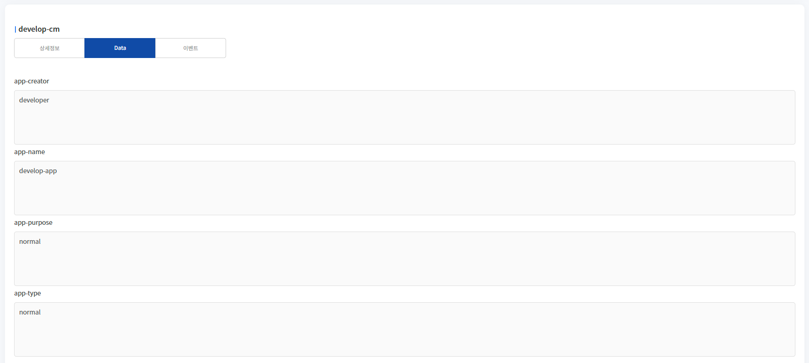

## 4. ConfigMap 삭제
1. 삭제하고자 하는 ConfigMap을 선택하고 목록 위 '삭제' 버튼을 클릭합니다.

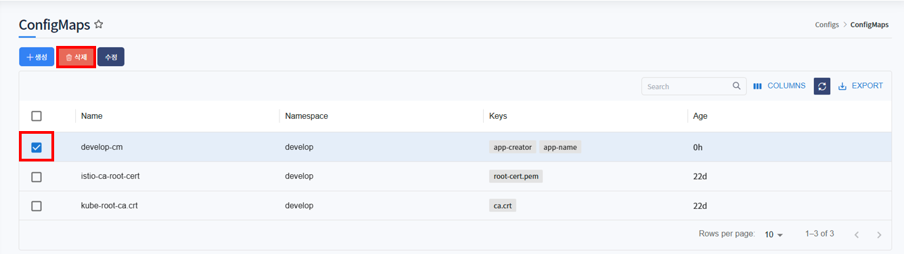 

2. 삭제를 확인하는 알림창이 노출되면 '확인' 버튼을 클릭합니다.

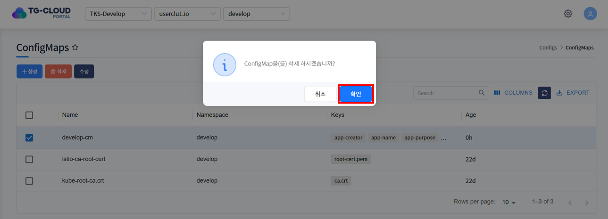

3. 목록에서 ConfigMap이 삭제된 것을 확인합니다.

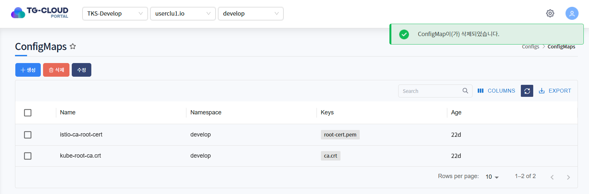