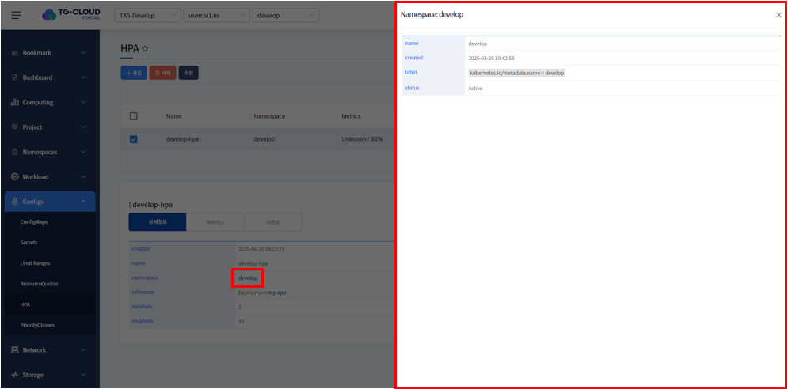
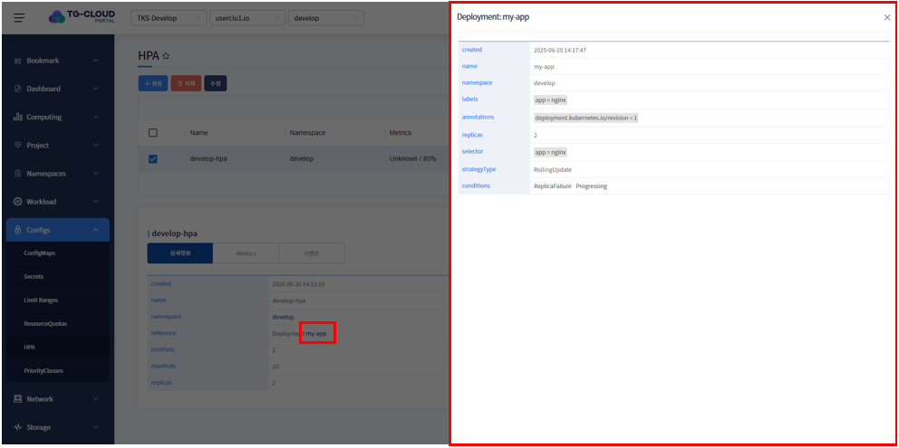
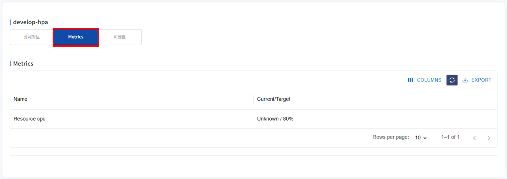
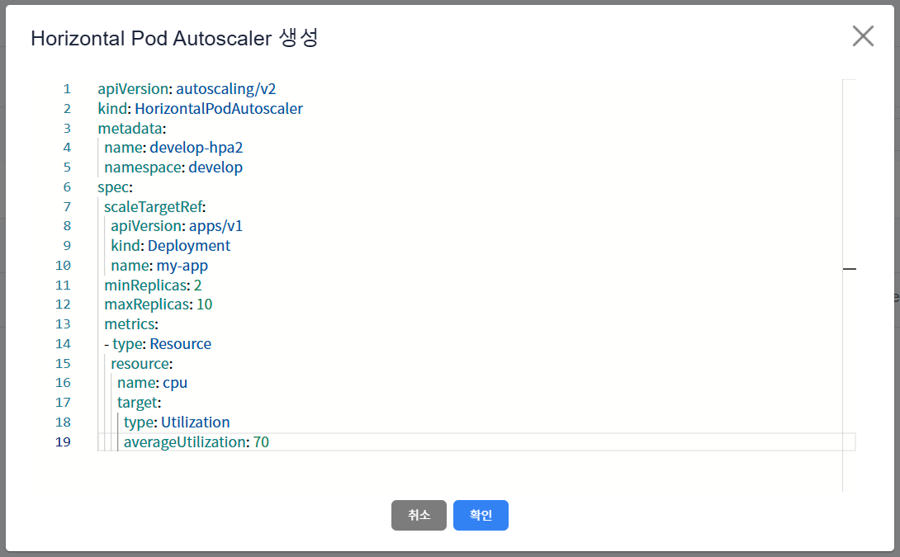
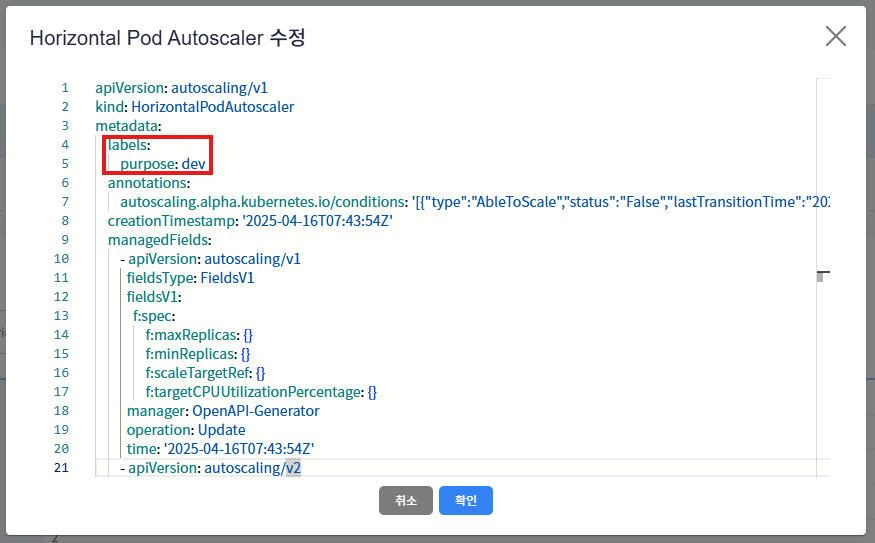

# HPA(Horizontal Pod Autoscaler)

> Horizontal Pod Autoscaler(HPA)는 CPU 사용률이나 기타 메트릭을 기준으로, Deployment나 ReplicaSet 등의 리소스를 자동으로 스케일 아웃 또는 스케일 인하는 Kubernetes 오브젝트입니다.
>
> HPA는 설정된 메트릭(CPU 사용률, 메모리, 또는 커스텀 메트릭 등)을 모니터링하고, 목표치와 비교해 Pod 수를 동적으로 조정합니다.

## 목차

1. [HPA 조회](#1-hpa-조회)
   * [리스트 조회](#리스트-조회)
   * [상세정보 조회](#상세정보-조회)
   * [Metrics 조회](#metrics-조회)
   * [이벤트 조회](#이벤트-조회)
2. [HPA 생성](#2-hpa-생성)
3. [HPA 수정](#3-hpa-수정)
4. [HPA 삭제](#4-hpa-삭제)

## 1. HPA 조회
### 리스트 조회
* 메뉴 진입시 상위 선택된 클러스터/네임스페이스 내 HPA 목록이 조회됩니다.
* HPA가 속한 네임스페이스,Metric, Pods, Replicas, Age 정보를 확인할 수 있습니다.


### 상세정보 조회
* 리스트에서 특정 HPA를 선택하면 하단 상세정보 탭에 HPA의 상세 정보가 조회됩니다.
* 선택된 HPA의 생성일시, 네임스페이스, reference, Pods, Replicas 등을 확인할 수 있습니다.


* 네임스페이스 이름을 클릭하면 해당 네임스페이스의 상세정보를 확인할 수 있습니다.



* reference 이름을 클릭하면 해당 reference의 상세정보를 확인할 수 있습니다.



### Metrics 조회
* 현재 Pod의 리소스 사용량(CPU, 메모리 등)과 HPA가 설정한 타겟 값을 확인할 수 있습니다.



### 이벤트 조회
* HPA에 발생한 이벤트 정보가 조회됩니다. 발생한 이벤트가 없을 경우 목록에서 표시되지 않습니다.


## 2. HPA 생성
1. 목록 위 '생성' 버튼을 클릭합니다.


2. HPA를 생성하는 Yaml 템플릿이 노출됩니다.


3. 템플릿 내 변수를 치환하여 생성하고자 하는 HPA Yaml을 작성하고 '확인' 버튼을 클릭합니다.



ex)
```yaml
apiVersion: autoscaling/v1
kind: HorizontalPodAutoscaler
metadata:
    name: develop-hpa2
    namespace: develop
spec:
    scaleTargetRef:
        apiVersion: apps/v1
        kind: Deployment
        name: my-app
    minReplicas: 2
    maxReplicas: 10
    metrics:
        - type: Resource
          resource:
              name: cpu
              target:
                  type: Utilization
                  averageUtilization: 70
```
metadata > namespace에 입력한 namespace에 HPA 생성됩니다.

* <strong>상단 헤더에 선택된 클러스터 내에 존재하는</strong> namespace 입력

4. HPA가 정상적으로 생성된 것을 확인합니다.


## 3. HPA 수정
1. 수정하고자 하는 HPA를 선택하고 목록 위 '수정' 버튼을 클릭합니다.


2. HPA가 Yaml 형태로 조회됩니다. 원하는 데이터로 Yaml을 수정한 후 '확인' 버튼을 클릭합니다.



3. 하단의 상세정보 탭 또는 Metrics 탭에서 HPA가 수정된 것을 확인합니다.


## 4. HPA 삭제
1. 삭제하고자 하는 HPA를 선택하고 목록 위 '삭제' 버튼을 클릭합니다.


2. 삭제를 확인하는 알림창이 노출되면 '확인' 버튼을 클릭합니다.


3. 목록에서 HPA가 삭제된 것을 확인합니다.


