# LimitRanges

> LimitRange는 네임스페이스 내에서 생성되는 Pod나 컨테이너에 대해 CPU, 메모리 등의 최소/최대/기본 리소스 제한을 설정하는 정책입니다.
>
> LimitRange는 사용자가 자원을 과도하게 요청하거나 설정하지 않은 경우를 방지하기 위해, 기본값(default)과 최대/최소 리소스 사용량을 자동으로 적용해주는 기능입니다.

## 목차

1. [LimitRange 조회](#1-limitrange-조회)
   * [리스트 조회](#리스트-조회)
   * [상세정보 조회](#상세정보-조회)
   * [이벤트 조회](#이벤트-조회)
2. [LimitRange 생성](#2-limitrange-생성)
3. [LimitRange 수정](#3-limitrange-수정)
4. [LimitRange 삭제](#4-limitrange-삭제)

## 1. LimitRange 조회
### 리스트 조회
* 메뉴 진입시 상위 선택된 클러스터/네임스페이스 내 LimitRange 목록이 조회됩니다.
* LimitRange가 속한 네임스페이스, Age 정보를 확인할 수 있습니다.

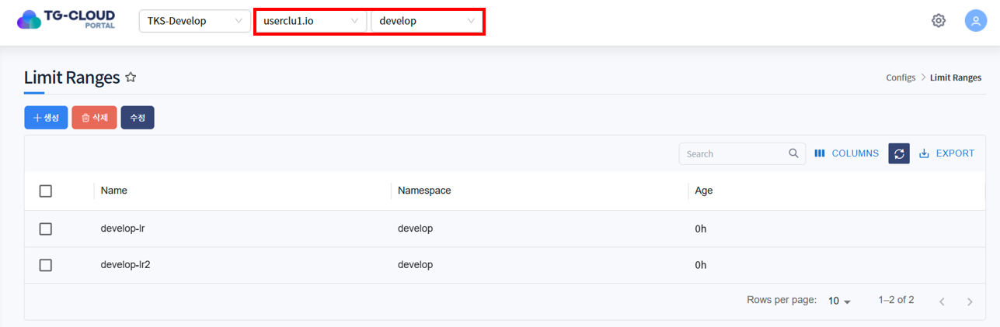

### 상세정보 조회
* 리스트에서 특정 LimitRange를 선택하면 하단 상세정보 탭에 LimitRange의 상세 정보가 조회됩니다.
* 선택된 LimitRange의 생성일시, 네임스페이스, CPU/Memory min/max 값을 확인할 수 있습니다.

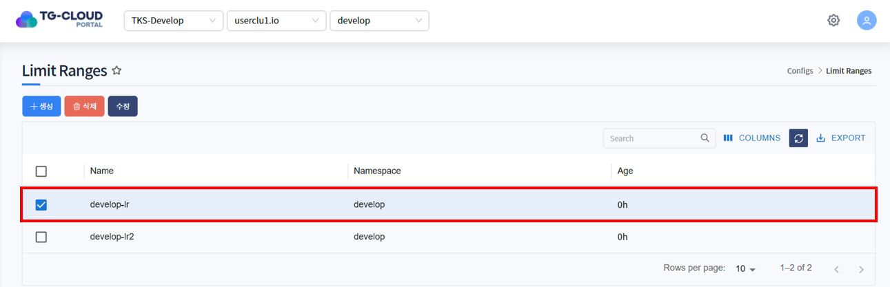
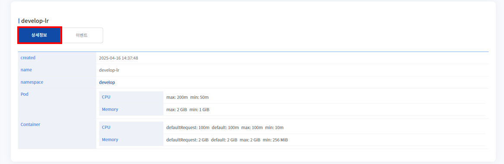

* 네임스페이스 이름을 클릭하면 해당 네임스페이스의 상세정보를 확인할 수 있습니다.

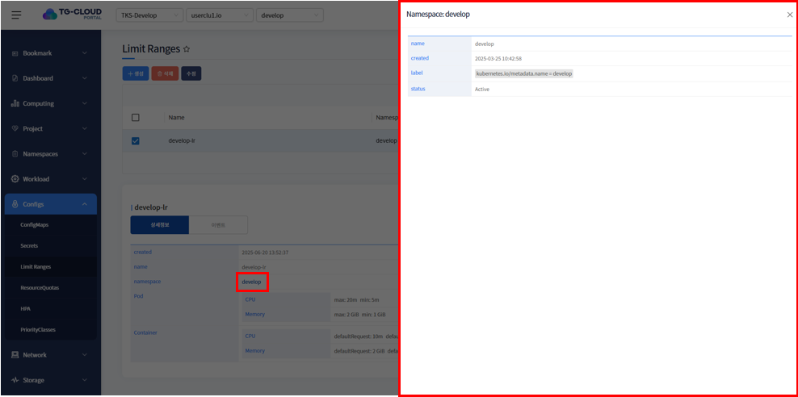

### 이벤트 조회
* LimitRange에 발생한 이벤트 정보가 조회됩니다. 발생한 이벤트가 없을 경우 목록에서 표시되지 않습니다.

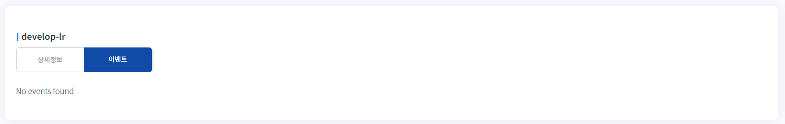

## 2. LimitRange 생성
1. 목록 위 '생성' 버튼을 클릭합니다.

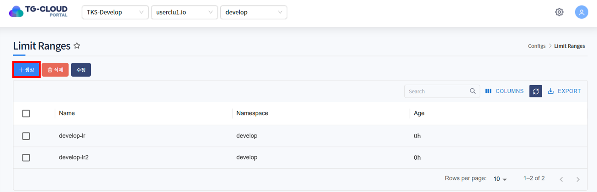

2. LimitRange를 생성하는 Yaml 템플릿이 노출됩니다.

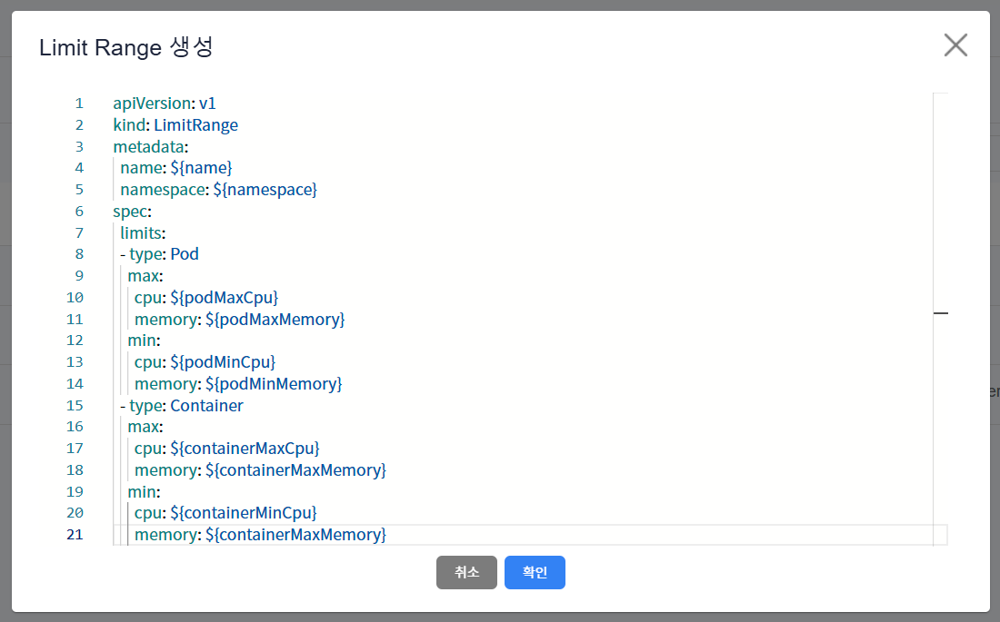

3. 템플릿 내 변수를 치환하여 생성하고자 하는 LimitRange Yaml을 작성하고 '확인' 버튼을 클릭합니다.

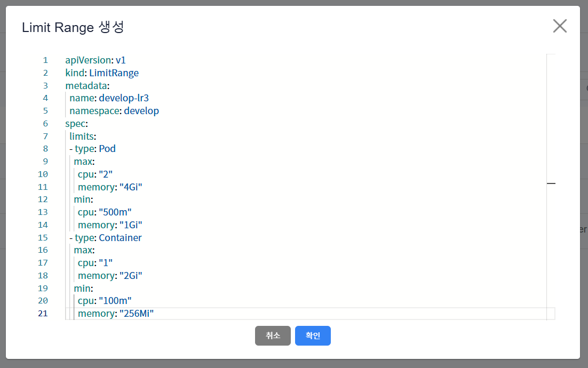

ex)
```yaml
apiVersion: v1
kind: LimitRange
metadata:
    name: develop-lr3
    namespace: develop
spec:
    limits:
        - type: Pod
          max:
              cpu: "2"
              memory: "4Gi"
          min:
              cpu: "500m"
              memory: "1Gi"
        - type: Container
          max:
              cpu: "1"
              memory: "2Gi"
          min:
              cpu: "100m"
              memory: "256Mi"
```
metadata > namespace에 입력한 namespace에 LimitRange 생성됩니다.

* <strong>상단 헤더에 선택된 클러스터 내에 존재하는</strong> namespace 입력

4. LimitRange가 정상적으로 생성된 것을 확인합니다.

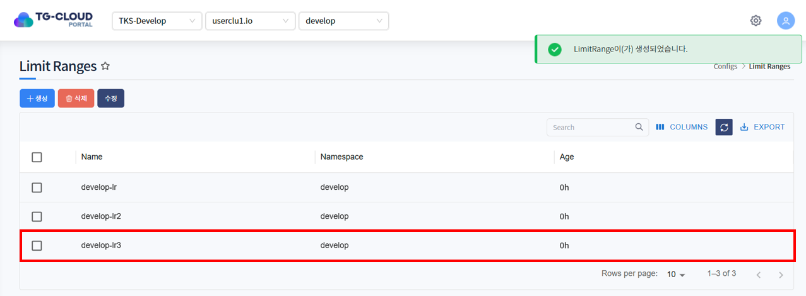

## 3. LimitRange 수정
1. 수정하고자 하는 LimitRange를 선택하고 목록 위 '수정' 버튼을 클릭합니다.

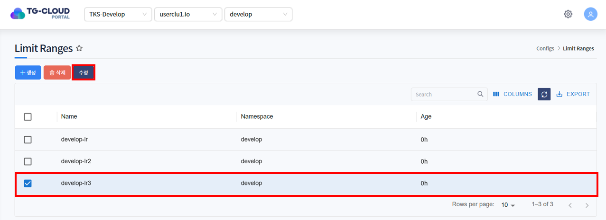

2. LimitRange가 Yaml 형태로 조회됩니다. 원하는 데이터로 Yaml을 수정한 후 '확인' 버튼을 클릭합니다.


3. 하단의 상세정보 탭에서 LimitRange가 수정된 것을 확인합니다.

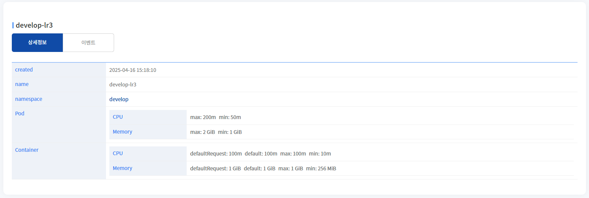

## 4. LimitRange 삭제
1. 삭제하고자 하는 LimitRange를 선택하고 목록 위 '삭제' 버튼을 클릭합니다.

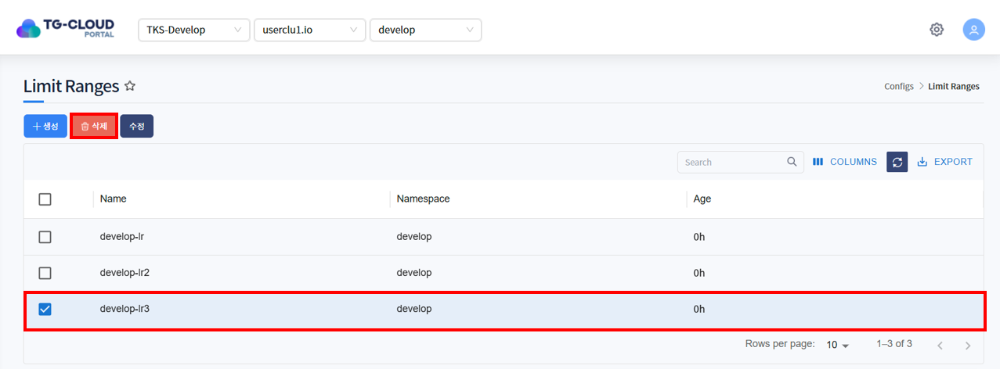

2. 삭제를 확인하는 알림창이 노출되면 '확인' 버튼을 클릭합니다.

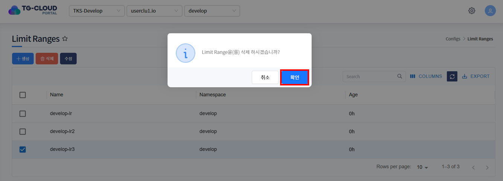

3. 목록에서 LimitRange가 삭제된 것을 확인합니다.

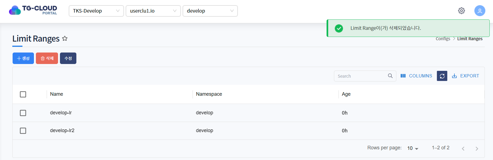