# ResourceQuotas

> ResourceQuota는 네임스페이스에서 사용할 수 있는 CPU, 메모리, 스토리지, 오브젝트 수 등을 제한하는 정책입니다. 
> 
> 리소스의 과도한 사용을 방지하고 클러스터 자원을 효율적으로 분배할 수 있도록 도와줍니다
>
> ResourceQuota를 설정하면 하나의 네임스페이스가 클러스터 자원을 독점하지 않도록, 사용할 수 있는 리소스의 총량을 정할 수 있습니다.

## 목차

1. [ResourceQuota 조회](#1-resourcequota-조회)
   * [리스트 조회](#리스트-조회)
   * [상세정보 조회](#상세정보-조회)
   * [이벤트 조회](#이벤트-조회)
2. [ResourceQuota 생성](#2-resourcequota-생성)
3. [ResourceQuota 수정](#3-resourcequota-수정)
4. [ResourceQuota 삭제](#4-resourcequota-삭제)

## 1. ResourceQuota 조회
### 리스트 조회
* 메뉴 진입시 상위 선택된 클러스터/네임스페이스 내 ResourceQuota 목록이 조회됩니다.
* ResourceQuota가 속한 네임스페이스, 사용량 정보를 확인할 수 있습니다.

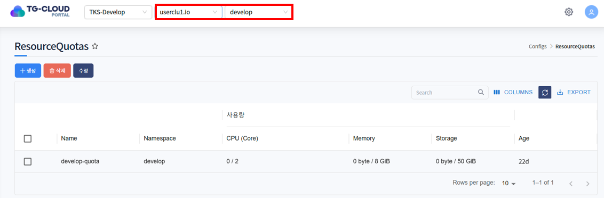

### 상세정보 조회
* 리스트에서 특정 ResourceQuota를 선택하면 하단 상세정보 탭에 ResourceQuota의 상세 정보가 조회됩니다.
* 선택된 ResourceQuota의 생성일시, 네임스페이스, Quota 등을 확인할 수 있습니다.

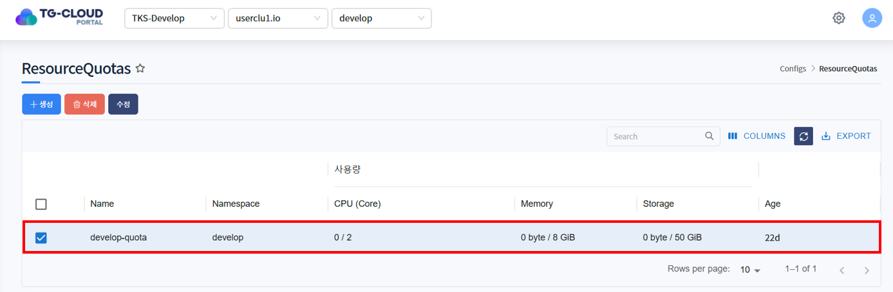
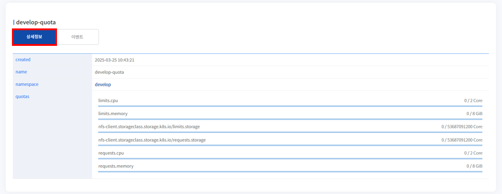

* 네임스페이스 이름을 클릭하면 해당 네임스페이스의 상세정보를 확인할 수 있습니다.

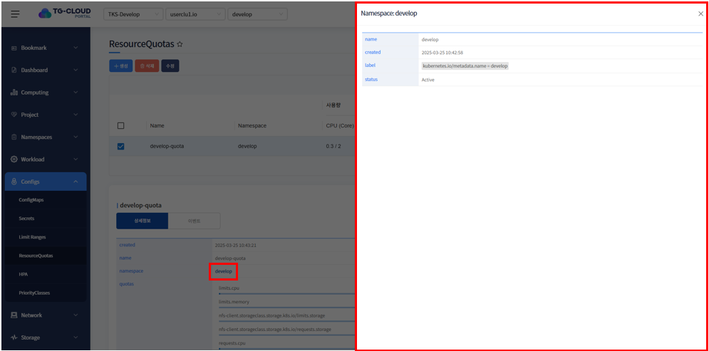

### 이벤트 조회
* ResourceQuota에 발생한 이벤트 정보가 조회됩니다. 발생한 이벤트가 없을 경우 목록에서 표시되지 않습니다.

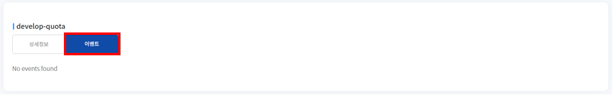

## 2. ResourceQuota 생성
1. 목록 위 '생성' 버튼을 클릭합니다.

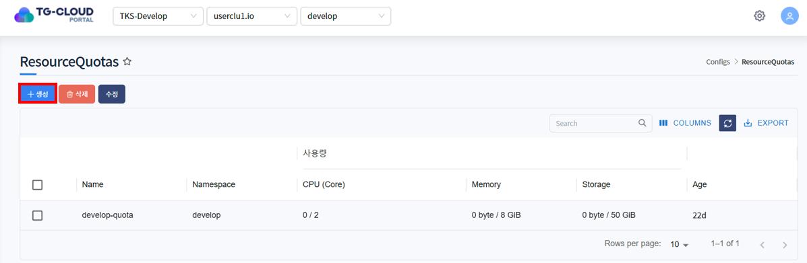

2. ResourceQuota를 생성하는 Yaml 템플릿이 노출됩니다.

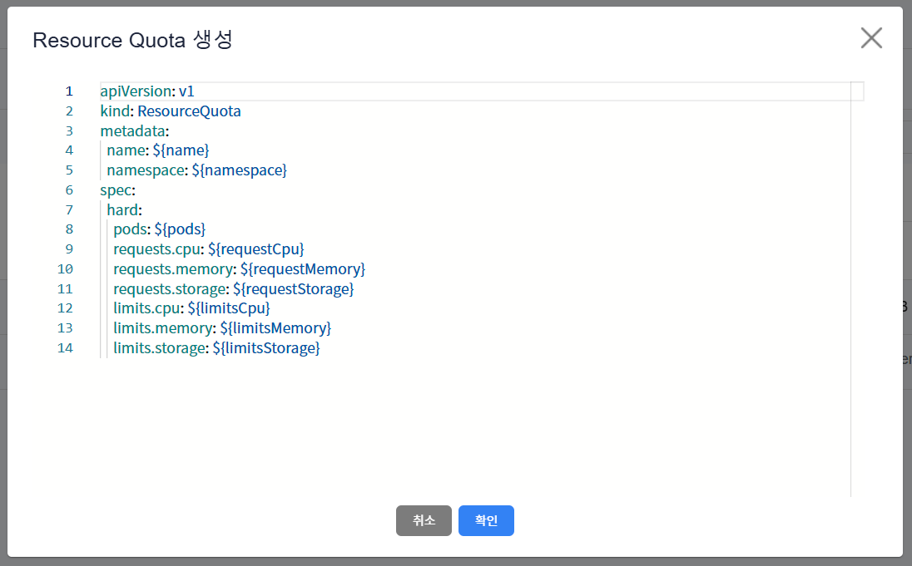

3. 템플릿 내 변수를 치환하여 생성하고자 하는 ResourceQuota Yaml을 작성하고 '확인' 버튼을 클릭합니다.

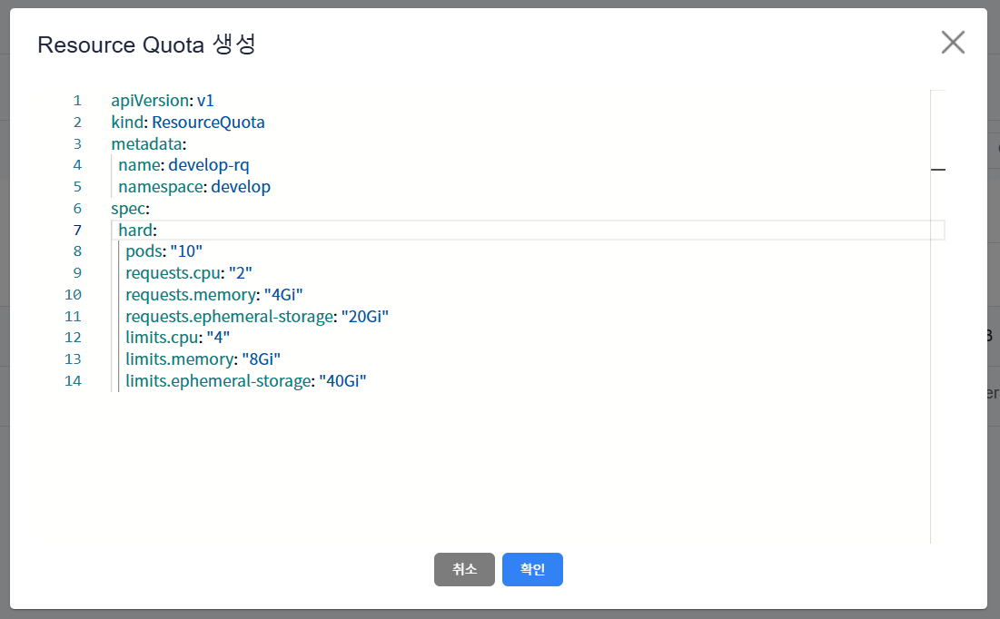

ex)
```yaml
apiVersion: v1
kind: ResourceQuota
metadata:
    name: develop-rq
    namespace: develop
spec:
    hard:
        pods: "10"
        requests.cpu: "2"
        requests.memory: "4Gi"
        requests.ephemeral-storage: "20Gi"
        limits.cpu: "4"
        limits.memory: "8Gi"
        limits.ephemeral-storage: "40Gi"
```
metadata > namespace에 입력한 namespace에 ResourceQuota 생성됩니다.

* <strong>상단 헤더에 선택된 클러스터 내에 존재하는</strong> namespace 입력

4. ResourceQuota가 정상적으로 생성된 것을 확인합니다.

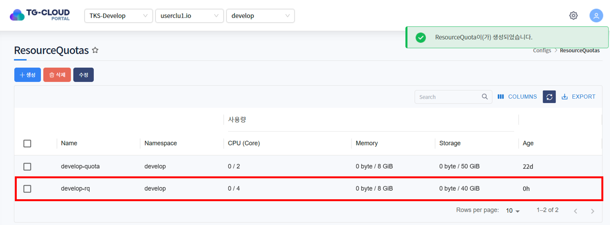

## 3. ResourceQuota 수정
1. 수정하고자 하는 ResourceQuota를 선택하고 목록 위 '수정' 버튼을 클릭합니다.

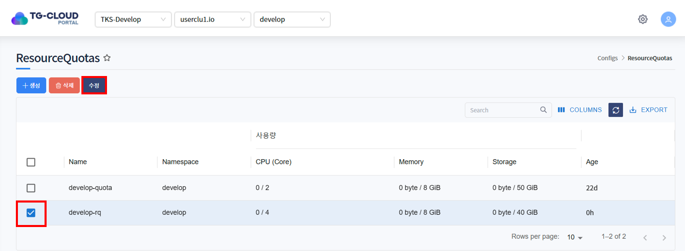

2. ResourceQuota가 Yaml 형태로 조회됩니다. 원하는 데이터로 Yaml을 수정한 후 '확인' 버튼을 클릭합니다.

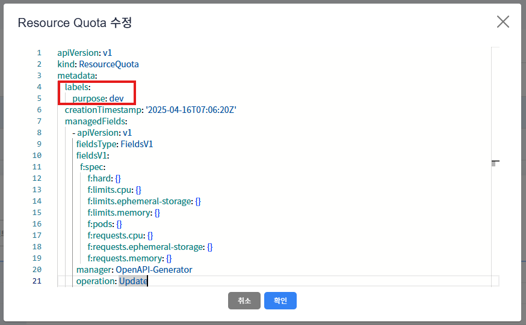

3. 하단의 상세정보 탭 또는 Data 탭에서 ResourceQuota가 수정된 것을 확인합니다.

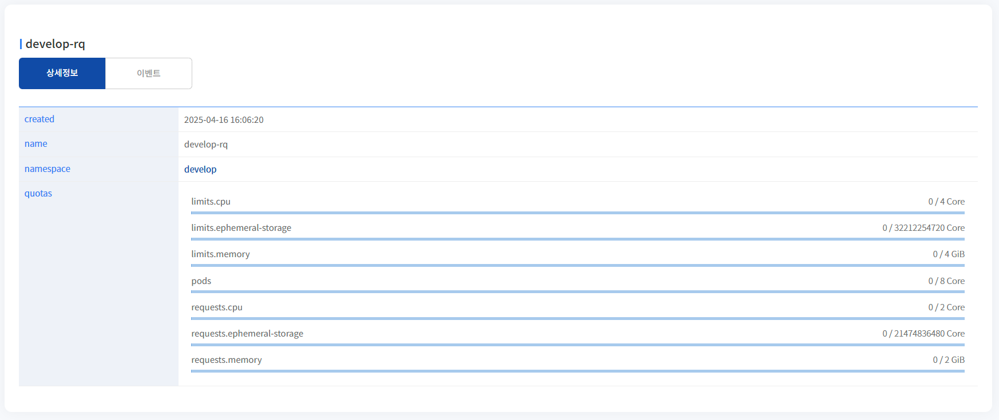

## 4. ResourceQuota 삭제
1. 삭제하고자 하는 ResourceQuota를 선택하고 목록 위 '삭제' 버튼을 클릭합니다.

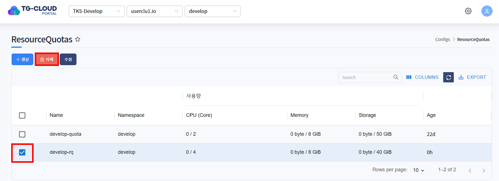

2. 삭제를 확인하는 알림창이 노출되면 '확인' 버튼을 클릭합니다.

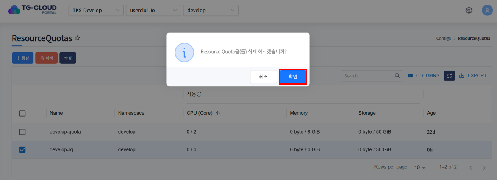

3. 목록에서 ResourceQuota가 삭제된 것을 확인합니다.

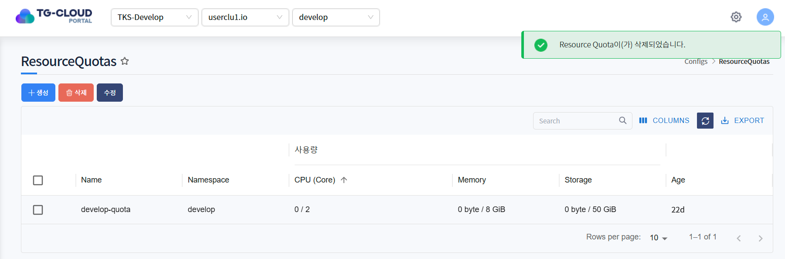