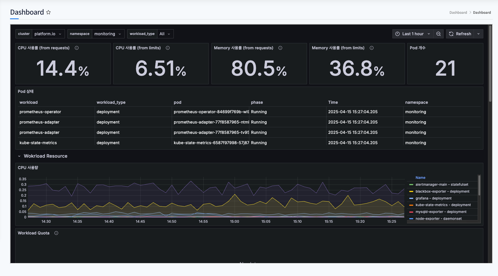
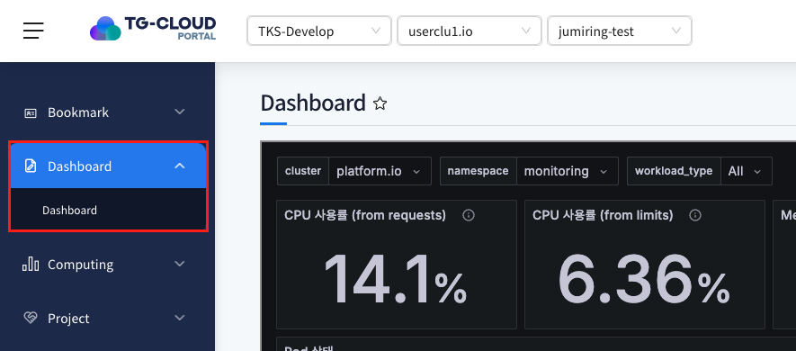
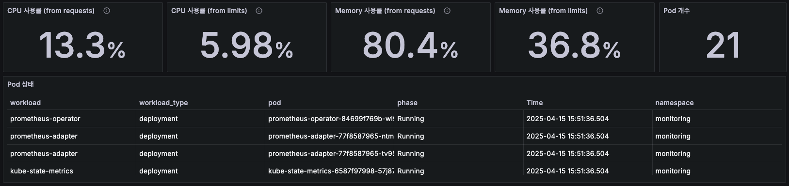
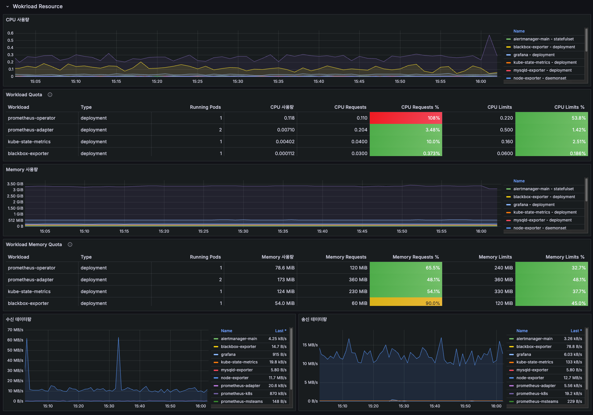
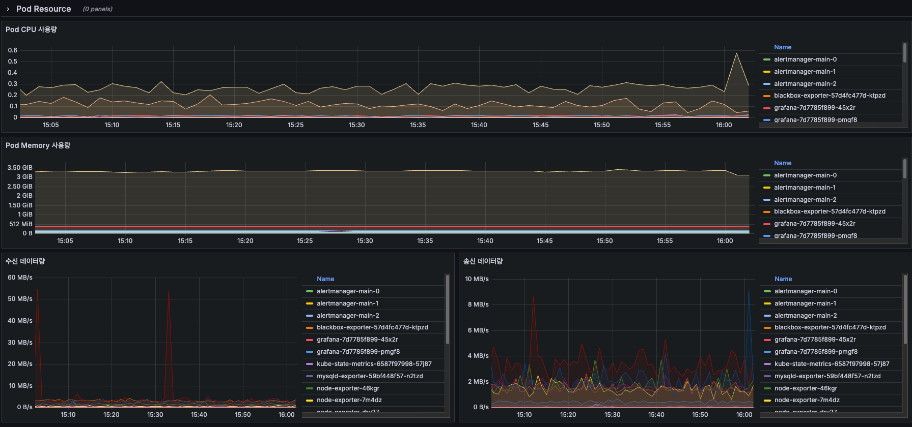
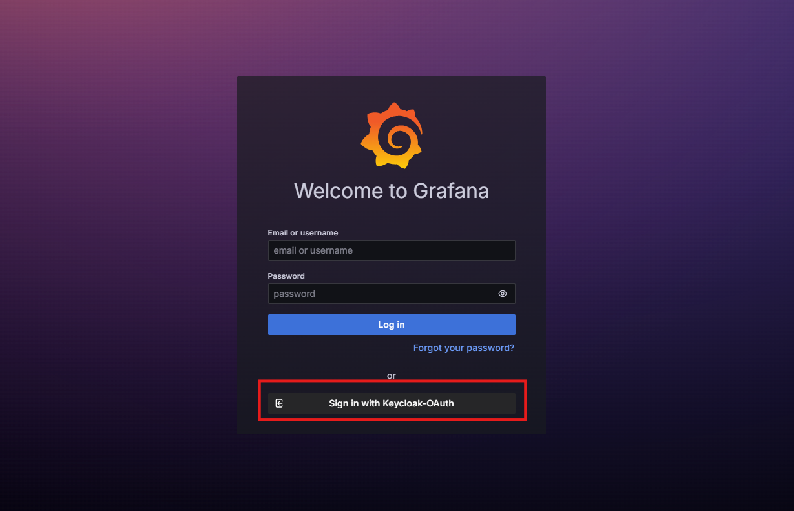
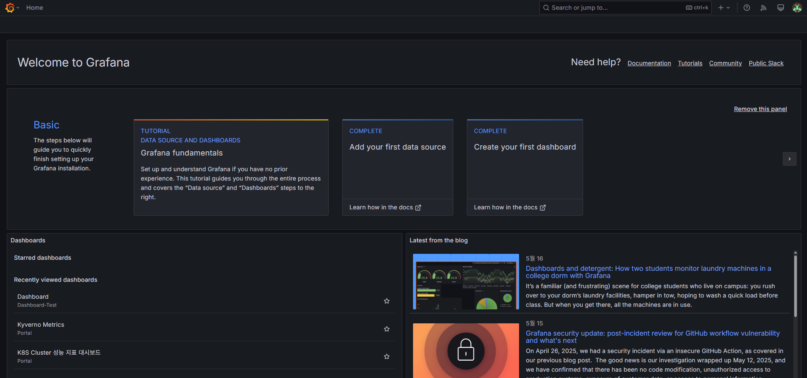

# Dashboard

> 포탈에서 사용중인 K8s 자원 현황을 grafana dashboard를 통해 시각적으로 데이터를 확인 할 수 있습니다.

## 목차

1. [Dashboard 메뉴 확인](#1-dashboard-메뉴-확인)
2. [Dashboard 화면 확인](#2-dashboard-화면-확인)
   - [기본 자원 현황](#기본-자원-현황)
   - [Workload 리소스 현황](#workload-리소스-현황)
   - [Pod 리소스 현황](#pod-리소스-현황)
3. [Dashboard 로그인](#3-dashboard-로그인)

## 1. Dashboard 메뉴 확인

> Grafana dashboard를 통해 자원 사용에 대한 metric 정보를 확인 할 수 있습니다.
> 해당 메뉴는 **admin 권한을 가진 Namespace에서만 확인이 가능**하며, 확인이 필요한 사용자는 관리자에게 권한 변경 요청이 필요합니다.

1. 좌측 메뉴 `Dashboard` 클릭

   

   좌측 메뉴의 `Dashboard` 클릭 후 자원정보가 시각화된 dashboard 확인

## 2. Dashboard 화면 확인

> grafana에서 데이터를 시각화해 제공하는 dashboard를 통해 자원현황 및 사용량, 사용률 등 상세 현황을 확인해 포탈을 필요에 맞게 사용할 수 있습니다.

### 기본 자원 현황

CPU, Memory의 사용률을 request/limit으로 분리해 확인 할 수 있으며, 사용중인 pod 개수와 상태를 제공합니다.

### Workload 리소스 현황

workload 자원 별 CPU, Memory 사용량을 그래프로 확인 할 수 있으며, 자원의 송수신 데이터를 제공하고 있습니다.

### Pod 리소스 현황

Pod의 CPU, Memory 사용량을 그래프로 확인 할 수 있으며, 송수신 데이터를 제공하고 있습니다.

## 3. Dashboard 로그인

포탈엔 로그인 되어있지만 Dashboard에 로그인 되어있지 않으면 로그인화면으로 이동합니다.

위 버튼 클릭하면 자동 로그인되고 아래의 화면으로 이동합니다.

