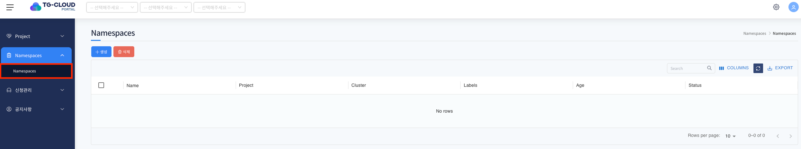
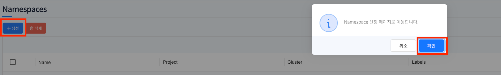
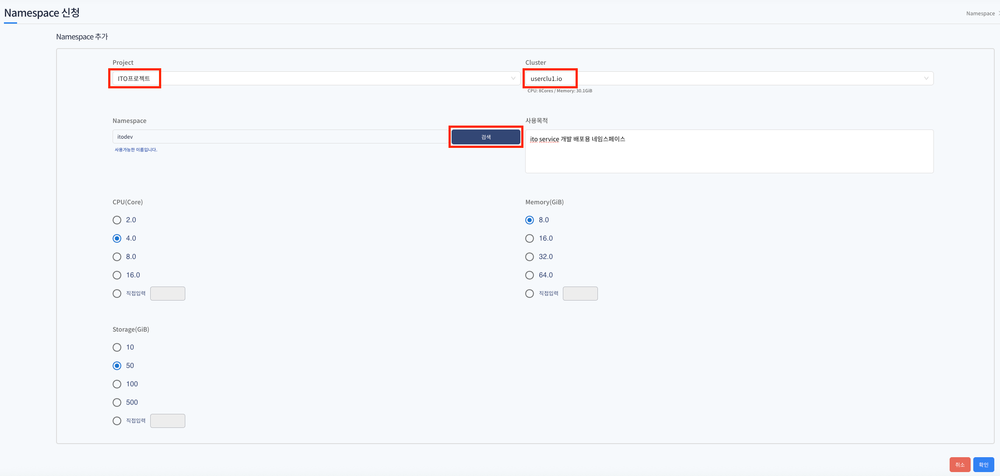
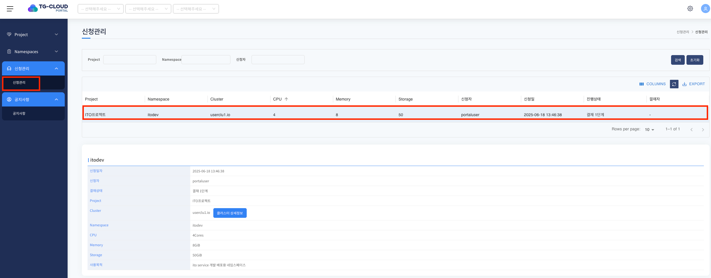
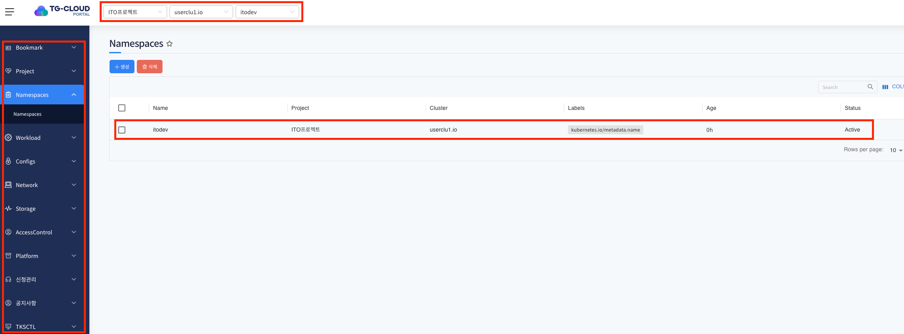

# Namespaces

> Namespaces는 상단의 클러스터에서 서비스중인 Namespace 목록을 확인하고 생성, 삭제하는 서비스 입니다.&#x20;

---
## **목차**
1. [Namespace 메뉴 진입](#1-namespace-메뉴-진입)
2. [namespace 생성 신청](#2-namespace-생성-신청)
3. [namespace 생성 확인](#3-namespace-생성-확인)

## 1. Namespace 메뉴 진입

1. 좌측 메뉴 `Namespaces` 메뉴 클릭

     

 - 좌측 메뉴 `Namespaces` 메뉴 클릭 후 네임스페이스 화면에 진입합니다.
 - 신규 프로젝트에 할당된 유저이며 프로젝트 하위에 속한 네임스페이스가 없기 때문에 빈 리스트로 표현됩니다.

---

## 2. Namespace 생성 신청

1. `생성` 버튼을 클릭하면 네임스페이스 신청을 할 수 있습니다. 네임스페이스 생성은 바로 생성되는것이 아닌 해당 `생성` 버튼을 통하여 신청 후 운영자/프로젝트 관리자의 승인을 거친 후에 네임스페이스를 생성할 수 있습니다.
   -  네임스페이스 신청 후 생성까지의 결재라인은 아래와 같이 이루어 집니다.

      > 유저 네임스페이스 신청 > portal 운영자 1차 결재 승인 > 프로젝트 관리자 2차 결재 승인
         
   - 아래와 같이 `생성` 버튼을 클릭하게 되면 Namespace 신청 페이지로 이동합니다. 라는 안내 문구와 함께 확인 버튼을 통하여 신청 페이지로 이동할 수 있습니다.

     

2. 네임스페이스 신청은 아래 form을 작성 후 신청할 수 있으며 항목 선택 및 입력 후 확인 버튼을 클릭하면 네임스페이스 생성 신청이 완료 됩니다. 주요 선택 항목에 대한 설명은 아래와 같습니다.
   - Project: 네임스페이스가 속하게 될 프로젝트를 선택하는 항목입니다.  
   - Cluster: 프로젝트 하위에 소속된 클러스터의 목록이며 실제 신청하는 네임스페이스가 배포되는 클러스터 입니다.
   - Namespace: 신청하는 네임스페이스의 이름입니다. 검색 버튼을 통하여 클러스터 하위에 동일한 이름의 네임스페이스가 존재하는지 여부를 체크합니다.
   - 사용목적: 네임스페이스가 사용되는 목적을 작성하는 항목입니다.
   - CPU: 네임스페이스에 할당할 CPU 용량입니다.
   - Memory(GiB): 네임스페이스에 할당할 메모리 용량입니다.
   - Storage(GiB): 네임스페이스에 할당할 스토리지 용량입니다.

     

3. 신청을 완료하면 신청관리 화면으로 이동하게 되며 내가 신청한 네임스페이스의 목록 및 결재 단계를 확인할 수 있습니다. 운영자 > 프로젝트 관리자의 1,2차 승인 후 네임스페이스가 추가되는것을 확인할 수 있습니다.

     

--- 

## 3. Namespace 생성 확인

1. 신청관리 화면에서 운영자, 프로젝트 관리자의 1,2차 승인이 완료되면 네임스페이스가 생성이 되며 해당 화면에서 확인할 수 있습니다.
   - 직접 생성한 프로젝트 및 하위 클러스터, 승인 완료된 네임스페이스를 상단에서 선택을 한 후 네임스페이스 메뉴에 진입하면 생성된 네임스페이스를 확인할 수 있습니다.
   - 직접 신청하여 생성된 네임스페이스내에서의 부여된 권한은 네임스페이스 관리자 권한을 갖게 됩니다.
   - 네임스페이스 생성 확인 및 특정 프로젝트 > 네임스페이스 하위에 유저의 권한이 할당되면 오픈된 메뉴에 한해서 각각의 기능을 수행할 수 있습니다. (<U>**각 수행 가능한 기능은 일반 사용자 매뉴얼 참조**</U>)   

     
