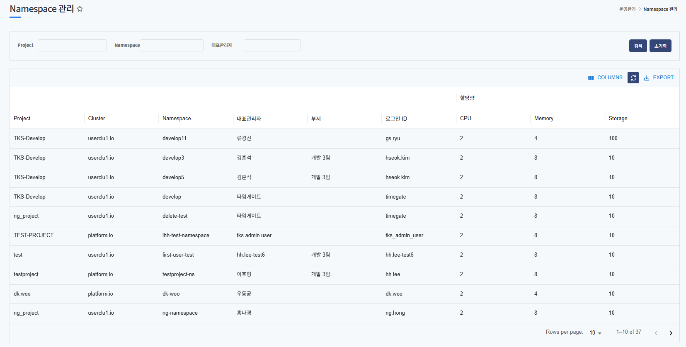
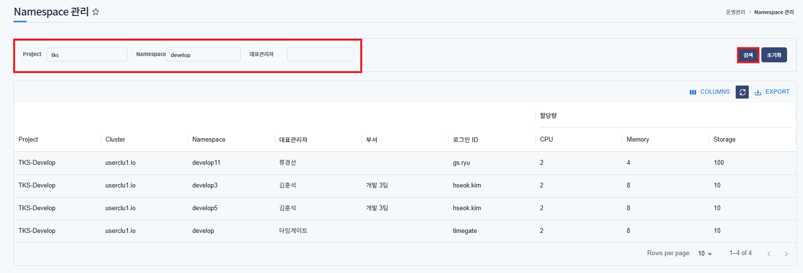

# Namespace 관리

> Namespaces 관리는 전체 Namespace 목록을 확인하는 서비스 입니다.
> 관리자 권한을 가진 사용자만 이용가능합니다.

---
## **목차**
1. [Namespace 조회](#namespace-조회)
   - [1.1. Namespace 목록](#namespace-목록)

## Namespace 조회

---
#### Namespace 목록

전체 클러스터에 등록된 Namespace 목록을 확인할 수 있습니다.

프로젝트, 클러스터, 대표관리자 등을 확인합니다.

---
각 필드에 단어가 포함된 목록은 검색됩니다. 

아래는 검색 예시 입니다.

