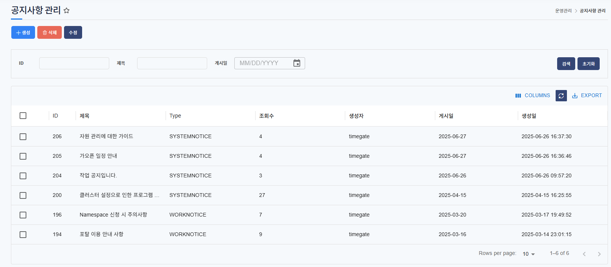
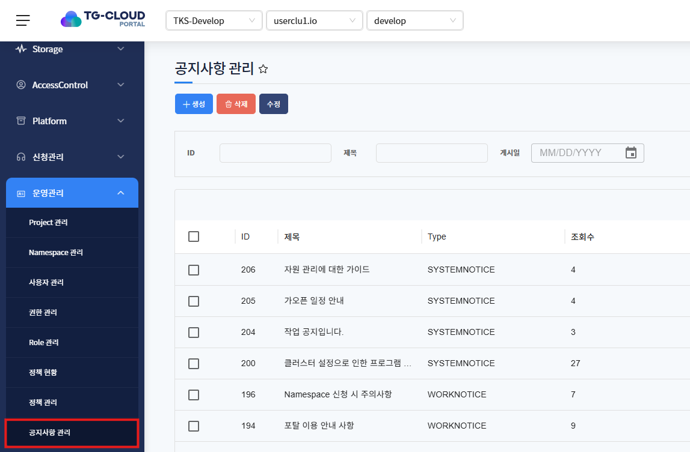
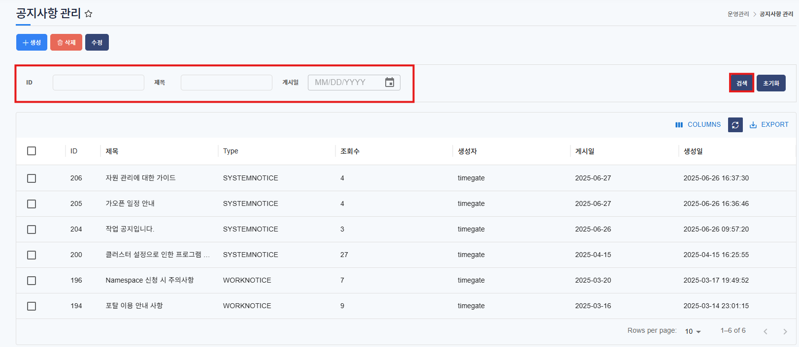
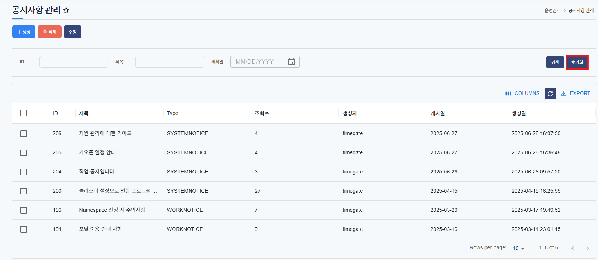
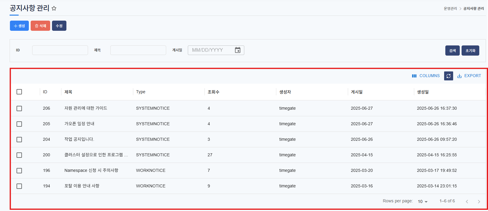
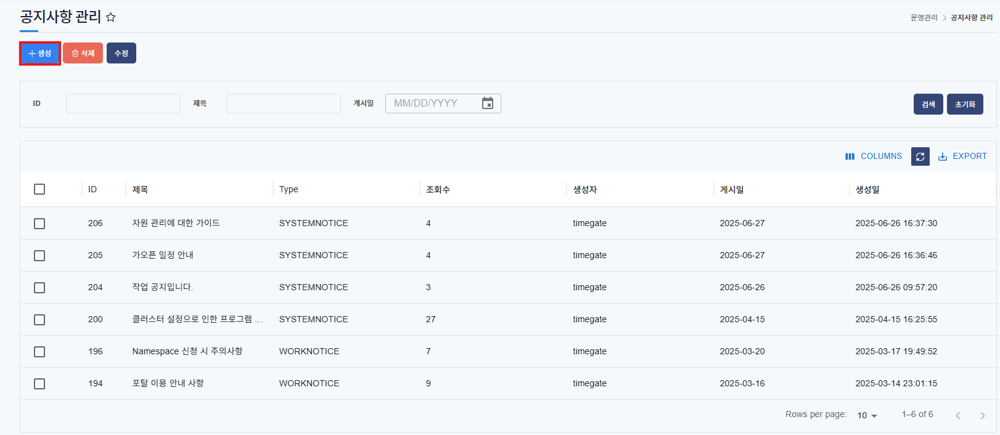
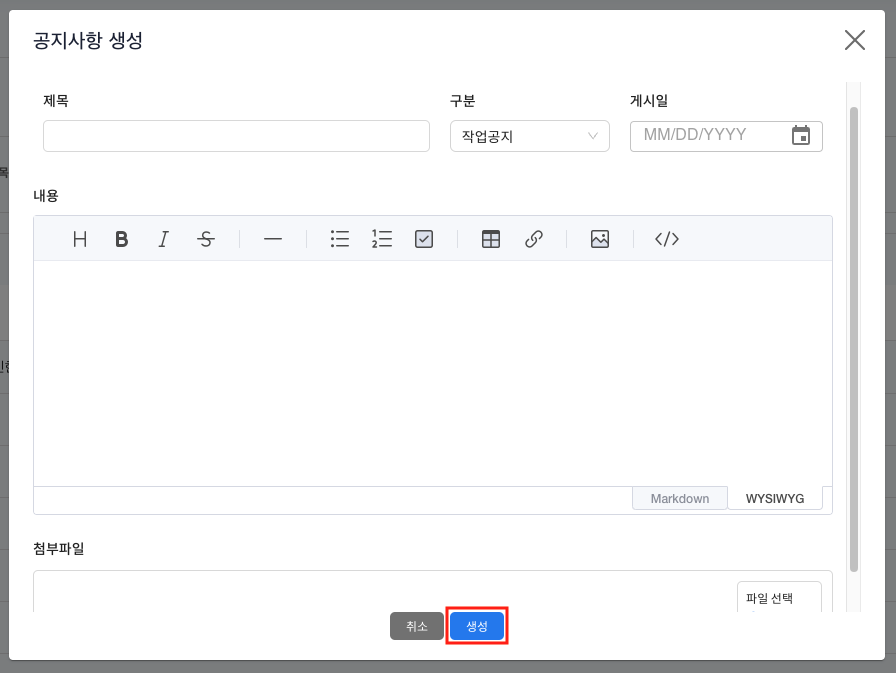
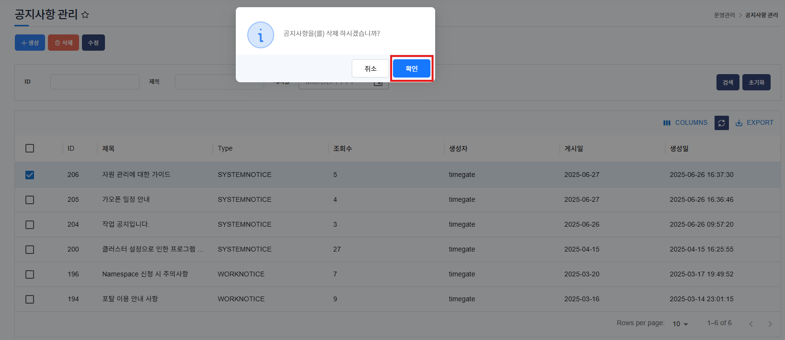
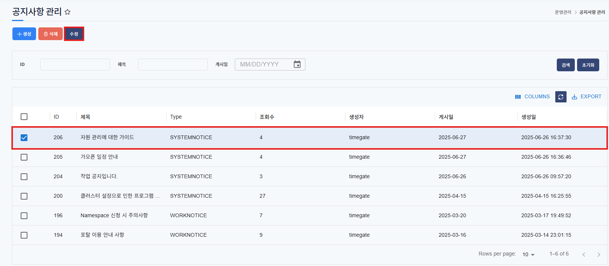
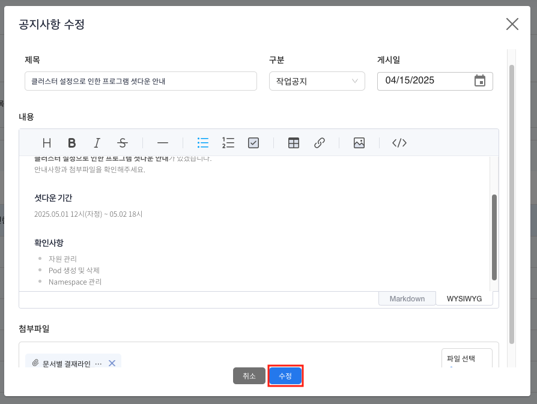

# 공지사항 관리

> 운영자가 공지사항을 등록하고 관리할 수 있는 메뉴입니다.
> 관리자 권한을 가진 사용자만 이용가능합니다.

## 목차

1. [공지사항 관리 메뉴 확인](#1-공지사항-관리-메뉴-확인)
2. [공지사항 관리 리스트 검색](#2-공지사항-관리-리스트-검색)
3. [공지사항 관리 리스트](#3-공지사항-관리-리스트)
4. [공지사항 관리 상세 내용](#4-공지사항-관리-상세-내용)
5. [공지사항 등록](#5-공지사항-등록)
6. [공지사항 삭제](#6-공지사항-삭제)
7. [공지사항 수정](#7-공지사항-수정)

## 1. 공지사항 관리 메뉴 확인

1. 메뉴 리스트에서 운영관리 하위의 공지사항 관리 메뉴를 클릭

   

   운영자가 등록한 모든 공지사항 리스트를 확인 할 수 있습니다.

## 2. 공지사항 관리 리스트 검색

1. 공지사항 상단의 검색창에서 ID, 제목, 생성일 필드에 검색어를 입력 후 `검색` 버튼 클릭

   

   - ID: 공지사항의 ID로 검색
   - 제목: 공지사항의 제목으로 검색
   - 생성일: 공지사항의 생성 일자로 검색

2. `초기화` 버튼을 클릭해 검색한 리스트를 초기화하고 전체 리스트를 호출

   

   전체 공지사항 리스트를 다시 확인 할 수 있습니다.

## 3. 공지사항 관리 리스트

1. 등록된 공지사항을 확인

   

   - ID: 공지사항 ID
   - 제목: 공지사항 제목
   - Type: 시스템공지와 작업공지 유형으로 분류
   - 조회수: 공지사항을 읽은 view 수 count
   - 생성자: 공지사항 등록인
   - 게시일: 공지사항이 게시된 일자
   - 생성일: 공지사항을 생성한 일자

## 4. 공지사항 관리 상세 내용

1. 선택한 공지사항의 상세 내용 확인

   

   공지사항 상세 내용을 확인 할 수 있으며, 첨부파일 등 전체 내용을 확인 할 수 있습니다.

## 5. 공지사항 등록

1. 공지사항 메뉴 상단의 `생성` 버튼 클릭

   

2. 공지사항 생성에 필수 데이터 입력 후 `생성` 버튼 클릭

   

- 필수 정보
  - 제목: 공지사항 제목
  - 구분: 공지사항 Type(시스템공지, 작업공지 중 택 1)
  - 게시일: 공지사항이 게시될 일자. 현재 일자 이후로만 설정 가능합니다.
  - 내용: editor를 사용해 가독성 있는 공지사항 내용 업로드
- 선택 정보
  - 첨부파일: 첨부파일은 최대 5개까지 업로드 가능하며, 파일크기는 총 10mb를 넘길 수 없습니다.

## 6. 공지사항 삭제

1. 삭제할 공지사항을 리스트에서 선택 후 상단의 `삭제` 버튼 클릭

   

   다중으로 삭제 할 수 있습니다.

2. 삭제 확인 팝업에서 `확인` 버튼 클릭

   

## 7. 공지사항 수정

1. 수정할 공지사항을 리스트에서 선택 후 상단의 `수정` 버튼 클릭

   

2. 수정 팝업에서 변경할 내용을 수정 후 `수정` 버튼 클릭

   

   모든 내용을 수정 할 수 있으며, 수정된 내용을 저장하면 해당 내용으로 변경됩니다.
   게시일은 현재 일자 이후로만 설정 가능합니다.
