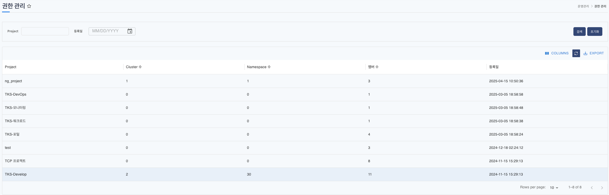
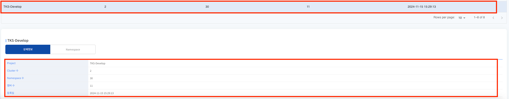
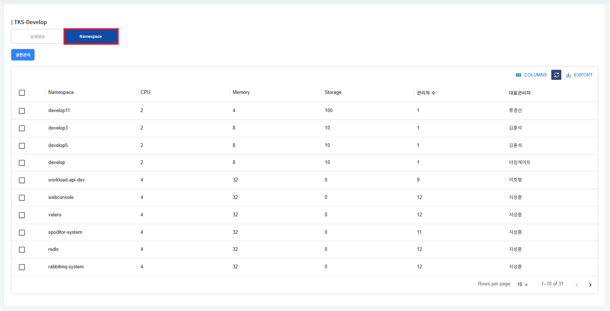
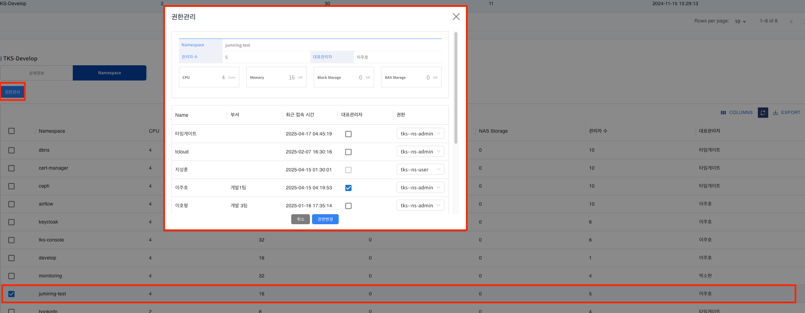
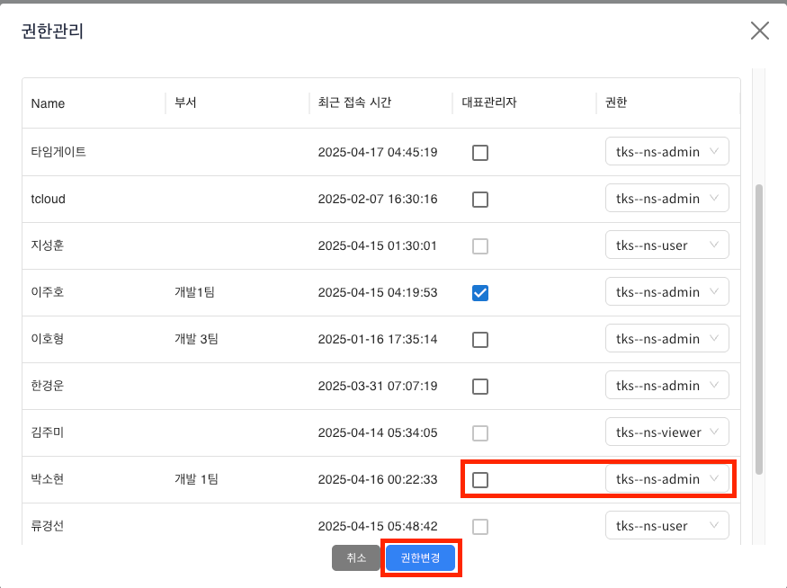
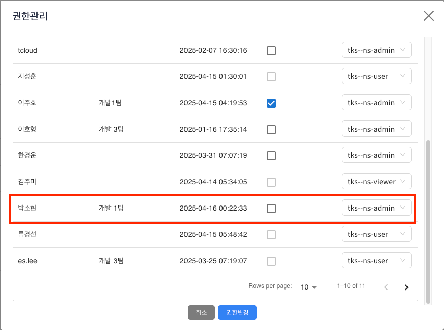
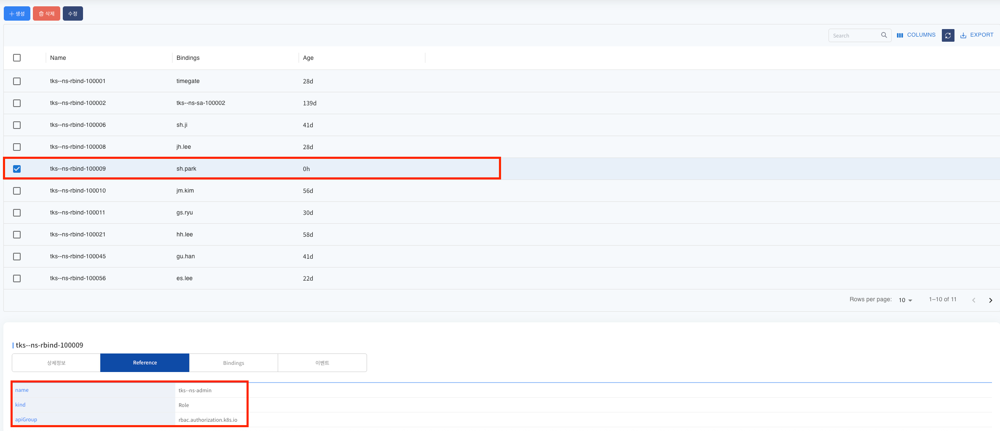

# 권한 관리

> 유저에게 권한(역할)을 부여하는 화면입니다. 네임스페이스 별 권한을 부여할 수 있으며 실제 kubernetes 내 Rbac이 함께 적용됩니다.
> 관리자 권한을 가진 사용자만 이용가능합니다.

---

## **목차**

1. [Project 정보 조회](#1-project-정보-조회)
   * [1.1. 리스트 조회](#11-리스트-조회)
   * [1.2. 상세정보 조회](#12-상세정보-조회)
   * [1.3. Namespace 조회(프로젝트 하위 네임스페이스 목록 조회)](#13-namespace-조회)
2. [권한 부여](#2-권한-부여)
   * [2.1. 프로젝트 내 속한 유저 목록 조회](#21-프로젝트-내-속한-유저-목록-조회)
   * [2.2. 네임스페이스 내 권한 부여](#22-네임스페이스-내-권한-부여)
   * [2.3. 권한 할당 확인](#23-권한-할당-확인)

---

## 1. Project 정보 조회

### 1.1. 리스트 조회

- 화면 진입시 콘솔 내 추가된 프로젝트 리스트가 조회됩니다.

### 1.2. 상세정보 조회

- 프로젝트 리스트 내에 특정 프로젝트를 선택하면 상세 내역이 조회됩니다.

### 1.3. Namespace 조회

- 프로젝트 리스트 내에 특정 프로젝트를 선택하면 프로젝트내 속한 네임스페이스 목록이 조회됩니다.

---

## 2. 권한 부여

### 2.1. 프로젝트 내 속한 유저 목록 조회

- 권한을 부여할 네임스페이스 선택 후 **[권한관리]** 버튼을 클릭하면 상위 그리드에서 선택된 프로젝트 하위에 할당된 유저 목록이 조회됩니다.
- 권한관리 팝업 내에는 선택한 네임스페이스 정보 및 유저에게 할당되어 있는 권한 정보가 조회 됩니다.

### 2.2. 네임스페이스 내 권한 부여

- 권한 할당은 가장 우측 role 을 선택한 후 [권한변경] 버튼을 통하여 부여를 할 수 있습니다.
- tks--ns-admin role 은 네임스페이스 내 admin 권한이며 해당 role 선택 시 네임스페이스 대표관리자로 지정할 수 있습니다. 대표관리자는 네임스페이스 내 한명만 지정이 가능합니다.
- 아래는 유저의 권한을 tks--ns-user 에서 tks--ns-admin 으로 변경하고 있습니다.

### 2.3. 권한 할당 확인

- 권한 변경 후 권한관리 팝업에서 유저의 권한이 변경된것을 확인할 수 있으며 권한을 변경한 namespace 를 상단에서 선택 후 AccessControl > RoleBinding 화면을 통하여 Rolebinding 도 변경된것을 확인할 수 있습니다.

