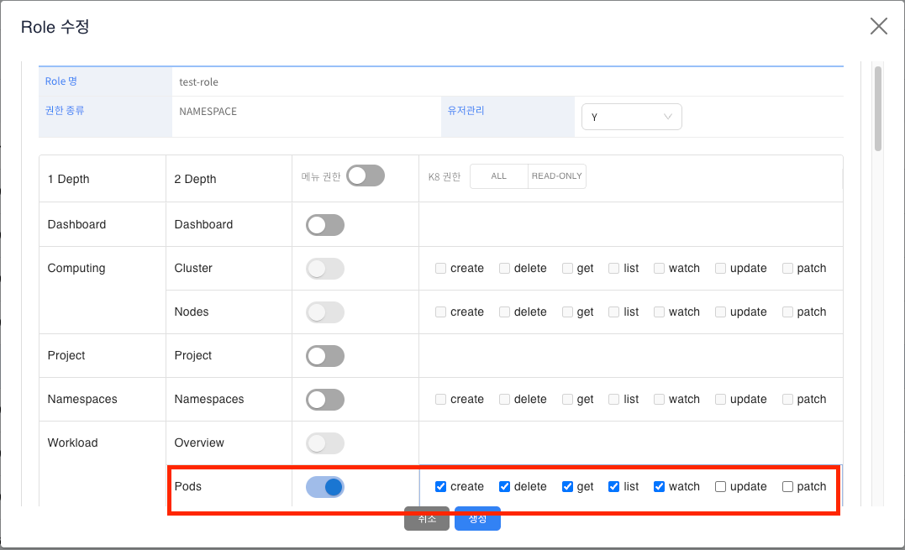

# Role 관리

> console 내 유저들에게 부여할 role 을 관리하는 화면입니다. role은 해당 화면에서 관리되며 실제 Kubernetes 내 role 또는 clusterRole 과 연계되어 Rbac 에 활용됩니다.
> 관리자 권한을 가진 사용자만 이용가능합니다.
---

## **목차**
1. [Role 정보 조회](#1-role-정보-조회)
   * [1.1. 리스트 조회](#11-리스트-조회)
   * [1.2. 상세정보 조회](#12-상세정보-조회)
2. [Role 생성](#2-role-생성)
   * [2.1. 생성 및 확인](#21-생성-및-확인)
3. [Role 수정](#3-role-수정)
4. [Role 삭제](#4-role-삭제)

---

## 1. Role 정보 조회

### 1.1. 리스트 조회
* 화면 진입시 현재 console에서 관리되는 Role 정보가 조회됩니다.

### 1.2. 상세정보 조회
* 리스트에서 특정 Role을 선택하면 Role 에 매핑된 메뉴 권한 정보와 메뉴 정보 중 k8s 와 연관된 메뉴의 verbs(상세 권한 정보) 가 조회 됩니다.
* 메뉴 권한(Show/None) 필드는 사용자의 역할에 따라 console의 좌측 메뉴 트리에 표시되는 메뉴 항목을 제어하는 데 사용됩니다. Show 로 설정된 메뉴는 사용자에게 표시되어 접근이 가능하게 하며, None 으로 설정된 메뉴는 사용자에게 숨겨져 접근이 제한됩니다.
* K8 권한은 메뉴 접근 후 해당 메뉴에서 수행할 수 있는 접근 권한 입니다. 실제 kubernetes Role 내 verbs 로 관리되는 값 입니다.

---

## 2. Role 생성
### 2.1. 생성 및 확인
* 상단 **[생성]** 버튼을 클릭하게 되면 Role 생성 템플릿이 조회됩니다.
* role 생성 템플릿은 아래와 같으며 각각 항목에 대한 설명은 다음과 같습니다.
     * **Role 명**: Role의 이름이며 실제로 kubernetes에 배포될 role의 이름이기도 합니다.
     * **권한 종류**: Cluster/Namespace 단위로 구분됩니다. Cluster 로 저장된 Role은 kubernetes 에 배포될때 ClusterRole(Cluster scope) 로 배포가 되며 Namespace 로 저장된 Role은 Role(Namespace scope) 로 배포가 됩니다. 
     * **유저관리**: 유저에게 권한을 할당할 수 있는 역할을 부여할지 여부이며 유저관리가 가능한 role을 할당받은 유저는 운영관리 > 권한관리 내에서 다른 사용자에게 권한을 할당할 수 있게 됩니다. 
     * **그리드** 
          * **메뉴 권한**: console의 좌측 메뉴 트리에 표시되는 메뉴 항목을 제어하는데 사용됩니다. Show 로 설정된 메뉴는 사용자에게 표시되어 접근이 가능하게 하며, None 으로 설정된 메뉴는 사용자에게 숨겨져 접근이 제한됩니다.
          * **k8 권한**: 메뉴 접근 후 해당 메뉴에서 수행할 수 있는 접근 권한 입니다. 실제 kubernetes Role 내 verbs 로 관리되는 값 입니다.

* 권한종류를 Cluster로 선택을 하면 권한을 모두 선택할 수 있도록 열리게 되며, Namespace로 선택을 하면 kubernetes 기준 namespace 하위에서 관리되는 리소스의 권한만 선택할 수 있도록 활성화 됩니다.
  * 아래 이미지처럼 Cluster, Nodes는 비활성화 되어 있는것을 확인할 수 있습니다.
  * 메뉴 권한이 비활성화 되면 K8 권한도 동일하게 비활성화 됩니다.

* Role을 아래와 같이 생성하게 되면 리스트에서도 확인할 수 있습니다.
* Role은 생성과 동시에 kubernetes에 배포되지 않습니다. 특정 사용자에게 권한을 할당(Rolebinding 또는 ClusterRoleBinding) 해줘야 kubernetes에도 배포가 됩니다. (권한관리 화면에서 확인)

---

## 3. Role 수정
* 상단 **[수정]** 버튼을 클릭하게 되면 기존 생성되었던 Role 의 정보가 팝업이 됩니다.

* Role을 수정할때 기존 kubernetes 내에 존재하는 Role을 수정하게 되면 Role의 verbs 정보도 함께 수정이 됩니다.
* 아래와 같이 기존에 Kubernetes Namespace 하위에도 생성된 Role 을 선택하여 수정 후 verbs가 변경 되었는지 확인할 수 있습니다.

* 변경된 권한(verbs)가 AccessControl > Role 내에 동일한 이름의 Role에도 적용된것을 볼 수 있습니다. 

---

## 4. Role 삭제
* 상단 **[삭제]** 버튼을 클릭하게 되면 기존 생성되었던 Role 의 정보가 삭제됩니다.
* Role이 Kubernetes 내 자원으로 존재하면 함께 삭제 됩니다.

* 운영관리 > Role 및 AccessControl > Role 화면 내 삭제 요청한 role이 함께 삭제된것을 확인할 수 있습니다.

