# Endpoints

> Kubernetes에서 Endpoints는 하나의 Service가 트래픽을 전달할 수 있는 대상 Pod들의 IP 주소 및 포트 정보를 담는 리소스입니다. 
> 
> 일반적으로 Service가 생성되면 selector에 맞는 Pod들을 자동으로 감지하여 대응하는 Endpoints가 생성됩니다. 
> 
> 만약 대상 Pod이 없거나 준비되지 않았다면, 해당 Endpoints는 비어 있게 됩니다.

## 목차
1. [Endpoint 조회](#1-endpoint-조회)
   * [리스트 조회](#리스트-조회)
   * [상세정보 조회](#상세정보-조회)
   * [Subsets 조회](#subsets-조회)
   * [이벤트 조회](#이벤트-조회)
2. [Endpoint 생성](#2-endpoint-생성)
3. [Endpoint 수정](#3-endpoint-수정)
4. [Endpoint 삭제](#4-endpoint-삭제)

## 1. Endpoint 조회
### 리스트 조회
* 메뉴 진입시 상위 선택된 클러스터/네임스페이스 내 Endpoint 목록이 조회됩니다.
* Endpoint가 속한 네임스페이스, Endpoints, Age 정보를 확인할 수 있습니다.

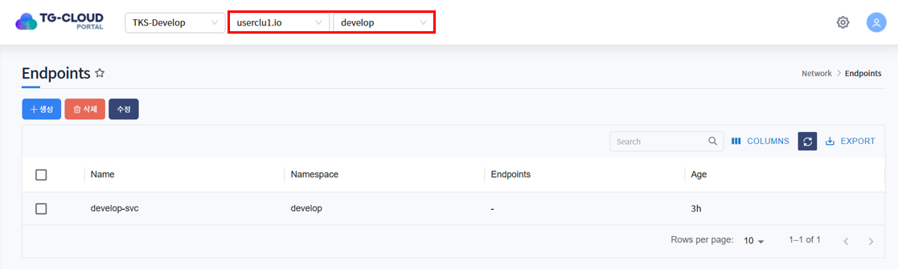

### 상세정보 조회
* 리스트에서 특정 Endpoint를 선택하면 하단 상세정보 탭에 Endpoint의 상세 정보가 조회됩니다.
* 선택된 Endpoint의 생성일시, 네임스페이스 등을 확인할 수 있습니다.

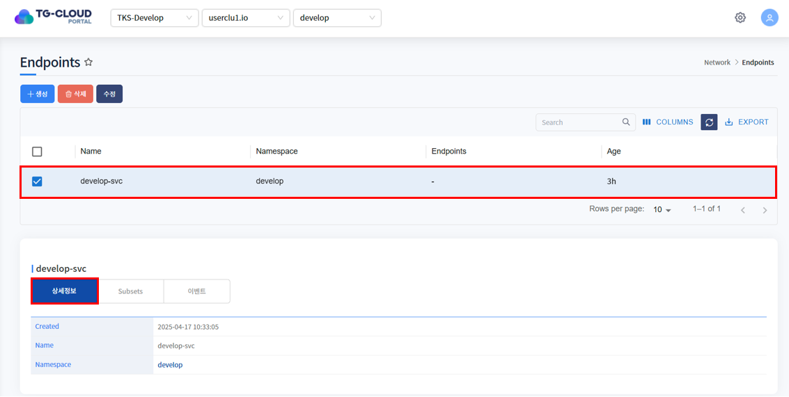

### Subsets 조회
* subsets는 Endpoints 리소스 내에서 연결 가능한 Pod들을 주소(IP)와 포트 조합으로 정리한 항목입니다. 
* 각각의 subset은 여러 Pod의 주소(addresses)와 그에 대응하는 포트(ports) 정보를 포함하며, 클러스터 내부에서 Service가 실제로 트래픽을 전달할 대상이 되는 엔드포인트들을 나타냅니다.

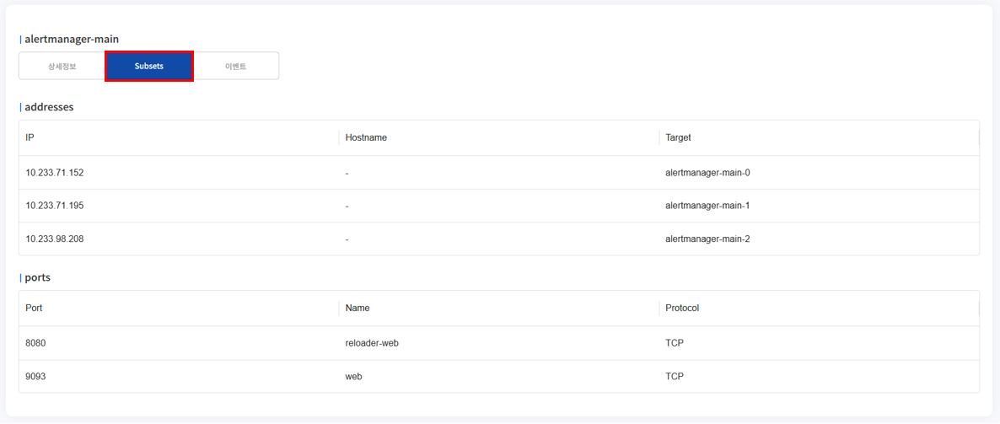

### 이벤트 조회
* Endpoint에 발생한 이벤트 정보가 조회됩니다. 발생한 이벤트가 없을 경우 목록에서 표시되지 않습니다.

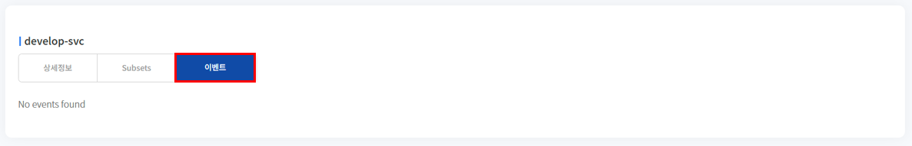


## 2. Endpoint 생성
1. 목록 위 '생성' 버튼을 클릭합니다.

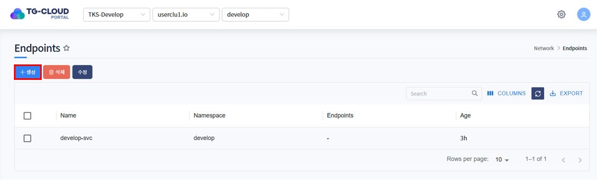

2. Endpoint를 생성하는 Yaml 템플릿이 노출됩니다.

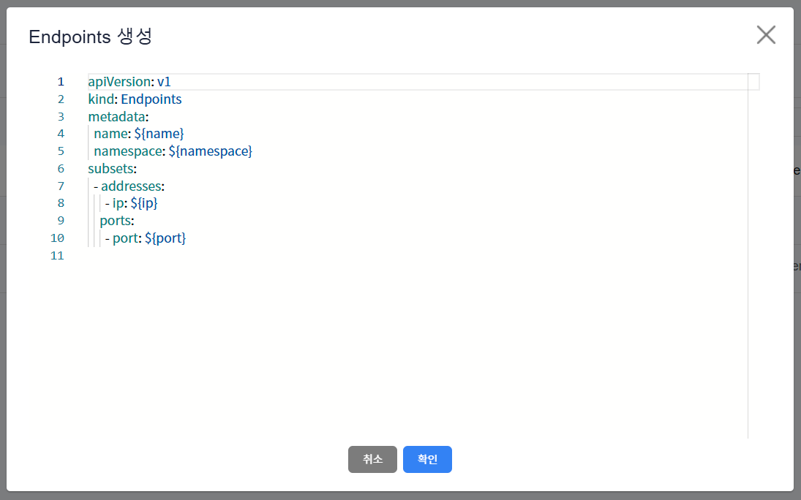

3. 템플릿 내 변수를 치환하여 생성하고자 하는 Endpoint Yaml을 작성하고 '확인' 버튼을 클릭합니다.

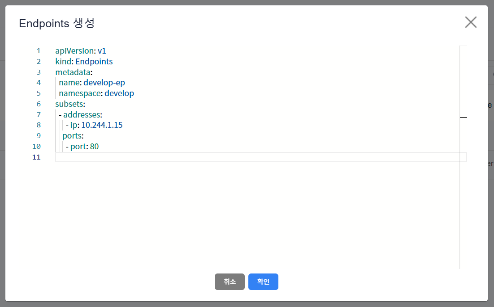

ex)
```yaml
apiVersion: v1
kind: Endpoints
metadata:
    name: develop-ep
    namespace: develop
subsets:
    - addresses:
        - ip: 10.244.1.15
      ports:
        - port: 80
```
metadata > namespace에 입력한 namespace에 Endpoints 생성됩니다.

* <strong>상단 헤더에 선택된 클러스터 내에 존재하는</strong> namespace 입력

4. Endpoint가 정상적으로 생성된 것을 확인합니다.

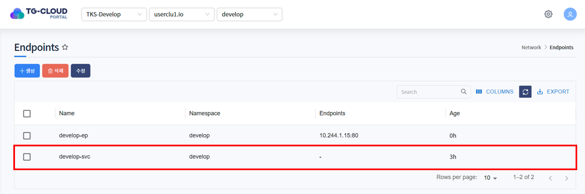

## 3. Endpoint 수정
1. 수정하고자 하는 Endpoint를 선택하고 목록 위 '수정' 버튼을 클릭합니다.

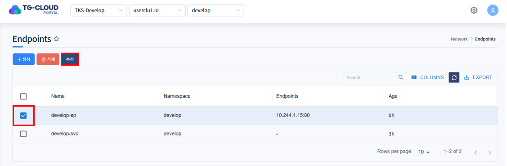

2. Endpoint가 Yaml 형태로 조회됩니다. 원하는 데이터로 Yaml을 수정한 후 '확인' 버튼을 클릭합니다.

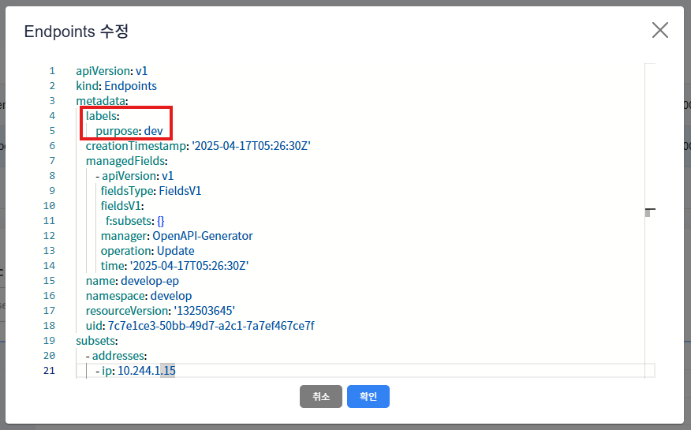

3. 하단의 상세정보 탭 또는 Subsets 탭에서 Endpoint가 수정된 것을 확인합니다.

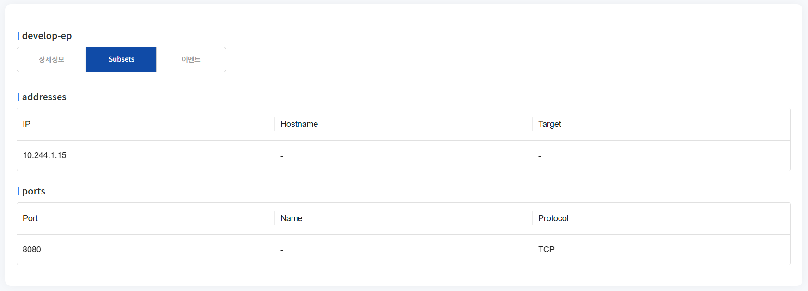

## 4. Endpoint 삭제
1. 삭제하고자 하는 Endpoint를 선택하고 목록 위 '삭제' 버튼을 클릭합니다.


2. 삭제를 확인하는 알림창이 노출되면 '확인' 버튼을 클릭합니다.

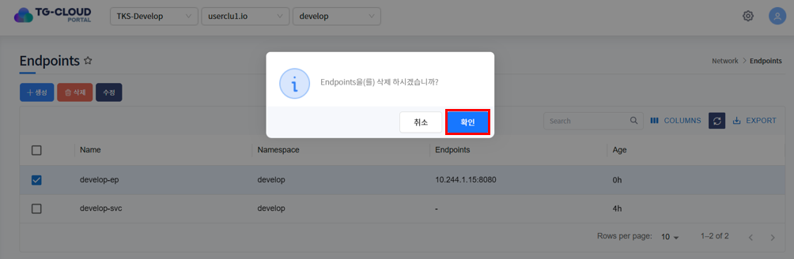

3. 목록에서 Endpoint가 삭제된 것을 확인합니다.

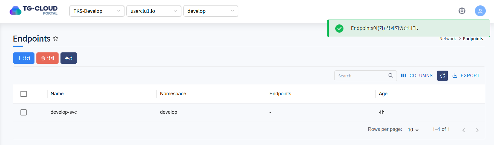