# NetworkPolicies

> NetworkPolicy는 네임스페이스 내 Pod들 사이의 인바운드 및 아웃바운드 트래픽을 제어할 수 있게 해주는 리소스입니다. 
>
> label selector를 기반으로 대상 그룹을 지정하며, 허용하고자 하는 트래픽의 방향, 포트, 프로토콜 등을 세밀하게 설정할 수 있습니다.

## 목차

1. [NetworkPolicy 조회](#1-networkpolicy-조회)
   * [리스트 조회](#리스트-조회)
   * [상세정보 조회](#상세정보-조회)
   * [Ingress 조회](#ingress-조회)
   * [Egress 조회](#egress-조회)
   * [이벤트 조회](#이벤트-조회)
2. [NetworkPolicy 생성](#2-networkpolicy-생성)
3. [NetworkPolicy 수정](#3-networkpolicy-수정)
4. [NetworkPolicy 삭제](#4-networkpolicy-삭제)

### 1. NetworkPolicy 조회
### 리스트 조회
* 메뉴 진입시 상위 선택된 클러스터/네임스페이스 내 NetworkPolicy 목록이 조회됩니다.
* NetworkPolicy가 속한 네임스페이스, Policy Types, Age 정보를 확인할 수 있습니다.

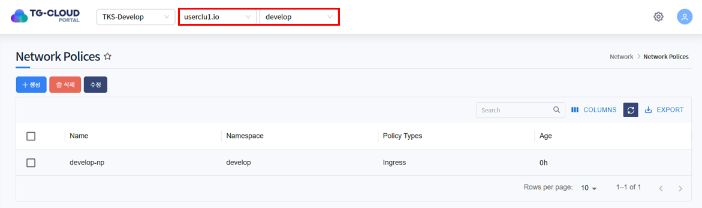

### 상세정보 조회
* 리스트에서 특정 NetworkPolicy를 선택하면 하단 상세정보 탭에 NetworkPolicy의 상세 정보가 조회됩니다.
* 선택된 NetworkPolicy의 생성일시, 네임스페이스, Pod Selector 등을 확인할 수 있습니다.

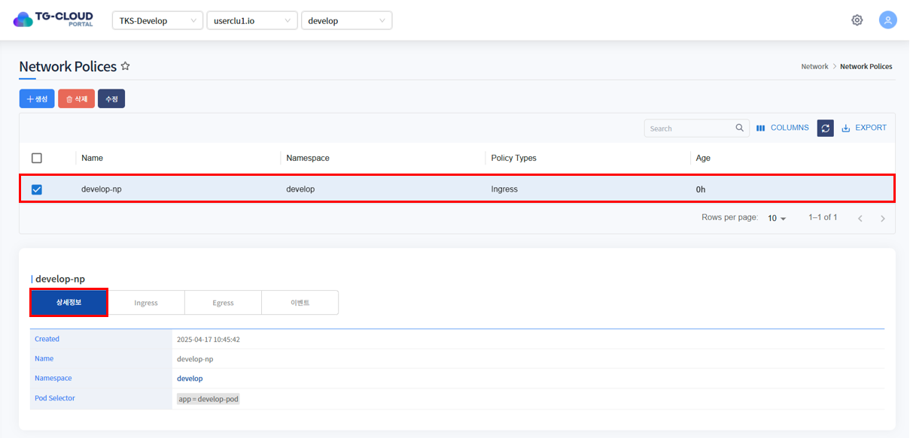

### Ingress 조회
* ingress는 외부에서 해당 Pod으로 들어오는 트래픽에 대한 허용 규칙을 정의하는 필드입니다. 
* 이 필드가 설정되면, 명시된 조건을 만족하는 트래픽만 해당 Pod으로 들어올 수 있습니다.

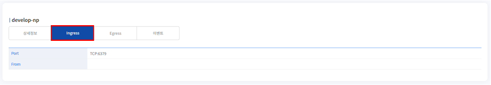

### Egress 조회
* egress는 Pod에서 외부로 나가는 트래픽을 제어하는 필드입니다. 
* 이 필드를 통해, 어떤 대상에게 트래픽을 보낼 수 있을지 정의할 수 있습니다.

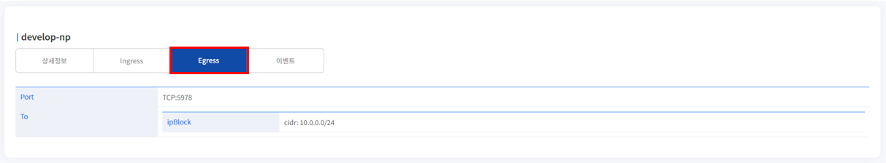

### 이벤트 조회
* NetworkPolicy에 발생한 이벤트 정보가 조회됩니다. 발생한 이벤트가 없을 경우 목록에서 표시되지 않습니다.

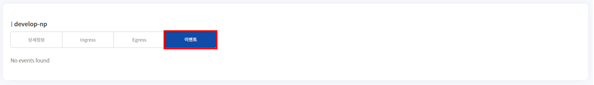


## 2. NetworkPolicy 생성
1. 목록 위 '생성' 버튼을 클릭합니다.

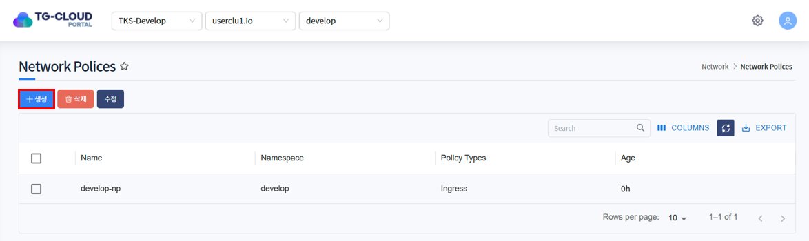

2. NetworkPolicy를 생성하는 Yaml 템플릿이 노출됩니다.

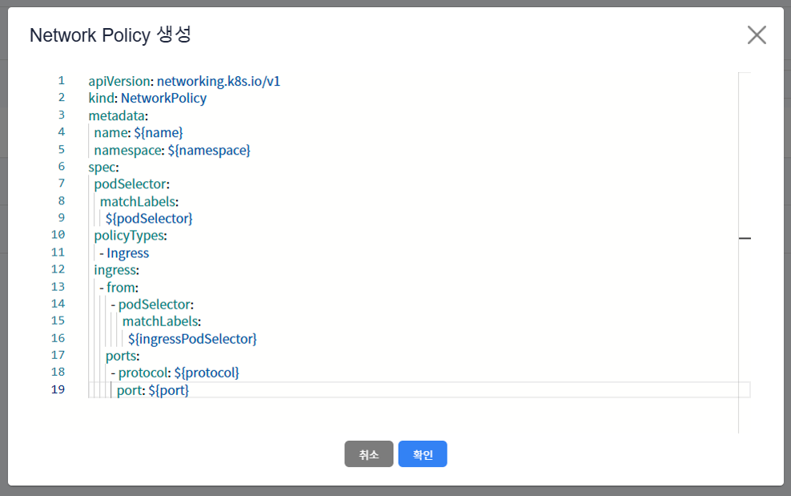

3. 템플릿 내 변수를 치환하여 생성하고자 하는 NetworkPolicy Yaml을 작성하고 '확인' 버튼을 클릭합니다.

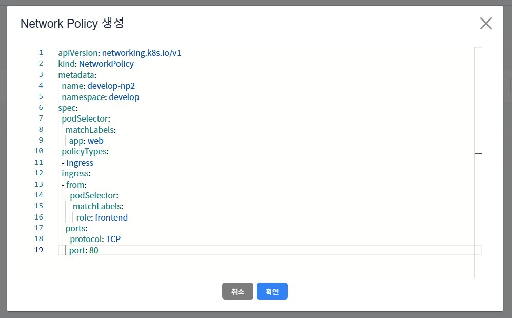

ex)
```yaml
apiVersion: networking.k8s.io/v1
kind: NetworkPolicy
metadata:
   name: develop-np2
   namespace: develop
spec:
   podSelector:
      matchLabels:
         app: web
   policyTypes:
      - Ingress
   ingress:
      - from:
           - podSelector:
                matchLabels:
                   role: frontend
        ports:
           - protocol: TCP
             port: 80
```
metadata > namespace에 입력한 namespace에 NetworkPolicy 생성됩니다.

* <strong>상단 헤더에 선택된 클러스터 내에 존재하는</strong> namespace 입력

4. NetworkPolicy가 정상적으로 생성된 것을 확인합니다.

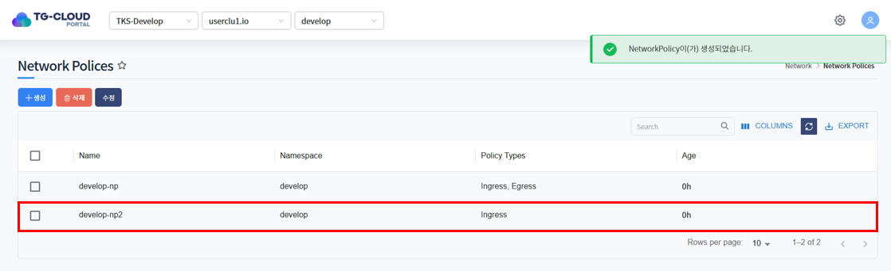

## 3. NetworkPolicy 수정
1. 수정하고자 하는 NetworkPolicy를 선택하고 목록 위 '수정' 버튼을 클릭합니다.

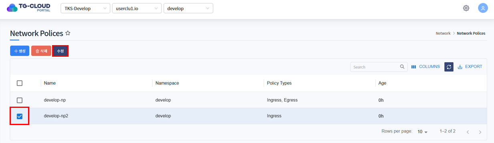

2. NetworkPolicy가 Yaml 형태로 조회됩니다. 원하는 데이터로 Yaml을 수정한 후 '확인' 버튼을 클릭합니다.

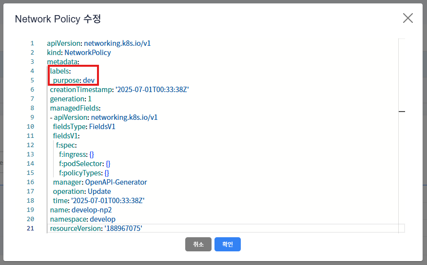

3. 하단의 상세정보 탭 또는 Ingress/Egress 탭에서 NetworkPolicy가 수정된 것을 확인합니다.

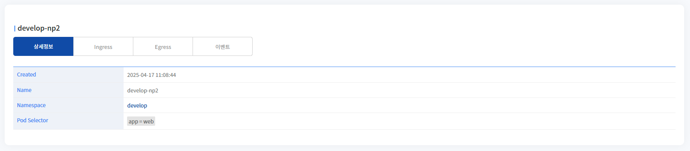

## 4. NetworkPolicy 삭제
1. 삭제하고자 하는 NetworkPolicy를 선택하고 목록 위 '삭제' 버튼을 클릭합니다.

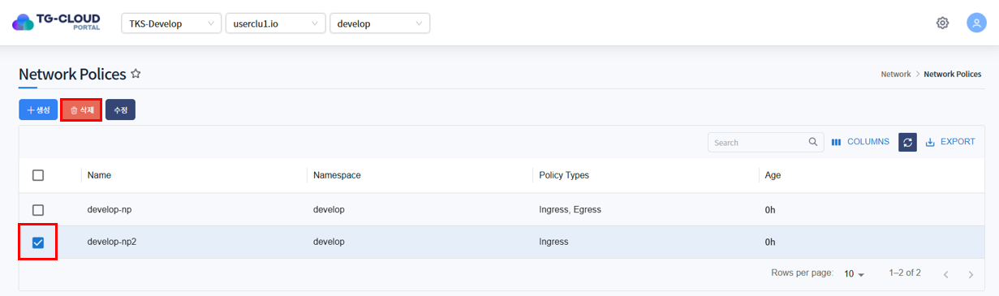

2. 삭제를 확인하는 알림창이 노출되면 '확인' 버튼을 클릭합니다.

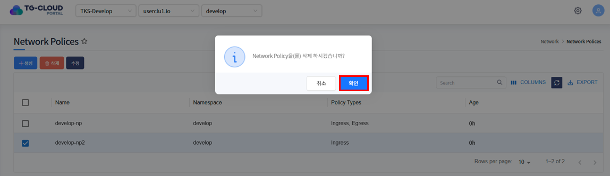

3. 목록에서 NetworkPolicy가 삭제된 것을 확인합니다.

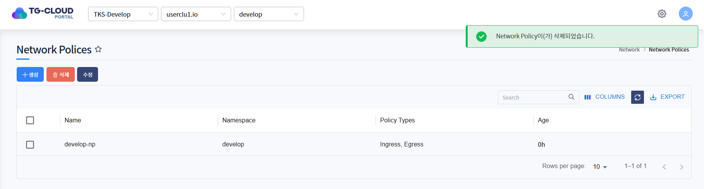