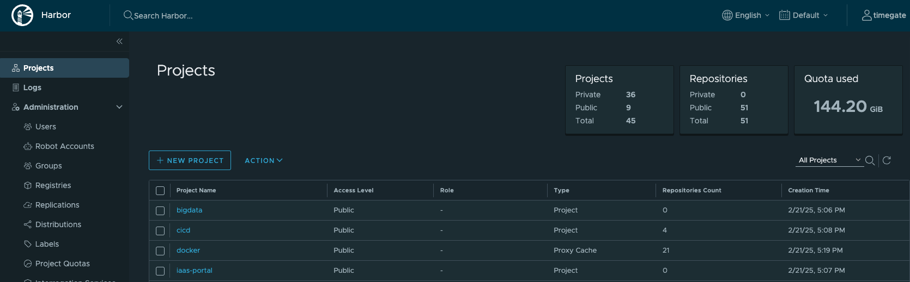
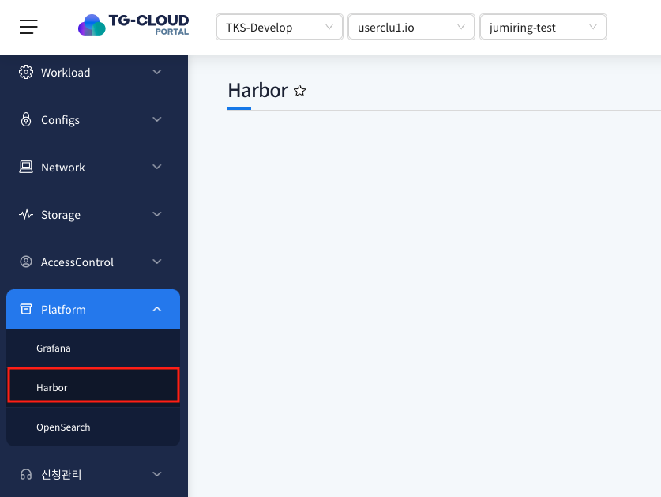
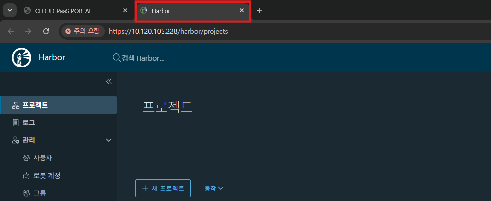
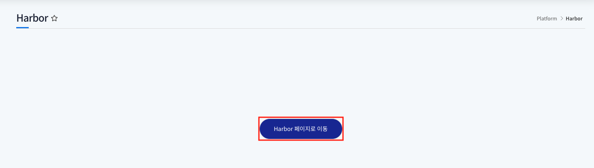

# Harbor

> 포탈에서 배포한 이미지를 저장하고 관리하고 로그인 정보를 연동해 사용할 수 있는 메뉴입니다.

## 목차

1. [Harbor 메뉴 이동](#1-harbor-메뉴-이동)
2. [Harbor 화면 이동](#2-harbor-화면-이동)

## 1. Harbor 메뉴 이동

1. 좌측 메뉴 `Harbor` 클릭

   
   
   Platform 메뉴 하위의 Harbor를 클릭하면 해당 메뉴를 확인 할 수 있습니다.

## 2. Harbor 화면 이동

1. 메뉴 클릭 시 Harbor 포탈이 새창으로 띄워집니다.

   
   

2. Harbor 포탈을 새로 열고 싶다면 `Harbor 페이지로 이동` 버튼 클릭

   
   
