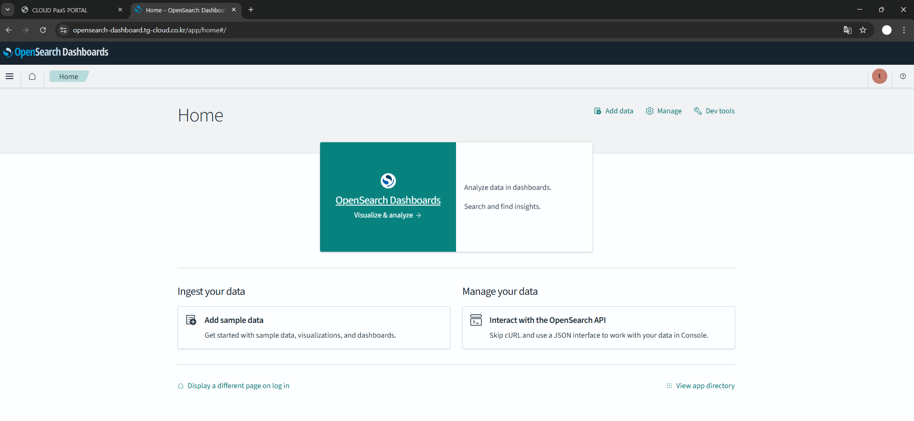

# OpenSearch

> 포탈에서 사용되는 K8s나 정책 등 데이터의 로그, 메트릭, 트레이스 정보를 확인할 수 있는 메뉴입니다.
> OpenSearch를 이용해 자원의 이슈와 이벤트를 확인 할 수 있습니다.
> 관리자 권한이 있는 사용자만 이용 가능합니다.

## 목차

1. [OpenSearch 메뉴 이동](#1-opensearch-메뉴-이동)
2. [OpenSearch 화면 이동](#2-opensearch-화면-이동)
3. [OpenSearch 로그인](#3-opensearch-로그인)

## 1. OpenSearch 메뉴 이동

1. 좌측 메뉴 `OpenSearch` 클릭

   
   
   Platform 메뉴 하위의 OpenSearch를 클릭하면 해당 메뉴를 확인 할 수 있습니다.
   

## 2. OpenSearch 화면 이동

1. 메뉴 클릭 시 OpenSearch 포탈이 새창으로 띄워집니다.

   
   
2. OpenSearch 포탈을 새로 열고 싶다면 `OpenSearch 페이지로 이동` 버튼 클릭

   
   
## 3. OpenSearch 로그인
   포탈에는 로그인 되어있지만 opensearch에 로그인 되어있지 않다면 로그인 화면이 나옵니다.

   1. `Log in with single sign-on` 버튼 클릭

   

   2. portal 로그인과 동일한 계정으로 로그인합니다.

   

   3. 사전에 설정된 대시보드 화면으로 진입하기 위해 `Explore on my own` 버튼을 클릭

   
   
   4. 이어서 나오는 안내창은 `dismiss` 클릭
   
   

   5.  OpenSearch Dashboards에 최초 로그인 시, 데이터를 저장하거나 시각화 작업을 수행할 테넌트(Tenant) 를 선택해야 합니다. (테넌트는 사용자 간의 데이터 접근 범위를 제어하기 위한 논리적 공간입니다.) 
   `global` 선택 후 `Confirm` 버튼 클릭

   - global은 모든 사용자와 공유되는 공용 테넌트 입니다.
   - Private은 오직 현재 로그인한 사용자에게만 보이는 개인용 테넌트입니다.

   

   6. tenant 설정 후 home 화면이 나옵니다.

   