# Project

> 사용자에게 할당된 Project와 하위의 Namespace, 사용자 정보를 확인 할 수 있는 메뉴입니다.  
> 새로운 Project를 생성 및 삭제 할 수 있고 Project 관리자 설정, 사용자를 추가 및 삭제 할 수 있습니다.

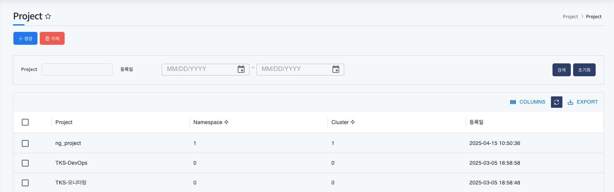

## 목차

1. [Project 메뉴 확인](#1-project-메뉴-확인)
2. [Project 리스트](#2-project-리스트)
3. [Project 리스트 검색](#3-project-리스트-검색)
4. [Project 생성](#4-project-생성)
5. [Project 삭제](#5-project-삭제)
6. [Project 상세정보](#6-project-상세정보)
7. [Project 관리자 변경](#7-project-관리자-변경)
8. [Project 내 Namespace 리스트](#8-project-내-namespace-리스트)
9. [Namespace 생성](#9-namespace-생성)
10. [Namespace 삭제](#10-namespace-삭제)
11. [Project 내 사용자 리스트](#11-project-내-사용자-리스트)
12. [사용자 추가](#12-사용자-추가)
13. [사용자 삭제](#13-사용자-삭제)

## 1. Project 메뉴 확인

1. 좌측 메뉴 `Project` 메뉴 클릭

   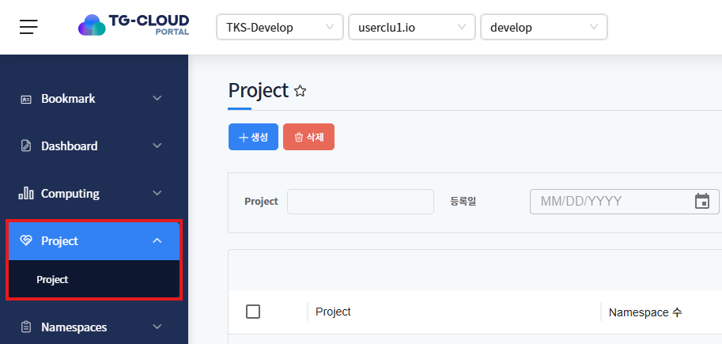

   좌측 메뉴 `Project` 메뉴 클릭 후 사용자에게 할당된 Project 리스트를 확인 할 수 있습니다.

## 2. Project 리스트

1. 할당된 Project 리스트 확인

   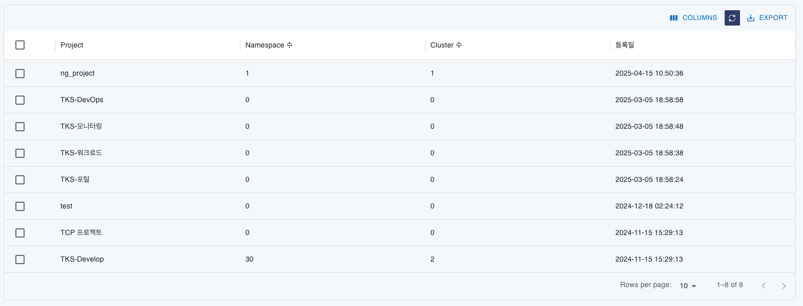

   - Project: 할당된 Project 명
   - Namespace 수: Project에 존재하는 Namespace 개수
   - Cluster 수: Project에 존재하는 Cluster 개수
   - 등록일: Project를 생성한 일자

## 3. Project 리스트 검색

1. Project 상단의 검색창에서 project 명과 등록일을 검색 및 선택 후 우측 `검색` 버튼 클릭

   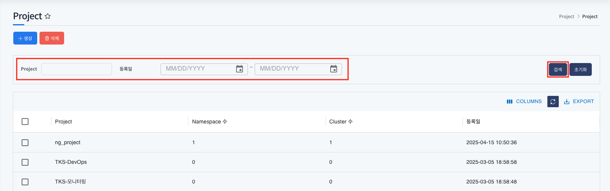

   - Project: Project 명
   - 등록일: Project를 생성한 일자

1. `초기화` 버튼을 클릭해 검색한 리스트를 초기화하고 전체 리스트를 호출

   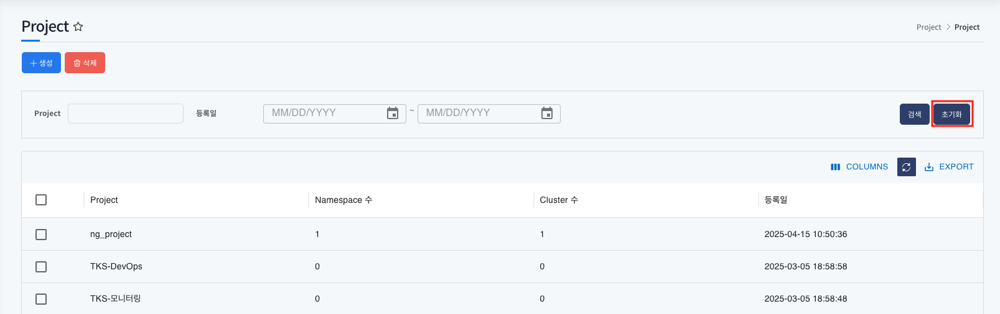

   전체 Project 리스트를 다시 확인 할 수 있습니다.

## 4. Project 생성

1. 좌측 상단의 `생성` 버튼 클릭

   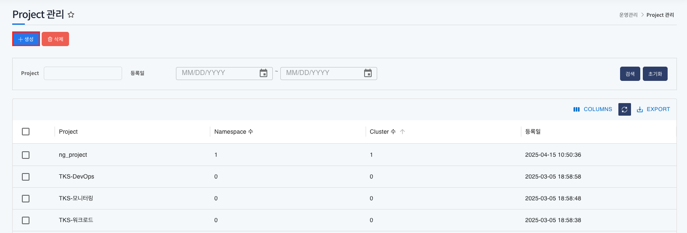

2. 생성 팝업에서 Project 명을 입력 후 `생성` 버튼 클릭

   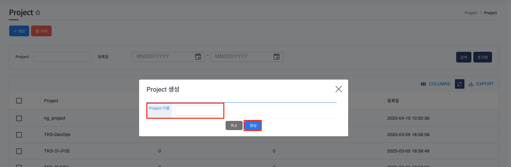

## 5. Project 삭제

1. 삭제할 Project를 선택

   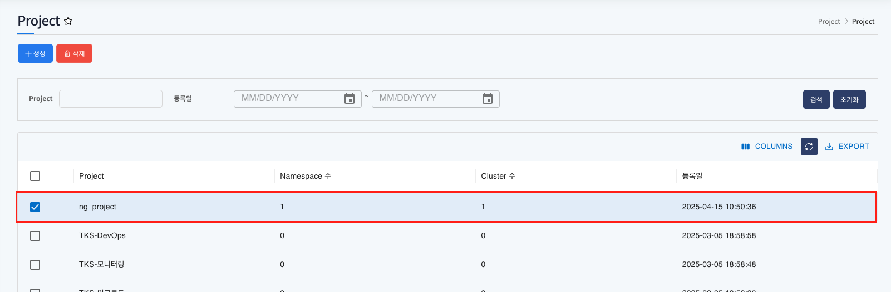

   여러 Project를 한번에 삭제 할 수 있습니다.
   삭제 버튼은 관리자인 경우에만 노출되고 삭제 기능을 동작할 수 있습니다.

2. 좌측 상단의 `삭제` 버튼 클릭

   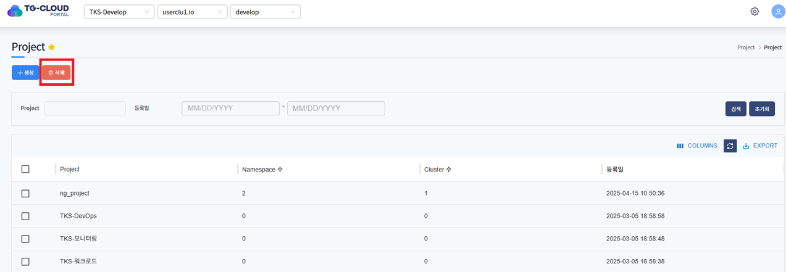

3. 삭제 확인 팝업에서 `확인` 버튼 클릭

   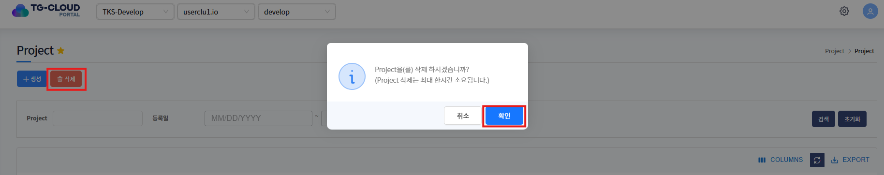

   Project 삭제 시 최대 한시간이 소요될 수 있습니다.

## 6. Project 상세정보

1. 상세정보를 확인 할 Project를 선택

   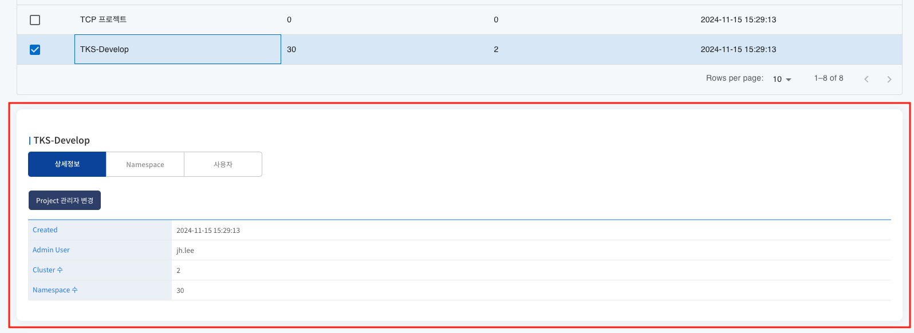

## 7. Project 관리자 변경

   > Project 관리자 변경은 운영자 / project 관리자만 변경할 수 있습니다.

1. 대표관리자를 변경할 Project 선택

   

2. 상세정보 상단의 `Project 관리자 변경` 버튼 클릭

   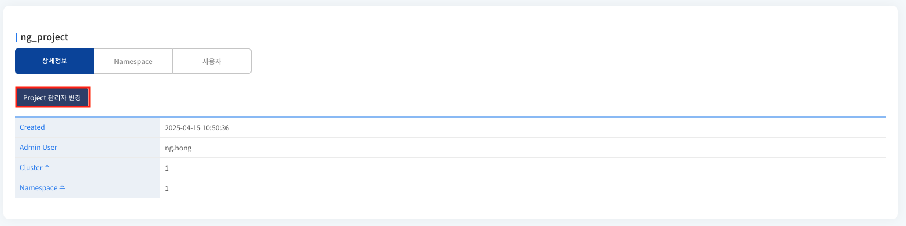

3. 팝업에서 변경할 사용자를 검색 후 선택

   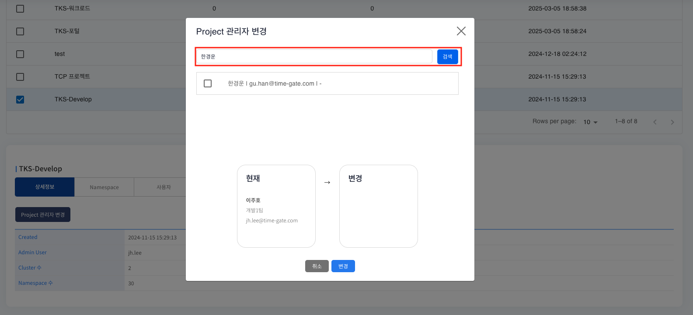

   사용자 리스트에서 직접 찾아 선택 후 변경 할 수 있습니다.

4. 변경할 사용자를 확인 후 `변경` 버튼 클릭

   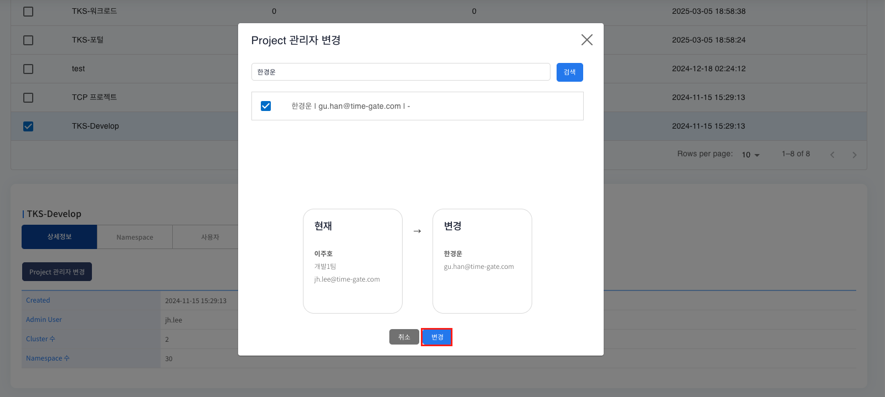

## 8. Project 내 Namespace 리스트

1. 선택한 Project에 생성한 Namespace 리스트 확인

   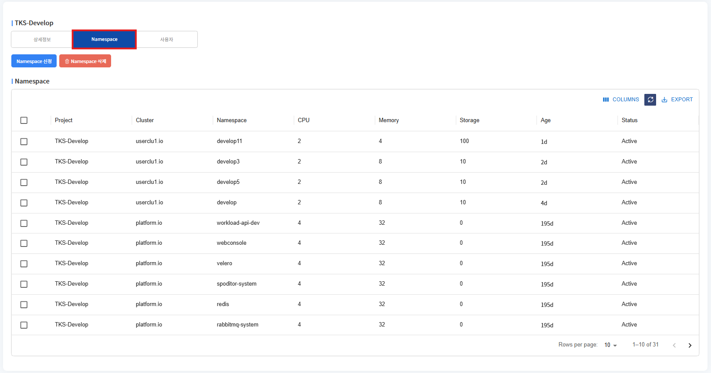

   - Project: 생성한 Namespace가 속한 Project
   - Cluster: 생성한 Namespace가 속한 Cluster
   - Namespace: 생성한 Namespace
   - CPU: 생성한 Namespace의 CPU
   - Memory: 생성한 Namespace의 Memory
   - Storage: 생성한 Namespace의 Storage
   - Age: 생성 후 현재까지 지난 시간
   - Status: 생성한 Namespace의 상태

## 9. Namespace 생성

1. Namespace 상단에 `Namespace 신청` 버튼 클릭

   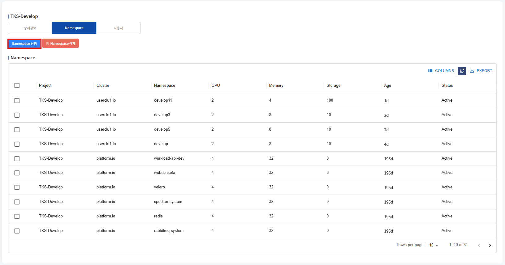

2. 신청 페이지로 이동 안내 팝업의 `확인` 버튼 클릭 후 페이지 이동

   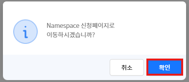

## 10. Namespace 삭제

1. Namespace 상단에 `Namespace 삭제` 버튼 클릭

   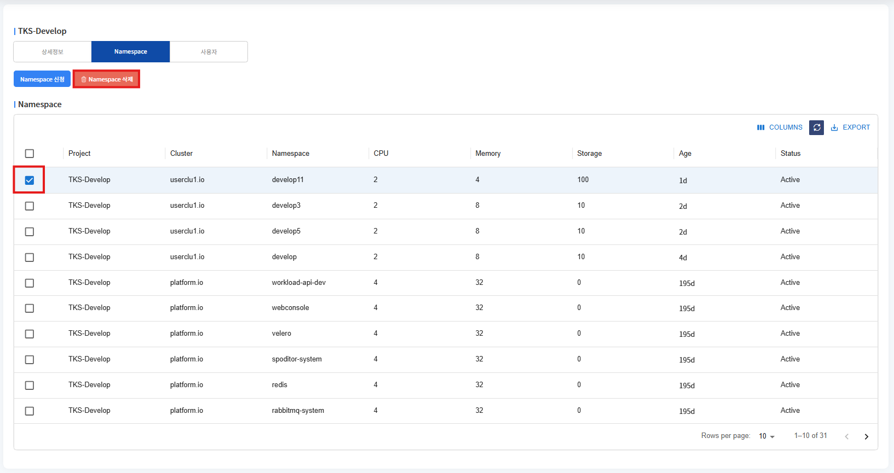

2. 삭제 확인 안내 팝업의 `확인` 버튼 클릭

   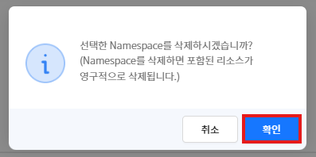

   Namespace 삭제는 해당 Namespace 내의 자원과 권한 등 모든 정보를 삭제합니다.

   '확인' 버튼을 클릭하면 삭제가 진행됩니다.

   Namespace 삭제에는 최대 1시간 소요될 수 있습니다.

## 11. Project 내 사용자 리스트

1. 선택한 Project에 추가한 사용자 리스트 확인

   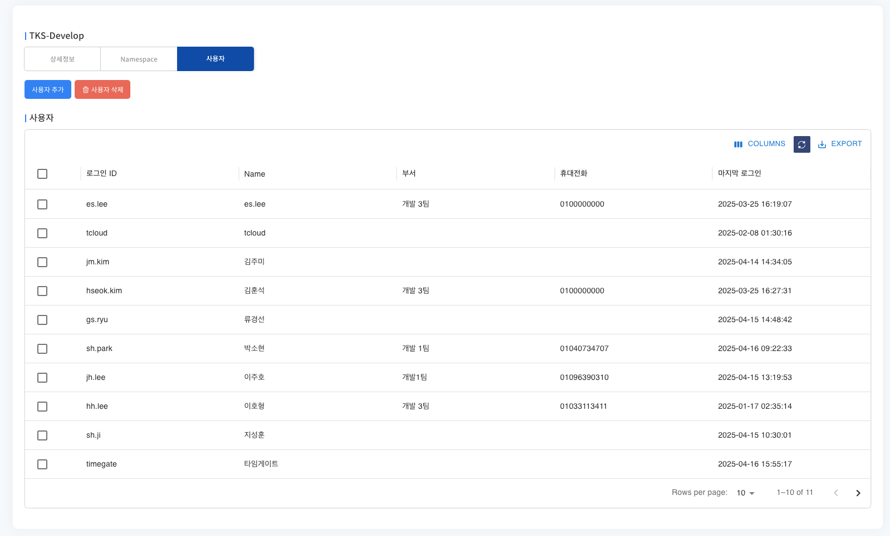

   - 로그인 ID: 사용자 로그인 ID
   - Name: 사용자명
   - 부서: 사용자 부서
   - 휴대전화: 사용자 휴대전화
   - 마지막 로그인: 사용자의 최근 로그인 일시

## 12. 사용자 추가

   > 사용자 추가는 운영자 / project 관리자만 추가할 수 있습니다.

1. 사용자 상단의 `사용자 추가` 버튼 클릭

   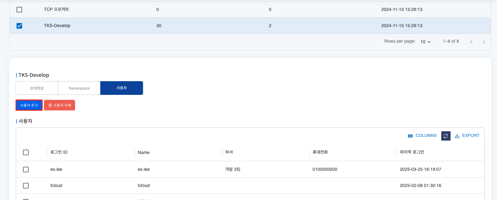

2. 추가할 사용자를 검색 후 선택

   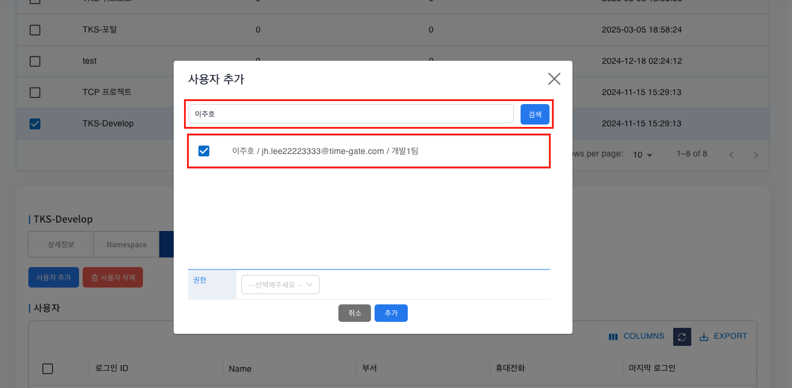

   추가할 사용자를 리스트에서 직접 찾아서 선택할 수 있으며, 여러 사용자를 선택할 수 있습니다.

3. 선택한 사용자에게 할당할 권한 선택

   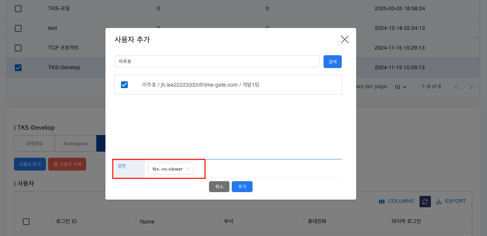

   선택한 사용자가 적용될 권한을 선택합니다.

4. 사용자 선택 후 권한 적용까지 마쳤으면 하단 `추가` 버튼 클릭

   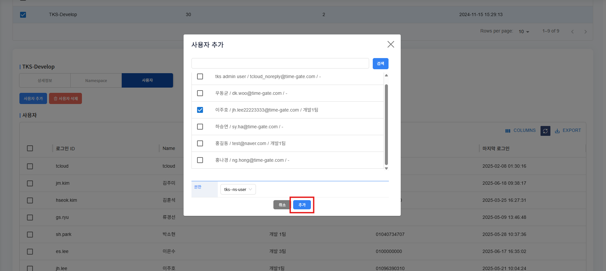

## 13. 사용자 삭제

   > 사용자 삭제는 운영자 / project 관리자만 삭제할 수 있습니다.

1. 삭제할 사용자를 선택

   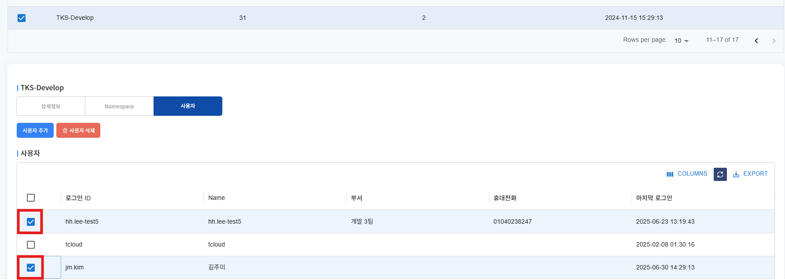

   사용자 삭제는 checkbox를 사용해 여러명을 한번에 삭제 할 수 있습니다.

2. 사용자 상단의 `사용자 삭제` 버튼 클릭

   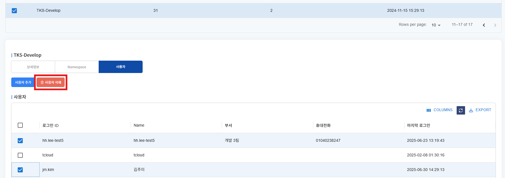

3. 사용자 삭제 확인 팝업에서 `확인` 버튼 클릭

   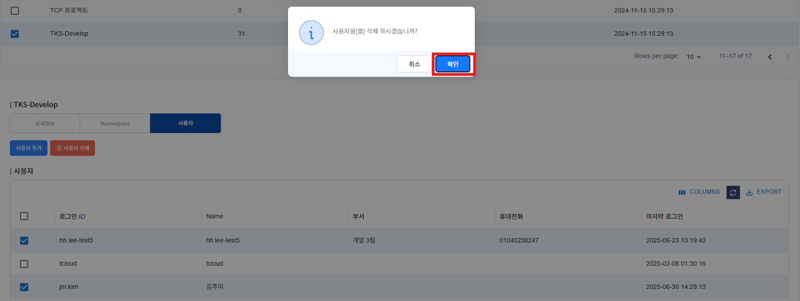
