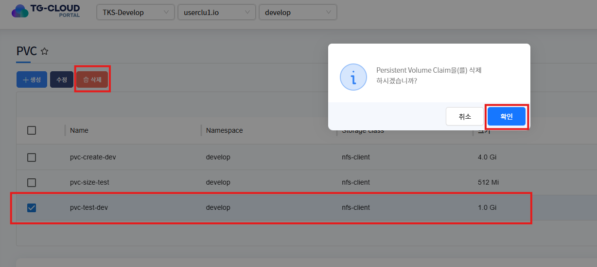

# PVC (Persistent Volume Claim)

> 사용자가 영구적인 스토리지를 요청하는 방법입니다.
>
> 특정 용량, 접근방식(읽기/쓰기 권한 등)을 갖는 영구적인 스토리지를 요청하는 오브젝트입니다.

---

## **목차**
1. [PVC 조회](#1-pvc-조회)
    * [1.1. 리스트 조회](#11-리스트-조회)
    * [1.2. 상세정보 조회](#12-상세정보-조회)
    * [1.3. Metric 정보 조회 (Pvc size metric 정보 조회)](#13-metric-정보-조회)
    * [1.4. Selector 정보 조회](#14-selector-정보-조회)
    * [1.5. PVC 내 발생한 이벤트 정보 조회](#15-pvc-내-발생한-이벤트-정보-조회)
2. [PVC 생성](#2-pvc-생성)
3. [PVC 수정](#3-pvc-수정)
4. [PVC 삭제](#4-pvc-삭제)

---

## 1. PVC 조회
### 1.1. 리스트 조회
* 화면 진입시 상위 선택된 클러스터/네임스페이스 하위 내 PVC 목록이 조회됩니다.


### 1.2. 상세정보 조회
* 리스트에서 특정 PVC를 선택하면 하단 상세정보 탭에 PVC의 상세 정보가 조회됩니다.
* 주요 정보로는 storageSize(용량), accessModes(영구 볼륨 접근 방식) 가 있습니다.


### 1.3. Metric 정보 조회
* 리스트에서 특정 PVC를 선택하면 하단 Metric 정보 탭에 5분단위 시간별 PVC Size 정보가 조회됩니다.


### 1.4. Selector 정보 조회
* 리스트에서 특정 PVC를 선택하면 하단 Selector 정보가 조회됩니다.
* Selector 정보는 PVC 생성시 특정 레이블(label)을 가진 기존의 PV에 해당 PVC를 지정하는 데 사용되는 필드입니다.
* label 지정 없이 생성하면 해당 항목에는 표시되지 않습니다.


### 1.5. PVC 내 발생한 이벤트 정보 조회
* 리스트에서 선택된 PVC에 발생한 이벤트 정보가 조회됩니다. 발생한 이벤트가 없을 경우 목록에서 표시되지 않습니다.


--- 

## 2. PVC 생성
* 상단 **[생성]** 버튼을 클릭하게 되면 PVC 생성에 필요한 yaml 템플릿 정보가 조회됩니다.


* 변수 치환 부분을 생성에 맞는 정보로 변경하여 확인 버튼을 클릭하게 되면 PVC가 정상적으로 생성됩니다.


* 템플릿 중 입력한 namespace에 해당 PVC 생성됩니다.
  
metadata > namespace에 입력한 namespace에 PersistentVolumeClaim 생성됩니다.
* <strong>상단 헤더에 선택된 클러스터 내에 존재하는</strong> namespace 입력

```yaml
apiVersion: v1
kind: PersistentVolumeClaim
metadata:
   name: pvc-test-dev
   namespace: develop
spec:
   accessModes:
      - ReadWriteOnce
   storageClassName: nfs-client
   resources:
      requests:
         storage: 0.5Gi
```


* 위 생성 템플릿에 입력한 develop namespace에 해당 PVC 생성된 화면입니다.

---

## 3. PVC 수정
* 수정할 PVC 선택 후 상단 **[수정]** 버튼을 클릭하게 되면 PVC 의 metadata yaml 정보가 조회됩니다.
* 수정할 항목을 변경 (storage 용량을 0.5Gi > 1Gi 로 변경 - 용량을 줄이는것은 불가능하며 늘리는 것만 가능합니다. 후 확인 버튼을 클릭하면 PVC 메타 정보가 변경됩니다.


```yaml
apiVersion: v1
kind: PersistentVolumeClaim
metadata:
  annotations:
    pv.kubernetes.io/bind-completed: 'yes'
    pv.kubernetes.io/bound-by-controller: 'yes'
    volume.beta.kubernetes.io/storage-provisioner: cluster.local/nfs-subdir-external-provisioner
    volume.kubernetes.io/storage-provisioner: cluster.local/nfs-subdir-external-provisioner
  creationTimestamp: '2025-06-26T08:04:50Z'
  finalizers:
  - kubernetes.io/pvc-protection
  managedFields:
  - apiVersion: v1
    fieldsType: FieldsV1
    fieldsV1:
      f:spec:
        f:accessModes: {}
        f:resources:
          f:requests:
            .: {}
            f:storage: {}
        f:storageClassName: {}
        f:volumeMode: {}
    manager: OpenAPI-Generator
    operation: Update
    time: '2025-06-26T08:04:50Z'
  - apiVersion: v1
    fieldsType: FieldsV1
    fieldsV1:
      f:metadata:
        f:annotations:
          .: {}
          f:pv.kubernetes.io/bind-completed: {}
          f:pv.kubernetes.io/bound-by-controller: {}
          f:volume.beta.kubernetes.io/storage-provisioner: {}
          f:volume.kubernetes.io/storage-provisioner: {}
      f:spec:
        f:volumeName: {}
    manager: kube-controller-manager
    operation: Update
    time: '2025-06-26T08:04:50Z'
  - apiVersion: v1
    fieldsType: FieldsV1
    fieldsV1:
      f:status:
        f:accessModes: {}
        f:capacity:
          .: {}
          f:storage: {}
        f:phase: {}
    manager: kube-controller-manager
    operation: Update
    subresource: status
    time: '2025-06-26T08:04:50Z'
  name: pvc-test-dev
  namespace: develop
  resourceVersion: '183649343'
  uid: e705181b-8aa0-449e-b36c-35b6315c4855
spec:
  accessModes:
  - ReadWriteOnce
  resources:
    requests:
      storage: 1Gi
  storageClassName: nfs-client
  volumeMode: Filesystem
  volumeName: pvc-e705181b-8aa0-449e-b36c-35b6315c4855
status:
  accessModes:
  - ReadWriteOnce
  capacity:
    storage: 512Mi
  phase: Bound

```
* 변경 후 PVC를 선택하여 상세 정보 내에서 변경된 정보를 확인할 수 있습니다.


---

## 4. PVC 삭제
* 삭제할 PVC를 선택 후 상단 **[삭제]** 버튼을 클릭하게 되면 PVC가 삭제됩니다.
* 삭제 후 리스트에서 PVC가 제거된것을 확인할 수 있습니다.




