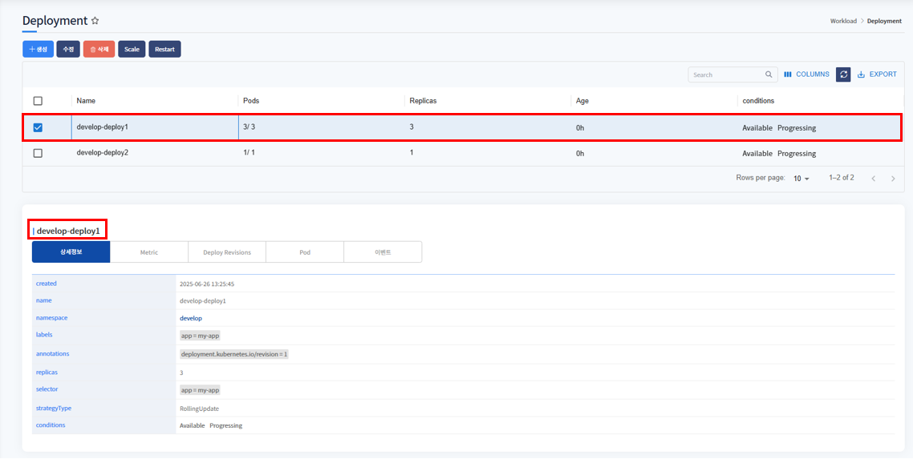

# Deployment

> Deployment는 네임스페이스에 서비스를 deploy하는 메뉴입니다. 
> 
> deployment 목록을 확인할 수 있고 생성, 삭제, 수정 또는 deployment scale 변경, 재시작할 수 있습니다.

---
## **목차**
1. [Deployment 조회](#deployment-조회)
   - [1.1. Deployment 화면](#deployment-화면)
   - [1.2. Deployment 상세정보](#deployment-상세정보)
   - [1.3. Deployment 상세정보-Namespace](#deployment-상세정보-namespace)
   - [1.4. Deployment Metric](#deployment-metric)
   - [1.5. Deployment Revisions](#deployment-revisions)
   - [1.6. Pod](#pod)
   - [1.7. 이벤트](#이벤트)
2. [Deployment 생성](#생성)
3. [Deployment 삭제](#삭제)
4. [Deployment 수정](#수정)
5. [Deployment scale](#scale)
6. [Deployment restart](#restart)

## Deployment 조회

---
### Deployment 화면


메뉴 진입시 상위 선택된 클러스터/네임스페이스 내 deployment 목록이 조회됩니다.

Namespace에 서비스 중인 deployment 목록을 표시합니다.
* pods, replicas 등 확인할 수 있습니다.


---
### Deployment 상세정보



deployment 상세정보를 표시합니다.

name, namespace, labels, annotations 등을 확인할 수 있습니다.

<br/>

---
### Deployment 상세정보-Namespace


상세정보에서 namespace를 클릭하면 deploy된 namespace 정보를 오른쪽 화면에 표시합니다.

---
### Deployment Metric
* CPU

  

  * pod의 CPU 차트를 표시합니다.


* Memory

  

  * pod의 Memory 차트를 표시합니다.


* Disk

  

  * pod의 Disk 차트를 표시합니다.
    * total write, read 두개의 차트를 표시합니다.


* Network

  

  * pod의 Network 차트를 표시합니다.
    * network in, out 두개의 차트를 표시합니다.

---
### Deployment Revisions


Deploy Revision 목록을 표시합니다.

Revisions는 deployment의 버전을 관리 역할을 합니다.

이전 버전으로 롤백하기 위해 필요한 목록입니다.

---


* 수정 : 목록을 선택하여 수정버튼 클릭 시 수정할 yaml 데이터가 포함된 팝업 호출됩니다.
    * 내용 수정 후 확인 버튼 클릭하면 수정됩니다.

---


* 삭제 : 목록을 선택하여 해당 revision 삭제할 수 있습니다.

---


* scale : 목록을 선택하여 해당 revision의 scale을 수정할 수 있습니다.

---
### Pod


Deployment로 생성된 pod 목록을 표시합니다. <br/>
Name, Node, Status 등을 확인할 수 있습니다.

---
### 이벤트


deployment 내에 발생한 이벤트 내용을 표시합니다.

---
## 생성


생성 버튼 클릭 시, deployment 생성 template이 포함된 팝업 호출됩니다. <br/>
${} 로 표기된 곳에 사용자가 입력 후(필요시 추가 데이터 입력), 확인 버튼 클릭하면 deployment가 생성됩니다.


${} 표기 입력 후 예제화면입니다.

metadata > namespace에 입력한 namespace에 deployment 생성됩니다.
* <strong>상단 헤더에 선택된 클러스터 내에 존재하는</strong> namespace 입력

ex)
```yaml
apiVersion: apps/v1
kind: Deployment
metadata:
  name: develop-deploy1
  namespace: develop
  labels:
    app: my-app
spec:
  replicas: 3
  selector:
    matchLabels:
      app: my-app
  template:
    metadata:
      labels:
        app: my-app
    spec:
      containers:
        - name: develop
          image: 10.120.105.228/docker/library/nginx
          ports:
            - containerPort: 80
          resources:
            requests:
              cpu: "250m"
              memory: "128Mi"
              ephemeral-storage: "512Mi"
            limits:
              cpu: "250m"
              memory: "128Mi"
              ephemeral-storage: "512Mi"


```

---
## 수정


수정하고자하는 deployment 선택 후, 수정 버튼 클릭하면 해당 deployment의 yaml 데이터를 팝업으로 호출합니다. <br/>
수정하고자하는 값을 수정 후, 확인 버튼 클릭하면 수정됩니다.

---
## 삭제


삭제하고자하는 deployment 선택 후, 삭제 버튼 클릭하면 해당 deployment는 삭제됩니다.


---
## scale


scale 변경하고자하는 deployment 선택 후, scale 버튼 클릭하면 scale 수정 팝업 호출합니다. <br/>
scale 변경 후, 생성 버튼 클릭하면 scale 변경됩니다.

---
## Restart


재시작 할 deployment 선택 후, Restart 버튼 클릭하면 해당 deployment가 재시작됩니다.