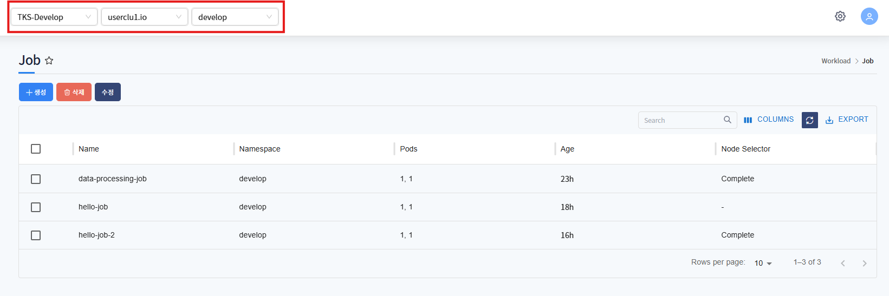
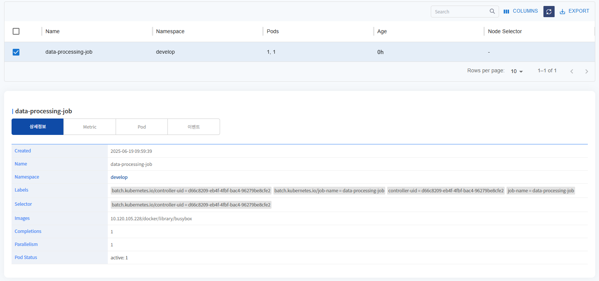
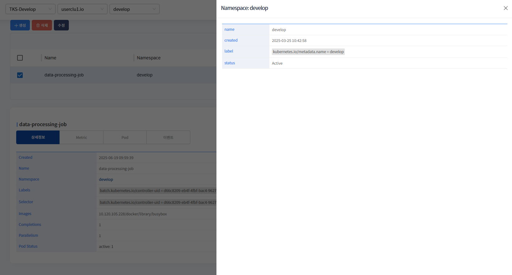
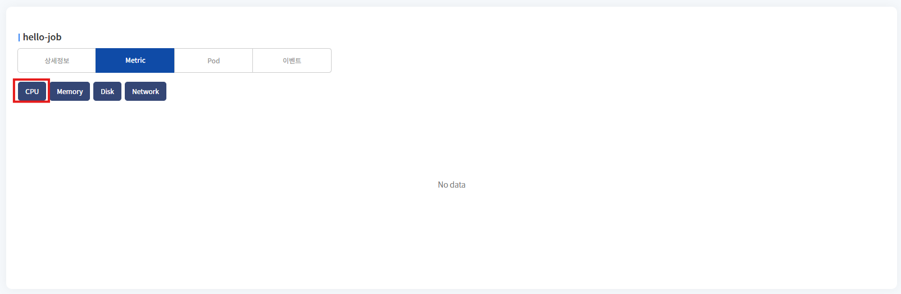
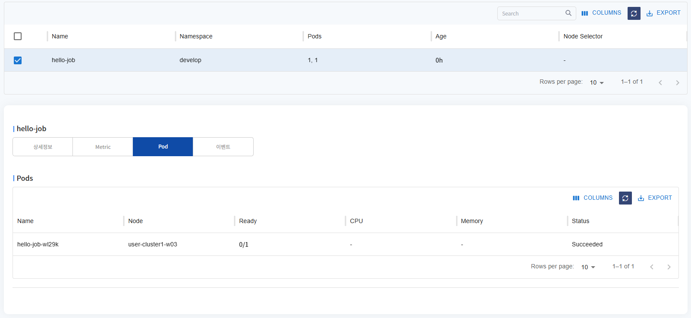
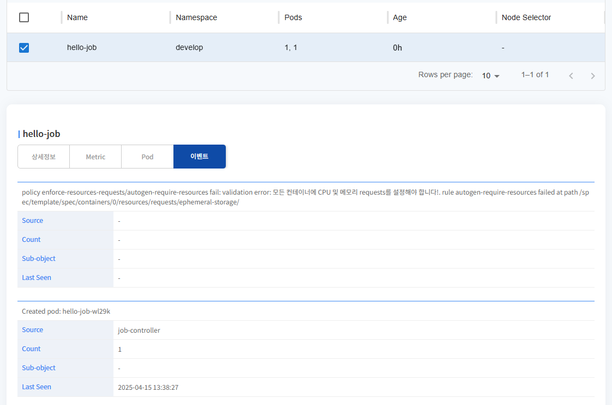
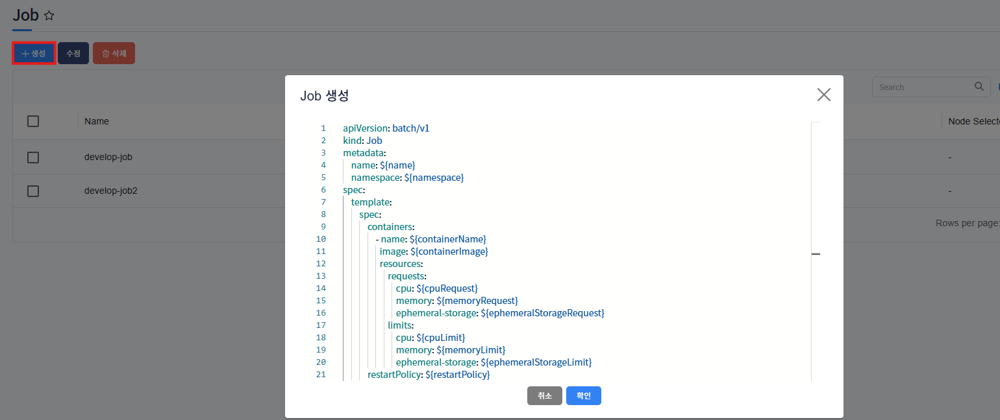
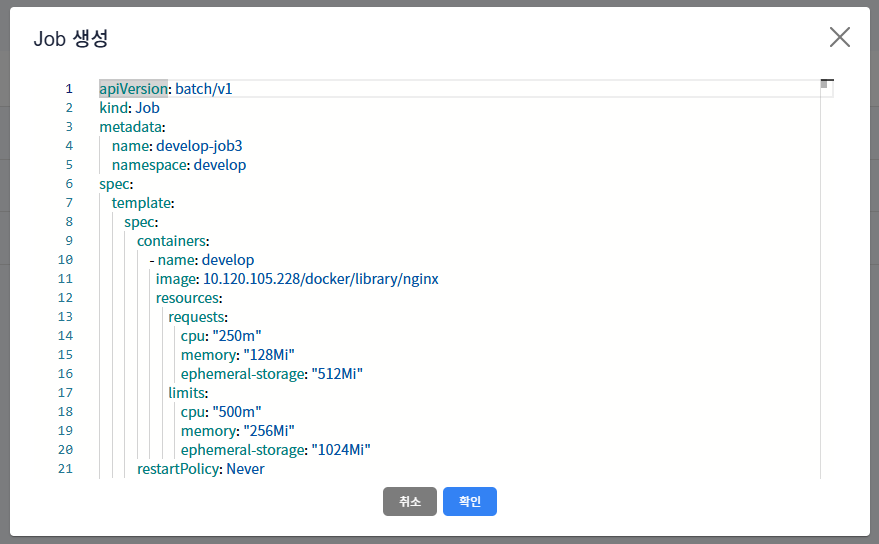
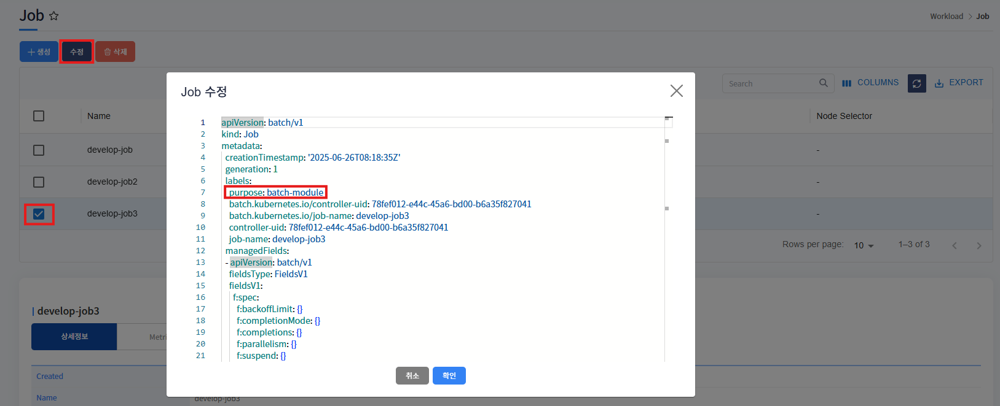
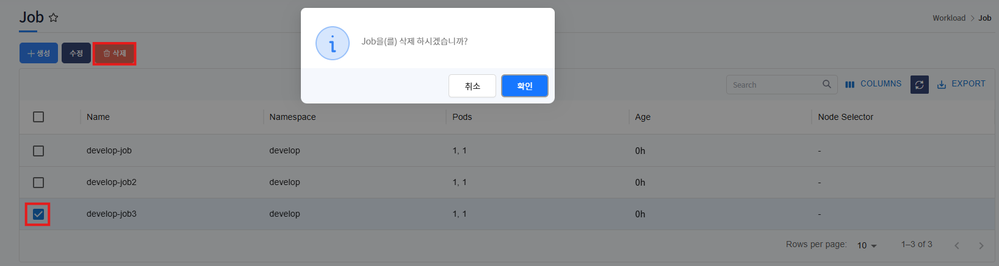

# Job

> Job은 네임스페이스에 서비스중인 Job 목록과 생성, 삭제, 수정하는 서비스 입니다.

---
## **목차**
1. [Job 조회](#job-조회)
   - [1.1. Job 목록](#job-목록)
   - [1.2. Job 상세정보](#job-상세정보)
   - [1.3. Job Metric](#job-metric)
   - [1.4. Job Pod](#job-pod)
   - [1.5. Job event](#job-event)
2. [Job 생성](#job-생성)
3. [Job 삭제](#job-삭제)
4. [Job 수정](#job-수정)

## Job 조회

---
### Job 목록



메뉴 진입시 상위 선택된 클러스터/네임스페이스 내 Job 목록이 조회됩니다.
* Name, Pods, Node Selector 등 확인할 수 있습니다.

### Job 상세정보



선택한 Job의 상세정보를 표시합니다.
생성날짜, Name, Labels, Selector 등을 확인할 수 있습니다.



서비스중인 namesapce 정보를 표시합니다.

### Job Metric


* Job의 metric 정보를 확인할 수 있습니다. 데이터 없을 시, No data로 표시됩니다.
  * metric 수집기가 30초 주기로 데이터 수집, 30초 사이에 job실행되고 종료되면 metric 데이터는 수집되지 않습니다.


---
### Job Pod



Job으로 배포된 pod 목록을 표시합니다.

Name, Node, Status 등을 확인할 수 있습니다.

---
### Job event



Job에 발생한 이벤트 목록을 표시합니다.

---
## Job 생성



생성 버튼 클릭 시, Job 생성 template이 포함된 팝업 호출됩니다.

${} 로 표기된 곳에 사용자가 입력 후(필요시 추가 데이터 입력), 확인 버튼 클릭하면 Job이 생성됩니다.



${} 표기 입력 후 예제화면입니다.

metadata > namespace에 입력한 namespace에 Job 생성됩니다.
* <strong>상단 헤더에 선택된 클러스터 내에 존재하는</strong> namespace 입력

ex)
```yaml
apiVersion: batch/v1
kind: Job
metadata:
    name: develop-job3
    namespace: develop
spec:
    template:
        spec:
            containers:
                - name: develop
                  image: 10.120.105.228/docker/library/nginx
                  resources:
                      requests:
                          cpu: "250m"
                          memory: "128Mi"
                          ephemeral-storage: "512Mi"
                      limits:
                         cpu: "250m"
                         memory: "128Mi"
                         ephemeral-storage: "512Mi"
            restartPolicy: Never
    backoffLimit: 4
```

---
## Job 수정



수정하고자하는 Job 선택 후, 수정 버튼 클릭하면 해당 Job의 yaml 데이터를 팝업으로 호출합니다.

수정하고자하는 값을 수정 후, 확인 버튼 클릭하면 수정됩니다.

---
## Job 삭제



삭제하고자하는 Job 선택 후, 삭제 버튼 클릭하면 해당 Job은 삭제됩니다.
