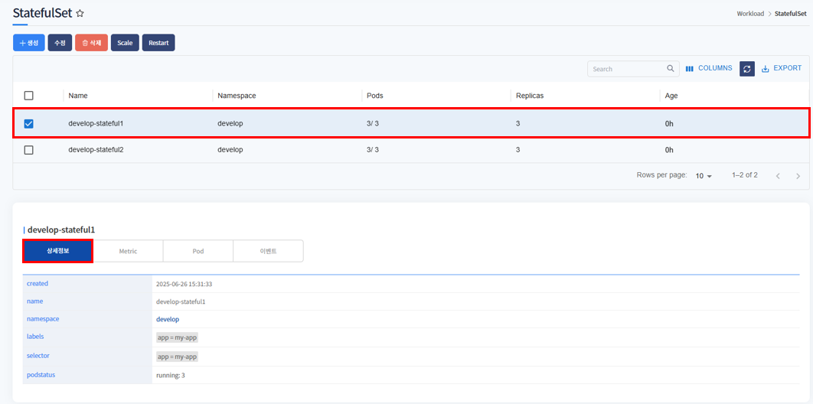

# StatefulSet

> StatefulSet은 네임스페이스에 서비스중인 StatefulSet 목록과 생성, 삭제, 수정, 재시작하는 서비스 입니다.

---
## **목차**
1. [StatefulSet 조회](#statefulset-조회)
   - [1.1. StatefulSet 목록](#statefulset-목록)
   - [1.2. StatefulSet 상세정보](#statefulset-상세정보)
   - [1.3. StatefulSet Metric](#statefulset-metric)
   - [1.4. StatefulSet Pod](#statefulset-pod)
   - [1.5. StatefulSet event](#statefulset-event)
2. [StatefulSet 생성](#statefulset-생성)
3. [StatefulSet 삭제](#statefulset-삭제)
4. [StatefulSet 수정](#statefulset-수정)
5. [StatefulSet Scale](#statefulset-scale)
6. [StatefulSet Restart](#statefulset-restart)

## StatefulSet 조회

---
### StatefulSet 목록


메뉴 진입시 상위 선택된 클러스터/네임스페이스 내 StatefulSet 목록이 조회됩니다.

Namespace에 서비스 중인 StatefulSet 목록을 표시합니다.
* Name, Pods, Replicas 등 확인할 수 있습니다.

### StatefulSet 상세정보


선택한 StatefulSet의 상세정보를 표시합니다.
생성날짜, Name, Labels, Annotations 등을 확인할 수 있습니다.

---
### StatefulSet 상세정보-Namespace


상세정보에서 namespace를 클릭하면 namespace 정보를 오른쪽 화면에 표시합니다.

---
### StatefulSet Metric

* CPU


StatefulSet의 CPU 차트를 표시합니다.

---
* Memory


StatefulSet의 Memory 차트를 표시합니다.

---
* Disk


StatefulSet의 Disk 차트를 표시합니다.</br>
total write, read 두개의 차트를 표시합니다.

---
* Network


StatefulSet의 Network의 metric 차트를 표시합니다.</br>
network in, out 두개의 차트를 표시합니다.

---
### StatefulSet Pod


StatefulSet으로 배포된 pod 목록을 표시합니다.
Name, Node, Status 등을 확인할 수 있습니다.

---
### StatefulSet event


StatefulSet에 발생한 이벤트 목록을 표시합니다.

---
### StatefulSet 생성


생성 버튼 클릭 시, StatefulSet 생성 template이 포함된 팝업 호출됩니다. <br/>
${} 로 표기된 곳에 사용자가 입력 후(필요시 추가 데이터 입력), 확인 버튼 클릭하면 StatefulSet이 생성됩니다.


${} 표기 입력 후 예제화면입니다.

metadata > namespace에 입력한 namespace에 StatefulSet 생성됩니다.
* <strong>상단 헤더에 선택된 클러스터 내에 존재하는</strong> namespace 입력

ex)
```yaml
apiVersion: apps/v1
kind: StatefulSet
metadata:
    name: develop-stateful3
    namespace: develop
    labels:
        app: my-app
spec:
    replicas: 3
    serviceName: "develop-service"
    selector:
        matchLabels:
            app: my-app
    template:
        metadata:
            labels:
                app: my-app
        spec:
            containers:
                - name: develop
                  image: 10.120.105.228/docker/library/nginx
                  ports:
                      - containerPort: 80
                  resources:
                      requests:
                          cpu: "250m"
                          memory: "128Mi"
                          ephemeral-storage: "512Mi"
                      limits:
                         cpu: "250m"
                         memory: "128Mi"
                         ephemeral-storage: "512Mi"
```
---
### StatefulSet 수정


수정하고자하는 StatefulSet 선택 후, 수정 버튼 클릭하면 해당 StatefulSet의 yaml 데이터를 팝업으로 호출합니다. <br/>
수정하고자하는 값을 수정 후, 확인 버튼 클릭하면 수정됩니다.

---
### StatefulSet 삭제


삭제하고자하는 StatefulSet 선택 후, 삭제 버튼 클릭하면 해당 StatefulSet은 삭제됩니다.

---

### StatefulSet Scale


scale 수정할 StatefulSet 선택 후, scale 버튼 클릭하면 scale 수정 팝업이 호출됩니다. <br/>
scale 수정 후 버튼 클릭 시, scale 변경되고 재시작됩니다.
* 단, StatefulSet으로 deploy한 것이 아닌 다른 workload로 deploy하여 생성된 StatefulSet이라면 다른 워크로드로 셋팅된 scale로 자동 적용됩니다.

---

### StatefulSet Restart


재시작 할 StatefulSet 선택 후, Restart 버튼 클릭하면 해당 StatefulSet이 재시작됩니다.