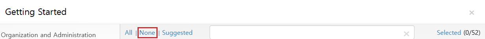
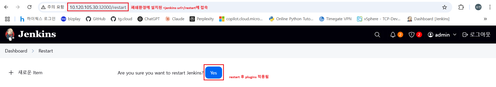
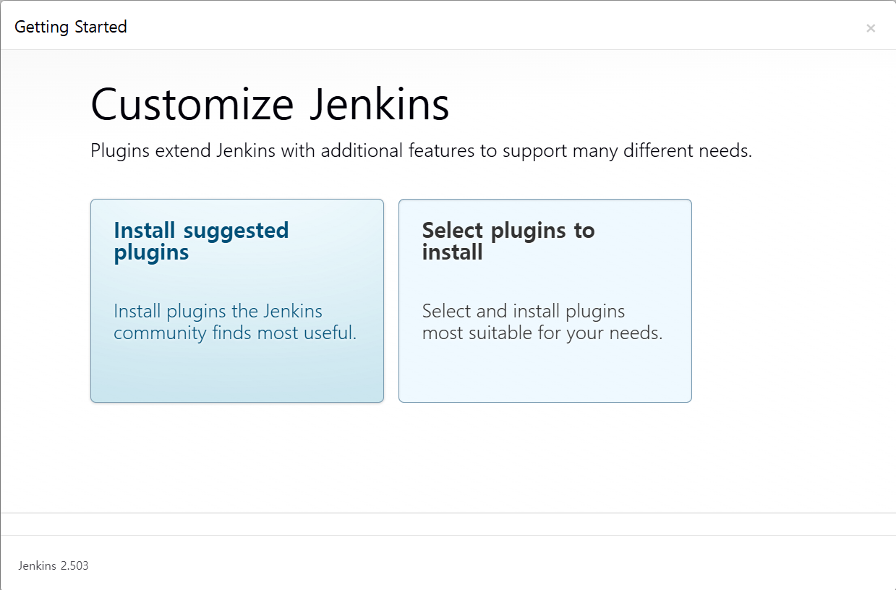
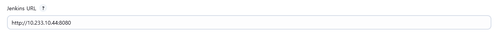
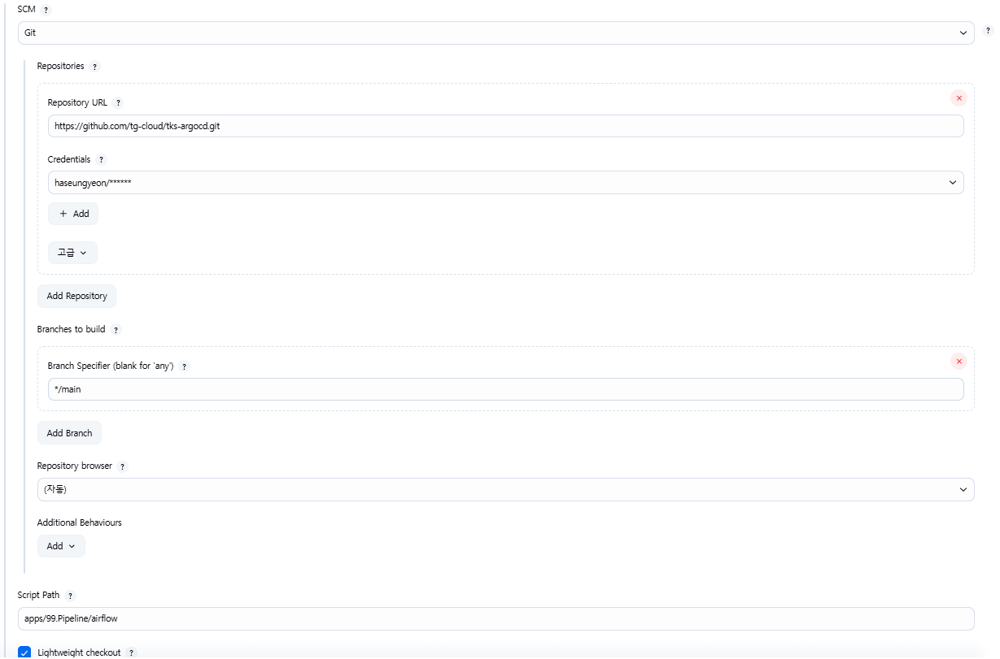

# Jenkins

## 목차
1. [설치](#1-설치)
    - [Namespace 생성](#namespace-생성)
    - [StorageClass 생성](#storageclass-생성)
    - [ClusterRole, ServiceAccount 생성](#clusterrole-serviceaccount-생성)
    - [PersistentVolume, PersistentVolumeClaim 생성](#persistentvolume-persistentvolumeclaim-생성)
    - [Secret 생성](#secret-생성)
    - [Deployment 생성](#deployment-생성)
    - [Service 생성](#service-생성)

2. [설정](#2-설정)
    - [초기 비밀번호 설정](#초기-설정)
    - [pod name 확인](#초기-설정)
    - [초기 비밀번호 확인](#초기-설정)
    - [Plugins](#plugins)
    - [Clouds](#clouds)
    - [Credentials](#credentials)
    - [Pipeline](#pipeline)

3. [업데이트](#3-업데이트)
    - [Plugins](#plugins-1)
    - [Jenkins Version Update](#jenkins-version-update)


## 1. 설치

### Namespace 생성

```bash
kubectl create namespace jenkins
```

### StorageClass 생성

```bash
echo '''kind: StorageClass
apiVersion: storage.k8s.io/v1
metadata:
  name: jenkins-local-storage
provisioner: kubernetes.io/no-provisioner
volumeBindingMode: WaitForFirstConsumer
''' > ~/jenkins-sc.yaml
```
```bash
kubectl apply -f ~/jenkins-sc.yaml
```

### ClusterRole, ServiceAccount 생성

```bash
echo '''apiVersion: rbac.authorization.k8s.io/v1
kind: ClusterRole
metadata:
  name: jenkins-admin
rules:
- apiGroups: [""]
  resources: ["pods", "pods/log","pods/exec", "pods/attach", "secrets"]
  verbs: ["*"]
---
apiVersion: v1
kind: ServiceAccount
metadata:
  name: jenkins-admin
  namespace: jenkins
---
apiVersion: rbac.authorization.k8s.io/v1
kind: ClusterRoleBinding
metadata:
  name: jenkins-admin
roleRef:
  apiGroup: rbac.authorization.k8s.io
  kind: ClusterRole
  name: jenkins-admin
subjects:
- kind: ServiceAccount
  name: jenkins-admin
  namespace: jenkins''' > ~/jenkins-ac.yaml
```
```bash
kubectl apply -f ~/jenkins-ac.yaml
```

### PersistentVolume, PersistentVolumeClaim  생성

```bash
echo '''apiVersion: v1
kind: PersistentVolumeClaim
metadata:
  name: jenkins-pv-claim
  namespace: jenkins
  labels:
    application: devops-tg-pvc
spec:
  storageClassName: jenkins-local-storage
  accessModes:
  - ReadWriteOnce
  resources:
    requests:
      storage: 8Gi
---
apiVersion: v1
kind: PersistentVolume
metadata:
  name: jenkins-pv
  labels:
    application: devops-tg-pv
spec:
  capacity:
    storage: 8Gi
  accessModes:
  - ReadWriteOnce
  storageClassName: jenkins-local-storage
  claimRef:
    name: jenkins-pv-claim
    namespace: jenkins
  local:
    path: /mnt
  nodeAffinity:
    required:
      nodeSelectorTerms:
        - matchExpressions:
        # jenkins 설치 클러스터 node의 metadata.labels를 참조하여 변경 필요
            - key: kubernetes.io/hostname
              operator: In
              values:
                - single-cluster-master1''' > ~/jenkins-st.yaml
```
```bash
kubectl apply -f ~/jenkins-st.yaml
```

### Secret 생성

harbor의 private project에 접근할 경우 뒤에 설명할 containerd 설정(/etc/containerd/config.toml)에 harbor 인증정보를 설정하지 않는다면 생성이 필요합니다. secret은 jenkins pipeline script에서 podTemplate의 imagePullSecret에 사용됩니다

```bash
kubectl create secret docker-registry jenkins-harbor --docker-server=<tg-harbor-address> --docker-username=<your-name> --docker-password=<your-password> --docker-email=<your-email> -n jenkins
```

### Deployment 생성
<details>
<summary>폐쇄 환경</summary>

<br>

```bash
# 인터넷이 되는 환경
podman pull jenkins/jenkins:2.503
podman save -o jenkins_jenkins_2.503.tar jenkins/jenkins:2.503
```
메일, 메신저, scp 등으로 파일 형태의 이미지를 폐쇄 환경으로 옮긴 후

---
private registry(harbor)가 있을 경우
```bash
# 폐쇄 환경
podman load -i jenkins_jenkins_2.503.tar
podman images
```
```pre
REPOSITORY                 TAG         IMAGE ID      CREATED     SIZE
localhost/jenkins/jenkins  2.503       be95e0848c42  9 days ago  474 MB # IMAGE ID 복사하여
```
```bash
podman tag be95e0848c42 <harbor-registry>/<project>/<repository>:<tag>
podman login <harbor-registry> --tls-verify=false -u <username> -p <password>
podman push --tls-verify=false <harbor-registry>/<project>/<repository>:<tag>
```
harbor에 이미지를 푸시 해줍니다
---
private registry가 없을 경우(임시)
```bash
# 폐쇄 환경
ctr -n=k8s.io images import jenkins_jenkins_2.503.tar
```
</details>

```bash
echo '''apiVersion: apps/v1
kind: Deployment
metadata:
  name: jenkins
  namespace: jenkins
spec:
  replicas: 1
  selector:
    matchLabels:
      app: jenkins-server
  template:
    metadata:
      labels:
        app: jenkins-server
    spec:
      # imagePullSecrets:
      # - name: jenkins-harbor # jenkins image가 harbor 내에 있을 경우 사용합니다
      securityContext:
        fsGroup: 1000
        runAsUser: 1000
      serviceAccountName: jenkins-admin
      containers:
      - name: jenkins
      # latest 대신 최신 이미지 tag를 직접 입력하는것을 권장합니다
      # 폐쇄망일 경우 압축해제한 이미지의 tag를 입력합니다. registry 주소: localhost. ex)localhost/jenkins/jenkins:2.503
        image: jenkins/jenkins:2.503
        # 자원을 제공해줄 node의 스펙 내에서 젠킨스 운영 환경을 고려하여 적절히 변경합니다
        resources:
          limits:
            memory: "16Gi"
            cpu: "4000m"
          requests:
            memory: "8Gi"
            cpu: "2000m"
        ports:
        - name: httport
          containerPort: 8080
        - name: jnlpport
          containerPort: 50000
        livenessProbe:
          httpGet:
            path: "/login"
            port: 8080
          initialDelaySeconds: 90
          periodSeconds: 10
          timeoutSeconds: 5
          failureThreshold: 5
        readinessProbe:
          httpGet:
            path: "/login"
            port: 8080
          initialDelaySeconds: 60
          periodSeconds: 10
          timeoutSeconds: 5
          failureThreshold: 3
        volumeMounts:
        - name: jenkins-data
          mountPath: /var/jenkins_home
      volumes:
      - name: jenkins-data
        persistentVolumeClaim:
          claimName: jenkins-pv-claim''' > ~/jenkins-deployment.yaml
```
```bash
kubectl apply -f ~/jenkins-deployment.yaml
```

### Service 생성
```bash
echo '''apiVersion: v1
kind: Service
metadata:
  name: jenkins-service
  namespace: jenkins
spec:
  selector:
    app: jenkins-server
  type: NodePort
  ports:
  - name: httpport
    protocol: TCP
    port: 8080
    targetPort: 8080
    nodePort: 32000
  - name: jnlpport
    port: 50000
    targetPort: 50000''' > ~/jenkins-service.yaml
```
```bash
kubectl apply -f ~/jenkins-service.yaml
```

## 2. 설정

### 최초 설정

pod name 확인

```bash
kubectl get po -n jenkins
```

```pre
NAME                       READY   STATUS    RESTARTS   AGE

jenkins-5558d4989b-6w7vt   1/1     Running   0          103m
```

초기 비밀번호를 확인합니다
```bash
kubectl exec -it jenkins-5558d4989b-6w7vt -n jenkins -- cat /var/jenkins_home/secrets/initialAdminPassword
```
```pre
780d4af0026e48c68df05d13768bfbcc
```
jenkins pod가 배포된 <node_ip>:32000으로 접속 후 (http://10.120.105.240:32000/)

위에 출력된 값을 Administrator password에 입력합니다

필요 플러그인 설치(install suggested plugins)를 클릭합니다

<details>
<summary>폐쇄 환경</summary>
<br>
Select plugins to install > None 선택 후 Install 합니다


(nexus와 같은 파일 저장 서버가 있다면 이용합니다. 여기서는 노드에 저장한 압축 파일을 사용하였습니다)
```bash
scp u@10.120.105.229:~/plugins.tar.gz ~/
kubectl cp plugins.tar.gz -n jenkins jenkins-5558d4989b-6w7vt:/var/jenkins_home/plugins
```
```bash
# jenkins pod container 내부
cd ~
tar -xvzf plugins.tar.gz --strip-components=1 -C /var/jenkins_home/plugins
```

`추가적으로 필요한 플러그인은 아래 주소에서 수동으로 다운로드 가능합니다`

[Jenkins Plugins](https://updates.jenkins-ci.org/download/plugins/)
</details>


Create First Admin User 계정 정보를 입력합니다

### Plugins
`Dashboard > Jenkins 관리 > Plugins > Available Plugins`

Kubernetes, Pipeline: Stage View, Pipeline Utility Steps 플러그인을 설치합니다

### Clouds
`Dashboard > Jenkins 관리 > Clouds > New cloud`

type cloud 선택 후 Jenkins URL에 Cluster IP 입력합니다

```bash
kubectl get svc -n jenkins
```
```pre
NAME              TYPE       CLUSTER-IP     EXTERNAL-IP   PORT(S)          AGE
jenkins-service   NodePort   10.233.42.13   <none>        8080:32000/TCP   7h17m
```



### Credentials
`Dashboard > Jenkins 관리 > Credentials`

Stores scoped to Jenkins 에서 System scope로 pipeline 내에서 사용될 인증정보를 등록합니다

**Harbor Registry 인증 credential**

Kind: Username with password

Scope: Global

Username: {harbor-username}

Password: {harbor-password}

ID: tg-harbor-auth => pipeline 내에서username, password에 접근하기 위한 파라미터

**github 인증 credential**

Kind: Username with password

Scope: Global

Username: {github-user-id} => 각 application source에 접근 가능한 github 계정

Password: {personal-access-token} => 위 github 계정으로부터 발급한 pat(아래 Personal Access Token 발급 방법 참고 하십시오)

ID: {github-id} => pipeline 내에서 username, password에 접근하기 위한 파라미터
<details>
<summary>Personal Access Token 발급 방법</summary>
=> 운영용 영구 유저로 github 로그인 후 Settings > developer settings > Personal access token > 필요한 모든 권한 체크 후 발행되는 토큰 복사하여 위의 github_paas_admin의 password에 저장합니다
</details>

### Pipeline

`Dashboard > 새로운 Item > (파이프라인 이름 입력 후)Pipeline 선택 및 OK`

- Do not allow concurrent build ✓: 파이프라인 빌드 중 추가적인 다른 빌드를 방지합니다

- 오래된 빌드 삭제✓ : 볼륨 용량 관리를 위해 빌드 이력이 오래된 로그를 삭제합니다

- Definition: Pipeline script from SCM

=> Pipeline script로 저장 시 형상관리가 되지 않기 때문에 테스트 용도로만 사용하고 운영용 스크립트는 github에 저장, 참조하여 형상관리가 되도록 합니다



- Credentials: Pipeline script가 저장된 github repo 경로에 대한 접근 권한이 있는 계정의 pat와 username으로 생성된 인증정보를 사용합니다

- Script Path: repo의 root를 기준으로 script 파일의 경로입니다. pipeline path는 tg.cloud organization의 tks-argocd repository의 apps/99.Pipeline 내에 application 별로 위치합니다

- Lightweight checkout✓: Pipeline script 파일만 checkout 하여 배포 성능을 향상시키는 옵션입니다


**⚠️kubernetes workload object(pod, replica, ... )에서 image를 pull 해올 registry에 대한 등록작업 필요**
(pod 배포가능한 모든 node에 대한 아래의 설정이 필요합니다)

/etc/containerd/config.toml 파일에서
[plugins."io.containerd.grpc.v1.cri".registry.mirrors] 아래에 registry 주소를 추가합니다
```pre
[plugins."io.containerd.grpc.v1.cri".registry.mirrors]
  [plugins."io.containerd.grpc.v1.cri".registry.mirrors."<private-registry 주소>"]
    endpoint = ["https://<private-registry 주소>"]
```
[plugins."io.containerd.grpc.v1.cri".registry.configs] 아래에 harbor 레지스트리의 ID, PW 정보와 verify skip을 설정합니다

아래와 같이 인증정보를 넣어줄 경우 pipeline script의 containerTemplate에서 harbor와 같은 private registry의 private project에 저장된 image를 pulling할 때 podTemplate의 imagePullSecrets에서 참조하는 별도의 k8s secret 없이 접근 가능합니다
```pre
[plugins."io.containerd.grpc.v1.cri".registry.configs]
  [plugins."io.containerd.grpc.v1.cri".registry.configs."<private-registry 주소>".auth]
    username = "<harbor ID>"
    password = "<harbor PW>"
  [plugins."io.containerd.grpc.v1.cri".registry.configs."<private-registry 주소>".tls]
    insecure_skip_verify = true # <= 이 설정을 넣어주어야 인증서 없이도 이미지를 받을 수 있습니다
```
```bash
systemctl restart containerd.service
```

## 3. 업데이트


### Plugins

`Dashboard > Jenkins 관리 > Plugins`

update 목록 체크박스 선택 후 업데이트 및 실행 중인 작업이 없을 경우 재시작 합니다

폐쇄 환경의 경우 [최초 설정](#최초-설정)의 폐쇄환경 가이드와 동일하게 /var/jenkins_home/plugins 내부에 jpi 파일을 압축해제하여 줍니다

### Jenkins Version Update

https://hub.docker.com/r/jenkins/jenkins/tags 에서 버전에 맞는 태그명으로 jenkins deployment image를 업데이트 합니다

폐쇄 환경의 경우 [Deploymen 생성](#deployment-생성)의 폐쇄환경 가이드와 동일하게 image 파일 압축 및 해제하여 로컬 또는 harbor 태그에 맞게 jenkins deployment image를 변경합니다