# Keycloak - Client 구성

> 키클락에 접속하여 oidc 인증을 위한 realm, client 및 client scope 등을 생성합니다.

## 목차

1. [keycloak 관리자 포탈에 접속 및 로그인](#1-keycloak-관리자-포탈에-접속-및-로그인)
2. [tks-sso Realm 생성](#2-argocd-설치)
3. [Groups Client scope 생성](#3-argocd-cli-설치)
4. [OIDC Client 생성](#4-argocd-cli-로그인)
5. [Groups Client scope 할당](#5-argocd---cluster-연결-설정)

## 1. keycloak 관리자 포탈에 접속 및 로그인

> keycloak에 oidc 인증을 위한 client를 생성 및 구성하기 위해 관리자 포탈에 접속합니다.

  URL: https://keycloak.tg-cloud.co.kr
  ID: admin
  PASS: admin

## 2. tks-sso Realm 생성

> Keycloak에서 Realm은 사용자, 그룹, 클라이언트, 인증 흐름 등을 독립적으로 관리할 수 있는 논리적 구분 단위입니다. 조직 내 다양한 서비스나 팀별로 인증/인가 환경을 격리하고자 할 때 Realm을 생성하여 활용할 수 있습니다.

  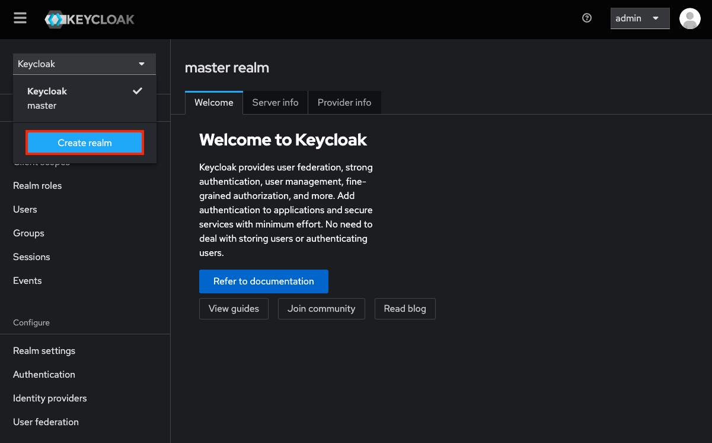

  좌측 상단에 realm 선택박스를 클릭 > Create realm 버튼 클릭

  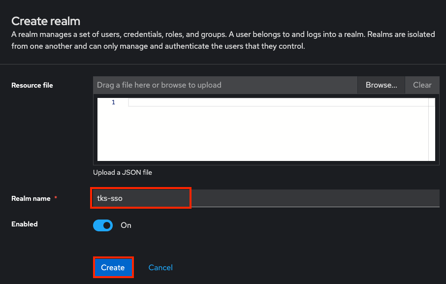

  tks-sso realm 생성

## 3. groups Client scope 생성

> Keycloak에서 groups 정보를 OIDC 토큰에 포함시키기 위해 Client Scope를 생성하고 매핑하는 과정은 OIDC 연동 시스템에서 그룹 기반 인증·인가(RBAC)를 구성할 때 핵심적인 단계입니다. 이 과정을 통해 외부 시스템은 사용자 인증 시 받은 토큰에 포함된 groups 정보를 기반으로 RoleBinding, RBAC 등 권한 제어를 수행할 수 있습니다.

  

  좌측의 client scopes 메뉴 클릭 > Create client scope 버튼 클릭

  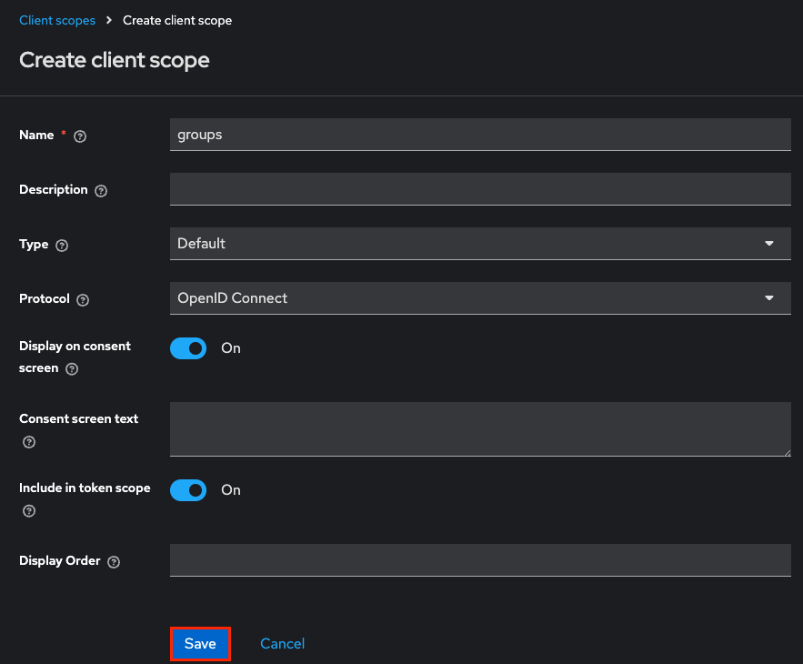

  각 필드를 채우고 Save 버튼 클릭

  주요 필드:
    Name: 클라이언트 스코프의 고유 이름. 이 이름은 토큰 요청 시 scope 파라미터로 지정될 수 있음
    Description: 스코프의 설명으로, 관리자가 목적을 이해할 수 있도록 작성
    Type: 해당 스코프가 클라이언트에 어떻게 적용되는지를 결정
    Default: 클라이언트에 기본적으로 항상 적용되는 스코프입니다. 별도의 요청 없이도 토큰에 포함됩니다.
    Optional: 클라이언트가 요청 시에만 사용 가능한 선택적 스코프입니다. 토큰 요청 시 scope 파라미터에 명시적으로 포함해야 적용됩니다.
    Protocol: 사용되는 프로토콜: OIDC인증 시  openid-connect를 선택
    Display On Consent Screen: 사용자에게 동의 화면 표시 여부
    Include in token scope: OAuth2/OpenID Connect 프로토콜에서 발급되는 Access Token의 scope 클레임에 이 스코프 이름을 포함할지 여부를 제어

  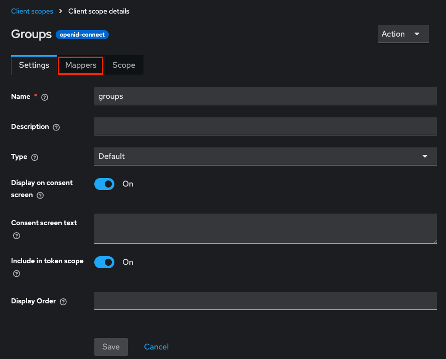

  groups client scope 상세 화면에서 Mappers 탭 클릭

  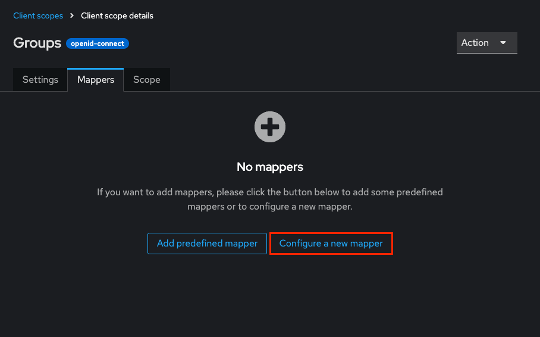

  groups client scope의 Mappers 탭에서 Configure a new mapper 버튼 클릭

  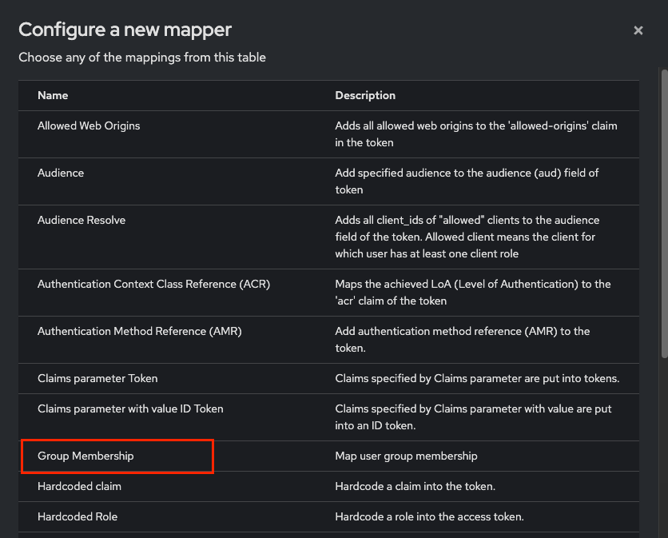

  mapper 테이블에서 Group Membership 선택

  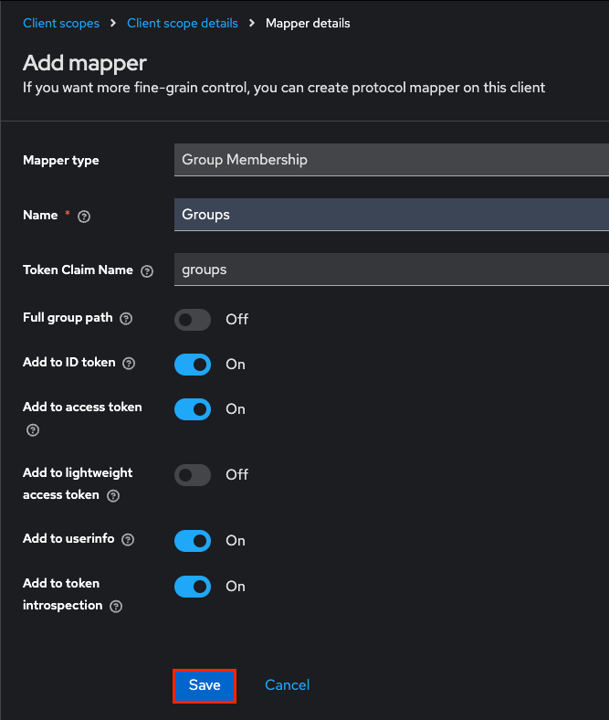

  Groups mapper의 각 필드를 채우고 Save 버튼 클릭

  주요 필드:
    Name: Mapper의 고유 이름. 관리 용도이며, 클레임 이름과는 다를 수 있음
    Mapper Type: 어떤 정보를 어떻게 클레임으로 변환할지를 결정하는 유형
    Token Claim Name: 토큰에 포함될 클레임 이름
    Full group path: / 로 시작하는 전체 경로로 그룹명 표시 여부
    Add to Id token / Access token / User Info: 해당 토큰에 포함할지 여부 체크박스
    Add to token introspection:  이 Mapper가 생성하는 클레임을 토큰 introspection 응답에 포함할지 여부 설정

  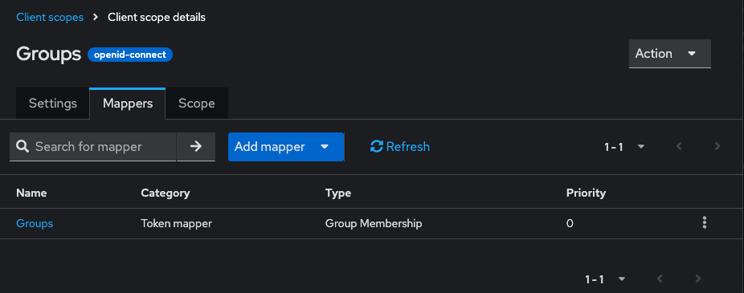

  groups client scope에 Groups mapper가 추가된 모습

## 4. OIDC Client 생성

> kube-apiserver, harbor 및 포탈 인증 서비스가 OIDC(OpenID Connect) 기반 인증을 지원하도록 설정하기 위해, Keycloak에 OIDC Client를 생성합니다.
이 Client는 관련된 컴포넌트의 사용자 인증 요청을 처리하며, Keycloak은 사용자 인증을 수행한 후 ID Token을 반환합니다.
각 서버는 이 토큰을 검증하여 사용자 인증 및 RBAC 연동(예: AD 그룹 기반 RoleBinding)에 활용합니다. 이 과정은 Keycloak을 각 서비스의 외부 인증 프로바이더로 구성하기 위한 핵심 단계입니다.

  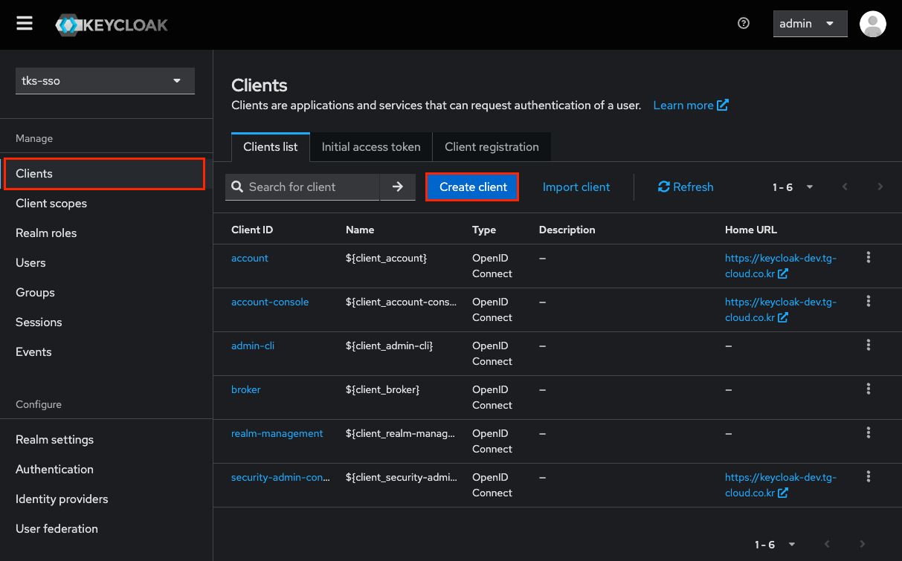
  
  좌측의 clients 메뉴 클릭 > Create client 버튼 클릭

  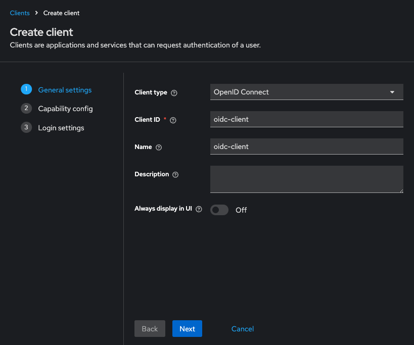

  general settings 단계의 주요 필드를 채우고 Next 버튼 클릭

  주요 필드:
    Client ID: 클라이언트의 고유 식별자. OAuth 2.0 / OIDC에서 client_id로 사용됨
    Name: 클라이언트의 고유한 식별자
    Always disply in UI: 사용자가 Keycloak 로그인 후 리소스(클라이언트) 선택 화면에서 해당 클라이언트를 항상 표시할지 여부를 결정

  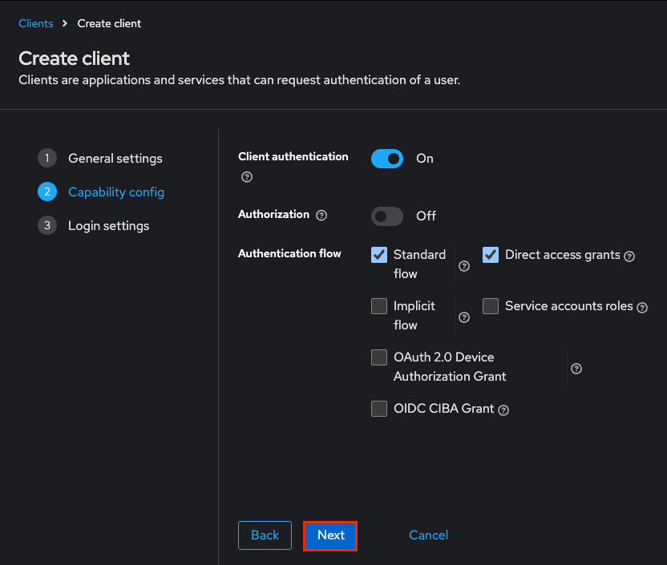

  capability config 단계의 주요 필드를 채우고 Next 버튼 클릭

  주요 필드:
    Client authentication:  클라이언트가 인증 시 사용하는 방식을 활성화하거나 비활성화하는 설정, 이 옵션이 활성화되면 클라이언트는 client_id와 client_secret 또는 다른 인증 방식을 사용하여 Keycloak에 인증을 시도
    Authorization: 클라이언트가 Keycloak의 Authorization 서비스를 사용할 것인지 여부를 설정하는 옵션
    Authentication flow: 클라이언트가 인증을 수행할 때 사용할 **인증 흐름(Flow)**을 설정하는 옵션입니다. Keycloak은 기본적으로 여러 인증 흐름을 제공하며, 이 옵션은 클라이언트가 어떤 인증 흐름을 사용할지를 정의

  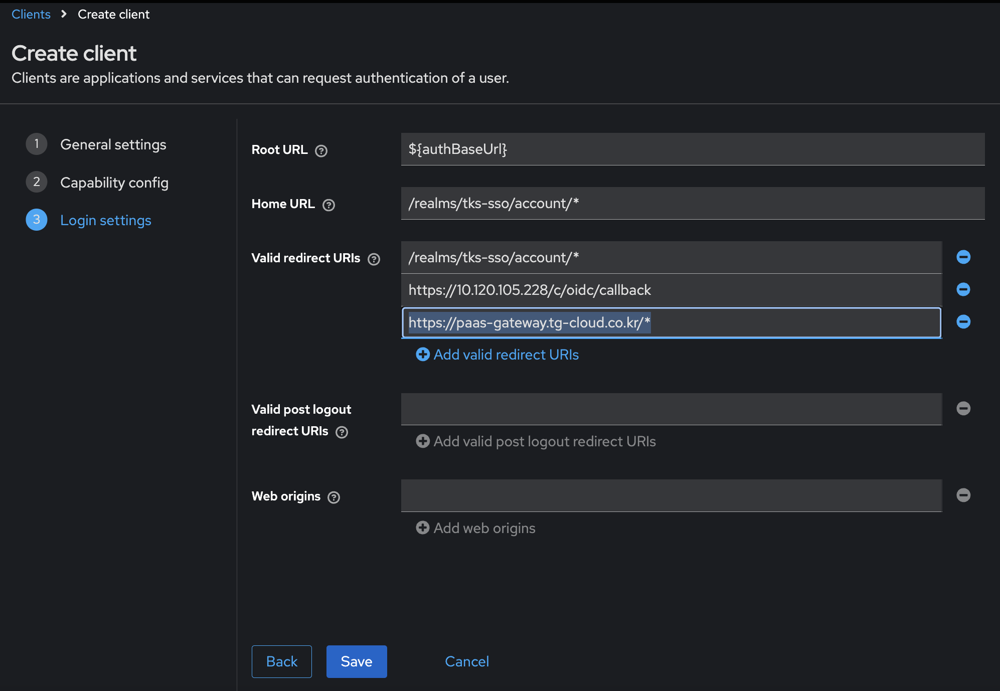

  login settings 단계의 주요 필드를 채우고 Save 버튼 클릭

  주요 필드:
    Root URL: 이 URL은 Keycloak과의 상호작용에서 기본 URL로 사용되며, 주로 애플리케이션의 홈 페이지나 기본 경로를 설정하는 데 사용
    Home URL: Home URL은 사용자가 인증을 완료한 후, 인증 후 리디렉션될 기본 URL을 설정하는 필드입니다. 사용자가 인증을 완료하거나 로그인한 후, 홈 페이지로 돌아가는 URL을 지정합니다
    Valid redirect URIs: Valid Redirect URIs는 클라이언트의 리디렉션 URI 목록을 설정하는 필드입니다. 인증 흐름이 완료된 후 Keycloak이 리디렉션할 수 있는 URL 목록을 설정하여, 악의적인 리디렉션 공격을 방지할 수 있습니다.
    Valid post logout redirect URIs: Valid Post Logout Redirect URIs는 사용자가 로그아웃 후 리디렉션될 수 있는 URL을 설정하는 필드입니다. 사용자가 Keycloak에서 로그아웃을 한 후, 어떤 URL로 리디렉션될지 정의하는 설정입니다.
    Web origins: Web Origins는 CORS (Cross-Origin Resource Sharing) 설정을 위해 사용되는 필드로, 클라이언트가 외부 도메인에서 호출할 수 있는 URL을 정의합니다. 이 설정은 주로 **SPA (Single Page Application)**나 웹 애플리케이션이 다른 도메인에서 Keycloak과 상호작용할 때 필요합니다.

  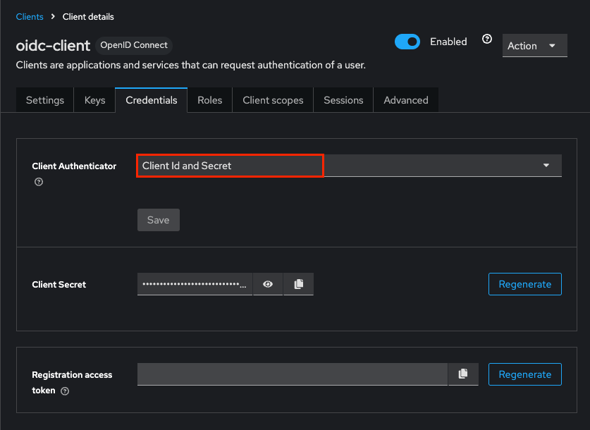

  oidc-client 상세 화면에서 Client scopes 탭 클릭 > Client Authenticator 필드가 Client Id and Secret인지 확인

## 5. Groups Client scope 할당

> Groups Client Scope는 사용자의 그룹 정보를 OIDC 토큰에 포함시키는 데 중요한 역할을 합니다. OIDC 클라이언트에 Groups Client Scope를 할당하면, 인증된 사용자의 그룹 정보가 ID 토큰 또는 Access 토큰에 포함되며, 이를 클라이언트 애플리케이션에서 쉽게 활용할 수 있습니다.

  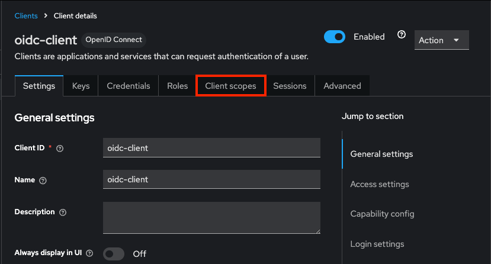

  OIDC Client 상세화면에서 Client scopes 탭 클릭

  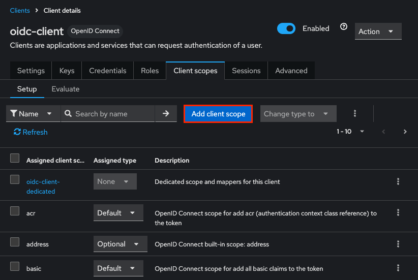

  OIDC Client의 Client scope 탭에서 groups가 없는 경우 Add client scope 버튼 클릭

  주의: Client 생성 시 Default Type인 Client scope들은 자동으로 추가됨, Client 생성 후 Client scope를 생성한 경우 아래와 같이 Add client scope 버튼을 클릭하여 스코프 추가 작업 필요

  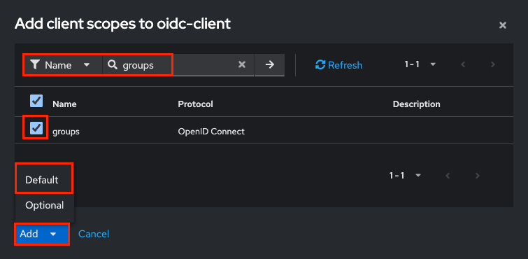

  groups 이름으로 필터링 및 Default 타입으로 추가