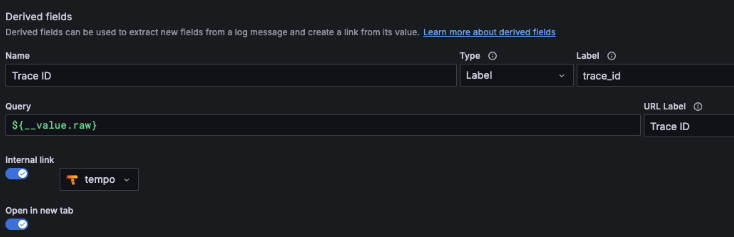
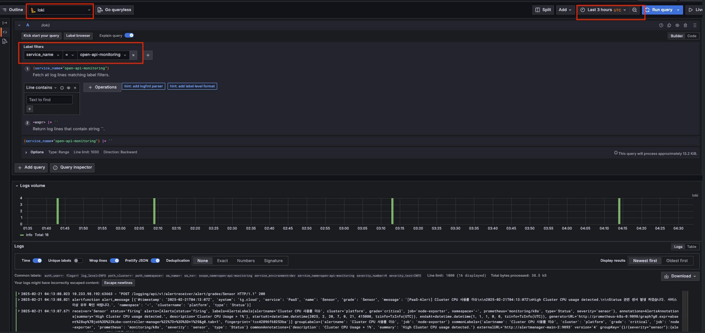
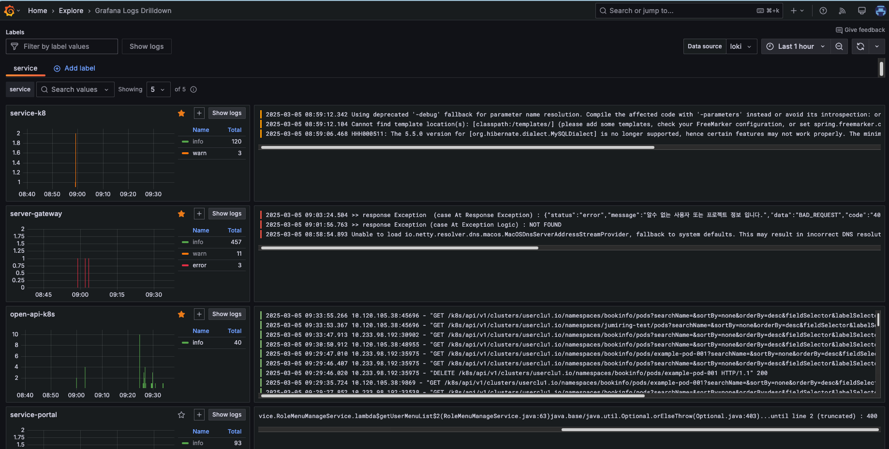
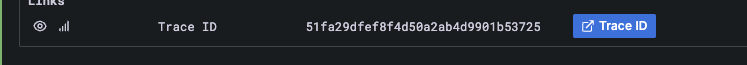

# Grafana Loki

> Grafana Loki 는 애플리케이션 로그를 수집하고 분석하는 데 특화된 로그 집계 시스템으로, 메타데이터 기반 인덱싱을 통해 운영 비용을 최소화하고 효율적인 로그 관리를 지원합니다. TKS 애플리케이션 (FastAPI, SpringBoot, React)의 로그 수집을 담당하며, Grafana 대시보드의 DataSource 설정을 통해 Grafana Tempo 와 연동하여 트레이스-로그 연계를 지원합니다.

---

## 목차

1. [개요](#1-개요)
2. [Loki 설치](#2-loki-설치)
3. [Grafana DataSource 설정 및 로그 조회](#3-grafana-datasource-설정-및-로그-조회)
4. [배포 구성 상세 설명](#4-배포-구성-상세-설명)
5. [트러블슈팅](#5-트러블슈팅)

---

## 1. 개요

Loki 는 Grafana Labs 에서 개발한 로그 집계 및 분석 솔루션으로, Prometheus 와 유사한 메타데이터 기반 로그 인덱싱을 수행하여 저비용으로 효율적인 로그 관리를 제공합니다.

### 주요 특징

- 수평 확장 가능 (Simple Scalable Deployment, SSD)
- 멀티 테넌시 지원 (X-Scope-OrgID)
- 저비용 운영 (인덱스 최소화)
- Prometheus 및 OpenTelemetry 연동 가능

---

## 2. Loki 설치

Grafana Loki 는 Helm Chart 를 사용하여 Kubernetes 에 배포합니다.  
loki 의 여러가지 배포 모드 중 SimpleScalable 모드를 기반으로 배포합니다.  
Helm values 파일은 TKS 플랫폼 레파지토리의 loki > simple-scalable-values.yaml 을 참조하세요.

### Helm Repository 추가 및 업데이트

```bash
helm repo add grafana https://grafana.github.io/helm-charts
helm repo update
```

### Loki 설치

Namespace: `grafana-loki` (가변적)

```bash
helm install --values simple-scalable-values.yaml loki grafana/loki --create-namespace --namespace grafana-loki
```

### 설치 확인 방법

```bash
helm list --namespace grafana-loki
kubectl get pods -n grafana-loki
```

#### Loki 제거 및 PVC 삭제

```bash
helm uninstall loki --namespace grafana-loki
kubectl delete pvc --namespace grafana-loki --all
```

---

## 3. Grafana DataSource 설정 및 로그 조회

Grafana 에서 Loki DataSource 를 추가하여 로그 데이터를 조회합니다.

### Grafana Loki DataSource 설정

- Grafana 접속 → Configuration → DataSources → Loki 선택

- URL 설정
```
http://loki-gateway.grafana-loki.svc.<가변적 도메인 또는 cluster.local>/
```

- 헤더 설정
```
X-Scope-OrgID: tks
```

- Derived fields 설정
  - Label 의 `trace_id` 는 애플리케이션에서 정의한 필드명으로 설정 (logs to traces 연동 목적)

  


### Grafana 에서 Loki 로그 조회 방법

TKS 애플리케이션(FastAPI, SpringBoot, React)의 로그는 OpenTelmetry 를 거쳐 Loki 로 수집되며, Grafana 의 **Explore** 또는 **Logs** 메뉴에서 로그를 조회할 수 있습니다.

---

#### 1. Explore 메뉴를 통한 로그 조회

1. **Grafana 좌측 메뉴 → Explore 클릭**
2. 상단 Data source 선택: `Loki`
3. `Log labels` 영역에서 최소 1개의 필터 (`service_name`) 을 기준으로 선택
4. 하단 쿼리 결과에서 실시간 로그를 확인

  
_Explore 메뉴에서 Loki 선택 및 필터, 타임 레인지 지정 후 Run Query 클릭 후 수집된 로그 실시간 조회_

---

#### 2. Logs 메뉴를 통한 로그 대시보드 조회 (Grafana 최신 버전)

1. Grafana 좌측 사이드바 →  Logs** 클릭

  
_Service 별 수집된 로그를 실시간으로 조회_

---

💡 참고: 각 로그 항목 클릭 후 하단 표시되는 Likn - Trace ID 아이콘을 클릭하면 해당 요청의 트레이스를 Tempo 에서 직접 확인할 수 있습니다.

  
_Tempo 연동된 트레이스 보기 버튼_

---

## 4. 배포 구성 상세 설명

Loki 는 Simple Scalable Deployment (SSD) 모드를 사용하여 배포되며, 구성 요소별로 분리된 아키텍처로 구성됩니다.

### Simple Scalable Mode(SSD) 개요

**Simple Scalable Mode**는 Grafana Loki의 **수평 확장이 가능한 분산형 배포 모드**입니다. 이 모드는 **단순하지만 확장 가능한 아키텍처**를 제공하며, 로그 수집, 저장, 쿼리 역할을 여러 인스턴스에 분산하여 처리할 수 있습니다.

#### 특징
* **단순한 운영**: Microservices 기반의 Loki 모드보다 구성 요소가 적어 관리가 쉬움
* **수평 확장 가능**: Read, Write, Backend 컴포넌트를 개별적으로 확장 가능
* **데이터 영속성 지원**: S3 및 MinIO 같은 오브젝트 스토리지를 사용하여 로그를 저장
* **TSDB 기반 인덱싱**: v13 스키마를 사용하여 로그 인덱스를 효율적으로 관리

### 배포 구성 설명

TKS 플랫폼 레파지토리의 loki > simple-scalable-values.yaml을 기반으로 **Loki의 Simple Scalable 모드**를 Kubernetes(K8s) 환경에서 배포하였습니다. 아래는 해당 설정의 주요 구성 요소와 역할에 대한 설명입니다.

#### 1. Loki 기본 설정

```yaml
loki:
  schemaConfig:
    configs:
      - from: 2025-01-22 # 변경
        store: tsdb
        object_store: s3
        schema: v13
        index:
          prefix: loki_index_
          period: 24h # 하루 단위로 새로운 인덱스 파일이 생성
```

* **TSDB(Storage Backend)**: store: tsdb → TSDB(Time-Series Database) 백엔드를 사용하여 로그 저장
* **Object Storage**: object_store: s3 → 로그 데이터를 **S3 기반 오브젝트 스토리지**에 저장
* **Schema Version**: schema: v13 → Loki 최신 스키마 v13을 사용하여 **효율적인 인덱싱 및 저장 구조** 활용
* **Indexing**: index.prefix: loki_index_, index.period: 24h → **하루 단위(24h)로 새로운 인덱스 파일 생성**

#### 2. 데이터 보존 및 삭제 정책

```yaml
limits_config:
  retention_period: 31d # 31일 뒤 데이터 삭제
  allow_deletes: true # API를 통한 삭제 허용
  allow_structured_metadata: true # 메타데이터 구조화 허용
```

* **Retention**: 31일 동안 로그를 보관하며, 이후 자동 삭제
* **로그 삭제 API 허용**: allow_deletes: true
* **구조화된 메타데이터 지원**: allow_structured_metadata: true

```yaml
compactor:
  working_directory: /tmp/loki/retention
  retention_enabled: true
  retention_delete_delay: 2h
  delete_request_store: s3
```

* **Compactor 활성화**: retention_enabled: true → 로그 정리 및 보존 정책 적용
* **Retention Delay**: 2시간 후 삭제

#### 3. 고가용성을 위한 Replica 설정

```yaml
backend:
  replicas: 2
read:
  replicas: 2
write:
  replicas: 3
```

* **Backend**: replicas: 2 → **메타데이터 및 저장소 관리 노드**
* **Read 노드**: replicas: 2 → **쿼리 요청을 처리하는 노드**
* **Write 노드**: replicas: 3 → **로그를 수집하여 저장소로 전달하는 노드**

💡 배포된 구성 요소는 수평 확장이 가능하도록 분리됨
* Read, Write, Backend 노드를 필요에 따라 **별도 스케일링** 가능
* 단일 노드 장애 시에도 서비스가 중단되지 않도록 **고가용성 보장**

#### 4. DNS 및 Cluster Domain 설정

```yaml
global:
  dnsService: 'coredns'  # 가변적
  dnsNamespace: 'kube-system'  # 가변적
  clusterDomain: 'platform.io' # 가변적, default: cluster.local
```

* 플랫폼 클러스터 coredns 설정에 맞게 조정 (위와 같이 설정시 k8s 서비스명 뒤에 cluster.local 대신 platform.io 가 사용됨)
* 위 설정을 별도로 하지 않을 경우 기본적으로 loki-gateway는 kube-dns.kube-system.svc.cluster.local 을 사용
* **플랫폼 환경**(platform.io 클러스터의 coredns 설정)**에 맞게 변경 필요**

#### 5. 스토리지 구성 (MinIO + CephFS StorageClass)

```yaml
minio:
  enabled: true
  persistence:
    enabled: true
    size: 200Gi  # 가변적
    storageClassName: csi-cephfs-sc  # 가변적
```

* **MinIO 활성화**: S3 인터페이스를 제공하는 MinIO를 사용하여 로그 저장
* **Persistent Storage 사용**: CephFS(csi-cephfs-sc)를 사용하여 데이터를 유지 (가변적)
* **저장 공간 할당**: 200Gi (가변적)

💡 MinIO를 활성화한 이유?
* AWS S3가 아닌 **사내에서 운영되는 오브젝트 스토리지(S3 Compatible Storage)** 사용

#### 6. 기타 설정 (로그 압축, Tracing, Query 설정)

```yaml
ingester:
  chunk_encoding: snappy
```
* **로그 압축**: snappy 압축 알고리즘을 사용하여 저장 공간 절약

```yaml
tracing:
  enabled: true
```
* **트레이싱 활성화**: Loki 내부에서 OpenTelemetry 기반 트레이싱 지원

```yaml
querier:
  max_concurrent: 4
```
* **최대 동시 쿼리 수 설정** → max_concurrent: 4

#### 7. 배포 모드 설정 (Simple Scalable Mode)

```yaml
deploymentMode: SimpleScalable
```
* SimpleScalable 모드를 사용하여 **간단하지만 확장 가능한 아키텍처로 Loki를 배포**
* 필요 없는 **SingleBinary 모드 관련 컴포넌트는 모두 비활성화**

```yaml
singleBinary:
  replicas: 0
ingester:
  replicas: 0
querier: 
  replicas: 0
queryFrontend:
  replicas: 0
queryScheduler:
  replicas: 0
distributor:
  replicas: 0
compactor:
  replicas: 0
indexGateway:
  replicas: 0
bloomCompactor:
  replicas: 0
bloomGateway:
  replicas: 0
```
* **불필요한 컴포넌트는 replicas: 0** 으로 설정하여 비활성화
* Loki를 **단순하면서도 분산 가능하도록 최적화**

---

## 5. 트러블슈팅

배포 및 운영 중 발생할 수 있는 일반적인 문제와 해결 방법은 다음과 같습니다.

- **로그 조회 실패 시**
  - Grafana DataSource 의 URL 및 헤더 설정 확인
  - Loki Gateway Pod 의 상태 및 로그 점검

- **저장된 로그가 보이지 않을 때**
  - 인덱스 및 객체 스토리지 상태 확인
  - MinIO 스토리지 접근 가능 여부 점검

- **로그 데이터 저장 실패 시**
  - Write Pod 로그 확인
  - 오브젝트 스토리지 설정 및 접근성 검증

### 유용한 트러블슈팅 명령어

- Pod 상태 점검:
```bash
kubectl get pods -n grafana-loki
kubectl describe pod <pod-name> -n grafana-loki
kubectl logs -n grafana-loki <pod-name>
```

- 서비스 상태 점검:
```bash
kubectl get svc -n grafana-loki
kubectl describe svc <service-name> -n grafana-loki
```

- 이벤트 조회:
```bash
kubectl get events -n grafana-loki --sort-by=.metadata.creationTimestamp
```

---