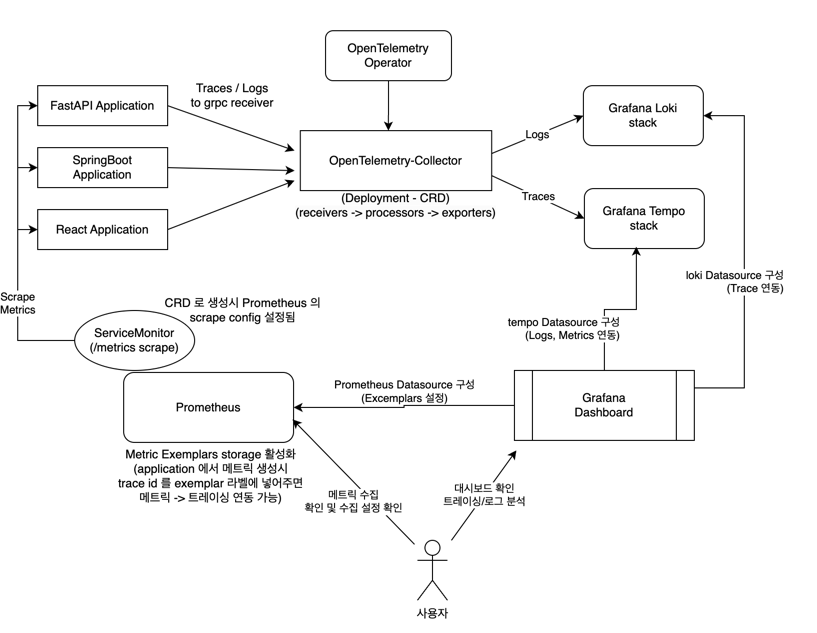

# Observability

> TKS 애플리케이션의 트레이싱(Tracing)과 로깅(Logging) 관리를 위한 Observability 구성 요소입니다.

---

## 목차

1. [Observability 개요](#1-observability-개요)
2. [Observability 아키텍처](#2-observability-아키텍처)
3. [구성 요소별 상세 안내](#3-구성-요소별-상세-안내)

---

## 1. Observability 개요

> Observability는 애플리케이션의 트레이싱, 로깅, 메트릭을 수집 및 분석하여 성능 모니터링과 문제 진단을 지원합니다.

- 구성된 주요 스택은 다음과 같습니다:

| 구성 요소                 | 역할 및 기능                          |
|------------------------|-----------------------------------|
| OpenTelemetry Collector | 애플리케이션 로그 및 트레이스 데이터 수집 |
| Grafana Tempo          | 트레이스 데이터 저장 및 분석             |
| Loki                   | 로그 데이터 저장 및 분석                |

---

## 2. Observability 아키텍처

> 아래 아키텍처는 TKS 애플리케이션의 Observability 데이터 흐름과 구성 요소의 연동 방식을 보여줍니다.

- 각 애플리케이션(FastAPI, SpringBoot, React 기반)은 OpenTelemetry Collector 에 트레이스와 로그 데이터를 전달합니다.
- 트레이스 데이터는 Grafana Tempo 에 저장 및 분석됩니다.
- 로그 데이터는 Loki 에 저장되어 분석됩니다.
- Prometheus 는 메트릭 데이터를 수집하여 Grafana와 함께 데이터 통합 분석 환경을 제공합니다.

---

## 3. 구성 요소별 상세 안내

> 각 구성 요소에 대한 세부 설치 및 운영 관리는 아래 문서를 참고하십시오.

- [OpenTelemetry Collector](opentelemetry_collector.md)
- [Grafana Tempo](tempo.md)
- [Grafana Loki](loki.md)

---

