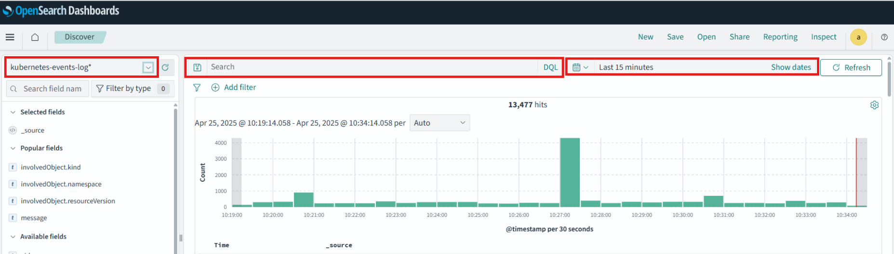
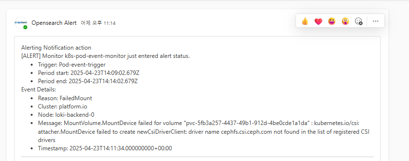
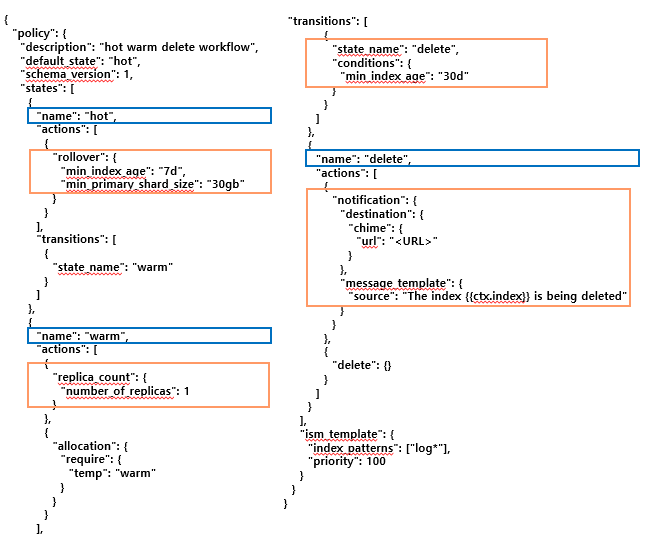
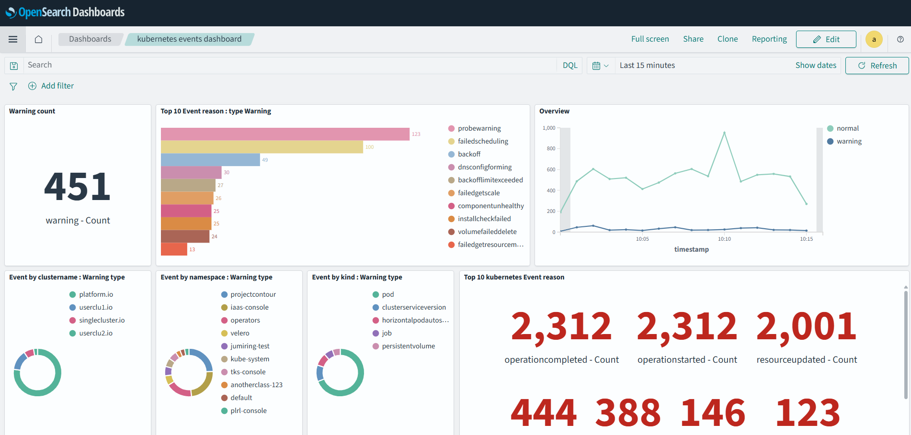

# OpenSearch 운영 매뉴얼

>본 문서는 OpenSearch 설치 및 운영 가이드입니다.

## 목차

1. [설치 및 설정](#1-설치-및-설정)
2. [운영](#2-운영)
3. [트러블슈팅](#3-트러블슈팅)

## 개요
OpenSearch는 로그 및 시계열 데이터 분석을 위한 오픈소스 검색 및 분석 엔진입니다. 분산 아키텍처를 가진 확장성 높은 시스템으로, 로그 분석, 실시간 애플리케이션 모니터링, 클릭스트림 분석 등 다양한 용도로 활용됩니다.

**OpenSearch 주요 구성 요소 및 역할**

| 노드 유형                        | 역할 설명 |
|-------------------------------|-----------|
| **Master Node**               | 클러스터의 메타데이터(인덱스 매핑, 샤드 할당 등)를 관리하고 클러스터 상태를 조정합니다. <br> - 샤드 할당 결정, 노드 상태 감시 등의 제어 플레인 역할 수행 <br> - 일반적으로 **3개 이상의 Replica**로 구성하여 고가용성 확보 |
| **Data Node**                 | 실제 데이터를 저장하고 검색 요청을 처리합니다. <br> - 샤드 데이터를 보유하며, 인덱싱·쿼리·집계 작업의 대부분이 이 노드에서 수행됨 <br> - **Hot/Warm 구조**로 구분해 성능과 비용을 최적화 가능 |
| **Coordinator Node**<br>(또는 Client Node) | 클라이언트로부터 요청을 받아 적절한 Data Node에 분산시킵니다. <br> - 자체 데이터 저장 없이 **라우팅, 집계, 조합** 등의 역할만 수행 <br> - 대규모 트래픽 처리 시 Coordinator Node를 통해 **부하 분산** |

## 1. 설치 및 설정
Bastion 또는 설치할 클러스터의 마스터 노드에서 진행합니다.

### 1.1 사전 준비
### Helm 설치: 
[Helm GitHub 릴리즈 페이지 바로가기](https://github.com/helm/helm/releases)

```bash
# Helm 설치 파일 다운로드
wget https://get.helm.sh/helm-v3.15.3-linux-amd64.tar.gz

# 압축 해제
tar -zxvf helm-v3.15.3-linux-amd64.tar.gz

# 바이너리 복사
sudo cp linux-amd64/helm /usr/local/bin/helm

# 설치 확인
ls -al /usr/local/bin/helm
```

### Helm Repository 등록

``` bash
# OpenSearch 공식 Helm 레포 등록 
helm repo add opensearch https://opensearch-project.github.io/helm-charts/

# Helm 레포지토리 정보 업데이트
helm repo update

# 설치 가능한 차트 확인
helm search repo opensearch
```

### max_map 확장

>OpenSearch는 내부적으로 `mmapfs` 스토리지를 사용합니다.  
`mmapfs`는 shard 인덱스를 메모리에 매핑하여 처리하는 구조로, **충분한 가상 메모리 주소 공간**이 필요합니다.

   > 따라서 OpenSearch가 배포될 **각 워커 노드**에 대해 `vm.max_map_count` 값을 증가시켜야 합니다.

```bash
# 기존 65530 -> 262144
# vm.max_map_count 변경 (재부팅 시 초기화됨)
sudo sysctl -w vm.max_map_count=262144

# 변경 확인
cat /proc/sys/vm/max_map_count

# 재부팅 후에도 유지하려면 아래와 같이 하면 됩니다.

# 설정 파일에 추가
sudo vi /etc/sysctl.conf

# 아래 항목을 마지막 줄에 추가
vm.max_map_count=262144
```

### 네임스페이스 생성 
OpenSearch 리소스가 배포될 namespace를 생성합니다. (namespace 이름 opensearch 권장)

``` bash
kubectl create namespace {namespace 이름}
```

### OpenSearch 및 Dashboard Helm 배포
>OpenSearch는 여러 역할로 구성된 노드(Master, Coordinator, Hot, Warm 등)와 Dashboard 구성 요소로 분리되어 있습니다.  
아래는 각 컴포넌트를 Helm을 이용해 설치하는 명령어입니다.

### 배포 명령어

```bash
# Master 노드 배포
helm install opensearch-master opensearch/opensearch --namespace opensearch -f 1.master-values.yaml

# Coordinator 노드 배포
helm install opensearch-coordinator opensearch/opensearch --namespace opensearch -f 2.coordinator-values.yaml

# Hot Data 노드 배포
helm install opensearch-hot-data opensearch/opensearch --namespace opensearch -f 3.hot-data-values.yaml

# Warm Data 노드 배포
helm install opensearch-warm-data opensearch/opensearch --namespace opensearch -f 4.warm-data-values.yaml

# Dashboard 배포
helm install opensearch-dashboard opensearch/opensearch-dashboards --namespace opensearch -f 5.dashboard-values.yaml
```

### 업그레이드 명령어
```bash
helm upgrade opensearch-master opensearch/opensearch --namespace opensearch -f 1.master-values.yaml

helm upgrade opensearch-coordinator opensearch/opensearch --namespace opensearch -f 2.coordinator-values.yaml

helm upgrade opensearch-hot-data opensearch/opensearch --namespace opensearch -f 3.hot-data-values.yaml

helm upgrade opensearch-warm-data opensearch/opensearch --namespace opensearch -f 4.warm-data-values.yaml

helm upgrade opensearch-dashboard opensearch/opensearch-dashboards --namespace opensearch -f 5.dashboard-values.yaml
```

### 삭제 및 정리 명령어
```bash
# 컴포넌트별 삭제
helm uninstall opensearch-master --namespace opensearch
helm uninstall opensearch-coordinator --namespace opensearch
helm uninstall opensearch-hot-data --namespace opensearch
helm uninstall opensearch-warm-data --namespace opensearch
helm uninstall opensearch-dashboard --namespace opensearch

# PVC (Persistent Volume Claim) 전체 삭제
kubectl delete pvc --namespace opensearch --all
```

### 설치 확인
```bash
helm list --namespace {namespace 이름}
```
---
### 1.2 cert-manager 설치 및 Self-Signed 인증서 구성

>`cert-manager`란 오픈서치 인증서 구성을 편리하게 하기 위해 사용
오픈서치 노드간 통신을 위해 인증서가 필요한데, 이런 인증서를 간단하게 secret 으로 관리할 수 있고 자동 갱신 처리를 해주는 역할을 합니다.

>cert-manager 를 설치하면 생성되는 crd (Certificate, Cert-Manager, CertifcateRequest) 를 통해 Secret 이 생성되고, 이 시크릿을 spoditor 를 통해 statefulset 에 각각 마운트해줍니다.


### Self-Signed 인증서 구성

1. **ClusterIssuer 생성**  
   - 파일: `01.selfSignedCA.yaml`

2. **CA 인증서 생성 (root CA)**  
   - 파일: `02.caCert.yaml`

3. **중간 Issuer 정의**  
   - 파일: `03.intermediateCA.yaml`

4. **Admin 인증서 발급**  
   - 파일: `04.adminCert.yaml`

5. **Master 노드 인증서 (3개)**  
   - 파일: `05.masterCert.yaml`

6. **Hot/Warm 노드 인증서 (3개)**  
   - 파일: `06.dataCertHW.yaml`

7. **Coordinator 노드 인증서 (3개)**  
   - 파일: `07.coordiCert.yaml`

8. **Ingress 인증서 (현재 사용하지 않음)**  
   - 파일: `08.ingressCert.yaml` *(Ingress 미생성으로 비활성)*


모든 파일은 레포지토리 내 `opensearch/1_cert-manager/` 디렉토리에서 확인할 수 있습니다.  


### cert-manager 설치

- cert-manager 설치는 레포지토리의 다음 파일을 사용합니다:  
  `opensearch/1_cert-manager/cert-manager_1.9.1.yaml`

---

### 1.3 Spoditor 설치
> `Spoditor`는 statefulset에 각각 맞는 secret 을 탑재하기 위해 사용합니다.  statefulset은 yaml파일에서 같은 pod spec을 공유하기 때문에 시크릿 값을 각 statefulset마다 지정할 수 없고 같은 시크릿을 사용하게 됩니다.
이를 해결하기 위해 spoditor를 사용합니다. 

- Spoditor 설치는 레포지토리의 다음 파일을 사용합니다:
`opensearch/2_spoditor/spoditor.yaml`

---

### 1.4 OpenSearch 배포 (Helm)

> OpenSearch는 Helm Chart를 통해 여러 역할(Master, Coordinator, Hot/Warm Data 노드)로 나뉘어 배포됩니다.  
아래는 각 노드 유형에 따른 Helm values 설정 내용입니다.

#### helm values  공통 적용 사항

- OpenSearch 이미지: `2.15.0` (최신 버전)
- StorageClass: `nfs-client`
- tolerations, nodeAffinity 설정 제거  
  (사내 Kubernetes 클러스터의 워커 노드 4개에 분산 배포)
- demo 설정 비활성화:
  ```yaml
  DISABLE_INSTALL_DEMO_CONFIG: true
  ```
### master node helm values
Replica 개수: 3\
기존 ldap 관련 설정 제거 

파일 : 1.master_values.yaml

### coordinator node helm values
Replica 개수: 2\
ingress 비활성화 (node port 사용)
```yaml
ingress:
  enabled: false
```
파일 : 2.coordinator_values.yaml

### hot-data node helm values
Replica 개수: 1\
Storage 크기: 500Gi

파일: 3.hot-data_values.yaml

### warm-data node helm values

Replica 개수: 1\
Storage 크기: 500Gi

파일 : 4.warm-data_values.yaml

모든 파일은 레포지토리 내 `opensearch/3_opensearch_values/` 디렉토리에서 확인할 수 있습니다. 

---
### 1.5 OpenSearch Dashboard 배포 (Helm)
> OpenSearch Dashboard는 시각화 및 데이터 조회 기능을 제공합니다.  
> Helm Chart를 통해 배포되며, 이 환경에서는 Ingress 없이 NodePort 방식으로 외부 접속을 구성합니다.

### 주요 설정 요약
- **OpenSearch Host**: `https://10.120.105.31:31010`  
  → 클러스터 워커 1번 노드의 Coordinator 노드(NodePort 31010, 내부 9200 포트)

- **Dashboard 접속 방식**:  
  - Ingress 미사용
  - NodePort 서비스로 5601 포트를 31020으로 노출

  ```yaml
  service:
    type: NodePort
    nodePort: 31020
  ```

파일: 5.dashboard_values.yaml\
파일 경로: opensearch/3_opensearch_values/5.dashboard_values.yaml


### 1.6 기타 설정

OpenSearch 보안 및 클러스터 설정 관련 추가 작업들을 안내합니다.


### OpenSearch admin 계정 비밀번호 변경
OpenSearch는 기본 admin 계정이 **admin / admin**으로 설정되어 있습니다.  
운영 환경에서는 반드시 비밀번호를 변경해야 합니다.

#### 비밀번호 변경 절차
1. **admin 비밀번호 해시 생성 (Master Pod 내부)**
```bash
# Master Pod 접속 후 경로 이동
cd /usr/share/opensearch/plugins/opensearch-security/tools

# 해시 생성
./hash.sh -p {New password}

# 출력 예시
$2y$12$fDBNKZWNsuaaFbdM7CF1vOpUi5U2mAtzHI51/ufwd1YgBHQFkyLQy
```

2. **기존 사용자 정보 확인**
```bash
cd /usr/share/opensearch/config/opensearch-security
cat internal_users.yml
```
3. **Helm values에 hash 반영**

internal_users.yml 의 내용을 helm values (1.master-values.yaml) 의
data -> internal_users.yml: |- 부분 아래에 붙여넣기 한 뒤,1에서 생성한 해시로 변경합니다.

```bash
data:
  internal_users.yml: |-
    admin:
      hash: "$2y$12$fDBN..."  # 위에서 생성한 해시로 변경
```

4. **Master node의 Helm upgrade 수행**

helm upgrade를 실행하여 재배포하면 변경된 패스워드가 적용됩니다.
```bash
helm upgrade opensearch-master opensearch/opensearch \
  --namespace opensearch \
  -f 1.master_values.yaml
```
---

### max_shards_per_node 설정 변경

OpenSearch는 환경에 따라 샤드 조정이 필요합니다.

- 변경값: 3000 (노드당 최대 샤드 개수)

**설정 방법**
1. OpenSearch Dashboard 접속
2. *Dev Tools* 메뉴로 이동
3. 아래 API 실행:
```bash
PUT _cluster/settings
{
  "persistent": {
    "cluster.max_shards_per_node": "3000"
  }
}
```
- 위 설정은 클러스터에 지속적으로 적용됩니다.
---
### 1.7 OpenSearch Dashboard 포털 임베디드 설정
OpenSearch Dashboard는 `iframe`을 통해 외부 포털 등에 임베디드할 수 있습니다.  

#### 1. Keycloak 설정
1. Keycloak 접속 → 해당 Realm 선택
2. `Realm Settings` > `Security Defenses` > `Content-Security-Policy` 메뉴 이동
3. `frame-ancestors` 항목에 임베디드 대상 도메인을 추가
```text
frame-src 'self'; frame-ancestors 'self' http://localhost:* http://your.portal.domain; object-src 'none';
```

 frame-ancestors란?
 frame-ancestors는 CSP의 디렉티브 중 하나로, 어떤 도메인이 현재 페이지를 frame 또는 iframe안에 삽입할 수 있는지를 제어합니다.\
 예:
 ```text
 Content-Security-Policy: frame-ancestors 'self' https://your-app.com;
 ```

> iframe이 로드될 포털의 도메인을 만드시 명시해야 합니다.

#### 2. OpenSearch Dashboard 설정
OpenSearch Dashboard에서도 iframe 사용을 위해 쿠키 보안 설정을 변경합니다.
포털에서 로그인한 keycloak 정보를 iframe 내 도메인으로 전달하기 위함입니다.
`5.dashboard_values.yaml` 파일에 다음 항목을 추가합니다.
```bash
opensearch_security:
  cookie:
    secure: true
    isSameSite: "None"
```

#### 3. 임베딩용 Dashboard iFrame 코드 복사
1. Dashboard 화면 접속
2. 상단메뉴에서 `Share` 버튼 클릭
3. Embed Code 탭 선택 후, Copy iFrame Code 버튼 클릭

> 복사된 iframe 코드를 원하는 포털 HTML에 붙여넣기

예시
```bash
<!DOCTYPE html>
<html lang="en">
<head>
    <meta charset="UTF-8">
    <meta name="viewport" content="width=device-width, initial-scale=1.0">
    <title>Document</title>
</head>
<body>
    <iframe src="https://opensearch-dashboard.tg-cloud.co.kr/app/dashboards?security_tenant=global#/view/7adfa750-4c81-11e8-b3d7-01146121b73d?embed=true&_g=(filters%3A!()%2CrefreshInterval%3A(pause%3A!f%2Cvalue%3A900000)%2Ctime%3A(from%3Anow-24h%2Cto%3Anow))" height="600" width="800"></iframe>
</body>
</html>
```
#### 4. Local 테스트 방법
테스트를 위해 아래와  같이 HTML을 실행할 수 있습니다:
1. 파일명을 index.html로 저장
2. 해당 디렉토리에서 아래 명령어 실행
```bash
python -m http.server 8080
```
3. 브라우저에서 http://localhost:8080 접속하여 임베딩 확인


## 2. 운영
## 목차
1.[로그 조회](#21-로그-조회-방법)\
2.[클러스터 상태 확인](#22-클러스터-상태-모니터링)\
3.[인덱스관리](#23-인덱스-관리)

### 2.1 로그 조회 방법
>시스템 운영 중 문제 해결이나 상태 모니터링을 위해 로그를 조회하는 방법에는 크게 두 가지가 있습니다. Dashboard의 Dev Tools를 사용하는 방법과 Overview를 통해 확인하는 방법입니다.

- Dev Tools을 사용하여 로그 조회\
OpenSearch Dashboards 접속 > Dev Tools > 쿼리 작성 및 실행

로그 조회 쿼리 예시 : 
```bash
# 특정 인덱스의 최근 로그 20개 조회
GET your-logs-*/_search
{
  "size": 20,
  "sort": [
    {
      "@timestamp": {
        "order": "desc"
      }
    }
  ],
  "_source": ["@timestamp", "log_level", "message", "service", "host.name"]
}
```


- Overview를 사용하여 로그 조회\
OpenSearch Dashboards 접속 > Discover > 좌측 상단의 인덱스 패턴 선택 드롭다운에서 로그 인덱스 패턴 선택 (예: logs-*)

  - 기본 사용법 : \
     중앙 상단의 검색 필드에 쿼리를 이용하여 필터링 가능\
     우측 상단의 시간 선택기를 사용하여 조회할 시간 범위 설정 가능




### 2.2 클러스터 상태 모니터링
> OpenSearch 클러스터의 상태를 지속적으로 모니터링하는 것은 **장애 예방 및 성능 유지에 핵심적인 작업**입니다.  
이 섹션에서는 상태 점검 방법과 주요 API, 알림 설정 방법을 안내합니다.


 #### 2.2.1 클러스터 Health Check
 클러스터의 상태는 다음 세 가지 중 하나로 표시됩니다:
| 상태   | 의미 |
|--------|------|
| Green  | 모든 샤드가 정상적으로 할당됨 (정상) |
| Yellow | 일부 replica 샤드가 할당되지 않음 (주의) |
| Red    | primary 샤드 중 할당되지 않은 것이 있음 (위험) |

OpenSearch Dashboard의 **Dev Tools**를 활용해 다음 명령어로 현재 클러스터의 상태를 확인할 수 있습니다.

```
GET _cluster/health
GET _cluster/health/<index>
```

#### 2.2.2 주요 API(Dev Tools 기준)
 
```bash

# 클러스터 Health 상태 (Green / Yellow / Red)
GET _cluster/health

# 샤드 상태 확인 (할당 상태, 노드 분산 등)
GET _cat/shards?v=true

# 샤드 할당 상세 설명 (할당 실패 시 원인 확인)
GET _cluster/allocation/explain

# 노드 목록 및 기본 정보
GET _cat/nodes?v=true

# 노드별 상세 통계 (Heap, 디스크, CPU 등)
GET _nodes/stats

# 샤드 할당 현황 (노드별 디스크 사용량 등 포함)
GET _cat/allocation?v=true

# 특정 인덱스 데이터 조회 (간단 쿼리)
GET [index_name]/_search

# 인덱스 매핑 구조 확인
GET [index_name]/_mapping
```
>[index_name]에는 실제 사용 중인 인덱스명을 입력하세요.\
> 예: log-2024.04.23, fluentd-kube-* 등

#### 2.2.3🔔 알림 설정(OpenSearch Alerting Plugin 기반)
> 이 방식은 Dashboards UI 기반으로 설정 가능하며, 별도의 외부 도구 없이 OpenSearch 내에서 알림 구성이 가능합니다.\
가능한 알림 채널 : Slack, Chime, Microsoft Teams, Custom webhook, Email,Amazon SNS

**- Alerting 기능 구성요소**

| 구성요소 | 설명 |
|----------|------|
| Monitor | 감시 대상 쿼리 (ex. 에러 로그, 시스템 상태 등) |
| Trigger | Monitor의 결과값을 평가하여 조건 만족 시 동작 |
| Action | Slack/Email/Webhook 등으로 알림 전송 |
| Destination | 알림을 보낼 외부 채널 정의 (Slack, Email 등)

**- 설정 순서**
> Monitor 유형에 따라 설정 방식이 달라질 수 있으므로 [공식 문서](https://docs.opensearch.org/docs/latest/observing-your-data/alerting/monitors/) 참고를 권장합니다.
 1. Channels 생성
   - OpenSearch Dashboards → `Notification` → `Channels` → `Create Channel`  
   - Slack, Teams, Webhook 등 채널 설정 가능\
   [Channels 관련 opensearch 문서](https://docs.opensearch.org/docs/latest/observing-your-data/notifications/index/)

 2. Monitor 생성
   - OpenSearch Dashboards → `Alerting` → `Monitors` → `Create Monitor`
   - **예시 설정:**
     - Monitor type: `Per query monitor`
     - Monitor definition method: `Extraction query editor`
     - 원하는 인덱스 선택 후 쿼리 입력
   ```json
     {
       "size": 1,
       "query": {
         "bool": {
           "filter": [
             {
               "range": {
                 "@timestamp": {
                   "gte": "now-5m"
                 }
               }
             },
             {
               "match": {
                 "log_level": "ERROR"
               }
             }
           ]
         }
       }
     }
  ```
3. Trigger 추가
   - 조건 예시:  
     ```text
     ctx.results[0].hits.total.value > 0
     ```
  
4. Action 설정
   - Trigger와 연결할 Action을 정의하고,  
     앞서 만든 Channel을 선택하여 알림 전송  
   - 알림 메시지는 커스터마이징 가능

**- alert 메시지 예시**
> 아래는 Microsoft Teams에 전송된 알림 메시지 예시입니다:



### 2.3 인덱스 관리
> 효율적인 OpenSearch 운영을 위해서는 체계적인 인덱스 관리가 필수적입니다.\
 이 섹션에서는 인덱스 상태 관리, 템플릿 구성에 대해 설명합니다.

 #### 2.3.1 인덱스 상태 관리 (ISM)
- OpenSearch는 Index State Management(ISM)은 인덱스의 상태를 자동으로 관리합니다.

인덱스의 주기와 크기 등을 기준으로 작업이 수행되며, 특정 기준에 따라 Hot, Warm, Delete 등 다양한 상태로 전환하고 삭제할 수 있습니다.
| 단계   | 설명                                       | 
|--------|--------------------------------------------|
| Hot    | 활발한 쓰기와 쿼리가 발생하는 단계         |
| Warm   | 읽기는 있지만 쓰기가 거의 없는 단계         | 
| Cold   | 읽기가 드물고 쓰기가 없는 단계             | 
| Delete | 더 이상 필요없는 데이터 삭제               | 

Policy를 통해 인덱스 관리가 이루어집니다.

- ISM  사례
  -  로그 데이터: 일별 인덱스 + 30일 Hot → 60일 Warm → 180일 Cold → 삭제
  -  메트릭 데이터: 주별 인덱스 + 7일 Hot → 30일 Warm → 90일 Cold → 삭제
  -  트랜잭션 데이터: 월별 인덱스 + 30일 Hot → 90일 Warm → 365일 Cold → 삭제

Policy 예시 :\


 #### 2.3.2 인덱스 템플릿
- index templates는 새로운 인덱스가 생성될 때 자동으로 적용되는 설정을 정의합니다. 매핑,설정,별칭 등을 일관성 있게 관리할 수 있습니다.

다음과 같은 사항을 설정할 수 있습니다.

- 매핑(Mappings): 데이터 구조와 필드 데이터 타입을 설정할 수 있습니다.
- 인덱스 설정(Index Settings): 샤드(Shard) 수, 레플리카(Replica) 수, 인덱스 코덱(codec) 등을 설정할 수 있습니다.
- 별칭(Aliases): 이 설정을 통해 인덱스에 별칭을 적용할 수 있습니다.

템플릿 생성 예시(Dev Tools에서 진행) :
```bash
PUT _template/your-template-name
{
 "index_patterns": ["pattern-*"],
 "template": {
   "settings": {
     "number_of_shards": 3,
     "number_of_replicas": 1
   },
   "mappings": {
     "properties": {
       "field1": {
         "type": "text"
       },
       "field2": {
         "type": "keyword"
       }
     }
   },
   "aliases" : {
     "your-alias" : {}
   }
 }
}
```

### 2.4 대시보드 및 시각화 구성
- OpenSearch Dashboards는 데이터를 시각화하고 분석하는 도구입니다.

OpenSearch Dashboards 접속 > Dashboards > Create > Create new\
시각화 유형 선택(막대 차트, 라인 차트, 파이 차트 등) > 데이터 소스 선택 > 메트릭 설정 > 저장

대시보드 예시 : 



## 3. 트러블슈팅
## 목차
1.[인덱스 샤드 할당 실패](#31-인덱스-샤드-할당-실패-문제-해결)
 - [문제 진단하기](#311-문제-진단하기)
 - [주요 샤드 할당 실패 원인과 해결 방법](#312-주요-샤드-할당-실패-원인과-해결-방법)

2.[Helm 설치 및 업그레이드 관련 이슈](#32-helm-설치-및-업그레이드-관련-이슈)
  - [ingress 대신 nodeport-사용](#321-ingress-대신-nodeport-사용)
  - [opensearch 이미지 업그레이드 2.15.0 버전](#322-opensearch-이미지-업그레이드-250--2150)

### 3.1 인덱스 샤드 할당 실패 문제 해결
> OpenSearch 운영 중 발생하는 문제 중 하나는 인덱스 샤드가 정상적으로 할당되지 않는 현상입니다.

#### 3.1.1 문제 진단하기
1. 클러스터 상태 확인
먼저 클러스터 전체 상태와 샤드 레벨까지 확인합니다:

```bash
# 클러스터 전체 상태 확인
GET _cluster/health
```

```bash
# 샤드 레벨까지 상세 상태 확인
GET _cluster/health?level=shards
```

   Red 상태인 경우, 하나 이상의 프라이머리 샤드가 할당되지 않은 상태입니다.


2. 미할당 샤드 상세 정보 조회
구체적인 원인 파악을 위해 할당되지 않은 샤드의 상세 정보를 확인합니다:
```bash
# 미할당 샤드 상세 정보 조회
GET _cluster/allocation/explain?pretty
```

3. 특정 인덱스의 샤드 상태 확인
특정 인덱스에 대한 샤드 상태만 확인하려면:
```bash
# 특정 인덱스의 샤드 상태 확인
GET _cluster/health/[인덱스명]?level=shards
```

#### 3.1.2 주요 샤드 할당 실패 원인과 해결 방법

**1. 손상된 샤드 또는 오래된 샤드 복사본 문제**

**증상:**
```json
"reason": "CLUSTER_RECOVERED",
"allocate_explanation": "cannot allocate because all found copies of the shard are either stale or corrupt"
```

**원인:**

>클러스터 재시작이나 장애 후 모든 샤드 복사본이 손상되거나 오래되었기 때문에 할당할 수 없다는 것을 의미합니다.

**해결 방법:**
> /_cluster/reroute API를 사용하여 수동으로 샤드 재할당을 시도할 수 있습니다. 해당 샤드가 복구 가능한 상태라면, 이 방법으로 복구할 수 있습니다.
```bash
POST _cluster/reroute
{
  "commands": [
    {
      "allocate_empty_primary": {
        "index": "[문제가 된 인덱스명]",
        "shard": [샤드번호],
        "node": "[노드이름]",
        "accept_data_loss": true
      }
    }
  ]
}
```

**⚠️주의:**
> 이 명령어는 샤드를 빈(primary) 샤드로 할당하여 데이터를 새로 생성하게 하며, accept_data_loss 옵션을 사용하여 데이터 손실을 수용합니다.이 방법은 **데이터가 완전히 손실**될 수 있기 때문에 주의해서 사용해야 합니다.

**2. 프라이머리 샤드가 활성화되지 않아 레플리카 샤드 할당 불가**

**증상 :** 미할당 Shard 정보 조회 결과
```json
"decider": "replica_after_primary_active",
"decision": "NO",
"explanation": "primary shard for this replica is not yet active"
```

**원인:**
>인덱스의 복제본이 할당되지 않았음을 의미합니다.\
프라이머리(기본) 샤드가 먼저 활성화되어야 레플리카 샤드가 할당될 수 있습니다.\
프라이머리 샤드 자체에 문제가 있어 활성화되지 않은 상태입니다.

**해결 방법:**
>먼저 프라이머리 샤드를 복구한 후, 레플리카 샤드는 자동으로 할당됩니다.
```bash
# 1. 프라이머리 샤드 복구
POST _cluster/reroute
{
  "commands": [
    {
      "allocate_empty_primary": {
        "index": "[문제가 된 인덱스명]",
        "shard": [샤드번호],
        "node": "[노드이름]",
        "accept_data_loss": true
      }
    }
  ]
}

# 2. 필요시 레플리카 수 조정
PUT [인덱스명]/_settings
{
  "number_of_replicas": 1
}
```


### 3.2 Helm 설치 및 업그레이드 관련 이슈
> 사내 클러스터에서 OpenSearch를 Helm을 통해 배포할 때 주의해야 할 설정과 업그레이드 시 발생할 수 있는 문제를 정리합니다.

#### 3.2.1 Ingress 대신 NodePort 사용
사내 클러스터 환경에서 Ingress를 사용할 경우, 다음과 같은 문제가 발생할 수 있습니다:

- 개인 PC마다 hosts 파일 수정을 요구

- 또는 public DNS 등록 시 내부 서비스가 외부에 노출됨

이에 따라 접속 경로는 Ingress가 아닌 NodePort를 사용하는 방식으로 통일하는 것을 권장합니다.

- coordinator values service 설정
- dashboard values service 설정
---
#### 3.2.2 OpenSearch 이미지 업그레이드: 2.5.0 → 2.15.0
최신 버전(OpenSearch 2.15.0)에서는 보안과 구성 관련 설정이 강화되면서 몇 가지 추가 설정이 필요합니다.

**1. 컨테이너 무한 재시작 문제**

최신 2.15.0 버전 사용시에 아래 오류가 발생하며 컨테이너 무한 재시작됩니다.

```bash
No custom admin password found. Please provide a password via the environment variable OPENSEARCH_INITIAL_ADMIN_PASSWORD
```

**해결 방법:**

Helm values.yaml에 아래 환경 변수를 추가합니다:


```bash
extraEnvs:
  - name: OPENSEARCH_INITIAL_ADMIN_PASSWORD
    value: "{비밀번호}"
```

> ⚠️ 해당 비밀번호가 실제로 적용되기 위해서는 DISABLE_INSTALL_DEMO_CONFIG: false로 설정되어야 하며,
그렇지 않을 경우 기본 admin 계정은 여전히 비밀번호가 admin입니다.

또한, internal_users.yml 파일을 통해 초기 admin 계정의 비밀번호를 Helm values에 설정할 수 있습니다.

**2. DISABLE_INSTALL_DEMO_CONFIG 설정 변경**

버전 2.5.0에서는 master와 coordinator 노드에만 DISABLE_INSTALL_DEMO_CONFIG: true를 설정해도 충분했습니다.
하지만 2.15.0부터는 data 노드에도 동일한 설정이 필요합니다.

**3. Helm reinstall 시 PVC 제거 필요**

버전 업그레이드 후 Helm으로 OpenSearch를 재설치할 경우, 기존 PVC(PersistentVolumeClaim)를 반드시 삭제해야 합니다.
삭제하지 않으면 다음과 같은 문제가 발생합니다:

lucene.jar 버전 불일치로 인해 컨테이너가 무한 재시작

Helm uninstall 후에도 pod가 Terminating 상태에서 제거되지 않음

**해결 방법:**
```bash
kubectl delete pod [파드명] --grace-period=0 --force --namespace opensearch
```

image.pullPolicy 설정을 Always로 변경 후 install\
image:
  pullPolicy: Always
설치가 완료된 후에는 다시 IfNotPresent로 원복할 수 있습니다.

