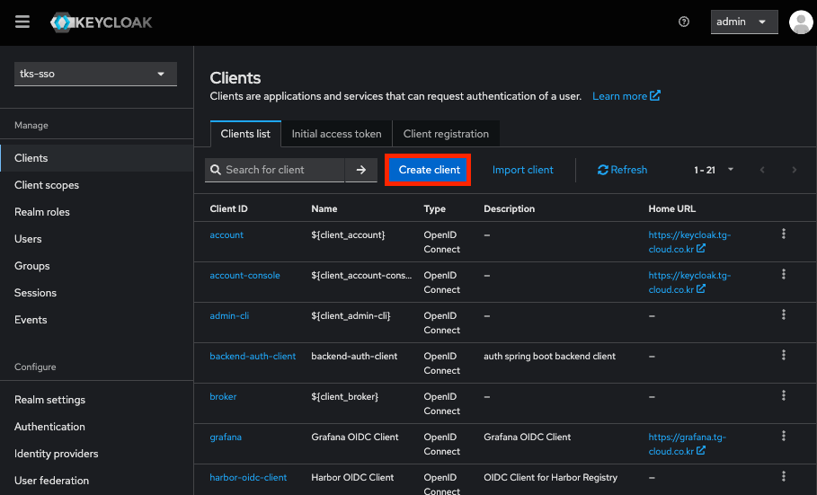
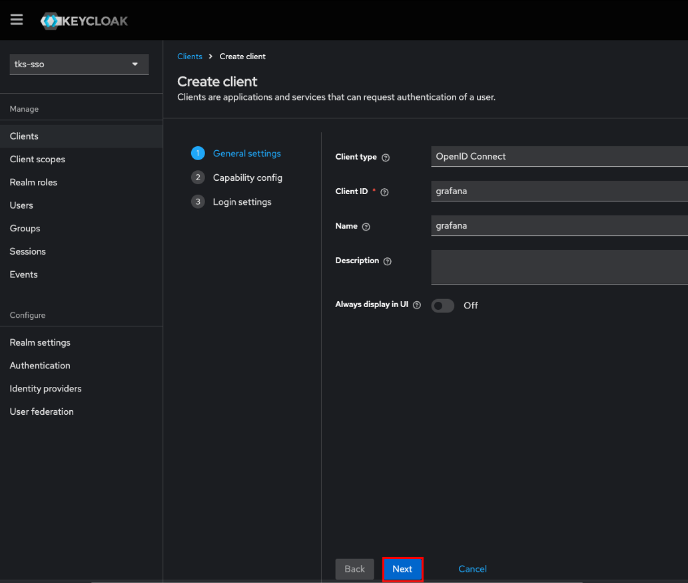
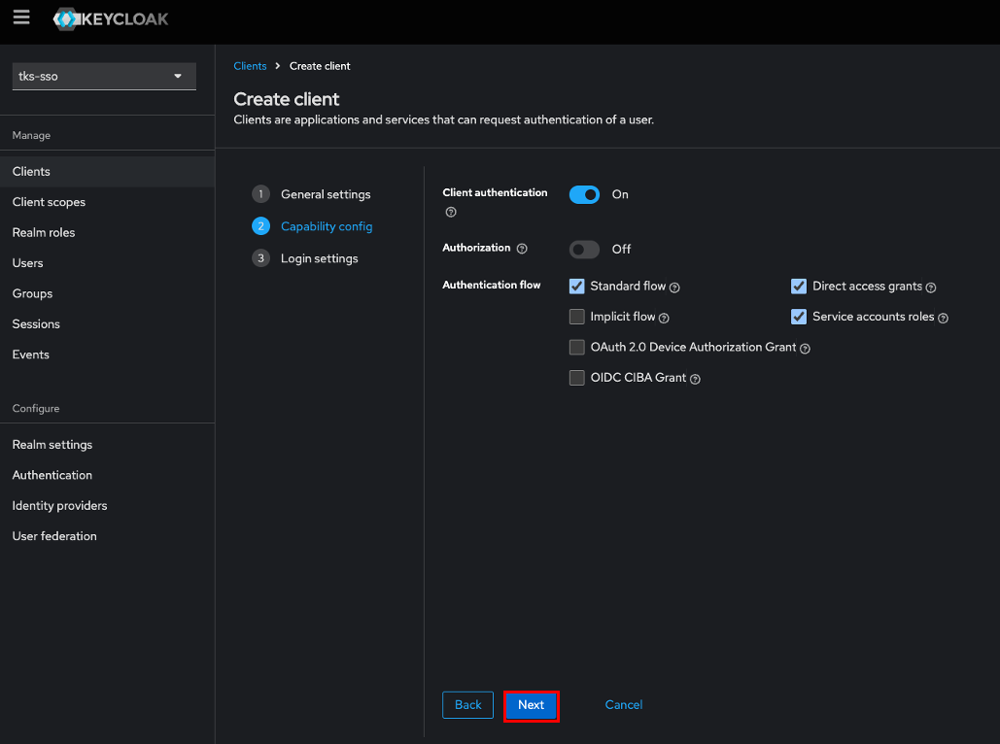
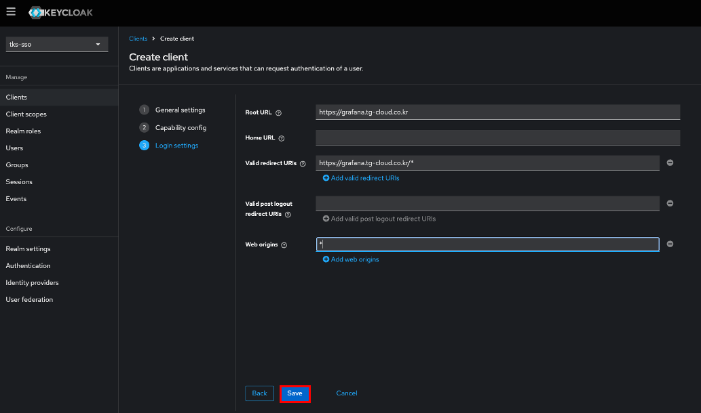
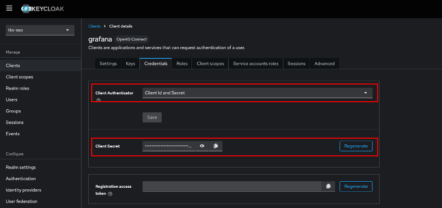
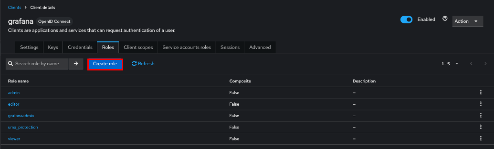
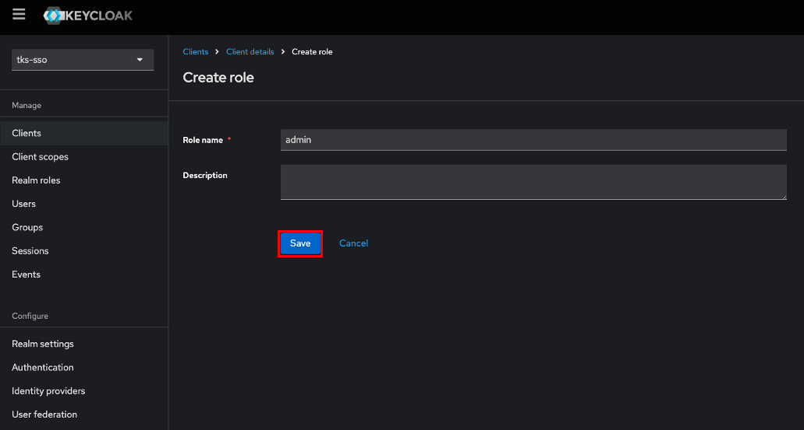
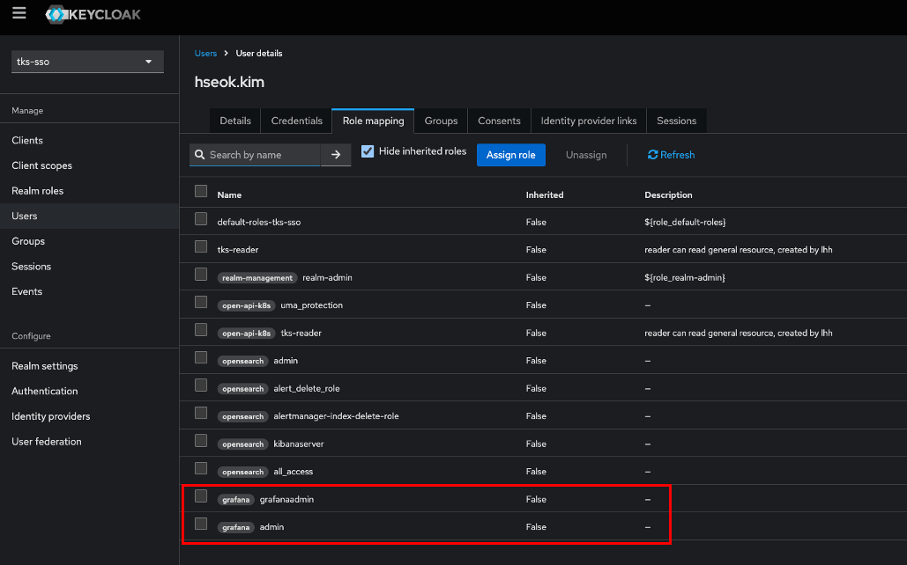

# Grafana OIDC

> Grafana 자체 로그인을 쓰지 않고, Keycloak 인증 서버를 확용하여 SSO를 기능을 구현합니다.

---

## 목차

1. [Keycloak - Client 구성](#1-keycloak---client-구성)
2. [Keycloak - Client Role 구성](#2-keycloak---client-role-구성)
3. [Grafana - OIDC Connect 구성](#3-grafana---oidc-connect-구성)


## 1. Keycloak - Client 구성

> idc 사용자가 open-api-k8s 서비스에 인증할 수 있도록 open-api-k8s client를 생성합니다.

1. open-api-k8s client 생성

  
  
  클라이언트 목록 화면에서 Create client 버튼 클릭

  
  
  Client type을 OpenID Connect로 선택, Client ID와 Name 필드를 채우고 Next 버튼 클릭
  _주의) Client ID는 open-api-k8s 애플리케이션 환경변수로 사용되며, Swagger OIDC 연동에 필요

  
  
  기본 설정에서 Client authentication 토글을 활성화하고 Next 버튼 클릭

  
  
  아래의 각 필드를 채우고 Next 버튼 클릭
   - Root URL: 인증 이후 사용자가 기본적으로 이동할 주소, 보통 서비스의 홈 URL 또는 대시보드 경로를 입력
   - Vaild redirect URIs: 로그인 후 리디렉션할 수 있는 허용된 URI 목록
   - Web origins: 브라우저 기반 클라이언트에서의 CORS 정책을 위해 필요한 도메인, 일반적으로 Root URL과 동일하게 설정


2. grafana client의 Authenticator 설정

  
  
  grafana 클라이언트의 Credentials 탭에서 Client Authenticator를 Client Id and Secret으로 선택  
  _주의) Client Secret은 grafana.ini 설정에 사용됨


## 2. Keycloak - Client Role 구성

> grafana 서비스 로그인시 Keycloak 에 설정한 User Role을 가지고 Grafana Role 이 자동 매핑될 수 있도록 Client Role 을 추가하여 User 별로 설정할 수 있도록 설정합니다.

1. Client Role 생성

  

  Client Role 항목에서 ``Create Role`` 버튼 클릭

  

  Role Name 설정 후 저장

  ```
  - Grafana Admin
  - Admin
  - Editor
  - Viwer 
  ```

  Grafana Role 종류


2. Client Role User 설정

  

  각 유저 권한에 맞게 Client Role 설정


## 3. Grafana - OIDC Connect 구성

> Grafana 서비스에서 자체 로그인 방식이 아닌 Keycloak 인증 서버를 확용하여 SSO를 기능을 구현합니다.

1. Grafana Config 설정

```yaml
apiVersion: v1
kind: Secret
metadata:
  labels:
    app.kubernetes.io/component: grafana
    app.kubernetes.io/name: grafana
    app.kubernetes.io/part-of: kube-prometheus
    app.kubernetes.io/version: 11.1.0
  name: grafana-config
  namespace: monitoring
stringData:
  grafana.ini: |
    [date_formats]
    default_timezone = UTC
    
    [server]
    root_url = <Grafana 도메인 URI 정보>
    
    [auth.generic_oauth]
    enabled = true
    name = <로그인 버튼에 표시될 이름>
    allow_sign_up = true
    client_id = <Grafana Client 이름>
    client_secret = <Grafana client secret 정보>
    scopes = openid email profile offline_access roles
    
    auth_url = https://<Keycloak 도메인 주소>/realms/<Keyclaok Realm 이름>/protocol/openid-connect/auth
    token_url = https://<Keycloak 도메인 주소>/realms/<Keyclaok Realm 이름>/protocol/openid-connect/token
    api_url = https://<Keycloak 도메인 주소>/realms/<Keyclaok Realm 이름>/protocol/openid-connect/userinfo
    signout_redirect_url = https://<Keycloak 도메인 주소>/realms/<Keyclaok Realm 이름>/protocol/openid-connect/logout?post_logout_redirect_uri=<Grafana 도메인 URI 인코딩 형식>%2Flogin

    role_attribute_path = contains(roles[*], 'admin') && 'Admin' || contains(roles[*], 'editor') && 'Editor' || 'Viewer'
    allow_assign_grafana_admin = true
    role_attribute_path = contains(roles[*], 'grafanaadmin') && 'GrafanaAdmin' || contains(roles[*], 'admin') && 'Admin' || contains(roles[*], 'editor') && 'Editor' || 'Viewer'
    login_attribute_path = preferred_username
    
    [auth]
    disable_login_form = false
    oauth_auto_login = true
    [security]
    allow_embedding: true
    cookie_secure: false
    cookie_samesite: lax
type: Opaque
```

Grafana 설정에 auth.generic_oauth 를 통해 keycloak 인증 서버와 연결 합니다.

각 항목에 대한 설명

server

- root_url : Grafana가 외부에서 접근되는 루트 URL 입니다. Keycloak Client 생성시 입력한 Root URL 과 일치해야 합니다.

auth.generic_oauth

- enabled : auth.generic_oauth 활성화
- name : oauth 이름 -> 로그인 버튼에 표시될 이름입니다.
- allow_sign_up : OAuth 로그인 시 사용자 자동 등록 허용
- client_id : keycloak client ID
- client_secret : keycloak client Secret
- scopes : OIDC 요청 범위 - 사용자 정보 요청 범위 설정

- auth_url : 로그인 요청을 보낼 keycloak의 인증 엔드포인트
- token_url : 로그인 후 Access Token을 받을 엔드포인트
- api_url : 로그인한 사용자의 정보를 가져올 사용자 정보 API

- signout_redirect_url : 로그아웃 리디렉션, 로그아웃 후 돌아올 위치를 URL-encoded로 포함해야 합니다.

- role_attribite_path : Keycloak 사용자 정보에서 roles 배열을 파싱하여 Grafana 내부 역할(GrafanaAdmin, Admin, Editor, Viewer)을 자동으로 부여합니다.
  - GrafanaAdmin은 allow_assign_grafana_admin = true 설정이 있어야 적용됩니다.

- login_attributes_path : 로그인 시 사용자명으로 사용할 항목입니다.

auth

- disable_login_form : 기본 사용자/비밀번호 로그인 폼을 유지 (false면 둘 다 사용 가능)
- oauth_auto_login : /login 진입 시 OIDC 자동 로그인 시도 (true면 바로 Keycloak으로 리디렉션)

security

- allow_embedding : 다른 앱에서 iframe으로 Grafana를 embed할 수 있도록 허용
- cookie_secure : HTTPS에서만 쿠키 사용 (false면 HTTP에서도 쿠키 허용)
- cookie_samesite : SSO를 위한 cross-origin 쿠키 정책 설정 (lax, none, strict)
