# 사용자 관리

> 운영자가 console 을 사용하는 사용자들을 관리하는 화면입니다. 생성/수정/삭제 등 기능이 있으며 해당 기능은 키클락과 연동이 됩니다.

---

## **목차**
1. [유저 정보 조회](#1-유저-정보-조회)
   * [1.1. 리스트 조회](#11-리스트-조회)
   * [1.2. 상세정보 조회](#12-상세정보-조회)
2. [유저 생성](#2-유저-생성)
   * [2.1. 생성 및 확인](#21-생성-및-확인) 
   * [2.2. 키클락 내 유저 생성되었는지 확인](#22-키클락-내-유저-생성되었는지-확인)
3. [유저 수정](#3-유저-수정)
   * [3.1. 수정 및 확인](#31-수정-및-확인)
   * [3.2. 키클락 내 정보 수정되었는지 확인](#32-키클락-내-정보-수정되었는지-확인)
4. [유저 삭제](#4-유저-삭제)
   * [4.1. 삭제 및 확인](#41-삭제-및-확인)
   * [4.2. 키클락 내 유저 삭제 되었는지 확인](#42-키클락-내-유저-삭제-되었는지-확인)

---

## 1. 유저 정보 조회

### 1.1. 리스트 조회
* 화면 진입시 현재 console에서 관리되는 유저 정보가 조회됩니다.

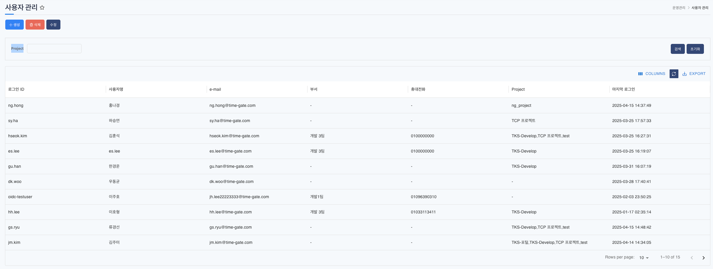

### 1.2. 상세정보 조회
* 리스트에서 특정 유저를 선택하면 하단 상세정보 탭에 유저의 상세 정보가 조회됩니다.

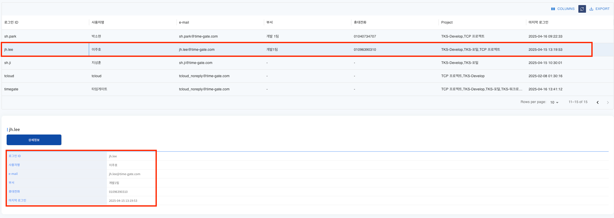

--- 

## 2. 유저 생성

### 2.1. 생성 및 확인
* 상단 **[생성]** 버튼을 클릭하게 되면 유저 생성 템플릿이 조회됩니다.
* 입력 항목은 로그인 ID, 비밀번호, 이름 (lastName, firstName), 사용자명, 부서, email, 휴대전화 정보가 있습니다.

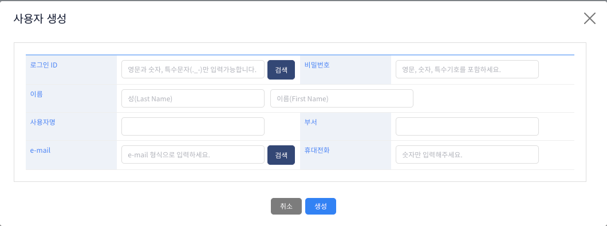

* 로그인 ID, email 은 중복체크를 통하여 등록되지 않는 값을 입력해야 합니다.

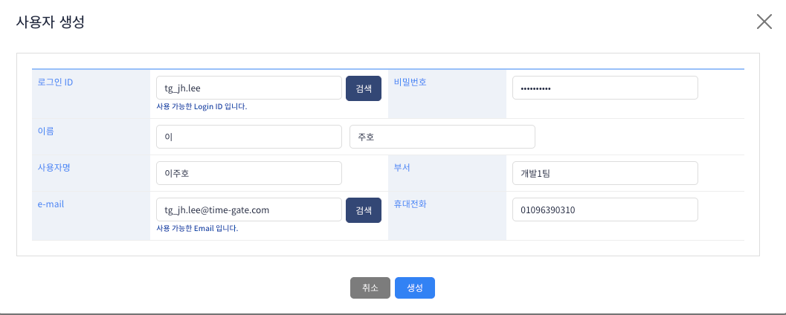

* 생성 후 아래와 같이 유저가 추가된것을 확인할 수 있습니다.

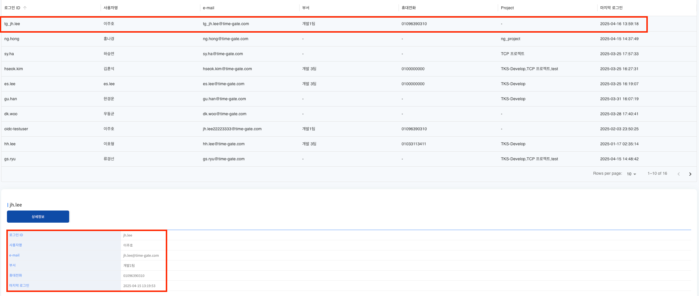

### 2.2. 키클락 내 유저 생성되었는지 확인
* 연동된 키클락 realm 의 admin console 내에 접근하여 유저가 추가되었는지 확인할 수 있습니다.

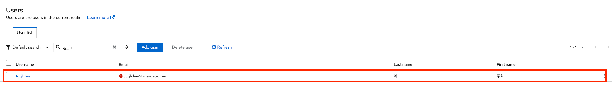

---

## 3. 유저 수정
### 3.1. 수정 및 확인
* 수정할 유저 선택 후 상단 **[수정]** 버튼을 클릭하게 되면 유저의 정보가 조회가 됩니다.

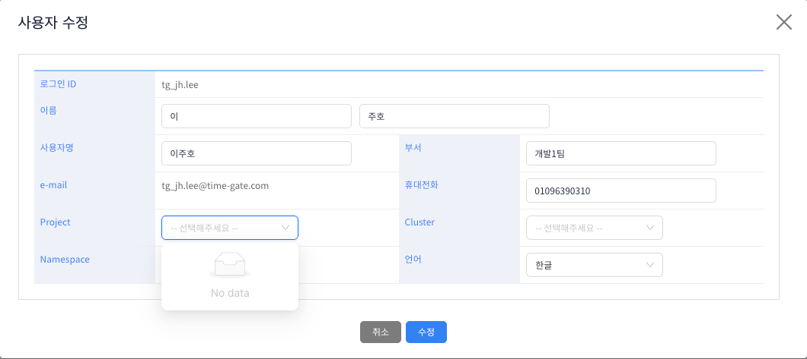
* 활성화 된 영역만 수정이 가능합니다.
* Project, Cluster, Namespace 수정 영역이 있는데 해당 값은 사용자가 로그인할 때 console 상단 header 정보를 세팅하는 default 정보입니다.
* 빈값으로 보여지는 부분은 사용자에게 할당된 프로젝트가 없기 때문이며 프로젝트, 클러스터, 네임스페이스 권한이 할당되어야 보이게 됩니다.
* 유저에게 할당된 Project가 없는 경우에는 Project, Cluster, Namespace 를 빈값으로 수정하여도 저장이 되며, 할당된 Project가 존재할때는 필수 값 입니다. 

* 아래와 같이 변경할 정보를 수정 후 수정 버튼을 클릭하게 되면 유저의 정보가 변경됩니다.

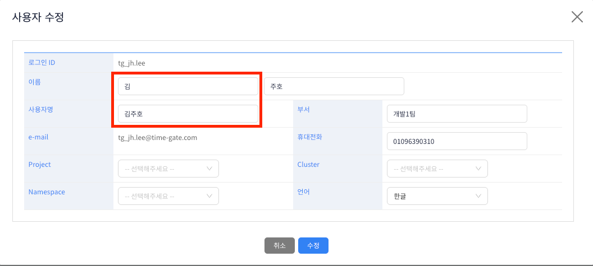

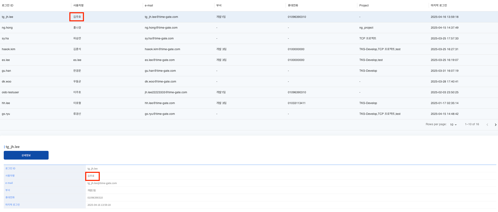

### 3.2. 키클락 내 정보 수정되었는지 확인
* 키클락 내에서 변경 정보가 적용된 것읋 확인할 수 있다.

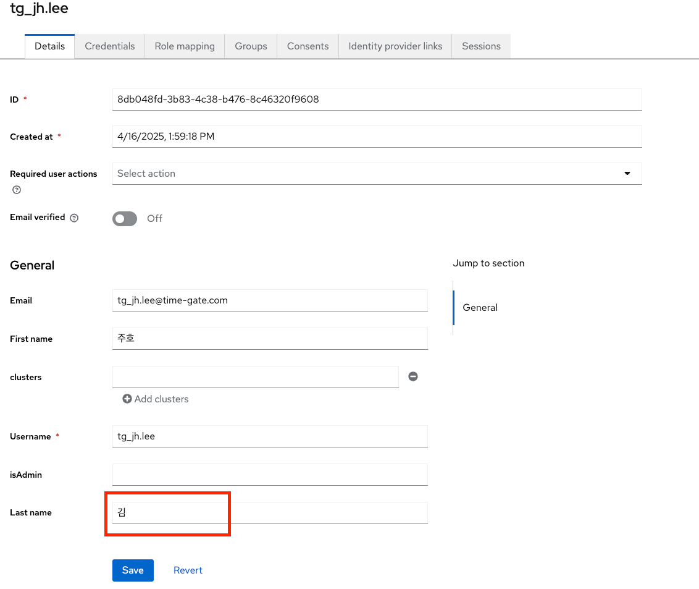

---

## 4. 유저 삭제
### 4.1. 삭제 및 확인
* 삭제 할 유저를 선택한 후 삭제 버튼을 클릭하면 유저가 삭제됩니다. 
* console 포함 keycloak 내에 생성된 유저 정보도 함께 삭제됩니다.
* 유저 삭제시 해당 유저가 특정 네임스페이스의 대표관리자로 설정되어 있으면 동일 네임스페이스 내 tks--ns-admin 권한을 가진 유저 중 가장 최근 로그인한 사용자에게 네임스페이스 대표관리자를 위임합니다.
  만약 동일 네임스페이스 내 tks--ns-admin 권한을 가진 유저가 없을 경우에는 권한에 상관없이 최근 로그인한 사용자에게 네임스페이스 대표관리자를 위임합니다. 

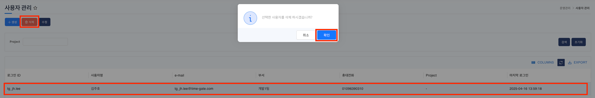

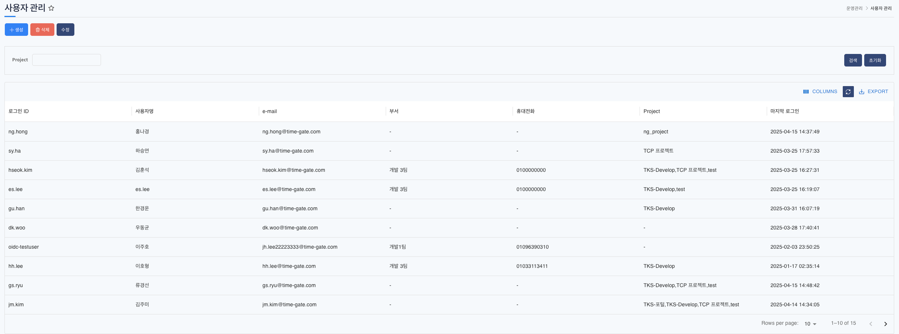

### 4.2. 키클락 내 유저 삭제 되었는지 확인
* 삭제 한 유저를 검색하게 되면 삭제되어 검색이 되지 않는것을 확인할 수 있습니다.

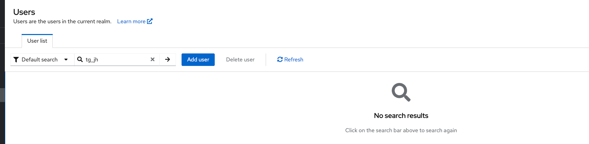

