# Ingresses

> Ingress는 외부에서 들어오는 HTTP/HTTPS 요청을 클러스터 내부의 Service로 전달하는 역할을 합니다. 
> 
> 도메인, 경로, 포트 등을 기반으로 요청을 라우팅할 수 있습니다.

## 목차

1. [Ingress 조회](#1-ingress-조회)
   * [리스트 조회](#리스트-조회)
   * [상세정보 조회](#상세정보-조회)
   * [Metric 조회](#metric-조회)
   * [Rules 조회](#rules-조회)
   * [Load-Balancer Ingress Points 조회](#load-balancer-ingress-points-조회)
   * [이벤트 조회](#이벤트-조회)
2. [Ingress 생성](#2-ingress-생성)
3. [Ingress 수정](#3-ingress-수정)
4. [Ingress 삭제](#4-ingress-삭제)

## 1. Ingress 조회
### 리스트 조회
* 메뉴 진입시 상위 선택된 클러스터/네임스페이스 내 Ingress 목록이 조회됩니다.
* Ingress가 속한 네임스페이스, Load Balancers, Rules, Age 정보를 확인할 수 있습니다.

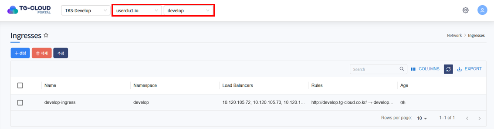

### 상세정보 조회
* 리스트에서 특정 Ingress를 선택하면 하단 상세정보 탭에 Ingress의 상세 정보가 조회됩니다.
* 선택된 Ingress의 생성일시, 네임스페이스, Port 등을 확인할 수 있습니다.

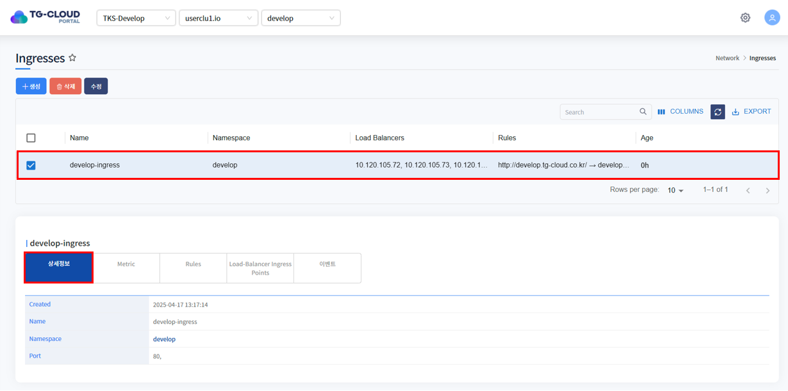

### Metric 조회
* Metric 탭을 클릭하면 해당 Ingress를 통해 들어온 요청 수를 5분 단위로 확인할 수 있습니다.

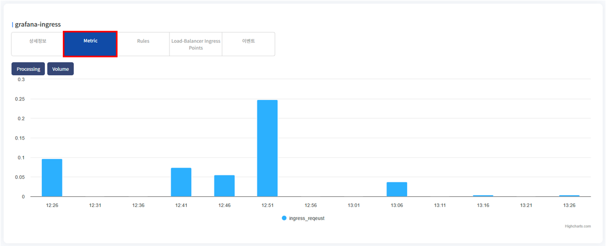

### Rules 조회
* rules는 Ingress가 외부 요청을 어떤 Service로 연결할지를 정의하는 HTTP 라우팅 규칙입니다.

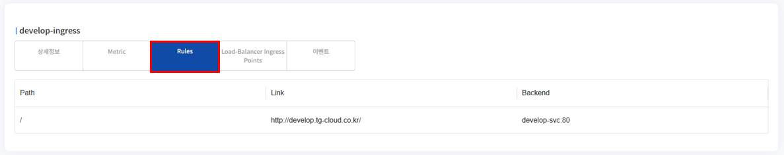

### Load-Balancer Ingress Points 조회
* Load-Balancer Ingress Points는 Ingress를 통해 생성된 외부 접근 지점의 주소(IP 또는 Hostname)입니다.

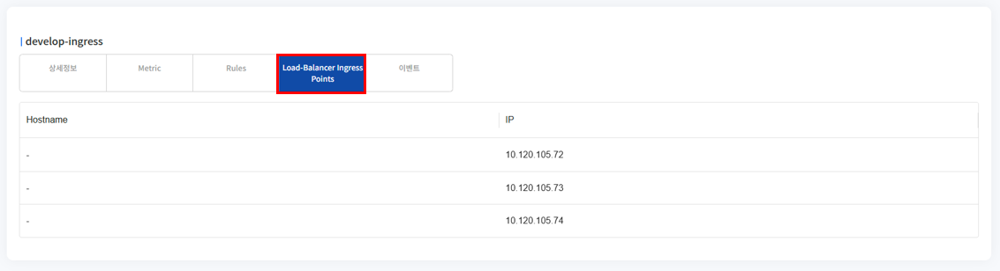

### 이벤트 조회
* Ingress에 발생한 이벤트 정보가 조회됩니다. 발생한 이벤트가 없을 경우 목록에서 표시되지 않습니다.

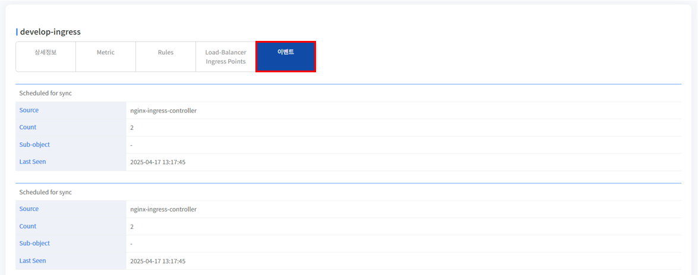

## 2. Ingress 생성
1. 목록 위 '생성' 버튼을 클릭합니다.

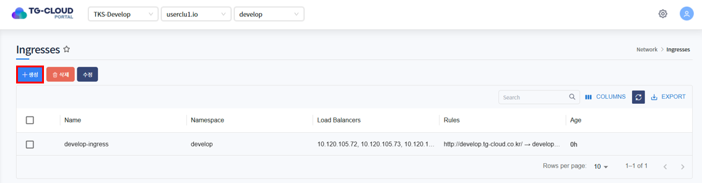

2. Ingress를 생성하는 Yaml 템플릿이 노출됩니다.

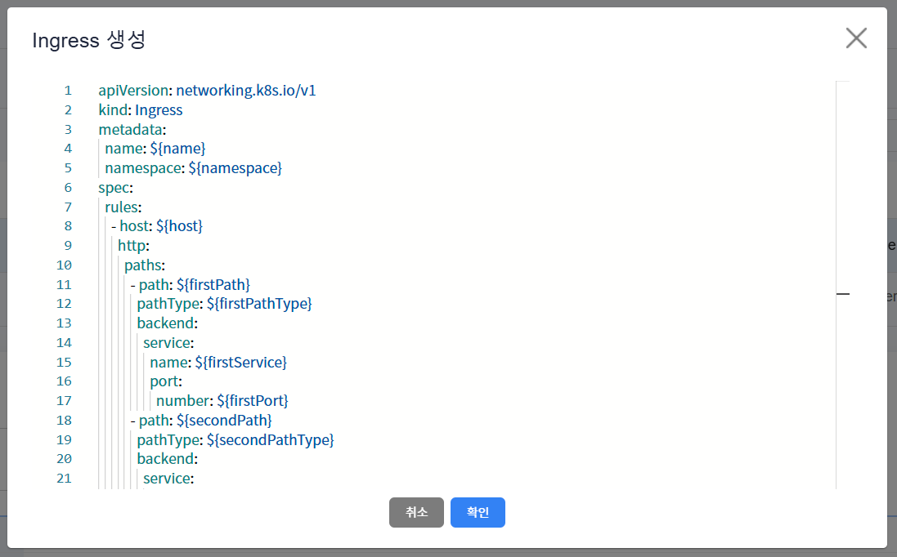

3. 템플릿 내 변수를 치환하여 생성하고자 하는 Ingress Yaml을 작성하고 '확인' 버튼을 클릭합니다.

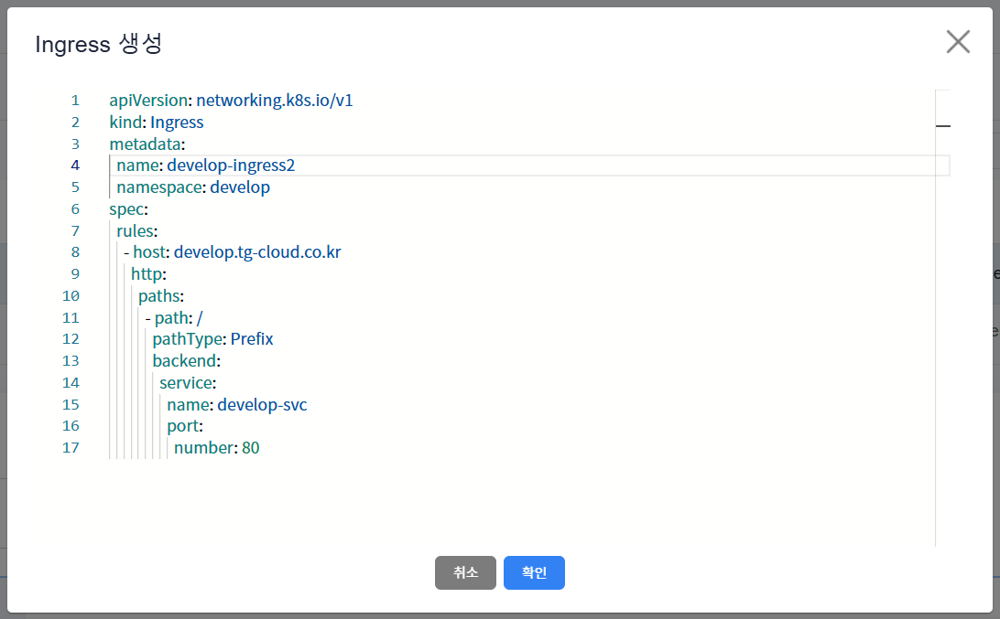

4. Ingress가 정상적으로 생성된 것을 확인합니다.

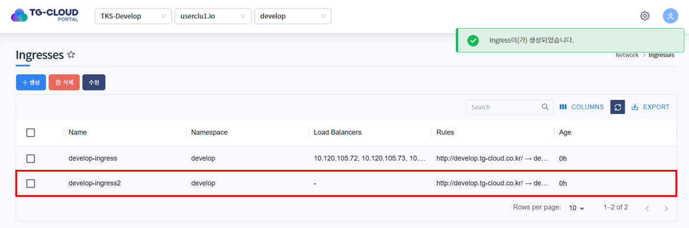

## 3. Ingress 수정
1. 수정하고자 하는 Ingress를 선택하고 목록 위 '수정' 버튼을 클릭합니다.

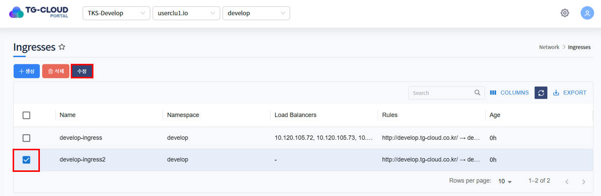

2. Ingress가 Yaml 형태로 조회됩니다. 원하는 데이터로 Yaml을 수정한 후 '확인' 버튼을 클릭합니다.

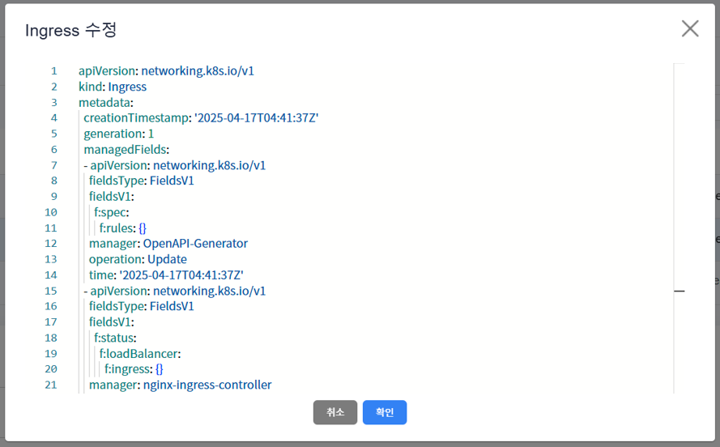

3. 하단의 상세정보 탭 또는 Rules 탭에서 Ingress가 수정된 것을 확인합니다.

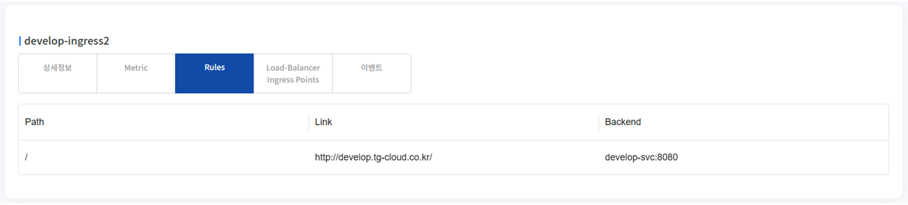

## 4. Ingress 삭제
1. 삭제하고자 하는 Ingress를 선택하고 목록 위 '삭제' 버튼을 클릭합니다.

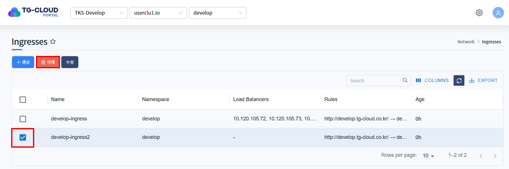

2. 삭제를 확인하는 알림창이 노출되면 '확인' 버튼을 클릭합니다.

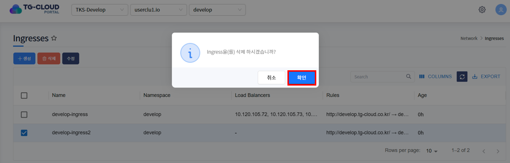

3. 목록에서 Ingress가 삭제된 것을 확인합니다.

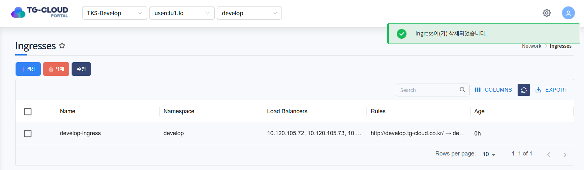