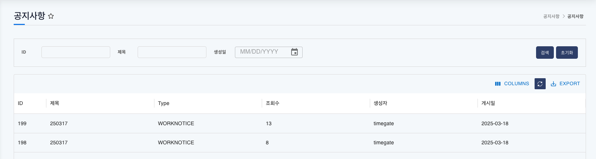
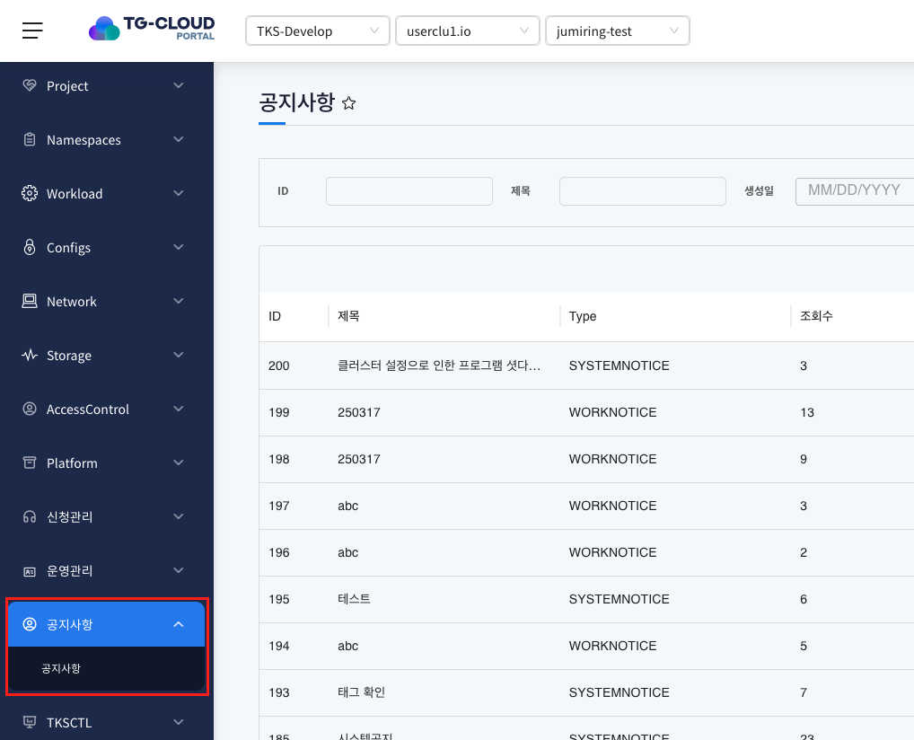
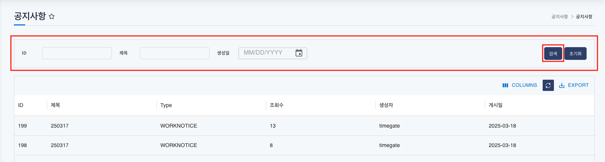
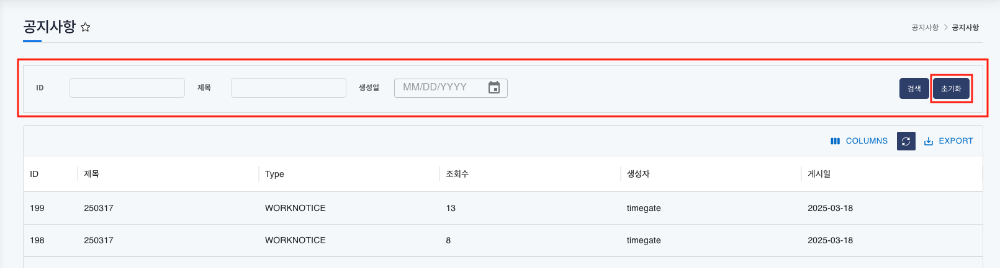
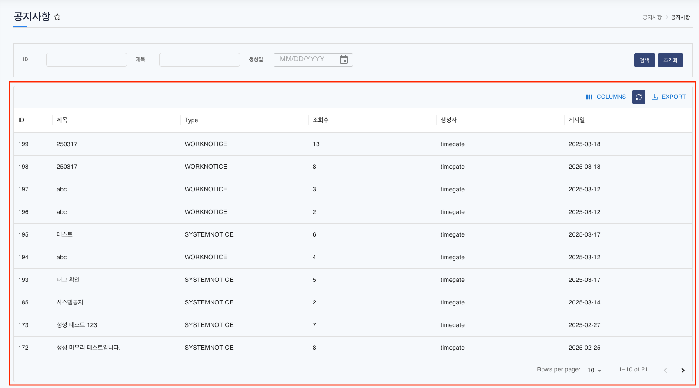

# 공지사항

> 등록된 공지사항을 확인 할 수 있는 게시판 메뉴 입니다.

## 목차

1. [공지사항 메뉴 확인](#1-공지사항-메뉴-확인)
2. [공지사항 리스트 검색](#2-공지사항-리스트-검색)
3. [공지사항 리스트](#3-공지사항-리스트)
4. [공지사항 상세 내용](#4-공지사항-상세-내용)

## 1. 공지사항 메뉴 확인

1. 메뉴 리스트에서 공지사항 메뉴를 클릭

   
   
   모든 사용자가 확인 할 수 있는 공지사항 내역을 제공합니다.

## 2. 공지사항 리스트 검색

1. 공지사항 상단의 검색창에서 ID, 제목, 생성일 필드에 검색어를 입력 후 `검색` 버튼 클릭

   

   - ID: 공지사항의 ID로 검색
   - 제목: 공지사항의 제목으로 검색
   - 생성일: 공지사항의 생성 일자로 검색

2. `초기화` 버튼을 클릭해 검색한 리스트를 초기화하고 전체 리스트를 호출

   
   
   전체 공지사항 리스트를 다시 확인 할 수 있습니다.

## 3. 공지사항 리스트

1. 등록된 공지사항을 확인

   
   
   - ID: 공지사항 ID
   - 제목: 공지사항 제목
   - Type: 시스템공지와 작업공지 유형으로 분류
   - 조회수: 공지사항을 읽은 view 수 count
   - 생성자: 공지사항 등록인
   - 게시일: 공지사항이 게시된 일자

## 4. 공지사항 상세 내용

1. 선택한 공지사항의 상세 내용 확인

   
   
   공지사항 상세 내용을 확인 할 수 있으며, 첨부파일 등 전체 내용을 확인 할 수 있습니다.
