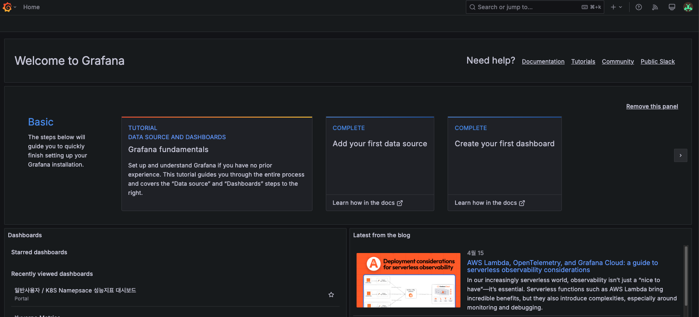
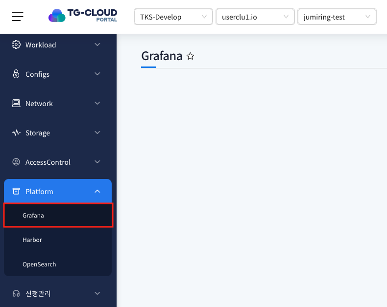
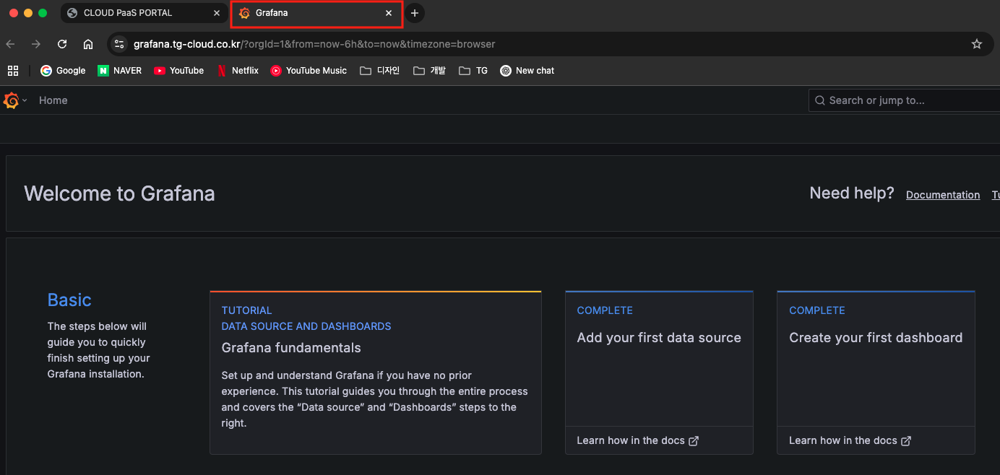
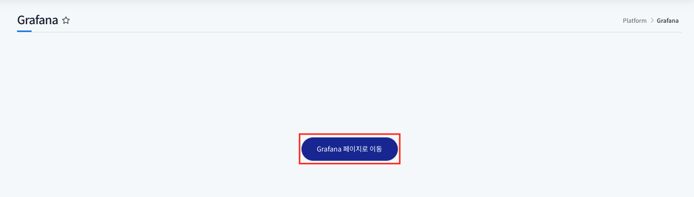

# Grafana

> 포탈에서 사용되고 있는 K8s 자원 현황과 metric 정보를 grafana에서 확인 할 수 있는 메뉴입니다.
> 수집된 정보를 시각화하여 다양한 자원 정보를 분석 할 수 있습니다.

## 목차

1. [Grafana 메뉴 이동](#1-grafana-메뉴-이동)
2. [Grafana 화면 이동](#2-grafana-화면-이동)

## 1. Grafana 메뉴 이동

1. 좌측 메뉴 `Grafana` 클릭

   

   Platform 메뉴 하위의 Grafana를 클릭하면 해당 메뉴를 확인 할 수 있습니다.

   **해당 메뉴는 어드민 계정만 확인 할 수 있습니다.**

## 2. Grafana 화면 이동

1. 메뉴 클릭 시 Grafana 포탈이 새창으로 띄워집니다.

   

2. Grafana 포탈을 새로 열고 싶다면 `Grafana 페이지로 이동` 버튼 클릭

   
