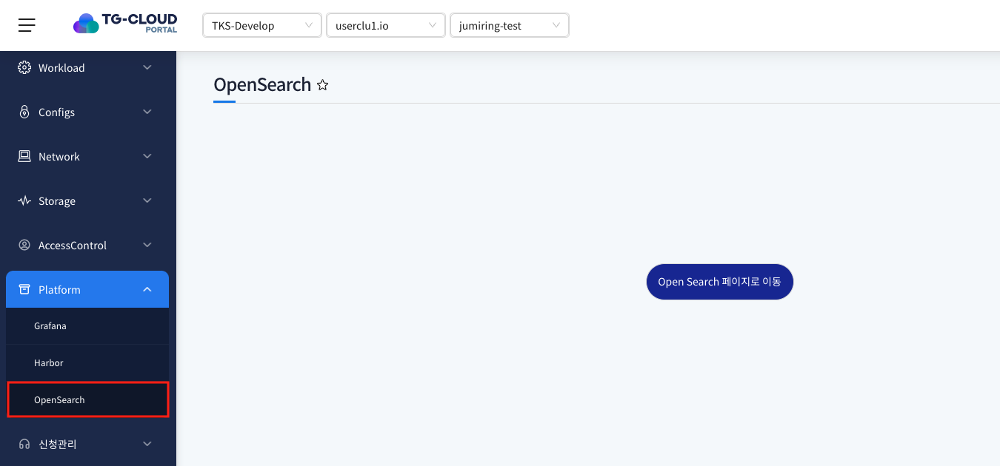

# OpenSearch

> 포탈에서 사용되는 K8s나 정책 등 데이터의 로그, 메트릭, 트레이스 정보를 확인할 수 있는 메뉴입니다.
> OpenSearch를 이용해 자원의 이슈와 이벤트를 확인 할 수 있습니다.

## 목차

1. [OpenSearch 메뉴 이동](#1-opensearch-메뉴-이동)
2. [OpenSearch 화면 이동](#2-opensearch-화면-이동)

## 1. OpenSearch 메뉴 이동

1. 좌측 메뉴 `OpenSearch` 클릭

   
   
   Platform 메뉴 하위의 OpenSearch를 클릭하면 해당 메뉴를 확인 할 수 있습니다.
   **해당 메뉴는 어드민 계정에서만 확인 할 수 있습니다.**

## 2. OpenSearch 화면 이동

1. 메뉴 클릭 시 OpenSearch 포탈이 새창으로 띄워집니다.

   
   

2. OpenSearch 포탈을 새로 열고 싶다면 `OpenSearch 페이지로 이동` 버튼 클릭

   
   
