# PV (Persistent Volume)

> 클러스터 내의 스토리지를 추상화하고 관리하는 핵심 리소스입니다.
> 
> Pod의 생명주기와 독립적인 스토리지 자원을 제공하며 새로운 Pod가 동일한 PV를 사용하도록 설정하면 기존 데이터를 이어서 사용할 수 있습니다.

---

## **목차**
1. [PV 조회](#1-pv-조회)
   * [1.1. 리스트 조회](#11-리스트-조회)
   * [1.2. 상세정보 조회](#12-상세정보-조회) 
   * [1.3. Claim 정보 조회 (PV와 연결된 PVC 목록 조회)](#13-claim-정보-조회)
   * [1.4. PV 내 발생한 이벤트 정보 조회](#14-pv-내-발생한-이벤트-정보-조회)
2. [PV 생성](#2-pv-생성)
3. [PV 수정](#3-pv-수정)
4. [PV 삭제](#4-pv-삭제)

---

## 1. PV 조회
### 1.1. 리스트 조회
* 화면 진입시 상위 선택된 클러스터 내 PV 목록이 조회 됩니다.

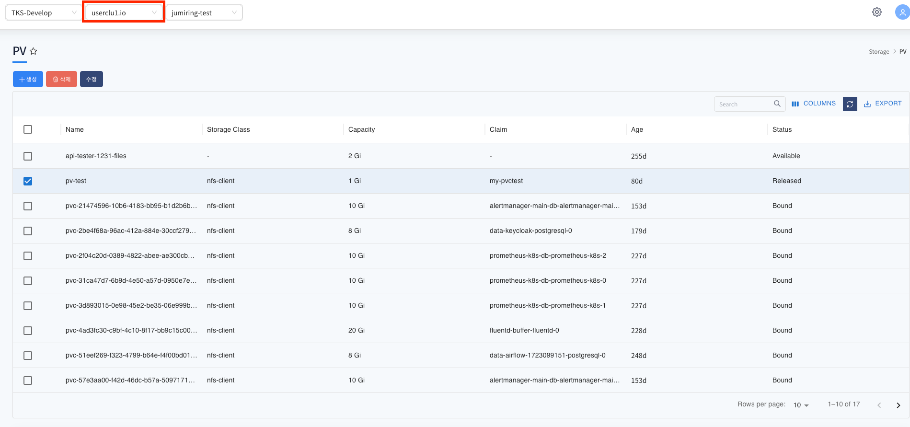

### 1.2. 상세정보 조회
* 리스트에서 특정 PV를 선택하면 하단 상세정보 탭에 PV의 상세 정보가 조회됩니다.
* 주요 정보로는 capacity(용량), accessModes(영구 볼륨 접근 방식), storageClassName(연동된 스토리지 클래스) 가 있습니다.

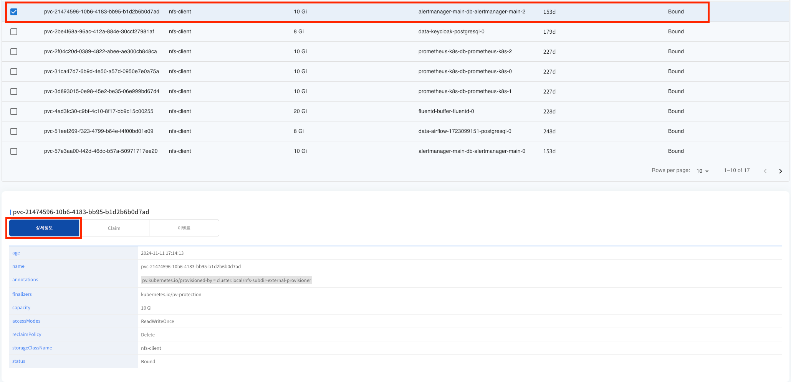

### 1.3. Claim 정보 조회
* 리스트에서 선택된 PV에 연결된 pvc 정보가 조회됩니다.
* pvc 이름, pvc 가 생성되어 있는 네임스페이스 정보를 볼 수 있으며 pvc 이름을 클릭하게 되면 pvc 정보를 우측 슬라이드를 통하여 확인할 수 있습니다.

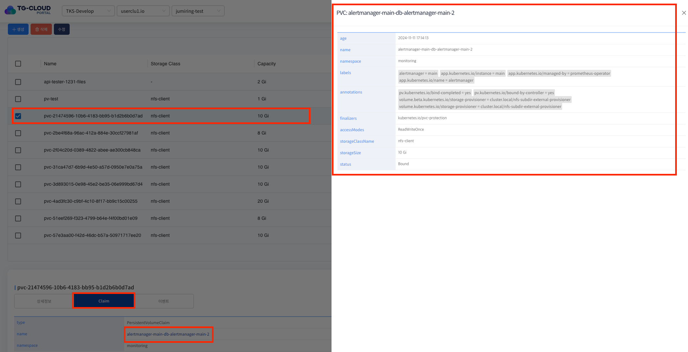

### 1.4. PV 내 발생한 이벤트 정보 조회
* 리스트에서 선택된 PV에 발생한 이벤트 정보가 조회됩니다. 발생한 이벤트가 없을 경우 목록에서 표시되지 않습니다.

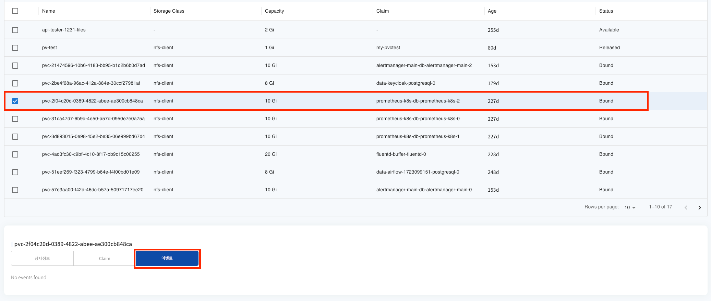

--- 

## 2. PV 생성
* 상단 **[생성]** 버튼을 클릭하게 되면 PV 생성에 필요한 yaml 템플릿 정보가 조회됩니다.

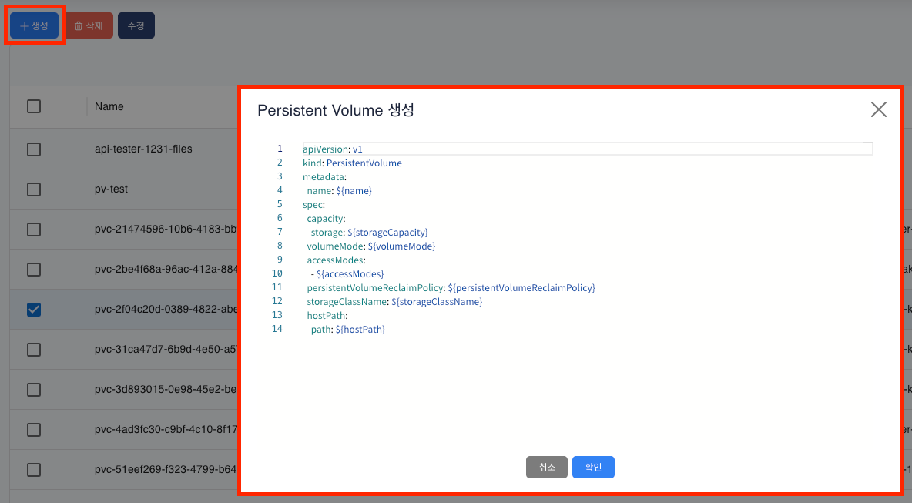
* 변수 치환 부분을 생성에 맞는 정보로 변경하여 확인 버튼을 클릭하게 되면 PV가 정상적으로 생성이 됩니다.

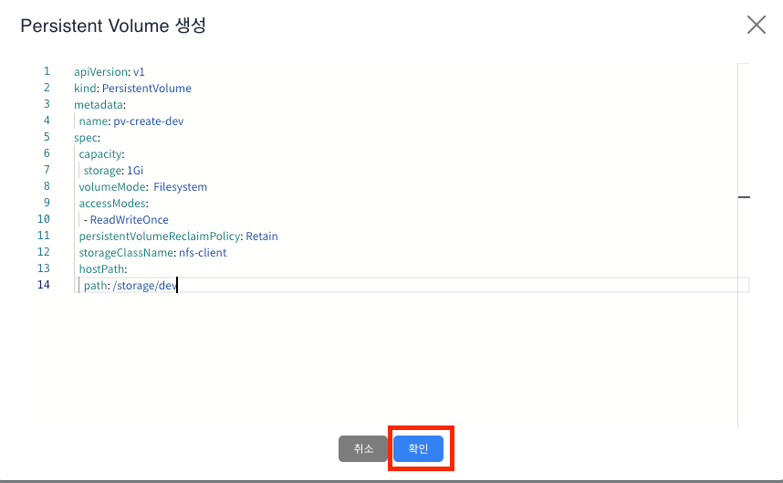

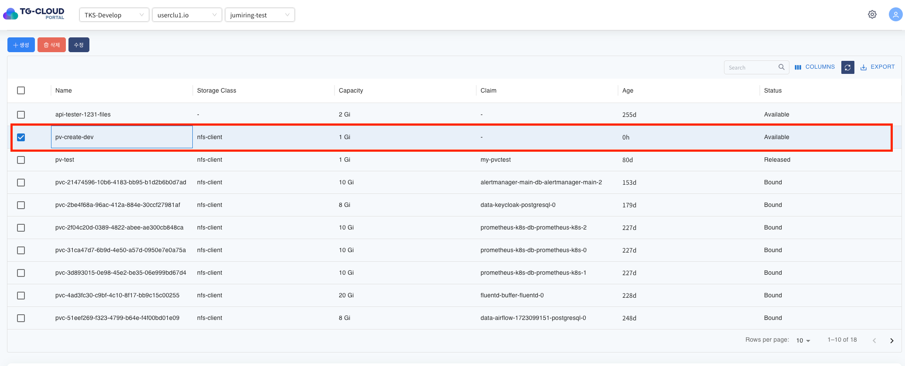

---

## 3. PV 수정
* 수정할 PV 선택 후 상단 **[수정]** 버튼을 클릭하게 되면 PV 의 metadata yaml 정보가 조회가 됩니다.
* 수정할 항목을 변경 (persistentVolumeReclaimPolicy Retain > Delete 로 변경) 후 확인 버튼을 클릭하면 PV 메타 정보가 변경됩니다.

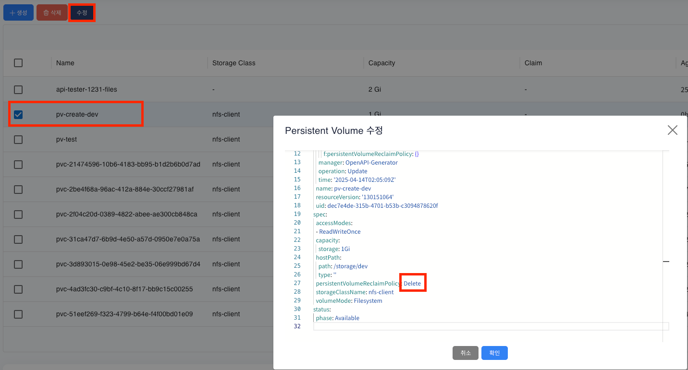
* 변경 후 PV를 선택하여 상세 정보 내에서 변경된 정보를 확인할 수 있습니다.

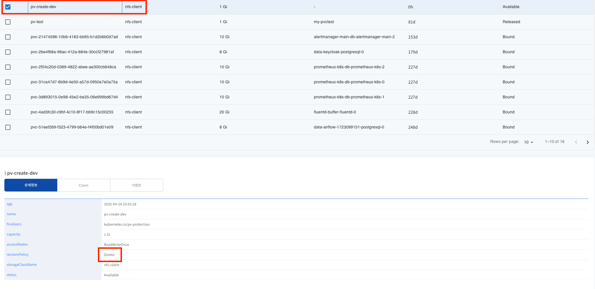

---

## 4. PV 삭제
* 삭제할 PV를 선택 후 상단 **[삭제]** 버튼을 클릭하게 되면 PV가 삭제가 됩니다.
* 삭제 후 리스트에서 PV가 제거된것을 확인할 수 있습니다.

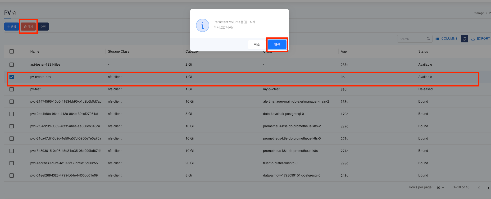

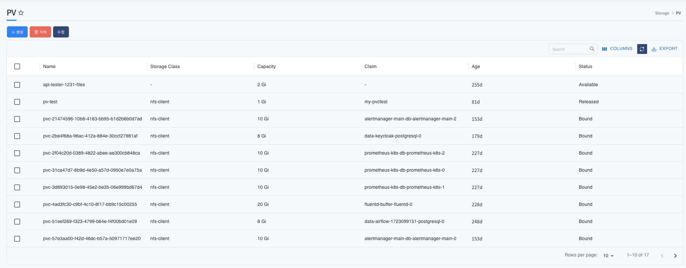