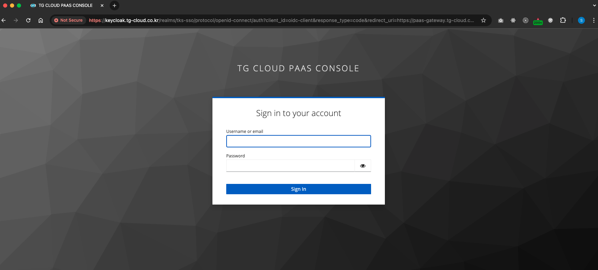
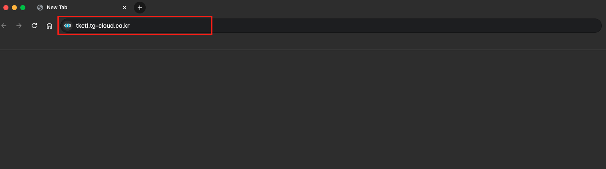
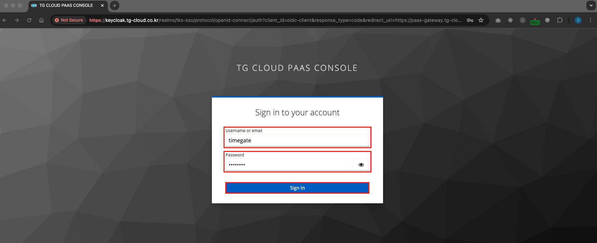
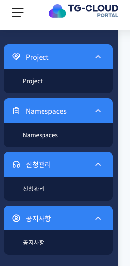
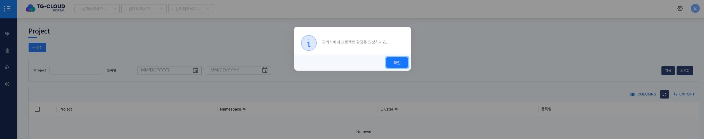

# Login

> PaaS Portal을 사용하기 위해 계정 인증을 위한 페이지입니다.  
> Keycloak 계정을 사용해 로그인 인증을 할 수 있으며, 본인 ID/PW를 입력 후 portal을 사용할 수 있습니다.

---

## 목차

1. [로그인 페이지](#1-로그인-페이지)
2. [로그인을 통한 인증](#2-로그인을-통한-인증)

---

## 1. 로그인 페이지

1. 브라우저 URL 창에 `https://tkctl.tg-cloud.co.kr`을 입력

포탈 URL을 입력 후 로그인 인증이 되어있지 않다면, 로그인 창으로 이동합니다.

---

## 2. 로그인을 통한 인증

1. 로그인이 되어있지 않은 사용자는 로그인 창에서 ID와 PW를 입력합니다.

- ID: username 또는 email 형식으로 입력
- PW: 로그인 계정의 비밀번호

2. 로그인이 완료되면 포탈 화면으로 진입

- portal 최초 로그인 시 유저에게 할당된 메뉴는 위와 같으며 프로젝트가 할당되어 있지 않으면 Project 메뉴로 이동하게 되며 직접 프로젝트 생성 또는 관리자에게 프로젝트 할당 요청을 해야합니다.

