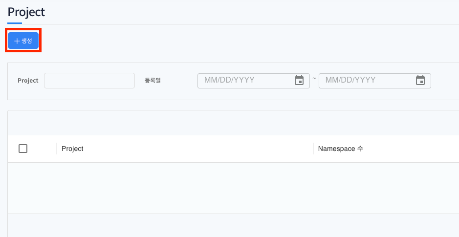
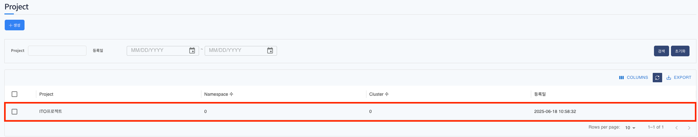

# Project

> 사용자에게 할당된 Project와 하위의 Namespace, 사용자 정보를 확인 할 수 있는 메뉴입니다.  
> 새로운 Project를 생성 및 삭제 할 수 있고, Project 관리자나 사용자를 추가 및 삭제 할 수 있습니다.

---

## 목차

1. [Project 메뉴 확인](#1-project-메뉴-확인)
2. [Project 생성](#2-project-생성)
3. [Project 생성 확인](#3-project-생성-확인)

---

## 1. Project 메뉴 확인

1. 좌측 메뉴 `Project` 메뉴 클릭

   

   - 좌측 메뉴 `Project` 메뉴 클릭 후 프로젝트 화면에 진입합니다.
   - 최초 로그인한 사용자에게 할당된 프로젝트가 없어 빈 리스트로 표현됩니다.

---

## 2. Project 생성

1. `생성` 버튼을 클릭하여 프로젝트를 생성할 수 있습니다.

2. 프로젝트 이름만 입력 후 생성할 수 있습니다. 있으며 

---

## 3. Project 생성 확인

1. 생성된 프로젝트 목록을 확인할 수 있으며 프로젝트를 생성한 유저가 프로젝트 관리자가 됩니다.
2. 프로젝트 관리자는 네임스페이스 생성 시 2차 승인자가 됩니다.

