# Service Account

> 애플리케이션이나 서비스가 Kubernetes API 서버에 접근할 때 사용되는 인증 및 권한 부여 메커니즘 입니다.
>
> ServiceAccount에 특정 역할을 바인딩하여 API 서버에 대한 접근 권한을 제어할 수 있습니다.

--- 

## **목차**
1. [ServiceAccount 조회](#1-serviceaccount-조회)
   * 1.1. 리스트 조회
   * 1.2. 상세정보 조회
   * 1.3. Mountable Secret 조회(ServiceAccount 와 연결된 secret 정보 조회) 
     * 1.3.1. Mount할 secret 정보 생성
     * 1.3.2. secret과 mount 되는 serviceAccount 생성
     * 1.3.3. serviceAccount 내 mountable secret 정보 조회
   * 1.4. KubeConfig 조회
     * 1.4.1. ServiceAccount와 매핑되는 kubeconfig secret 정보 생성
     * 1.4.2. KubeConfig 조회(팝업)
   * 1.5. ServiceAccount 내 발생한 이벤트 정보 조회
2. [ServiceAccount 생성](#2-serviceaccount-생성)
3. [ServiceAccount 수정](#3-serviceaccount-수정)
4. [ServiceAccount 삭제](#4-serviceaccount-삭제)

---

## 1. ServiceAccount 조회
### 1.1. 리스트 조회
* 화면 진입시 상위 선택된 클러스터/네임스페이스 하위에 존재하는 ServiceAccount 목록이 조회 됩니다.

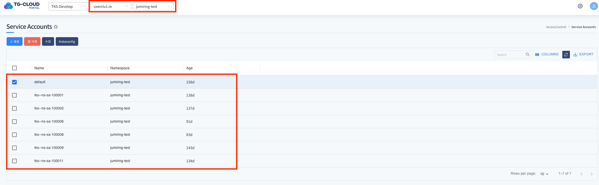

### 1.2. 상세정보 조회
* 리스트에서 특정 Service Account 를 선택하면 하단 상세정보 탭에 ServiceAccount의 상세 정보가 조회됩니다.

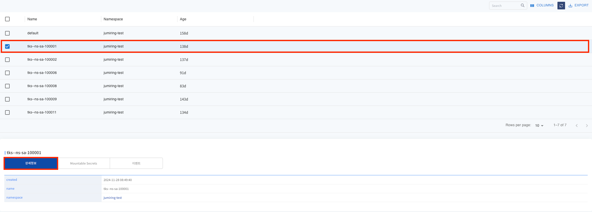

### 1.3. Mountable Secret 조회
* ServiceAccount에 Secret을 매핑함으로써 해당 ServiceAccount를 사용하는 모든 Pod에 자동으로 추가한 Secret을 마운트 하는 용도로 사용할 수 있습니다.
#### 1.3.1. Mount할 secret 정보 생성
* ServiceAccount와 mount 할 secret을 우선 생성합니다.

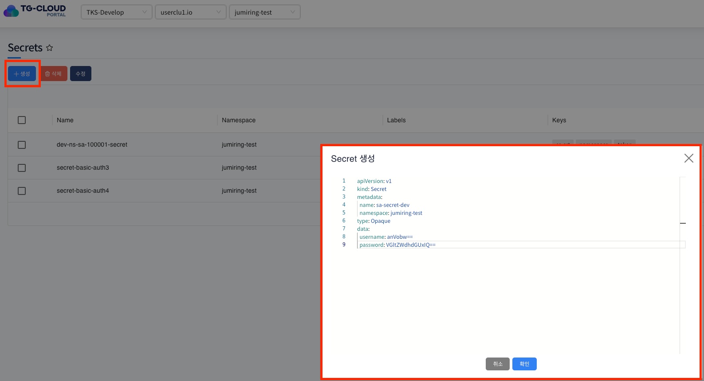

#### 1.3.2. secret과 mount 되는 serviceAccount 생성

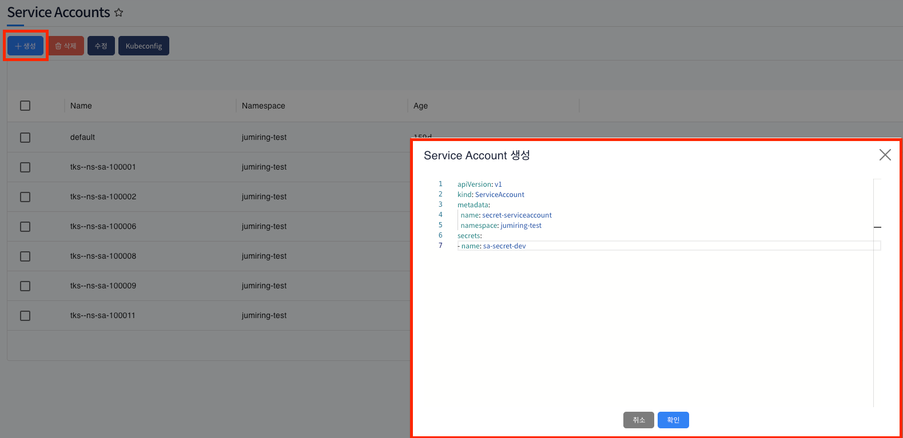

#### 1.3.3. serviceAccount 내 mountable secret 정보 조회

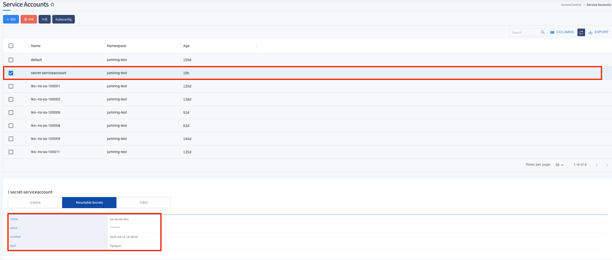

### 1.4. KubeConfig 조회
* 클러스터에 접근하기 위한 구성정보를 담고 있는 파일이며 클라이언트 라이브러리가 API 서버와 통신할 때 사용합니다.
#### 1.4.1. ServiceAccount와 매핑되는 kubeconfig secret 정보 생성
* ServiceAccount 의 Mountable secret 을 확인하기 위해서는 ServiceAccount 토큰 Secret을 만들어야 합니다. 
* Configs > Secret 화면에서 **[생성]** 버튼을 통하여 아래와 같이 Secret 정보를 만들면 됩니다. 

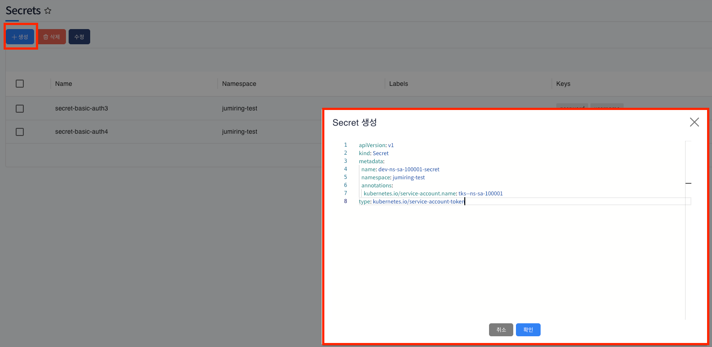

#### 1.4.2. KubeConfig 조회(팝업)
* ServiceAccount 화면 Kubeconfig 버튼을 통하여 조회를 할 수 있습니다.

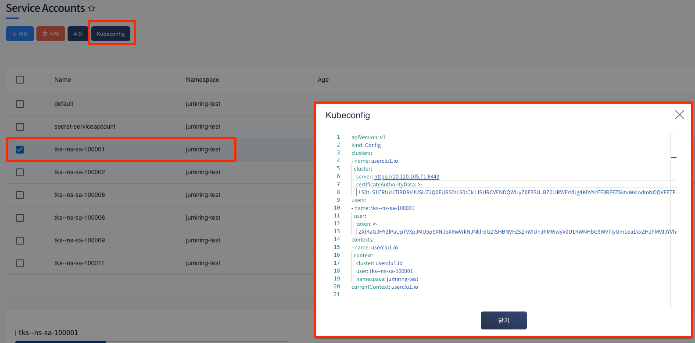

### 1.5. ServiceAccount 내 발생한 이벤트 정보 조회
* 리스트에서 선택된 ServiceAccount에 발생한 이벤트 정보가 조회됩니다. 발생한 이벤트가 없을 경우 목록에서 표시되지 않습니다.

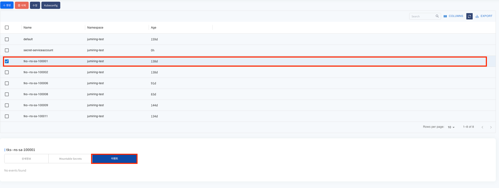

--- 

### 2. ServiceAccount 생성
* 상단 **[생성]** 버튼을 클릭하게 되면 ServiceAccount 생성에 필요한 yaml 템플릿 정보가 조회됩니다.

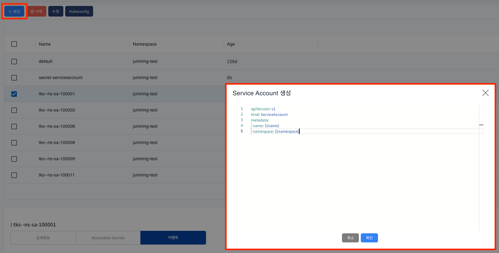
* 변수 치환 부분을 생성에 맞는 정보로 변경하여 확인 버튼을 클릭하게 되면 PV가 정상적으로 생성이 됩니다.

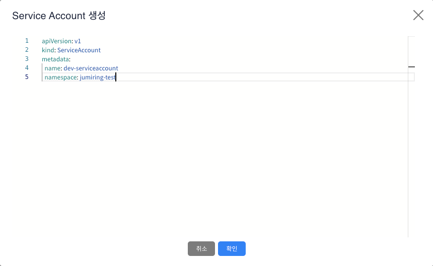

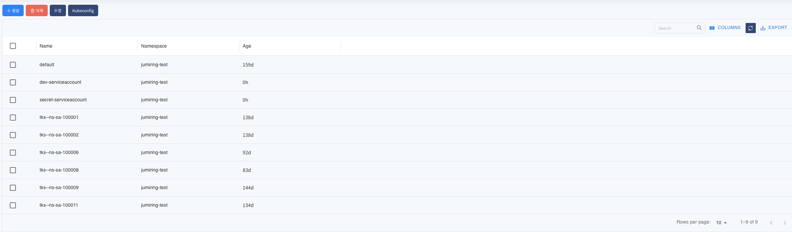

--- 

### 3. ServiceAccount 수정
* 예시로 생성한 serviceaccount에 변경 가능한 메타데이터 정보는 없습니다.

--- 

### 4. ServiceAccount 삭제
* 삭제할 ServiceAccount를 선택 후 상단 **[삭제]** 버튼을 클릭하게 되면 ServiceAccount가 삭제가 됩니다.
* 삭제 후 리스트에서 ServiceAccount가 제거된것을 확인할 수 있습니다.

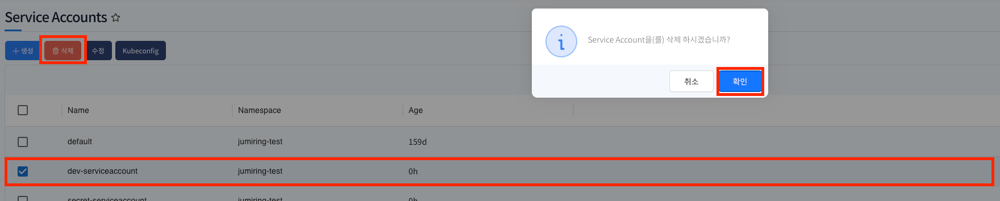

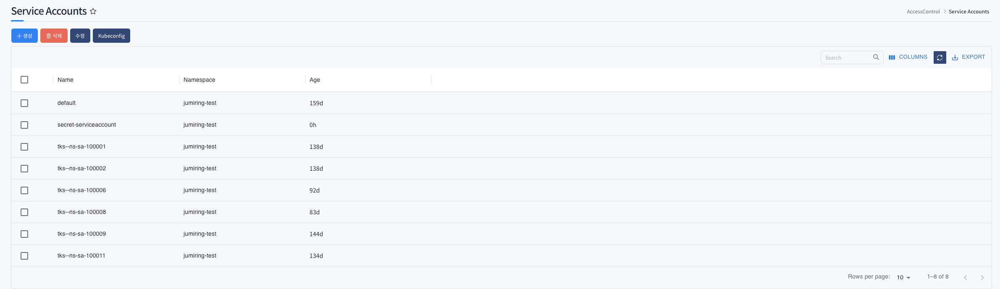

